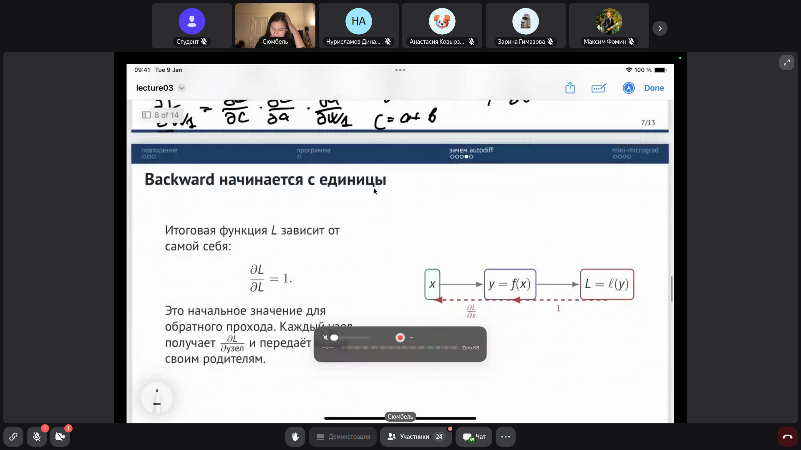
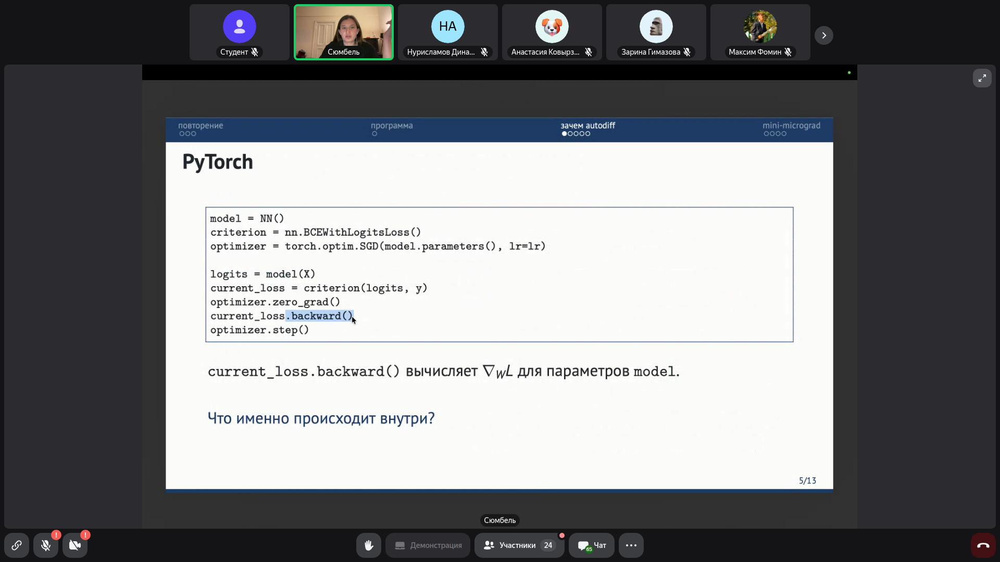
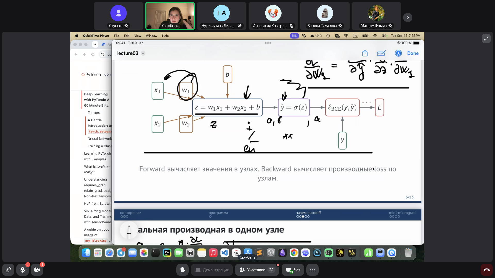
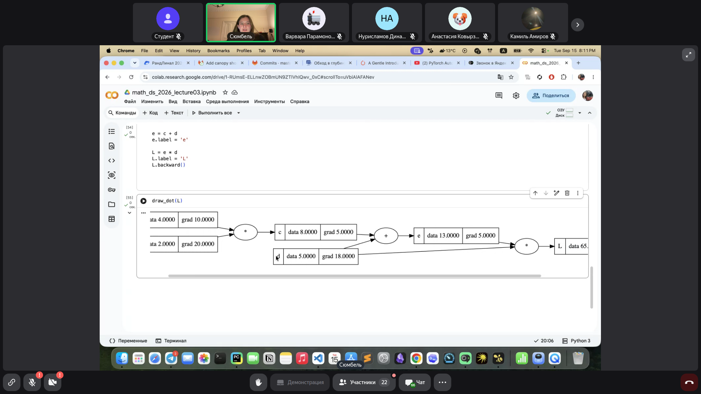
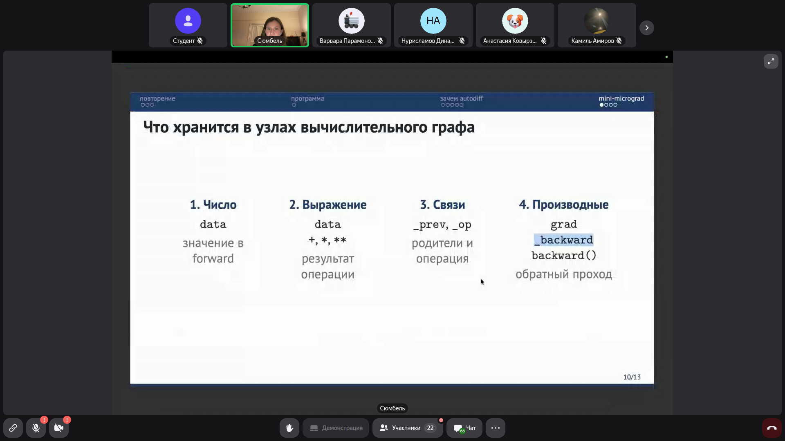

# Математика и программирование для Data Science: Автоматическое дифференцирование и построение движка autograd с нуля

> **Тема**: Автоматическое дифференцирование и построение движка autograd с нуля  
> **Статус конспекта**: Очищен от оговорок и воды, структурирован AI-ассистентом с сохранением авторских терминов.  
> **AI-модель**: `gemini-flash-latest`  

## Введение
В рамках занятия изучаются принципы автоматического дифференцирования в нейронных сетях. Рассматривается переход от явного ручного подсчета частных производных к модульному представлению вычислений через ориентированные ациклические графы (DAG). Разбирается устройство движка PyTorch Autograd, математика цепного правила дифференцирования сложной функции (chain rule), необходимость накопления градиентов при ветвлении графа и алгоритм упорядочивания вычислений с помощью обратного топологического порядка (DFS). На практике с нуля написан мини-фреймворк автоматического дифференцирования на Python (класс `Value`), а также разобран метод численной верификации градиентов через центральные конечные разности.

---

## Повторение: Обучение нейросети, градиентный спуск и chain rule `[00:21]`

Нейронная сеть представляет собой сложную параметризованную функцию:

$$f_W : F \to A, \quad \hat{y} = f_W(X)$$

где архитектура определяет вид функции, а набор настраиваемых параметров $W$ задает конкретное отображение.

Процесс оптимизации параметров строится по следующему циклу:
1. **Forward pass:** Вычисление предсказания $\hat{y} = f_W(X)$ и расчет функции потерь $L = \frac{1}{N} \sum_{i} \ell_{\text{BCE}, i}$.
2. **Backward pass:** Вычисление градиента функции потерь по всем настраиваемым параметрам $\nabla_W L$.
3. **Update (Градиентный спуск):** Шаг обновления весов в сторону антиградиента (наискорейшего убывания ошибки):

$$W \leftarrow W - \alpha \nabla_W L$$

где $\alpha$ — темп обучения (learning rate).

Градиент задает вектор частных производных:

$$\nabla L = \begin{bmatrix} \frac{\partial L}{\partial w_1} \\ \frac{\partial L}{\partial w_2} \end{bmatrix}$$

Для нахождения производных суперпозиции функций применяется **цепное правило (chain rule)**:

$$\frac{d}{dx} f(g(x)) = f'(g(x)) \cdot g'(x) \implies \frac{dy}{dx} = \frac{dy}{dz} \cdot \frac{dz}{dx}$$

### Слайды и код с экрана:


> [!IMPORTANT]
> **На заметку к зачету / экзамену:**
> - Каждая компонента градиента показывает локальную чувствительность итоговой функции потерь (loss) к изменению одного конкретного параметра.
> - Градиент всегда направлен в сторону наискорейшего возрастания функции, поэтому оптимизация параметров требует движения в сторону антиградиента.

---

## Устройство Autograd в PyTorch и концепция вычислительного графа `[01:13]`

В библиотеке PyTorch стандартный цикл обучения скрывает всю сложность вычисления градиентов за вызовом метода `current_loss.backward()`:

```python
model = NN()
criterion = nn.BCEWithLogitsLoss()
optimizer = torch.optim.SGD(model.parameters(), lr=lr)

logits = model(X)
current_loss = criterion(logits, y)
optimizer.zero_grad()
current_loss.backward()  # Вычисляет ∇_W L для параметров model
optimizer.step()
```

### Вычислительный граф (Computational Graph)
Любая нейросеть представляется как ориентированный ациклический граф (DAG — Directed Acyclic Graph), где:
- **Узлы (Nodes):** Хранят тензоры данных/весов ($x_1, x_2, w_1, w_2, b$), промежуточные результаты вычислений ($z, \hat{y}$) и итоговый скаляр ($L$).
- **Ребра (Edges):** Отражают зависимости между переменными и элементарными операциями (сложение, умножение, применение функции активации $\sigma$).

В PyTorch вычислительный граф является **динамическим** (DAGs are dynamic): граф строится заново «на лету» на каждом прямом проходе (`forward`), что позволяет использовать циклы и условные операторы Python, меняя архитектуру от шага к шагу.

### Слайды и код с экрана:


> [!IMPORTANT]
> **На заметку к зачету / экзамену:**
> - Граф элементарных операций строится во время прямого прохода (forward pass).
> - Флаг `requires_grad=True` указывает PyTorch отслеживать операции над данным тензором и включать его в вычислительный граф.

---

## Локальные производные, chain rule и накопление градиентов `[07:05]`

Каждый элементарный узел графа изолированно знает лишь свою операцию и соответствующие локальные производные.

### Локальное правило в одном узле
Рассмотрим узел умножения $c = a \cdot b$:
- Локальные производные:
  $$\frac{\partial c}{\partial a} = b, \quad \frac{\partial c}{\partial b} = a$$
- Если в ходе обратного прохода к узлу $c$ сверху уже пришла производная $\frac{\partial L}{\partial c}$, то по цепному правилу (chain rule) в родительские узлы передаются значения:
  $$\frac{\partial L}{\partial a} = \frac{\partial L}{\partial c} \cdot \frac{\partial c}{\partial a} = \frac{\partial L}{\partial c} \cdot b$$
  $$\frac{\partial L}{\partial b} = \frac{\partial L}{\partial c} \cdot \frac{\partial c}{\partial b} = \frac{\partial L}{\partial c} \cdot a$$

### Начало обратного прохода: Базовый случай
Обратный проход (`backward`) всегда начинается с терминального узла функции потерь $L$. Так как $L$ зависит сама от себя тождественно:

$$\frac{\partial L}{\partial L} = 1.0$$

Это начальное единичное значение передается родителям терминального узла.

### Накопление градиентов при ветвлении (Многопутевые зависимости)
Если переменная участвует в вычислении более одного раза (например, $y = x^2 + x + 1$, где $a = x \cdot x$, $b = x + 1$, $y = a + b$), то полный дифференциал функции нескольких переменных требует суммирования вкладов по всем путям:

$$\frac{dy}{dx} = \underbrace{\frac{\partial y}{\partial a} \frac{\partial a}{\partial x}}_{x \to a \to y} + \underbrace{\frac{\partial y}{\partial b} \frac{\partial b}{\partial x}}_{x \to b \to y} = 2x + 1$$

**Критически важное правило реализации:** В коде автограда градиент узла обязан **накапливаться** (`+=`), а не перезаписываться (`=`):
```python
x.grad += out.grad * local_derivative
```

### Слайды и код с экрана:




> [!IMPORTANT]
> **На заметку к зачету / экзамену:**
> - Почему в PyTorch перед каждым шагом обучения вызывается optimizer.zero_grad()? Именно потому, что градиенты по умолчанию суммируются (+=) для поддержки ветвлений графа.
> - Для функции двух переменных $y(a(x), b(x))$ формула дифференцирования: $dy/dx = (\partial y/\partial a)(da/dx) + (\partial y/\partial b)(db/dx)$.

---

## Топологический обход вычислительного графа через DFS `[21:03]`

Чтобы корректно вычислить градиенты, обратный проход должен обрабатывать узлы в строго определенном порядке: узел должен вызывать свой `_backward` только **после того**, как все его потомки передали свои вклады в его градиент.

### Топологический порядок
Для ориентированного ациклического графа (DAG) топологический порядок вершин $v_1, \dots, v_n$ — это такой порядок, при котором для каждого направленного ребра $u \to v$ вершина $u$ расположена строго раньше вершины $v$.

Для `backward()` обход узлов выполняется в **обратном топологическом порядке** (от выхода сети к входным данным и весам).

### Алгоритм топологической сортировки через поиск в глубину (DFS):
```python
def build_topo(v):
    if v not in visited:
        visited.add(v)
        for child in v._prev:
            build_topo(child)
        topo.append(v)
```
После завершения рекурсивного обхода список `topo` разворачивается (`reversed(topo)`), и для каждого узла последовательно вызывается его замыкание `node._backward()`.

### Слайды и код с экрана:


> [!IMPORTANT]
> **На заметку к зачету / экзамену:**
> - Топологическая сортировка корректно определена только на ациклических графах (DAG). В циклических графах топологический порядок не существует.
> - Рекурсивный DFS добавляет вершину в топологический список только после того, как все ее дочерние узлы (родители в терминологии графа вычислений) уже обработаны.

---

## Реализация движка автоматического дифференцирования (Класс Value) `[28:56]`

В узле вычислительного графа хранятся 4 компонента:
1. **Число (`data`):** Численное значение переменной на прямом проходе.
2. **Выражение (`_op`):** Операция, породившая узел (`+`, `*`, `**` и т.д.).
3. **Связи (`_prev`):** Кортеж или множество родительских узлов, из которых получен данный узел.
4. **Производные (`grad`, `_backward`):** Накопленный градиент $\frac{\partial L}{\partial \text{node}}$ и функция обратного распространения градиента на родителей.

### Программная реализация ядра (mini-micrograd):
```python
class Value:
    def __init__(self, data, _prev=(), _op='', label=''):
        self.data = data
        self.grad = 0.0          # Накопленный градиент ∂L/∂self
        self._backward = lambda: None
        self._prev = set(_prev)
        self._op = _op
        self.label = label

    def __repr__(self):
        return f"Value(data={self.data}, grad={self.grad})"

    def __add__(self, other):
        other = other if isinstance(other, Value) else Value(other)
        out = Value(self.data + other.data, _prev=(self, other), _op='+')

        def _backward():
            self.grad += out.grad * 1.0
            other.grad += out.grad * 1.0
        out._backward = _backward

        return out

    def __mul__(self, other):
        other = other if isinstance(other, Value) else Value(other)
        out = Value(self.data * other.data, _prev=(self, other), _op='*')

        def _backward():
            self.grad += out.grad * other.data
            other.grad += out.grad * self.data
        out._backward = _backward

        return out

    def backward(self):
        # 1. Построение топологического порядка через DFS
        topo = []
        visited = set()

        def build_topo(v):
            if v not in visited:
                visited.add(v)
                for child in v._prev:
                    build_topo(child)
                topo.append(v)

        build_topo(self)

        # 2. Инициализация градиента целевой функции единицей: ∂L/∂L = 1
        self.grad = 1.0

        # 3. Обход узлов в обратном топологическом порядке
        for node in reversed(topo):
            node._backward()
```

### Слайды и код с экрана:



> [!IMPORTANT]
> **На заметку к зачету / экзамену:**
> - По умолчанию при инициализации `self.grad = 0.0`. Это необходимо для корректного накопления градиентов через `+=`.
> - Метод `backward()` вызывается только от финального скаляра loss.

---

## Численная проверка градиентов (Gradient Check) методом конечных разностей `[60:36]`

Для проверки корректности аналитического автограда производную любого скалярного параметра $w$ можно аппроксимировать численно с помощью **метода центральных конечных разностей**:

$$\frac{\partial L}{\partial w} \approx \frac{L(w + \varepsilon) - L(w - \varepsilon)}{2\varepsilon}$$

где $\varepsilon$ — достаточно малое число (например, $\varepsilon = 10^{-4}$ или $10^{-5}$).

Схема валидации разработанного фреймворка:
1. Вычисляется численное приближение производной по формуле центральной конечной разности.
2. Вычисляется аналитический градиент с помощью написанного класса `Value.grad` после вызова `L.backward()`.
3. Вычисляется градиент с помощью PyTorch (`torch.tensor.grad`).
4. Все три полученных значения сравниваются между собой. Близкое совпадение подтверждает отсутствие ошибок в реализации `_backward` элементарных операций.

### Слайды и код с экрана:



> [!IMPORTANT]
> **На заметку к зачету / экзамену:**
> - Центральная разность $(L(w+\varepsilon) - L(w-\varepsilon))/(2\varepsilon)$ дает порядок погрешности $O(\varepsilon^2)$, что делает ее значительно точнее и устойчивее односторонней разности $(L(w+\varepsilon) - L(w))/\varepsilon$, имеющей погрешность $O(\varepsilon)$.

---
