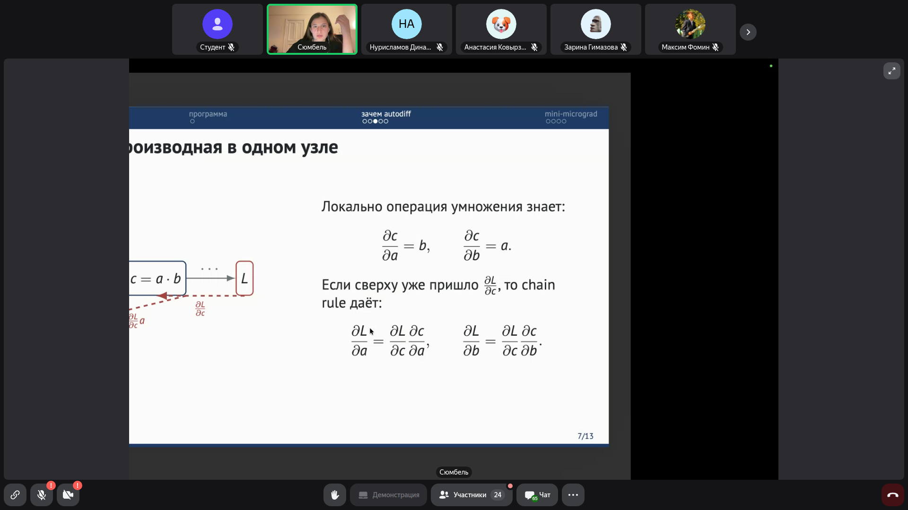
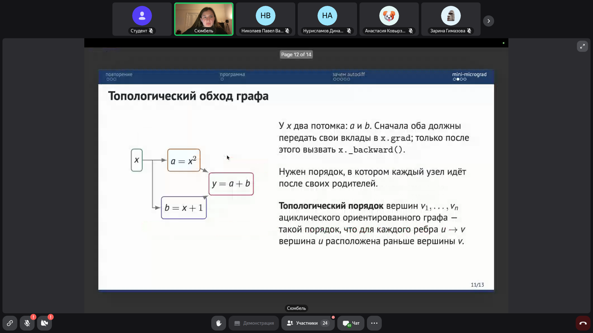
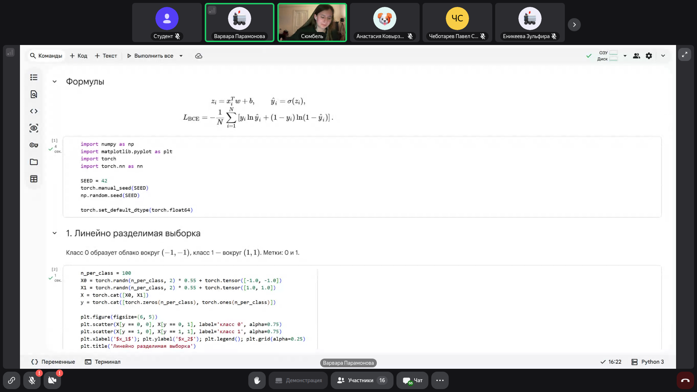
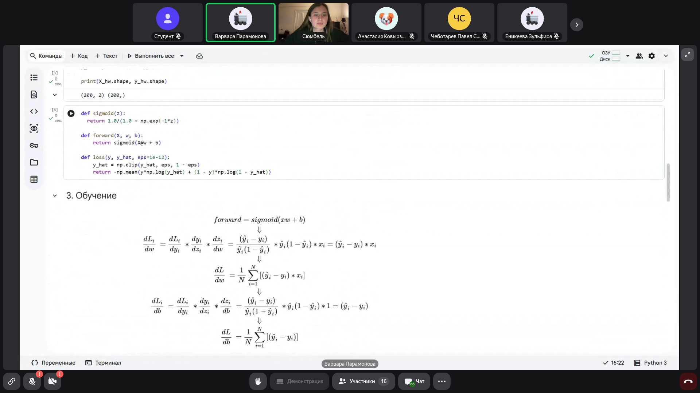
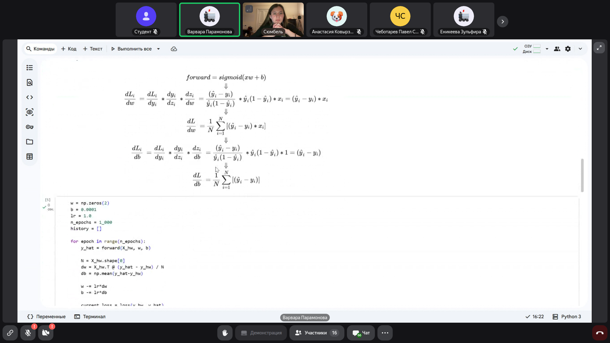
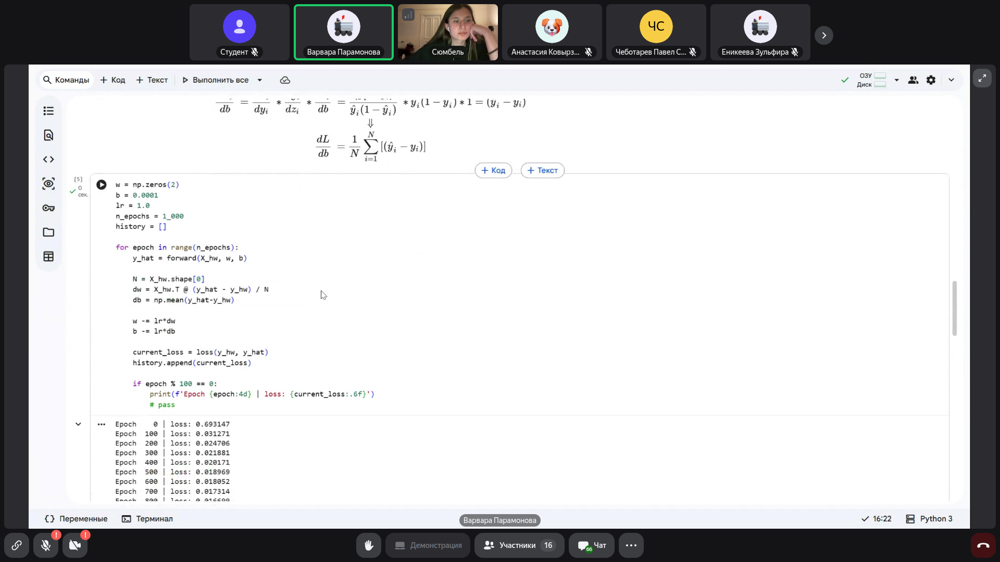
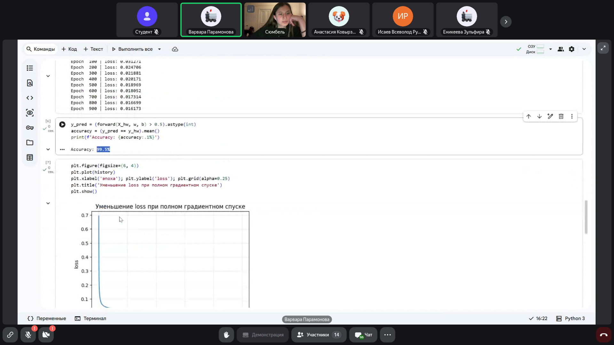
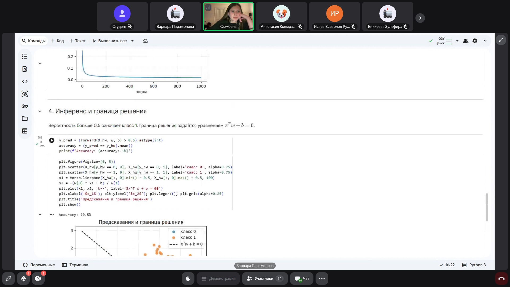

# Математика для Data Science: Автоматическое дифференцирование и устройство Autograd

> **Тема**: Автоматическое дифференцирование и устройство Autograd  
> **Статус конспекта**: Очищен от оговорок и воды, структурирован AI-ассистентом с сохранением авторских терминов.  
> **AI-модель**: `gemini-flash-latest`  

## Введение
Современные библиотеки глубокого обучения (в частности, PyTorch) берут на себя рутинную задачу дифференцирования сложных параметризованных функций с помощью механизма автоматического дифференцирования (autodiff). Настоящая лекция посвящена детальному разбору того, что скрывается за вызовом метода `loss.backward()`. Рассматриваются принципы динамического построения ориентированного ациклического графа (DAG), вычисление локальных производных через цепное правило (chain rule), корректное накопление градиентов при ветвлении через формулу полного дифференциала, топологический обход вершин с помощью поиска в глубину (DFS) и реализация скалярного движка автодифференцирования `Value` на чистом Python.

---

## 1. Мотивация Autodiff и концепция динамического графа вычислений `[01:10]`

В типичном пайплайне обучения нейронной сети в PyTorch цикл обучения выглядит следующим образом:

```python
model = NN()
criterion = nn.BCEWithLogitsLoss()
optimizer = torch.optim.SGD(model.parameters(), lr=lr)

logits = model(X)
current_loss = criterion(logits, y)
optimizer.zero_grad()
current_loss.backward()  # Вычисляет градиент nabla_w(L)
optimizer.step()
```

Строка `current_loss.backward()` автоматически вычисляет частные производные функции потерь $L$ по всем обучаемым параметрам модели ($W, b$).

В PyTorch вычислительный граф строится **динамически** (Dynamic DAG):
- Граф формируется на лету во время прямого прохода (**forward pass**);
- После каждого вызова `.backward()` граф удаляется и на следующей итерации при новом проходе строится заново. Это позволяет менять архитектуру сети, размеры слоев и ветвления в рантайме в зависимости от управляющих конструкций (условий, циклов).

### Слайды и код с экрана:


> [!IMPORTANT]
> **На заметку к зачету / экзамену:**
> - Понимать разницу между статическим графом (TensorFlow 1.x) и динамическим графом (PyTorch DAG). В PyTorch граф пересоздается с нуля после каждого backward-прохода.

---

## 2. Локальные производные и правило дифференцирования сложной функции (Chain Rule) `[07:15]`

Вычислительный граф состоит из узлов (**nodes**), хранящих значения и операции. Каждый узел знает только о своей локальной математической операции.

Пусть промежуточный узел $c$ получен перемножением $a$ и $b$:
$$c = a \cdot b$$

Локально операция умножения знает свои частные производные:
$$\frac{\partial c}{\partial a} = b, \quad \frac{\partial c}{\partial b} = a$$

Когда во время обратного прохода (backward) из последующих слоев в узел $c$ уже пришла производная функции потерь $\frac{\partial L}{\partial c}$, цепное правило (**chain rule**) позволяет мгновенно вычислить градиенты для входных аргументов узла:
$$\frac{\partial L}{\partial a} = \frac{\partial L}{\partial c} \cdot \frac{\partial c}{\partial a} = \frac{\partial L}{\partial c} \cdot b$$
$$\frac{\partial L}{\partial b} = \frac{\partial L}{\partial c} \cdot \frac{\partial c}{\partial b} = \frac{\partial L}{\partial c} \cdot a$$

Таким образом, общая сложная производная декомпозируется на цепочку тривиальных локальных умножений.

### Слайды и код с экрана:





> [!IMPORTANT]
> **На заметку к зачету / экзамену:**
> - Цепное правило: глобальный градиент по входу равен произведению пришедшего градиента на локальную производную операции.

---

## 3. Ветвление в графе: накопление градиентов через полный дифференциал `[15:40]`

Критически важный нюанс: если одна и та же переменная $x$ используется в нескольких ветках вычислений (например, $a = f(x)$ и $b = g(x)$, а затем $y = a + b$), то простой перезаписи градиента недостаточно.

По формуле полного дифференциала функции нескольких переменных:
$$dy = \frac{\partial y}{\partial a} da + \frac{\partial y}{\partial b} db$$
Разделив на $dx$, получаем правило суммирования производных по всем путям от целевой функции к переменной $x$:
$$\frac{\partial y}{\partial x} = \frac{\partial y}{\partial a} \frac{\partial a}{\partial x} + \frac{\partial y}{\partial b} \frac{\partial b}{\partial x}$$

**Следствие для программной реализации:**
В коде Autograd аккумуляция градиента всегда выполняется через оператор сложения с присваиванием `+=`, а не через прямое присваивание `=`:
```python
self.grad += out.grad * local_derivative
```
Если забыть `+=` и написать просто `=`, то при наличии развилок градиент от одной ветки перезапишет градиент от другой ветки, что приведет к грубой математической ошибке.

### Слайды и код с экрана:


> [!IMPORTANT]
> **На заметку к зачету / экзамену:**
> - Вопрос на зачете: почему в autograd пишется `node.grad += ...`, а не `node.grad = ...`? Ответ: для корректного учета всех ветвей графа в соответствии с формулой полного дифференциала.

---

## 4. Порядок обхода: обратная топологическая сортировка через DFS `[21:00]`

Обратный проход начинается с финального узла $L$ (функции потерь). Для самого узла $L$ базовый градиент всегда равен единице:
$$\frac{\partial L}{\partial L} = 1.0$$

Далее необходимо обойти все узлы графа в таком порядке, чтобы для каждого узла вызов `_backward()` происходил строго **после** того, как все его потомки (зависимые узлы) уже передали свои вклады в его градиент.

Поскольку вычислительный граф представляет собой DAG (ориентированный ациклический граф), требуемый порядок гарантируется **топологической сортировкой** (**Topological Sort**):
1. Запускается рекурсивный поиск в глубину (DFS) от финального узла $L$.
2. Поддерживается множество `visited` посещенных вершин.
3. Вершина добавляется в список топологического порядка `topo` только после рекурсивного обхода всех ее родителей (`_prev`).
4. Для выполнения обратного прохода полученный список обходится в обратном порядке: `reversed(topo)`.

### Слайды и код с экрана:





> [!IMPORTANT]
> **На заметку к зачету / экзамену:**
> - Топологический порядок в DAG: если существует ребро u -> v, то u расположено раньше v. Для backprop нужен обратный топологический порядок, начинающийся с L (loss).

---

## 5. Реализация скалярного autograd-движка: класс Value `[28:40]`

В ходе лекции был разработан базовый класс `Value` (микро-аналог библиотеки Karpathy Micrograd):

```python
class Value:
    def __init__(self, data, _prev=(), _op='', label=''):
        self.data = data
        self.grad = 0.0  # Начальный градиент dL/d(self)
        self._backward = lambda: None
        self._prev = set(_prev)  # Множество узлов-родителей
        self._op = _op
        self.label = label

    def __repr__(self):
        return f"Value(data={self.data}, grad={self.grad})"

    def __add__(self, other):
        other = other if isinstance(other, Value) else Value(other)
        out = Value(self.data + other.data, (self, other), '+')

        def _backward():
            # d(c)/da = 1, d(c)/db = 1
            self.grad += out.grad * 1.0
            other.grad += out.grad * 1.0
        out._backward = _backward
        return out

    def __mul__(self, other):
        other = other if isinstance(other, Value) else Value(other)
        out = Value(self.data * other.data, (self, other), '*')

        def _backward():
            # d(c)/da = b, d(c)/db = a
            self.grad += out.grad * other.data
            other.grad += out.grad * self.data
        out._backward = _backward
        return out

    def backward(self):
        topo = []
        visited = set()
        def build_topo(v):
            if v not in visited:
                visited.add(v)
                for child in v._prev:
                    build_topo(child)
                topo.append(v)
        build_topo(self)

        self.grad = 1.0  # dL/dL = 1
        for node in reversed(topo):
            node._backward()
```

Данная структура данных хранит числовое значение (`data`), накопленный градиент (`grad`), операцию (`_op`), ссылки на родителей (`_prev`) и локальную функцию обратного распространения (`_backward`).

### Слайды и код с экрана:


> [!IMPORTANT]
> **На заметку к зачету / экзамену:**
> - Четыре составляющих узла вычислительного графа: 1. Число (data), 2. Выражение/операция (_op), 3. Связи (_prev), 4. Производные (grad, _backward).

---

## 6. Численная валидация градиентов (Gradient Checking) `[55:10]`

Для проверки корректности аналитических производных в самописных движках автодифференцирования используется метод **центральных конечных разностей** (Gradient Check):

$$\frac{\partial L}{\partial w} \approx \frac{L(w + \epsilon) - L(w - \epsilon)}{2\epsilon}$$
где $\epsilon$ — малое число (например, $10^{-5}$ или $10^{-7}$).

Центральная конечная разность имеет порядок погрешности $O(\epsilon^2)$, в отличие от односторонней разности $\frac{L(w+\epsilon) - L(w)}{\epsilon}$, имеющей порядок $O(\epsilon)$.

В домашнем задании требуется сопоставить три значения производной для каждого веса:
1. Численное значение через конечные разности;
2. `Value.grad` после вызова `backward()`;
3. `torch.tensor.grad` из библиотеки PyTorch.

### Слайды и код с экрана:


> [!IMPORTANT]
> **На заметку к зачету / экзамену:**
> - Формула симметричной (центральной) конечной разности более точна ($O(\epsilon^2)$), чем односторонняя разность ($O(\epsilon)$).

---

## 7. Практический разбор студенческих работ: перцептрон и матричные формулы `[62:40]`

В заключительной части занятия студенты сдавали домашнее задание №2 (реализация бинарной логистической регрессии / перцептрона на NumPy без автодифференцирования).

**Ключевой теоретический вопрос преподавателя на защите:**
Почему в векторной формуле обновления весов $dw$ матрица $X$ обязательно транспонируется?
$$dw = \frac{1}{N} X^T (\hat{y} - y)$$
$$db = \frac{1}{N} \sum_{i=1}^N (\hat{y}_i - y_i)$$

**Объяснение:**
- Матрица признаков $X$ имеет размерность $(N, D)$, где $N$ — число объектов (батч), а $D$ — число признаков (размерность входного вектора).
- Вектор ошибок $(\hat{y} - y)$ имеет размерность $(N, 1)$.
- Чтобы получить градиент по весам $dw$ размерности $(D, 1)$, необходимо выполнить умножение $(D, N) \times (N, 1) = (D, 1)$.
- Транспонирование $X^T$ обеспечивает правильное взвешивание признаков каждого объекта по соответствующей ему величине ошибки классификации и суммирование вкладов всех $N$ объектов выборки.

Также обсуждался клиппинг предсказаний перед вычислением BCE (Binary Cross-Entropy Loss) для предотвращения $\ln(0) \to -\infty$:
```python
y_hat = np.clip(y_hat, eps, 1 - eps)
```

### Слайды и код с экрана:










> [!IMPORTANT]
> **На заметку к зачету / экзамену:**
> - На защитах строго проверяется осознание геометрического и размерностного смысла матричных операций: транспонирование $X^T$ нужно не просто 'чтобы перемножилось', а для суммирования вклада $i$-го объекта по каждому признаку.

---
