# Информатика и программирование: Цифровая обработка звука (Часть 2)

> **Тема**: Цифровая обработка звука (Часть 2)  
> **Статус конспекта**: Очищен от оговорок и воды, структурирован AI-ассистентом с сохранением авторских терминов.  
> **AI-модель**: `gemini-flash-latest`  

## Введение
Лекция посвящена углубленному изучению математических и алгоритмических основ цифровой обработки аудиосигналов. Рассматриваются физическая природа дискретизации и квантования, анализируются вычислительные аспекты дискретного преобразования Фурье (ДПФ) и алгоритм быстрого преобразования Фурье Кули — Тьюки. Особое внимание уделено практическим методам цифровой фильтрации во временной и частотной областях, эффекту утечки спектра и методам оконного взвешивания (окно Ханна), а также подходам к изменению темпа звучания аудиосигнала без изменения его высоты тона.

---

## Дискретизация, квантование и хранение звука `[05:00]`

При переходе из непрерывного физического мира в вычислительную систему акустическая волна преобразуется микрофоном в аналоговый электрический сигнал, который затем оцифровывается с помощью аналого-цифрового преобразователя (АЦП).

### Основные концепции цифрового звука:
1. **PCM (Pulse Code Modulation / Импульсно-кодовая модуляция):** Представление сигнала в виде последовательности чисел, отражающих мгновенные значения амплитуды через равные промежутки времени.
2. **Частота дискретизации ($F_d$ или Sample Rate):** Количество измерений (сэмплов) в единицу времени (секунду). Согласно **теореме Котельникова (Найквиста)**, аналоговый сигнал с ограниченным спектром может быть точно восстановлен, если частота дискретизации превышает удвоенную максимальную частоту в спектре сигнала:
$$f_d > 2 f_c$$
Для человеческого слуха диапазон слышимости составляет от $20$ Гц до $20\,000$ Гц, поэтому стандартные частоты дискретизации составляют $44.1$ кГц (Audio CD) или $48$ кГц, что гарантирует сохранение всех воспринимаемых частот.
3. **Битовая глубина (Bit depth):** Разрядность квантования ($n$), определяющая количество доступных уровней квантования ($N = 2^n$) для описания амплитуды каждого отсчета.
4. **Шум квантования:** Погрешность округления непрерывного значения амплитуды до ближайшего дискретного уровня сетки квантования. Квантование — это процесс, приводящий к необратимой потере информации.

### Расчет битрейта (на примере Audio CD):
Для несжатого стереозвука формата CD (частота $44\,100$ Гц, разрядность $16$ бит, 2 канала):
$$\text{Bitrate} = 44\,100 \times 16 \times 2 = 1\,411\,200 \text{ бит/с} \approx 1.41 \text{ Мбит/с}$$
Такой объем порождает существенную нагрузку при хранении и передаче, что обуславливает необходимость сжатия (lossless/lossy).

### Слайды и код с экрана:
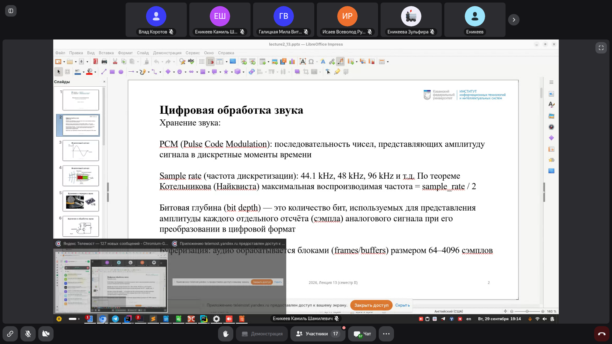
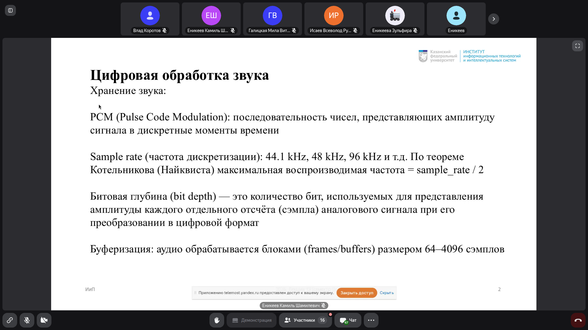
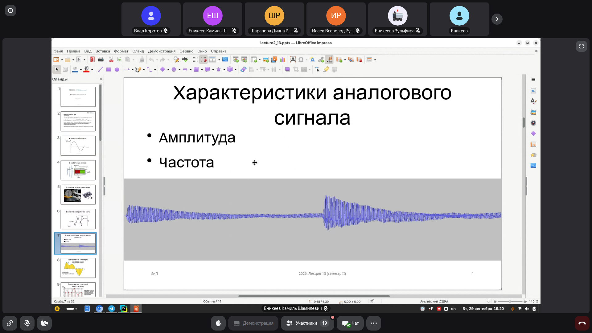
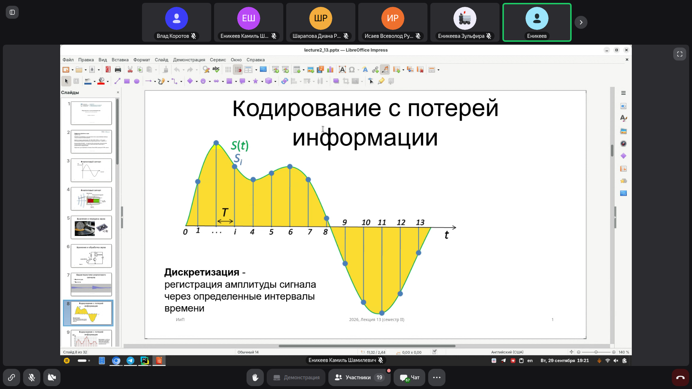
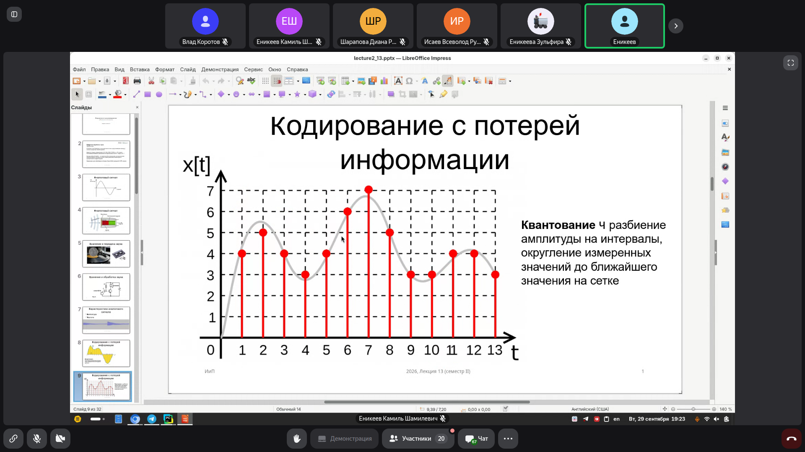
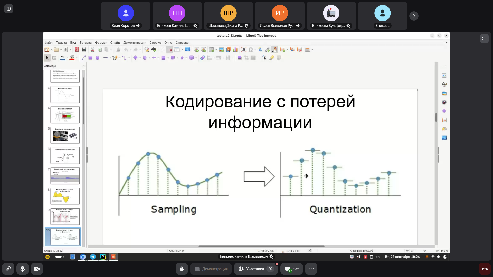
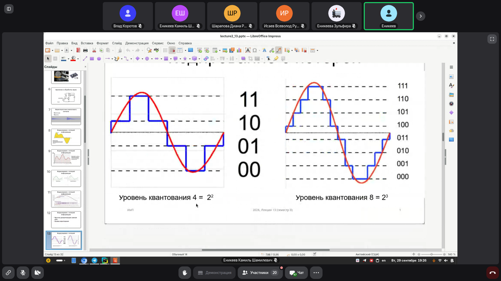
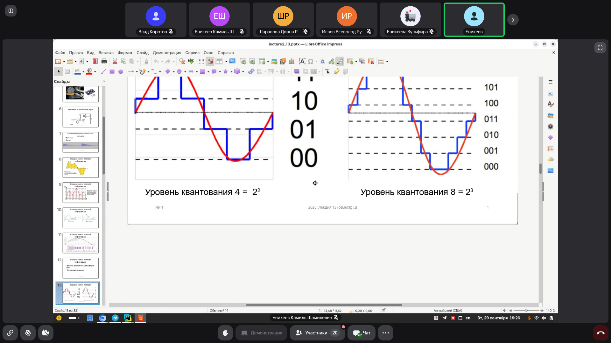
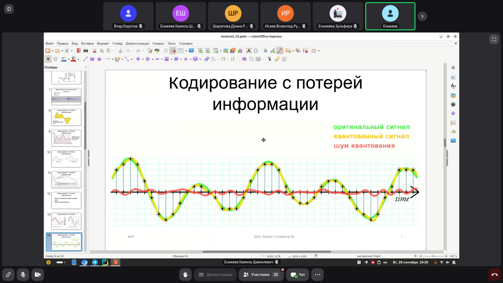
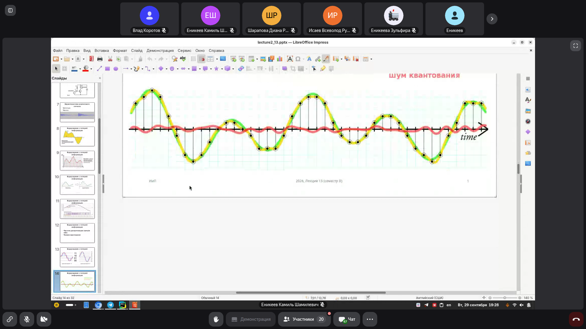
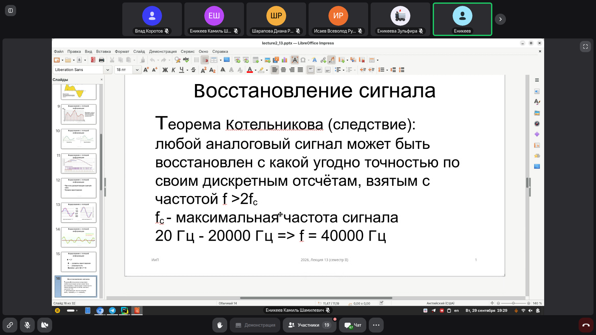

> [!IMPORTANT]
> **На заметку к зачету / экзамену:**
> - Помнить строгое различие между дискретизацией (разбиение по времени) и квантованием (разбиение по уровню амплитуды).
> - Знать формулу битрейта: Частота дискретизации × Разрядность квантования × Количество каналов.
> - Формулировка теоремы Котельникова и коэффициент 2 относительно граничной частоты спектра.

---

## Дискретное преобразование Фурье (ДПФ) и спектральное разрешение `[21:40]`

Дискретное преобразование Фурье позволяет перейти из временной области в частотную, сопоставляя вектору дискретных измерений спектральные коэффициенты.

### Математический аппарат:
Прямое ДПФ:
$$X_k = \sum_{n=0}^{N-1} x_n e^{-\frac{2\pi i}{N} kn}, \quad k = 0, 1, \dots, N-1$$

Обратное ДПФ:
$$x_k = \frac{1}{N} \sum_{n=0}^{N-1} X_n e^{\frac{2\pi i}{N} kn}, \quad k = 0, 1, \dots, N-1$$

Для вещественных сигналов $x_n \in \mathbb{R}$ коэффициенты спектра обладают комплексной симметрией:
$$X_{N-k} = X_k^*$$
Это означает, что физически независимой является только первая половина спектра (от $0$ до $N/2$).

### Частотные бины и разрешение:
Каждому индексу $k$ (частотному бину) соответствует определенная частота.
Параметры сетки:
- $T$ — длительность интервала измерения (окна);
- $N$ — общее количество отсчетов во фрагменте;
- $F_d = N / T$ — частота дискретизации;
- $\Delta f = 1 / T = F_d / N$ — шаг частотной сетки (расстояние между соседними бинами спектра).

**Пример:**
- Если окно $T = 1$ с, при $F_d = 44\,100$ Гц получаем $N = 44\,100$, а шаг сетки $\Delta f = 1$ Гц.
- Если окно уменьшить до $T = 0.5$ с ($N = 22\,050$), шаг по частоте увеличится до $\Delta f = 1 / 0.5 = 2$ Гц.

*Дилемма окна:* Чем короче окно по времени, тем грубее спектральное разрешение (больше $\Delta f$), однако длинные окна размывают временную локализацию быстро меняющихся звуковых событий.

### Слайды и код с экрана:
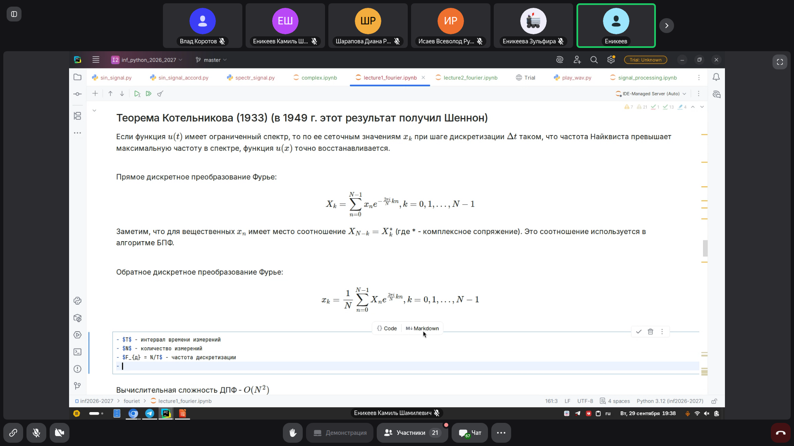
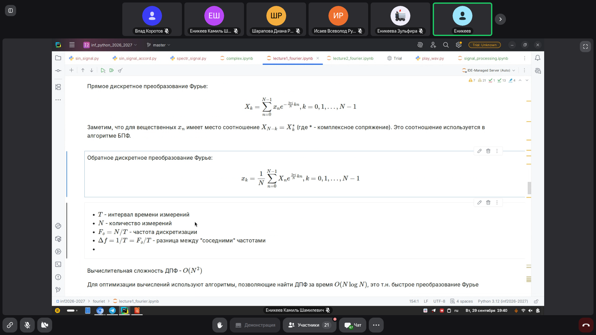
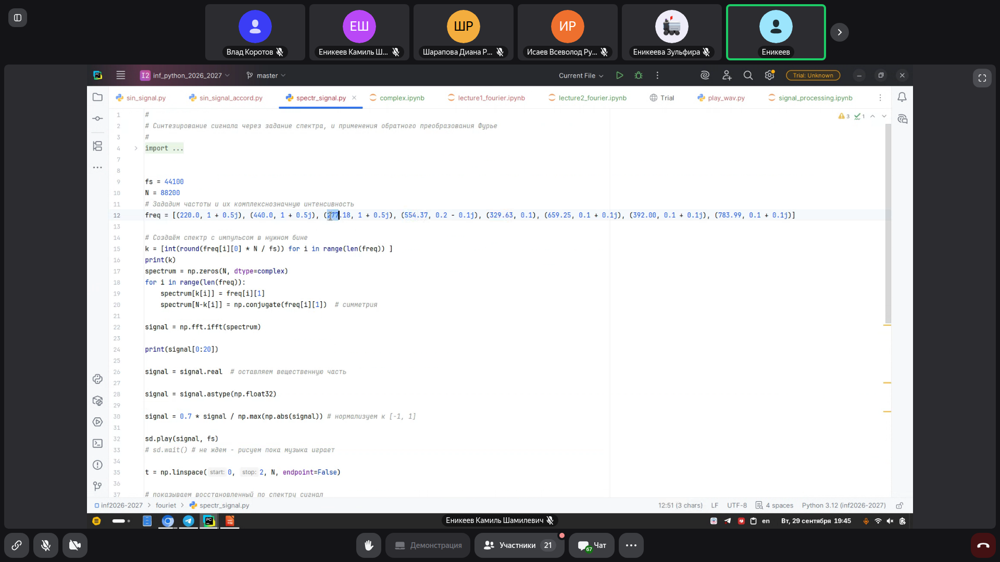
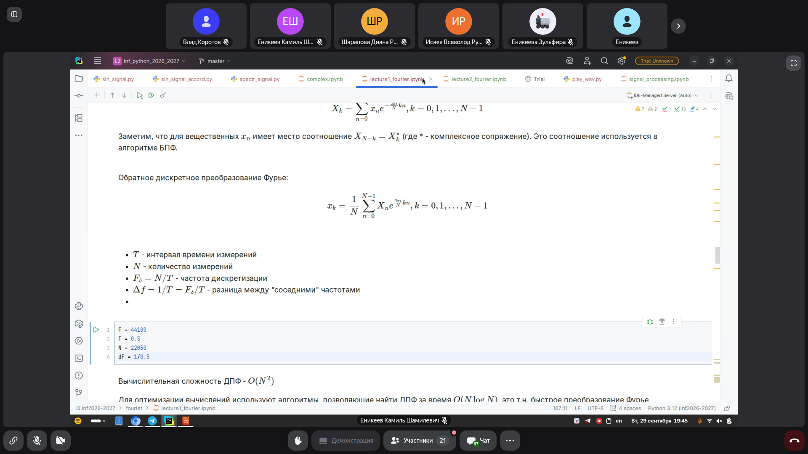
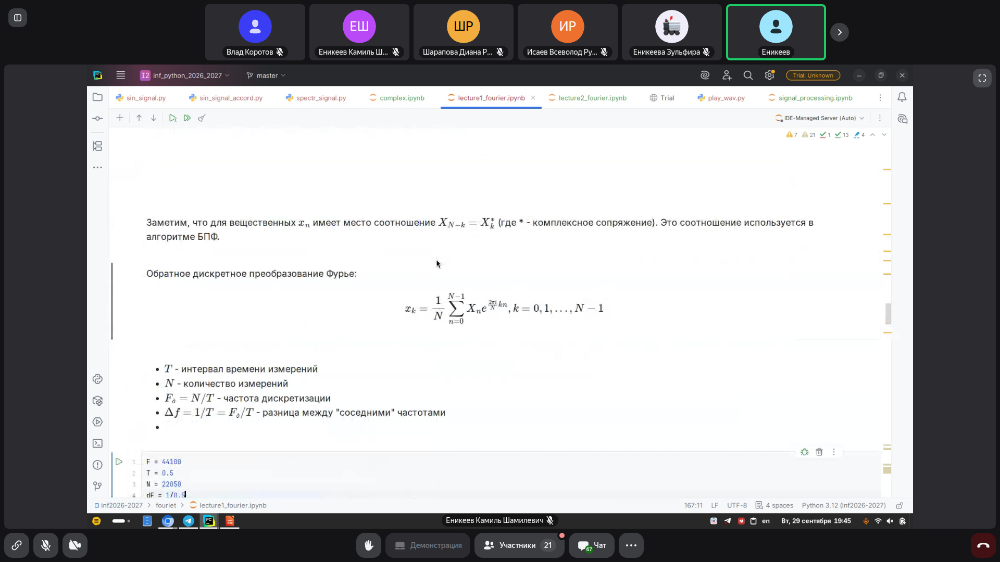
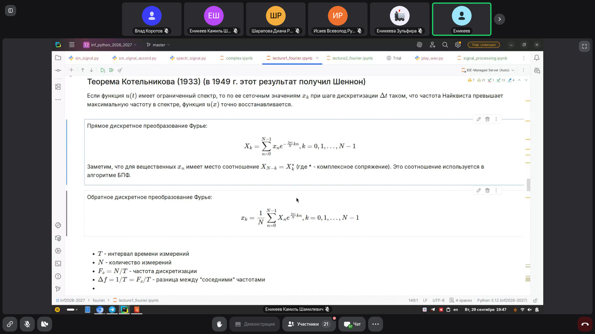


> [!IMPORTANT]
> **На заметку к зачету / экзамену:**
> - Связь шага частот с длиной окна: $\Delta f = 1 / T = F_d / N$.
> - Комплексное сопряжение $X_{N-k} = X_k^*$ для вещественных входных последовательностей — на нем строится оптимизация вычислений.

---

## Алгоритм быстрого преобразования Фурье Кули — Тьюки (БПФ) `[36:50]`

Прямое вычисление ДПФ по определению требует $N$ умножений для каждого из $N$ коэффициентов, что дает асимптотическую сложность $O(N^2)$. При больших $N$ (например, десятки и сотни тысяч сэмплов) это неприемлемо для работы в реальном времени.

### Принцип «Разделяй и властвуй» (Radix-2 Cooley-Tukey):
Введем поворотный множитель:
$$W_N = e^{-\frac{2\pi i}{N}}$$
Его ключевые свойства:
1. $W_N^{k+N} = W_N^k$ (периодичность)
2. $W_N^{k + N/2} = -W_N^k$ (антипериодичность / симметрия)
3. $W_N^{2k} = W_{N/2}^k$ (редукция шага)

Разделим исходную сумму отсчетов на четные ($2n$) и нечетные ($2n+1$) индексы:
$$X_k = \sum_{n=0}^{N/2 - 1} x_{2n} W_N^{k(2n)} + \sum_{n=0}^{N/2 - 1} x_{2n+1} W_N^{k(2n+1)} = \sum_{n=0}^{N/2 - 1} x_{2n} W_{N/2}^{kn} + W_N^k \sum_{n=0}^{N/2 - 1} x_{2n+1} W_{N/2}^{kn}$$

Обозначив суммы четных и нечетных элементов как $E_k$ и $O_k$ (каждая из которых представляет собой ДПФ размера $N/2$):
$$X_k = E_k + W_N^k O_k$$
$$X_{k + N/2} = E_k - W_N^k O_k, \quad k = 0, 1, \dots, N/2 - 1$$

За счет рекурсивного деления задачи пополам общая вычислительная сложность снижается до **$O(N \log N)$**.

### Слайды и код с экрана:
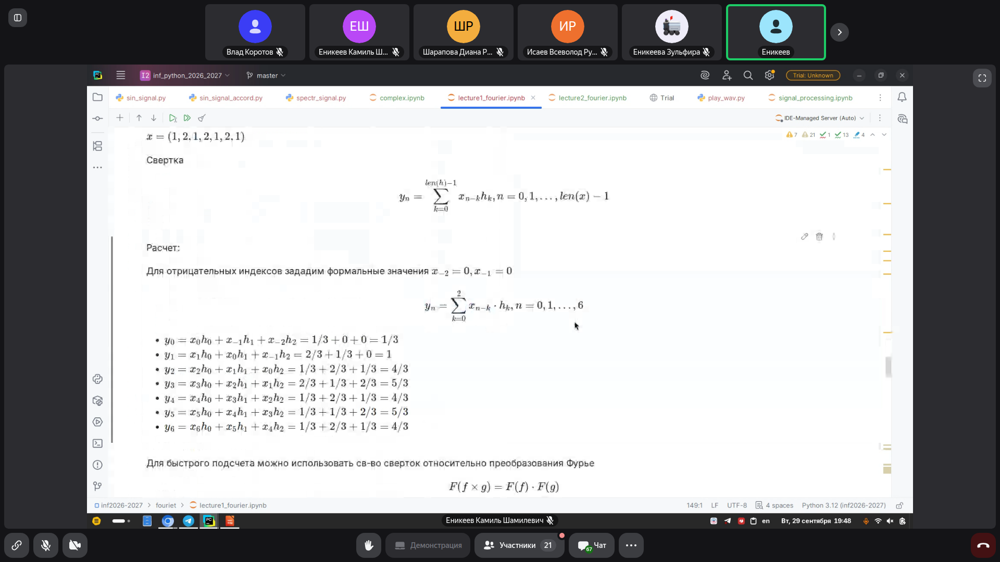
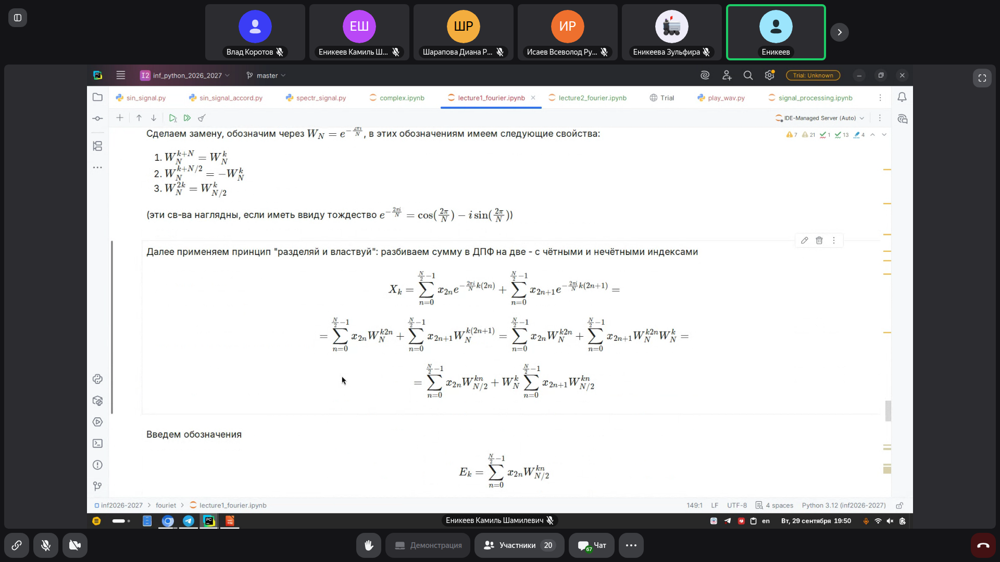
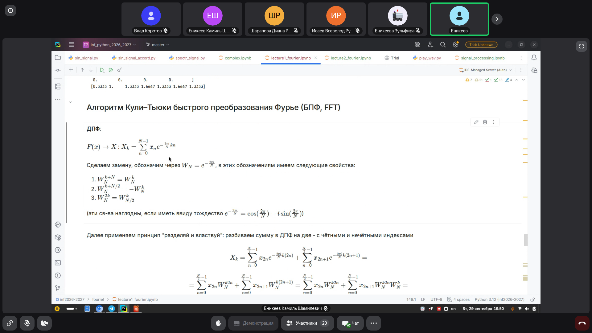
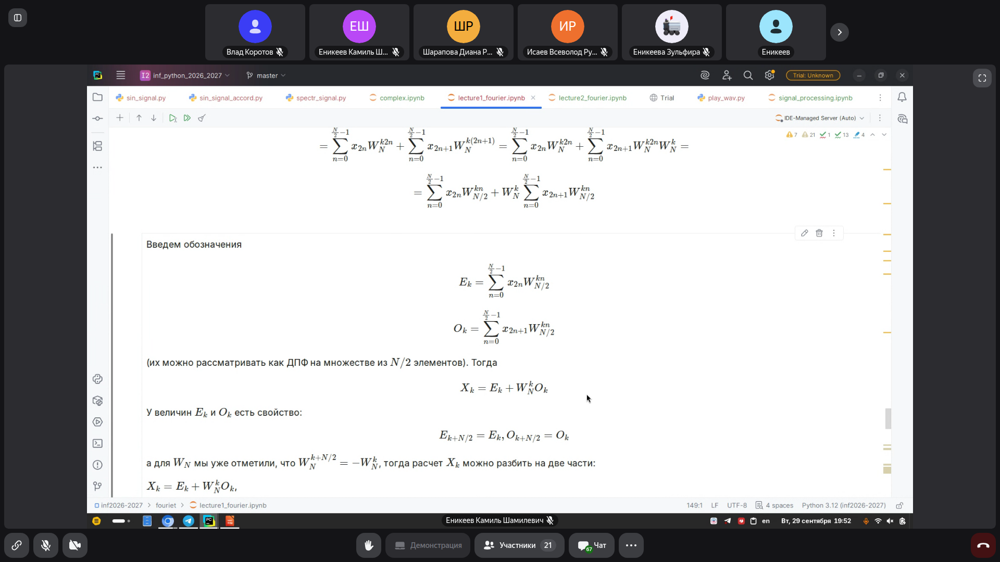
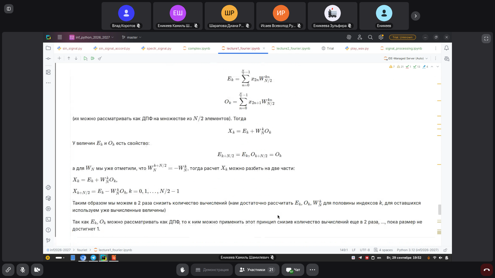
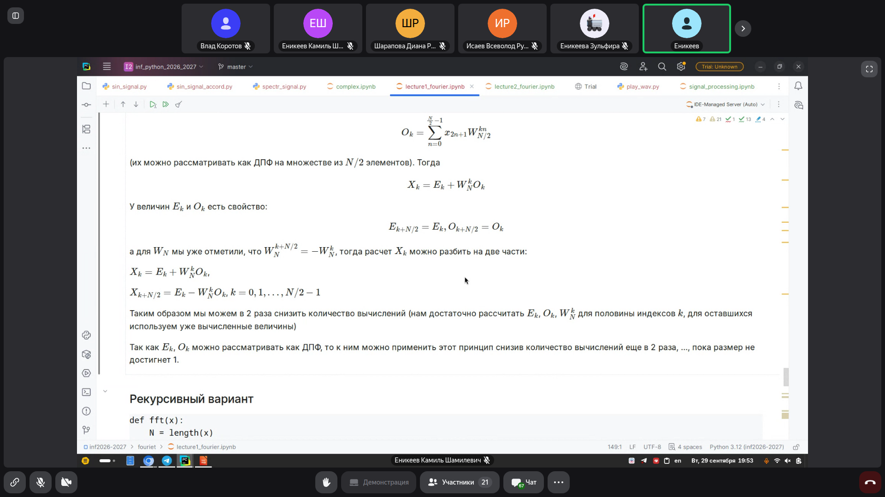


> [!IMPORTANT]
> **На заметку к зачету / экзамену:**
> - Понимание структуры «бабочки» БПФ и вывод формул через разбиение на четные/нечетные отсчеты.
> - Снижение вычислительной сложности с $O(N^2)$ до $O(N \log N)$.

---

## Предобработка аудио: удаление DC-компоненты и нормализация `[55:30]`

Перед спектральным анализом или подачей аудио в модели машинного обучения сырой сигнал требует обязательной предварительной подготовки.

### 1. Удаление постоянной составляющей (DC-компоненты)
Аппаратная часть микрофонов и трактов часто привносит паразитное постоянное напряжение (смещение нуля). В спектре Фурье этому соответствует нулевой бин ($X[0]$), который может обладать колоссальной амплитудой и маскировать реальные гармоники.
Удаление производится центрированием относительно среднего:
$$DC = \frac{1}{N} \sum_{n=0}^{N-1} x[n]$$
$$x_{\text{centered}}[n] = x[n] - DC$$

```python
import numpy as np

def remove_dc(x):
    return x - np.mean(x)
```

### 2. Нормализация сигнала
Амплитуда звукового сигнала из разных источников может сильно различаться. Используются три основных типа нормализации:

```python
import numpy as np

# 1. Пиковая нормализация (Peak Normalization) к диапазону [-1, 1]
def normalize_peak(x, eps=1e-9):
    return x / (np.max(np.abs(x)) + eps)

# 2. RMS-нормализация (среднеквадратичная энергия)
def normalize_rms(x, eps=1e-9):
    rms = np.sqrt(np.mean(x**2))
    return x / (rms + eps)

# 3. Z-score стандартизация (нулевое среднее, единичная дисперсия)
def normalize_zscore(x, eps=1e-9):
    return (x - np.mean(x)) / (np.std(x) + eps)
```

### Слайды и код с экрана:
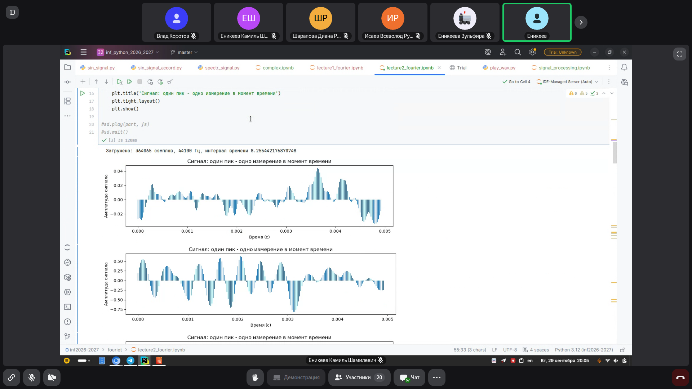
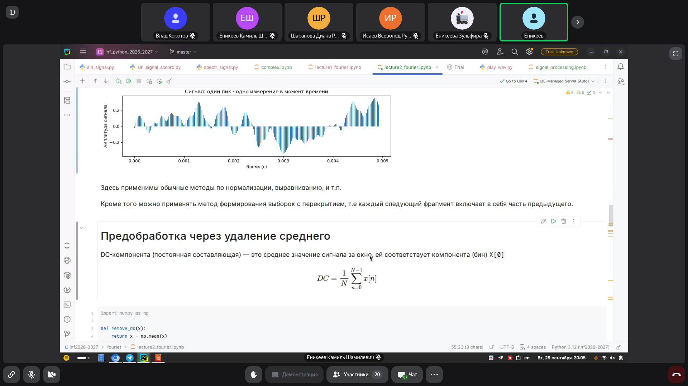
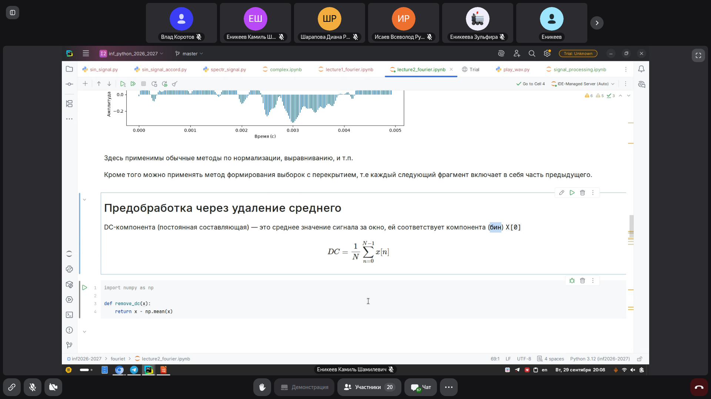
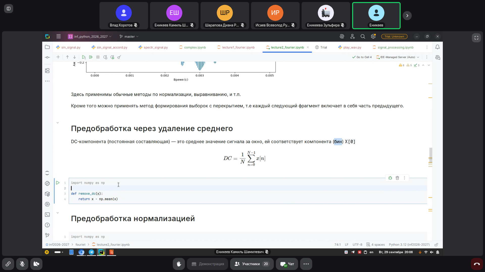
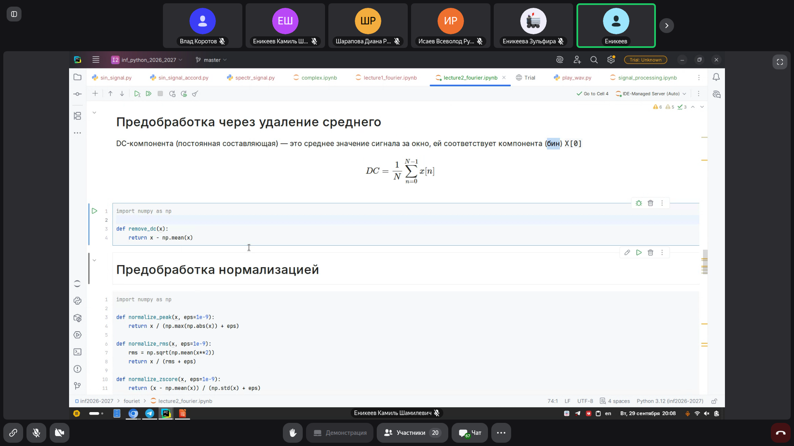
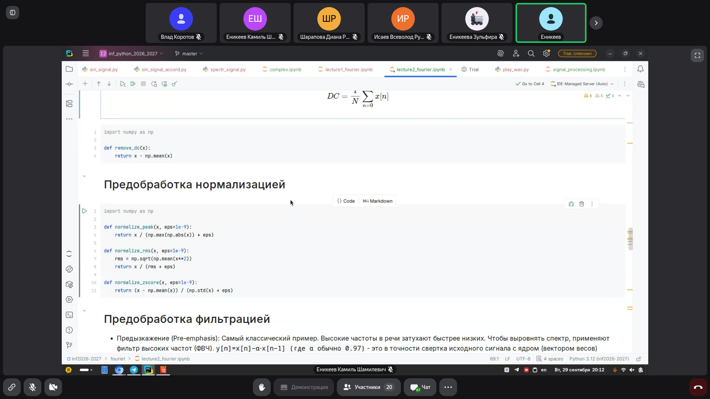
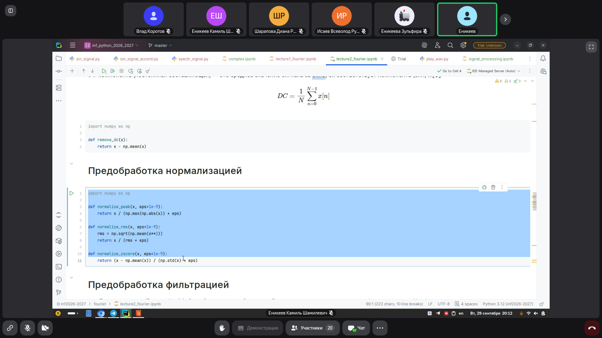

> [!IMPORTANT]
> **На заметку к зачету / экзамену:**
> - Зачем удалять постоянную составляющую: чтобы нулевой бин $X[0]$ не искажал спектр и динамический диапазон.
> - Разница между пиковой нормализацией (сохраняет форму волны без клиппинга) и RMS-нормализацией (выравнивает субъективную громкость/энергию).

---

## Цифровая фильтрация через свёртку и теорема о свёртке `[64:10]`

Линейные инвариантные во времени системы реализуются с помощью операции одномерной свёртки входного сигнала $x$ с импульсной характеристикой (ядром) фильтра $h$.

### Формула свёртки:
$$y_n = \sum_{k=0}^{M-1} x_{n-k} h_k, \quad n = 0, 1, \dots, N-1$$
где $M$ — длина импульсной характеристики фильтра, $h_k$ — весовые коэффициенты ядра.

### Примеры фильтров:
1. **Фильтр скользящего среднего (ФНЧ — фильтр низких частот):**
Сглаживает сигнал и подавляет высокочастотный шум.
Ядро длины $M=5$:
$$h = [0.2, 0.2, 0.2, 0.2, 0.2]$$
Каждая точка выхода представляет собой усреднение 5 соседних отсчетов.

2. **Фильтр верхних частот (ФВЧ / Pre-emphasis filter):**
В человеческой речи высокие частоты затухают быстрее низких. Для компенсации спектра и выделения формант применяют предсказательный фильтр:
$$y[n] = x[n] - \alpha x[n-1], \quad \alpha \approx 0.97$$
Ядро свёртки длины 2: $h = [1.0, -0.97]$.

```python
import numpy as np
import matplotlib.pyplot as plt

# Ручная реализация свёртки скользящего среднего (ФНЧ)
M = 5
h = np.ones(M) / M
y = np.zeros_like(x)
for n in range(M - 1, len(x)):
    for k in range(M):
        y[n] += h[k] * x[n - k]

# Быстрая свёртка через NumPy
y_fast = np.convolve(x, h, mode='same')
```

### Теорема о свёртке:
Свёртка двух сигналов во временной области эквивалентна поэлементному произведению их спектров в частотной области:
$$\mathcal{F}(x * h) = \mathcal{F}(x) \cdot \mathcal{F}(h)$$
Сложность свёртки во временной области составляет $O(N \cdot M)$. Используя БПФ, свёртку можно вычислить за $O(N \log N)$:
$$y = \text{IFFT}(\text{FFT}(x) \cdot \text{FFT}(h))$$

### Слайды и код с экрана:
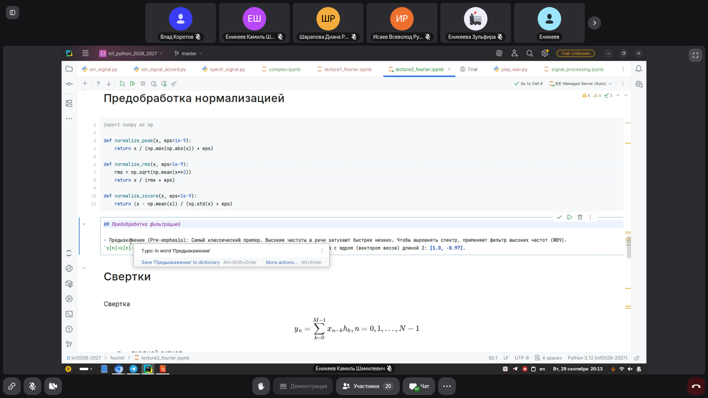
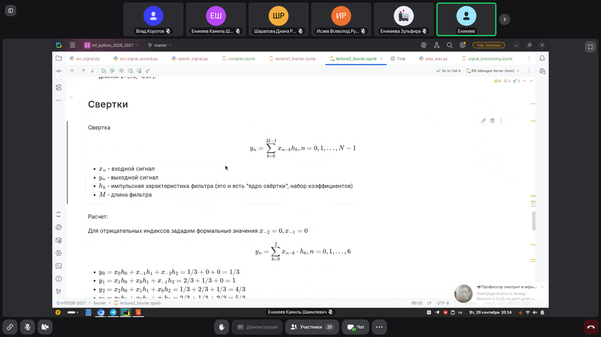
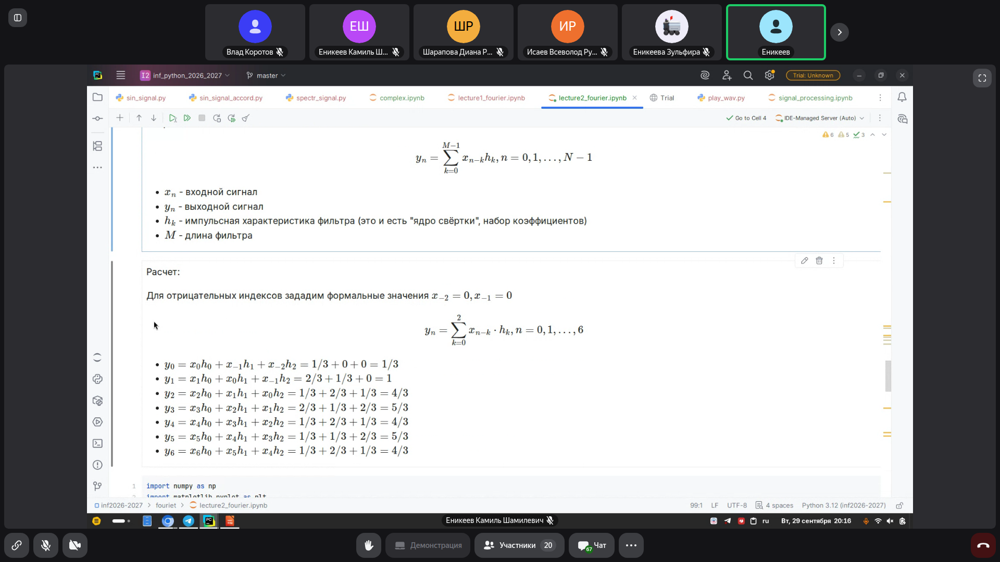
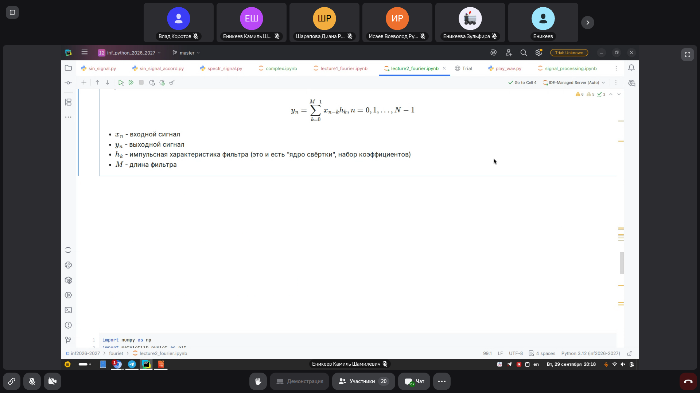
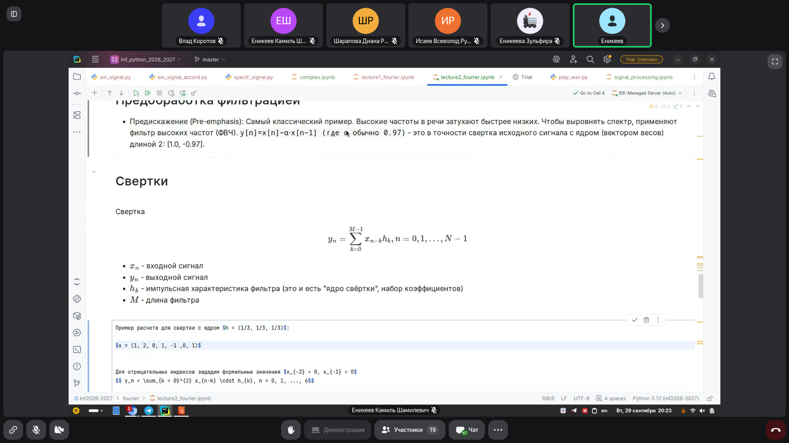
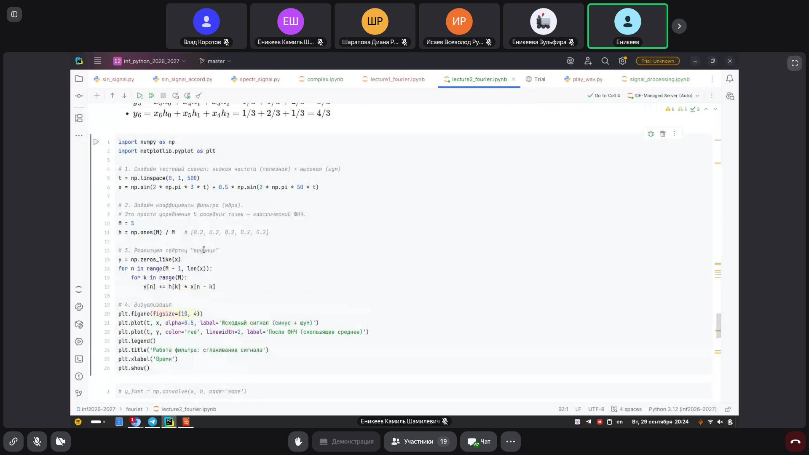
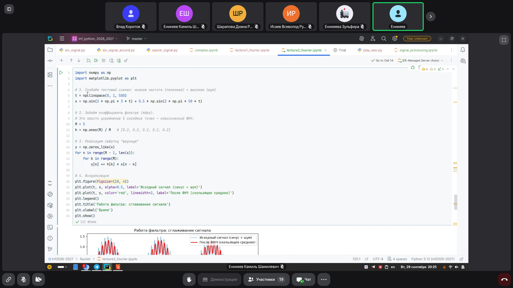
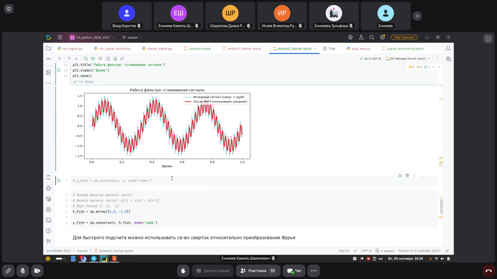
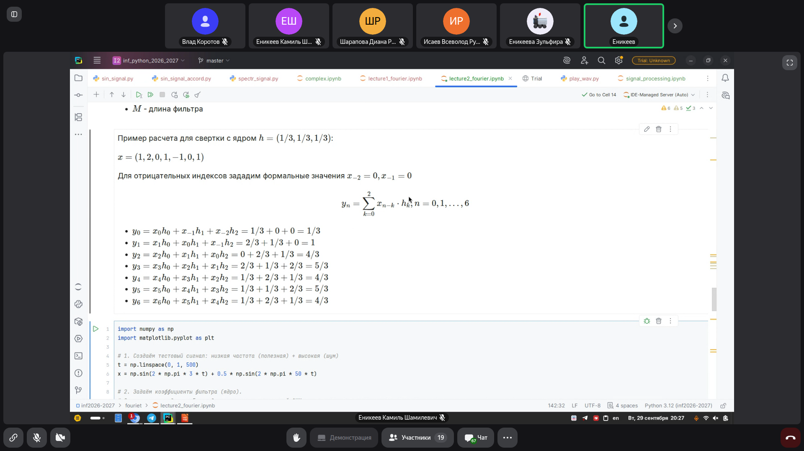

> [!IMPORTANT]
> **На заметку к зачету / экзамену:**
> - Знать теорему о свёртке: свёртка во времени $\leftrightarrow$ умножение в частотной области.
> - Понимать структуру фильтра скользящего среднего (деление на длину $M$) и фильтра пре-эмфазиса ($1.0, -0.97$).

---

## Периодическое продолжение и оконная функция Ханна `[79:30]`

Математическая база ДПФ неявно предполагает, что анализируемый конечный отрезок сигнала длины $T$ тиражируется влево и вправо до бесконечности как периодическая функция.

### Проблема краевых эффектов (утечка спектра):
В реальном звуке амплитуда в начале фрагмента $x[0]$ почти никогда не совпадает с амплитудой в конце $x[N-1]$. При периодическом продолжении на стыках периодов возникают резкие разрывы (ступеньки).
Разложение разрыва в ряд Фурье требует бесконечного набора высокочастотных синусоид. В результате в спектре появляются ложные высокочастотные всплески, которых физически не было в звуке (эффект Гиббса / утечка спектра).

### Окно Ханна (Hann Window):
Чтобы устранить разрыв на границах, сигнал умножают на плавную колоколообразную весовую функцию, которая плавно спадает до нуля на краях интервала:
$$w_n = \frac{1}{2} \left(1 - \cos\left(\frac{2\pi n}{N - 1}\right)\right), \quad n = 0, 1, \dots, N-1$$

```python
import numpy as np

N = 8
n = np.arange(N)
w = 0.5 * (1 - np.cos(2 * np.pi * n / (N - 1)))
print(np.round(w, 4))
```
При умножении сигнала на окно Ханна края фрагмента принудительно обнуляются, устраняя граничный скачок и очищая спектр от паразитных высоких частот.

### Слайды и код с экрана:
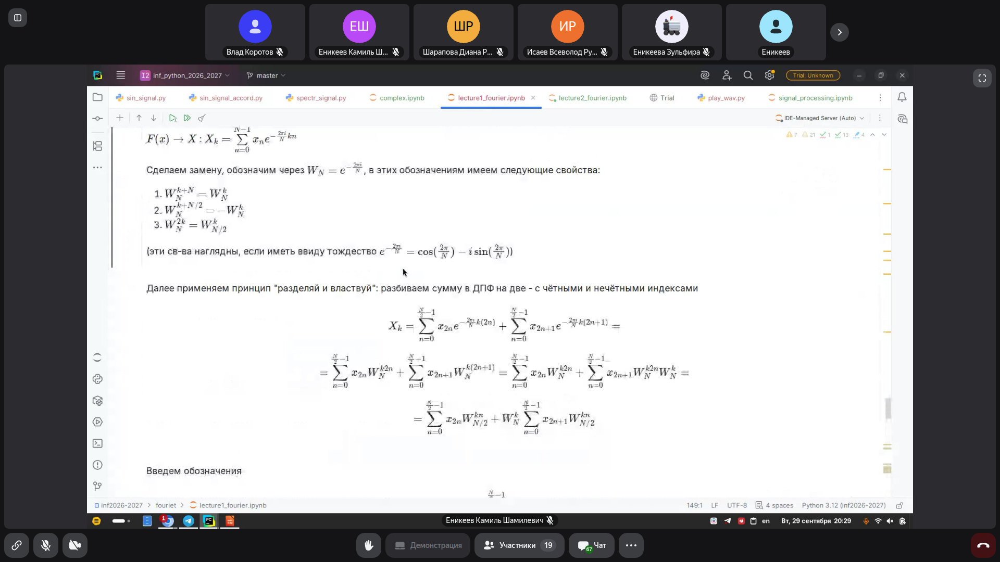
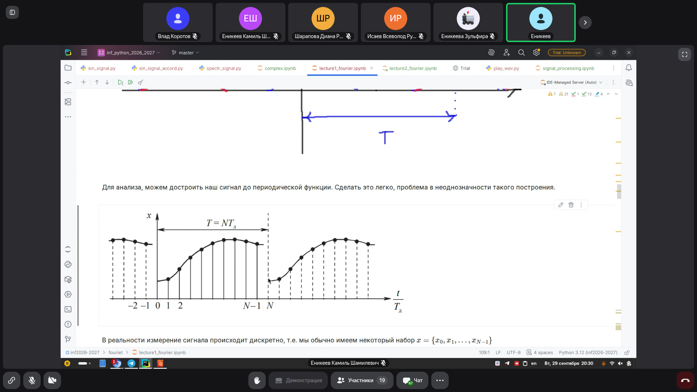
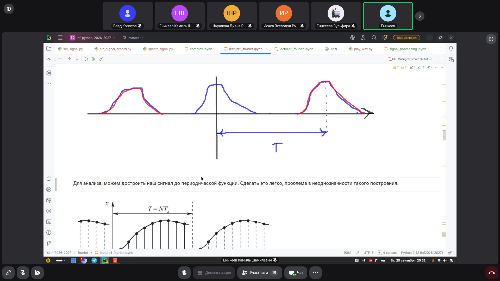
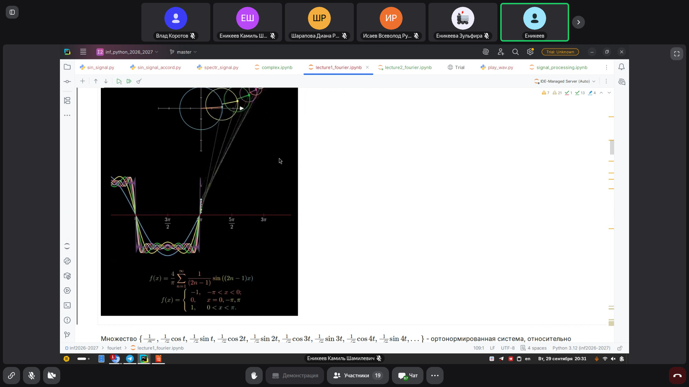
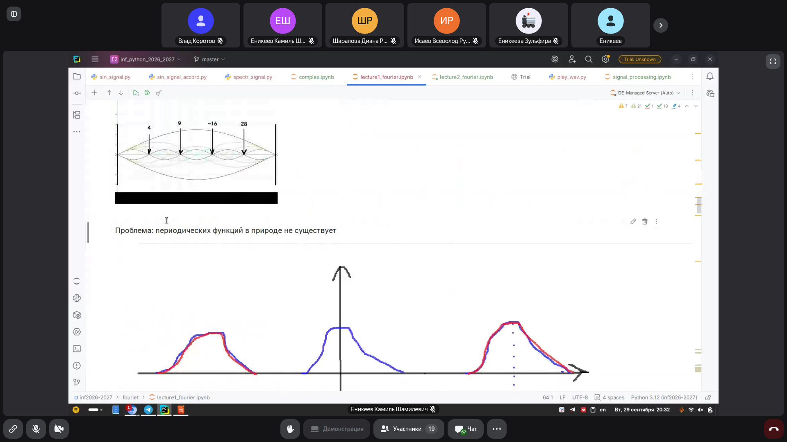
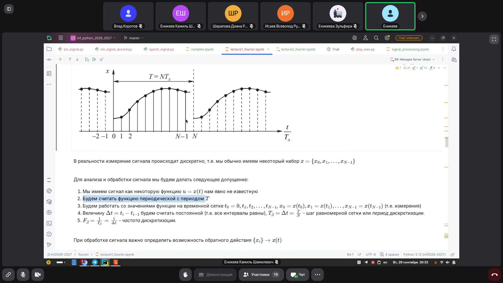
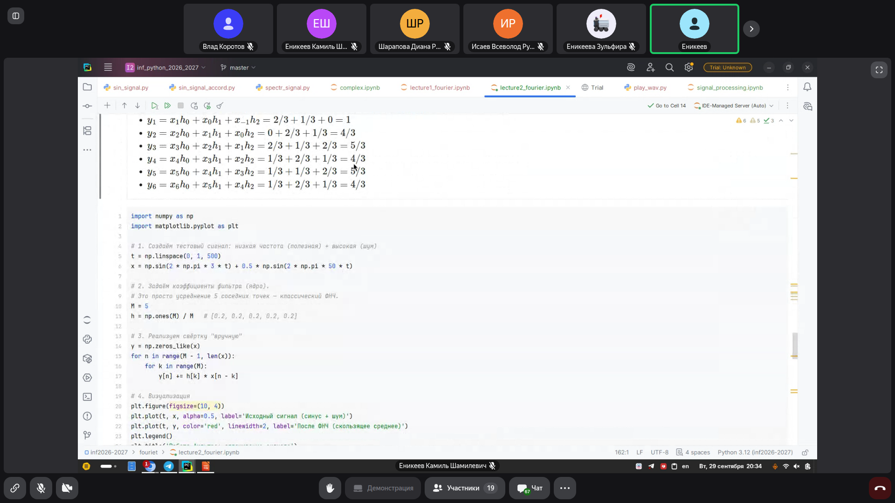
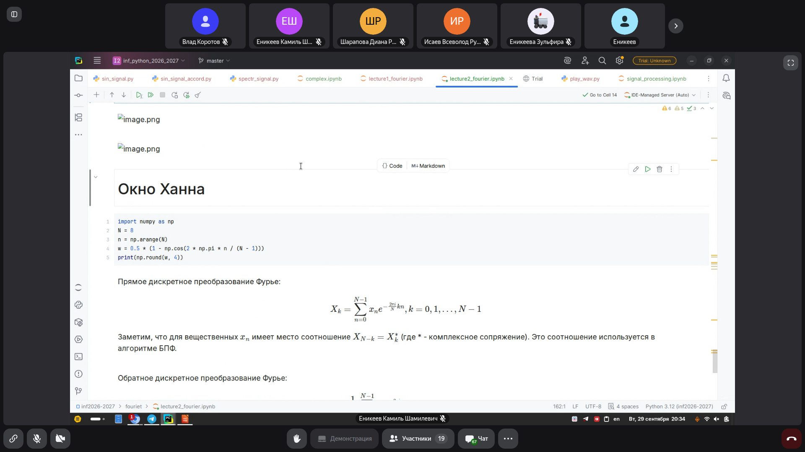
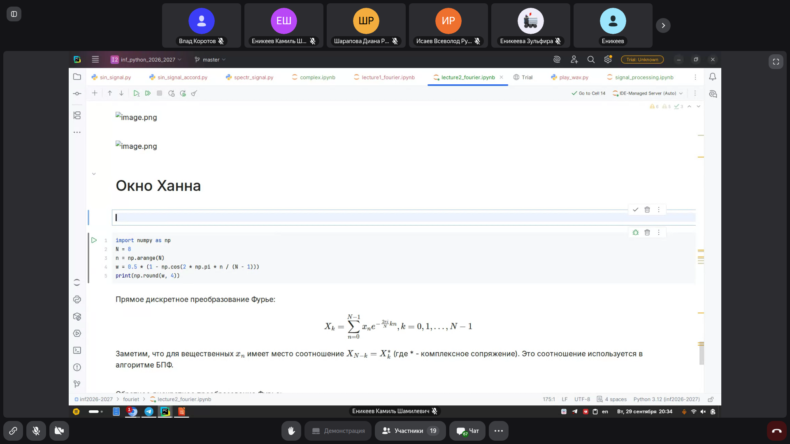

> [!IMPORTANT]
> **На заметку к зачету / экзамену:**
> - Почему возникают ложные высокие частоты: из-за допущения о бесконечной периодичности конечного фрагмента и разрыва на стыке $x[0]$ и $x[N-1]$.
> - Смысл окна Ханна: принудительное сведение сигнала на границах окна к нулю с помощью полусинусоиды/косинусоиды.

---

## Практикум: изменение темпа аудиосигнала без изменения высоты тона `[96:40]`

При простом прореживании отсчетов или увеличении частоты воспроизведения в 2 раза звук ускоряется, но все частоты сдвигаются вверх в 2 раза (голос становится неестественно высоким — эффект питч-шифта).

### Постановка задачи:
Сжать 4-секундный сигнал в 2-секундный так, чтобы сохранить оригинальные частоты спектра (Pitch preservation).

### Алгоритм решения через спектральный перенос:
1. **Исходные параметры:**
   - Время $T_1 = 4$ с, частота дискретизации $F_d = 44\,100$ Гц.
   - Число отсчетов $N_1 = 44\,100 \times 4 = 176\,400$.
   - Разрешение спектра: $\Delta f_1 = 1 / T_1 = 1/4$ Гц.
2. **Целевые параметры:**
   - Время $T_2 = 2$ с, частота $F_d = 44\,100$ Гц.
   - Число отсчетов $N_2 = 44\,100 \times 2 = 88\,200$.
   - Разрешение спектра: $\Delta f_2 = 1 / T_2 = 1/2$ Гц.
3. **Алгоритм сопоставления гармоник:**
   - Вычисляем прямое БПФ исходного вектора $x \to X$.
   - Создаем целевой комплексный спектр $Y$ размера $N_2$, заполненный нулями.
   - Итеративно перебираем доминирующие пики $X_k$ в первой половине спектра исходного сигнала ($k \in [0, N_1/2]$).
   - Настоящая частота гармоники: $f = k \times \Delta f_1 = k / 4$ Гц.
   - Определяем, в какой индекс $m$ массива $Y$ попадает данная частота:
$$m = \text{round}\left(\frac{f}{\Delta f_2}\right) = \text{round}\left(\frac{k / 4}{1 / 2}\right) = \text{round}\left(\frac{k}{2}\right)$$
   - Записываем гармонику в новый спектр с соблюдением зеркальной симметрии:
$$Y[m] = X[k]$$
$$Y[N_2 - m] = X[k]^*$$
4. **Синтез:**
   - Применяем обратное БПФ к новому спектру: $y = \text{np.real}(\text{np.fft.ifft}(Y))$.
   - Воспроизводим полученный сигнал со штатной частотой $F_d = 44\,100$ Гц.

### Слайды и код с экрана:
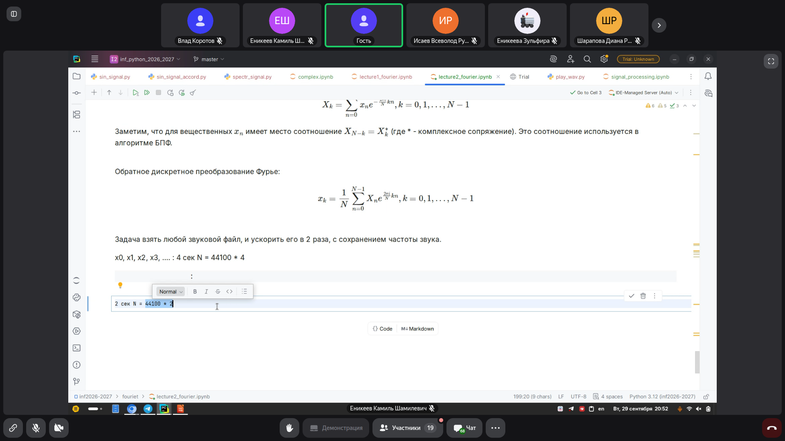
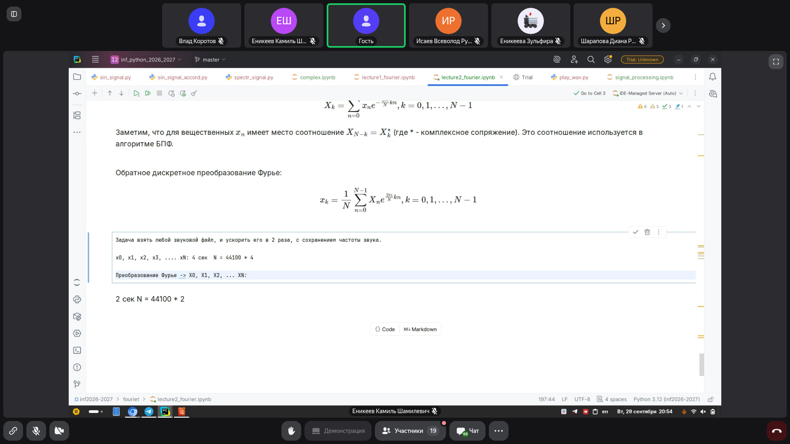


> [!IMPORTANT]
> **На заметку к зачету / экзамену:**
> - Формула пересчета индексов бинов между сетками разной длительности: сопоставление через физическую частоту $f = k \cdot \Delta f$.
> - Обязательность восстановления отрицательных частот через комплексное сопряжение $Y[N-m] = Y[m]^*$ для получения вещественного сигнала во времени.

---
