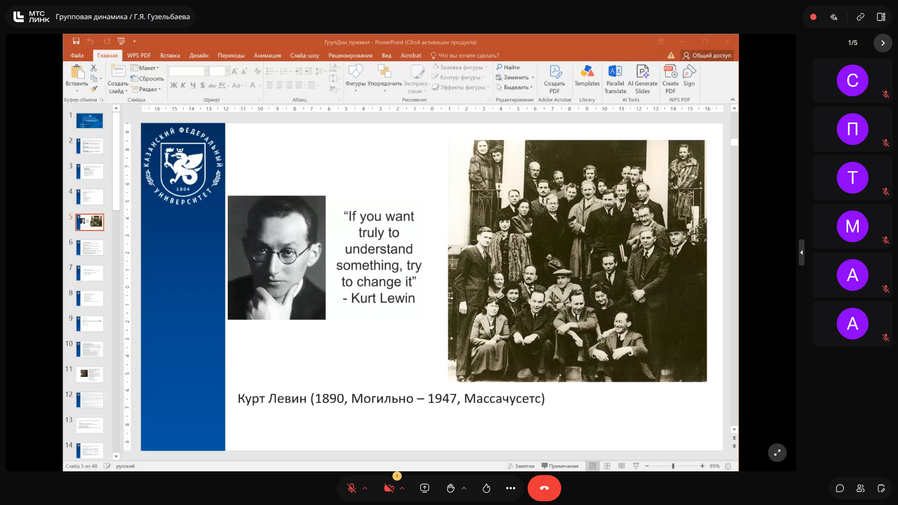
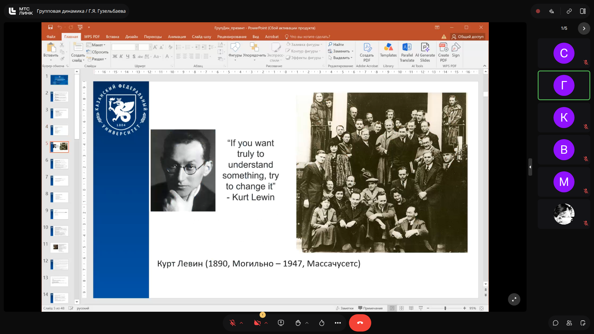
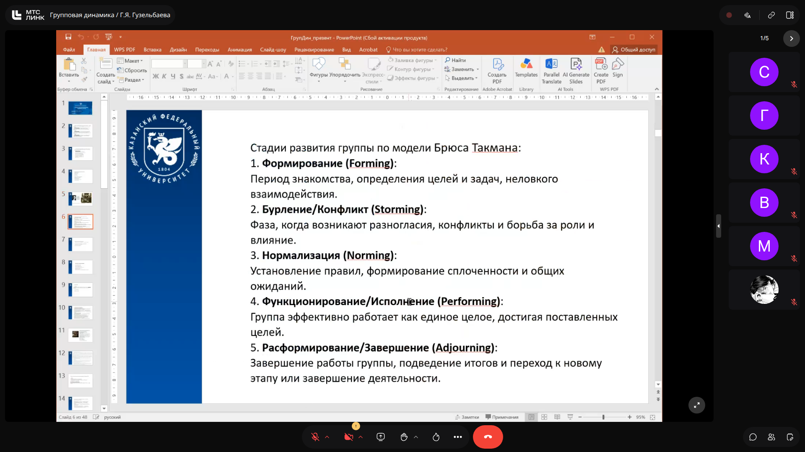

# Групповая динамика: Курт Левин и модель стадий развития группы Брюса Такмана

> **Тема**: Курт Левин и модель стадий развития группы Брюса Такмана  
> **Статус конспекта**: Очищен от оговорок и воды, структурирован AI-ассистентом с сохранением авторских терминов.

## Введение
Материалы лекции посвящены базовым концепциям дисциплины «Групповая динамика». В ходе занятия рассмотрены историческая роль психолога Курта Левина, а также классическая пятиступенчатая модель жизненного цикла и развития малой группы Брюса Такмана.

*Примечание: голосовые комментарии лектора отсутствовали (в аудиозаписи зафиксирована тишина), конспект составлен строго по материалам представленных слайдов.*

---

## Курт Левин и зарождение теории групповой динамики `[00:00]`

### Курт Левин (1890–1947)
Курт Левин (1890, Могильно — 1947, Массачусетс) — выдающийся психолог, стоявший у истоков социальной психологии и концепции групповой динамики.

Ключевой методологический принцип исследователя сформулирован в известном тезисе:
> *«If you want truly to understand something, try to change it»*  
> *(«Если вы действительно хотите что-то понять, попытайтесь это изменить»)*

Данный принцип лег в основу исследований действия (action research) и изучения динамических процессов, происходящих внутри малых групп.

### Слайды и код с экрана:

> [!IMPORTANT]
> **На заметку к зачету / экзамену:**
> - Знать годы жизни Курта Левина (1890–1947) и его ключевой афоризм о познании через изменение.

---

## Стадии развития группы по модели Брюса Такмана `[04:30]`

Модель Брюса Такмана описывает последовательные фазы, через которые проходит малая группа в процессе своей эволюции от момента создания до прекращения совместной деятельности:

1. **Формирование (Forming)**:
   - Период первичного знакомства участников.
   - Определение целей и задач группы.
   - Характерно ощущение неловкости взаимодействия и ориентация на поиск ориентиров поведения.

2. **Бурление / Конфликт (Storming)**:
   - Фаза проявления индивидуальных различий и несогласий.
   - Возникновение открытых или скрытых конфликтов.
   - Борьба за социальные роли, статус и влияние внутри коллектива.

3. **Нормализация (Norming)**:
   - Установление внутренних правил, норм и регламентов.
   - Формирование групповой сплоченности и согласованности.
   - Выработка общих ожиданий и стандартов совместной работы.

4. **Функционирование / Исполнение (Performing)**:
   - Группа выходит на пиковую эффективность и работает как единое целое.
   - Конструктивное решение задач и достижение поставленных целей.

5. **Расформирование / Завершение (Adjourning)**:
   - Завершение совместной деятельности группы.
   - Подведение итогов работы.
   - Переход участников к новым этапам или полное прекращение функционирования группы.

### Слайды и код с экрана:

> [!IMPORTANT]
> **На заметку к зачету / экзамену:**
> - Обязательно знать все 5 стадий модели Брюса Такмана по порядку на русском и английском языках: Forming, Storming, Norming, Performing, Adjourning.
> - Уметь охарактеризовать специфику межличностных отношений на каждой стадии (неловкость на Forming, борьба за влияние на Storming, правила на Norming, синергия на Performing, подведение итогов на Adjourning).

---
