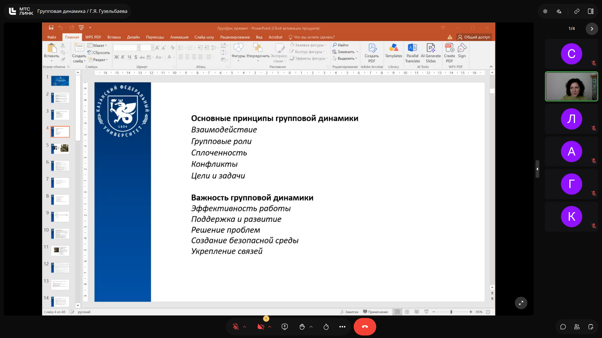
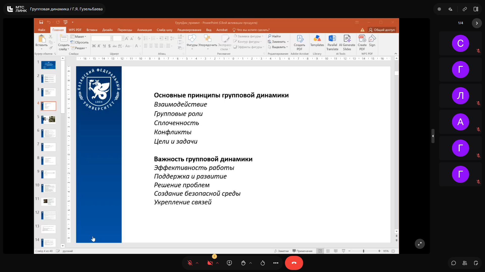

# Групповая динамика: Принципы групповой динамики, роли и этапы развития малой группы

> **Тема**: Принципы групповой динамики, роли и этапы развития малой группы  
> **Статус конспекта**: Очищен от оговорок и воды, структурирован AI-ассистентом с сохранением авторских терминов.

## Введение
Дисциплина изучает закономерности взаимодействия людей внутри малых групп, процессы командообразования, влияние социальных факторов на продуктивность и механизмы разрешения внутренних конфликтов. Основоположником направления является социальный психолог Курт Левин, впервые сформулировавший представление о группе как динамической системе.

---

## Понятие и ключевые принципы групповой динамики `[01:15]`

Групповая динамика описывает совокупность психологических и социологических процессов, происходящих в малой группе в ходе ее существования.\n\n### Базовые принципы:\n1. **Взаимодействие (Interaction):** Регулярный обмен информацией, эмоциями и совместная деятельность членов группы.\n2. **Групповые роли (Roles):** Модели поведения и функциональные обязанности, закрепляющиеся за конкретными участниками.\n3. **Сплоченность (Cohesion):** Степень взаимной привязанности участников и привлекательности группы для каждого из них.\n4. **Конфликты (Conflicts):** Неизбежный элемент развития, возникающий из-за расхождения интересов, ценностей или взглядов на методы решения задач.\n5. **Цели и задачи (Goals):** Объединяющий вектор деятельности группы, определяющий ее направленность и критерии успеха.

### Слайды и код с экрана:

> [!IMPORTANT]
> **На заметку к зачету / экзамену:**
> - Группа рассматривается не как простая сумма индивидов, а как самостоятельная система с собственными законами функционирования (полевая теория Курта Левина).

---

## Практическое значение групповой динамики `[04:40]`

Понимание динамических процессов в команде позволяет целенаправленно воздействовать на коллектив:\n\n- **Эффективность работы:** Оптимизация распределения ресурсов и обязанностей приводит к повышению синергии.\n- **Поддержка и развитие:** Здоровая групповая среда способствует ускоренному профессиональному росту каждого участника.\n- **Решение проблем:** Команды с развитой культурой коммуникации быстрее справляются с кризисными и нестандартными ситуациями.\n- **Создание безопасной среды:** Высокий уровень психологической безопасности стимулирует инициативу и обмен идеями без страха осуждения.\n- **Укрепление связей:** Долгосрочные доверительные отношения формируют устойчивость группы к внешним стрессам.

### Слайды и код с экрана:

> [!IMPORTANT]
> **На заметку к зачету / экзамену:**
> - Психологическая безопасность — ключевой предиктов высокой эффективности команды (обратите внимание на пример исследований Google Аристотель).

---

## Этапы развития группы по модели Брюса Такмана `[07:30]`

Модель описывает линейно-циклический путь взросления рабочей группы:\n\n1. **Forming (Формирование):** Участники знакомятся, ориентируются в целях, проявляют вежливость и осторожность, ищут свое место в структуре.\n2. **Storming (Шторминг / Бурление):** Фаза неизбежного конфликта. Происходит борьба за лидерство, пересмотр целей, сопротивление установленным правилам.\n3. **Norming (Нормирование):** Разрешение противоречий, формирование консенсуса, выработка общепринятых неписаных норм и правил взаимодействия.\n4. **Performing (Функционирование):** Период максимальной продуктивности. Роли гибки, коммуникация открыта, группа сфокусирована на достижении общего результата.\n5. **Adjourning (Распад / Завершение):** Завершение проекта или реорганизация команды, рефлексия и подведение итогов.

### Слайды и код с экрана:

> [!IMPORTANT]
> **На заметку к зачету / экзамену:**
> - Преподаватель подчеркнул: стадию шторминга невозможно пропустить или искусственно избежать без ущерба для финальной продуктивности группы.

---
