# Групповая динамика и коммуникация в командной разработке: Модель трансактного анализа: Родитель, Взрослый, Ребенок

> **Тема**: Модель трансактного анализа: Родитель, Взрослый, Ребенок  
> **Статус конспекта**: Очищен от оговорок и воды, структурирован AI-ассистентом с сохранением авторских терминов.  
> **AI-модель**: `gemini-flash-latest`  

## Введение
Лекция посвящена изучению основ трансактного анализа как рационального метода описания и анализа поведения людей в межличностном взаимодействии и малых группах. Рассматривается концепция трех эго-состояний личности по Эрику Берну (Родитель, Взрослый, Ребенок), механизмы их проявления, манипулятивные паттерны и влияние занимаемой позиции на эффективность коммуникации в командной работе.

---

## Введение в групповую динамику и трансактный анализ `[00:08]`

Взаимодействие людей в малых группах и командах строится на повторяющихся социально-психологических процессах. Знание этих механизмов позволяет осознанно управлять динамикой общения и совместной работы.

В межличностном взаимодействии выделяются различные дихотомические и поведенческие паттерны:
- Кооперация и конкуренция;
- Согласие и конфликт;
- Приспособление и оппозиция.

Осознание и выбор позиции в общении являются центральным компонентом **коммуникативной компетентности личности**.

### Слайды и код с экрана:
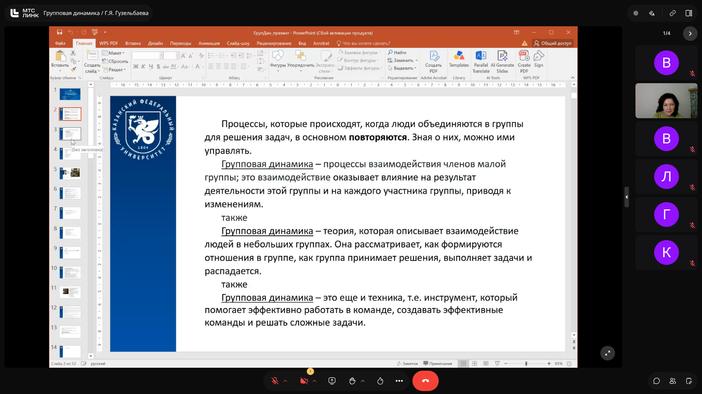
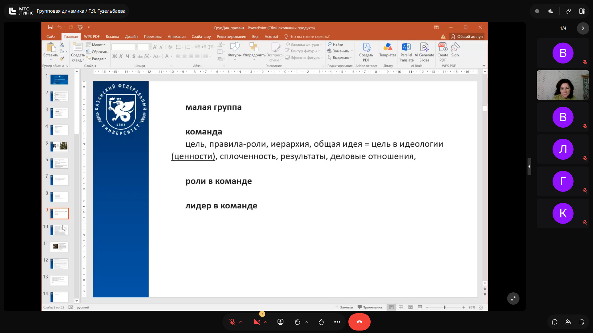
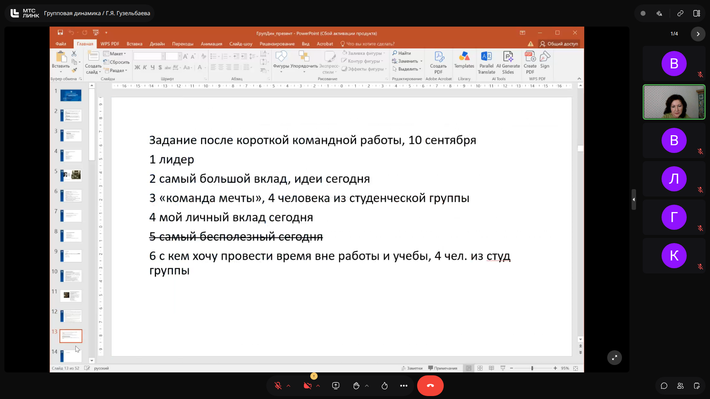

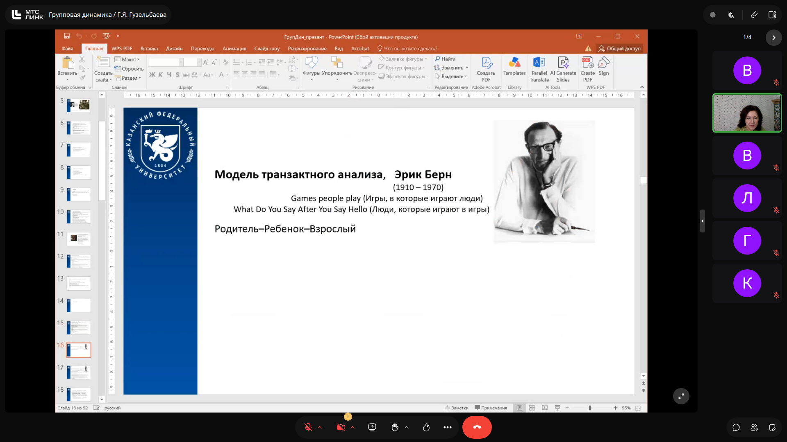

> [!IMPORTANT]
> **На заметку к зачету / экзамену:**
> - Позиция задает характер взаимодействия и определяет исход коммуникации.
> - Выбор позиции в общении — ключевой компонент коммуникативной компетентности.

---

## Теоретические основы модели Эрика Берна `[19:10]`

Модель трансакционного (трансактного) анализа разработана американским психотерапевтом и психиатром **Эриком Берном** (1910–1970) в 1960-х годах. Ее популяризации способствовали всемирно известные книги: *«Игры, в которые играют люди»* (Games People Play) и *«Люди, которые играют в игры»* (What Do You Say After You Say Hello).

### Ключевые положения трансактного анализа:
1. **Трансакция** — единица взаимодействия партнеров по общению, обусловленная занимаемой каждым из них психологической позицией.
2. Общаясь, человек осознанно или неосознанно стремится повлиять на позицию собеседника и изменить либо отрегулировать собственную позицию.
3. **Эго-состояния личности** — целостные системы чувств и паттернов поведения. Один и тот же человек в различных ситуациях функционирует исходя из одного из трех четко различимых состояний:
   - **Родитель (Р)**;
   - **Взрослый (В)**;
   - **Ребенок / Дитя (Д)**.
4. Модель исходит из рационального принципа: каждый человек способен научиться доверять себе, думать за себя, принимать самостоятельные решения и открыто выражать свои чувства.

### Слайды и код с экрана:
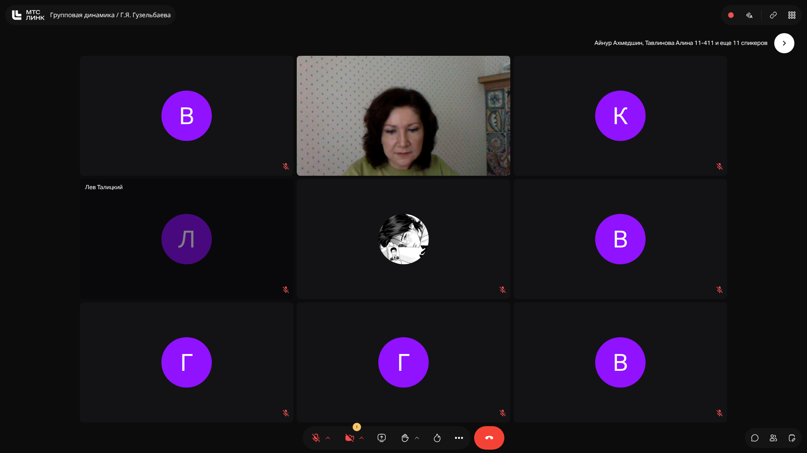

> [!IMPORTANT]
> **На заметку к зачету / экзамену:**
> - Трансакция — это единица межличностного взаимодействия.
> - Эго-состояния — не постоянные психотипы, а роли/позиции, переключающиеся в зависимости от ситуации.

---

## Характеристика трех эго-состояний `[29:10]`

### 1. Эго-состояние «Родитель»
- **Происхождение:** включает в себя стереотипы, нормы, установки и паттерны поведения, перенятые в детстве извне (прежде всего от собственных родителей и значимых авторитетов).
- **Внешние проявления:** критичность, оценивание, нравоучения, назидательный или безапелляционный приказной тон, предвзятость, но одновременно — опека, поощрение и забота.
- **Две ипостаси Родителя:**
  - *Критический Родитель:* указывает, как надо поступать, требует, наказывает, контролирует («ты должен», «так положено»);
  - *Заботливый Родитель:* сочувствует, утешает, берет ответственность за слабого на себя.

### 2. Эго-состояние «Взрослый»
- **Происхождение:** отражает объективную текущую реальность «здесь и сейчас», свободную от непроработанных травм и архаичных установок прошлого.
- **Внешние проявления:** объективный анализ фактов, логика, независимость суждений, эмоциональная выдержка, спокойный и нейтральный тон общения.
- **Характеристики:** организованность, находчивость, гибкая адаптация к обстановке, готовность признавать взаимную ответственность и сотрудничать на равных («на партнерских позициях»).

### 3. Эго-состояние «Ребенок» (Дитя)
- **Происхождение:** актуализация детского опыта, спонтанных эмоциональных реакций, ранних воспоминаний и детских защитных механизмов.
- **Внешние проявления:** импульсивность, зависимость от чужого мнения (ведомость), эгоцентризм, безответственность, капризы, беззащитность, позиция восприятия мира «снизу вверх».
- **Манипулятивный аспект:** демонстрация слабости («я не умею / не знаю, решите за меня»), провокация партнера на переход в роль опекающего или карающего Родителя.
- **Творческий аспект:** состояние Ребенка отвечает за спонтанность, нестандартное мышление, самовыражение и творческий поток.

### Слайды и код с экрана:

> [!IMPORTANT]
> **На заметку к зачету / экзамену:**
> - Ребенок отвечает не только за инфантилизм и манипуляции, но и за творчество и генерацию идей.
> - Взрослый ориентирован исключительно на объективную реальность здесь и сейчас, без архаичных проекций прошлого.

---

## Разбор кейсов: сцены в автобусе и отделении милиции `[53:40]`

В качестве наглядной иллюстрации эго-состояний проанализирован эпизод в автобусе из новеллы «Напарник» (х/ф «Операция „Ы“ и другие приключения Шурика»):

1. **Хулиган Федя:**
   - Занимает ярко выраженную позицию **Ребенка**: ведет себя демонстративно, расслабленно, игнорирует социальные нормы, открыто манипулирует («А если я встану — ты у меня ляжешь»).
2. **Пассажиры автобуса (пожилая женщина, гражданин с футляром):**
   - Вступают с позиции **критического Родителя**: поучают, стыдят, взывают к совести («Эти места специально для детей и инвалидов!»), используют назидательный тон.
3. **Беременная девушка с книгой:**
   - Проявляет позицию **Взрослого**: сохраняет нейтралитет, эмоциональную независимость, вежливо благодарит за предложения уступить место, но продолжает спокойно стоять и читать книгу, не включаясь в манипулятивные игры.
4. **Шурик:**
   - Реагирует на инфантилизм Феди включением роли **хитрого Родителя**: использует уловку (притворяется слепым инвалидом), вынуждая «Ребенка» подчиниться установленному правилу.
5. **Сцена в отделении милиции:**
   - Дежурный милиционер и свидетели действуют из позиции **Взрослых** (фиксация объективных фактов без эмоционального вовлечения), тогда как арестованный Федя сохраняет подавленную, но упрямую позицию «наказанного Ребенка».

### Слайды и код с экрана:
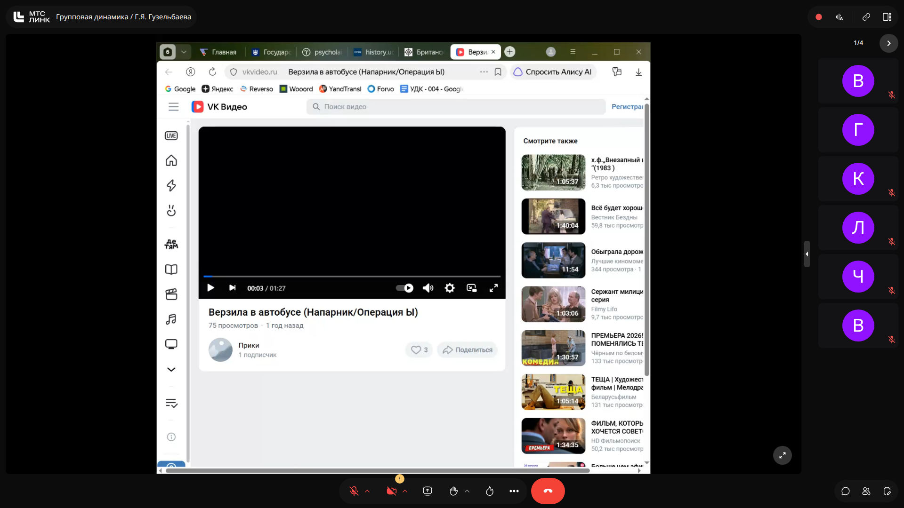
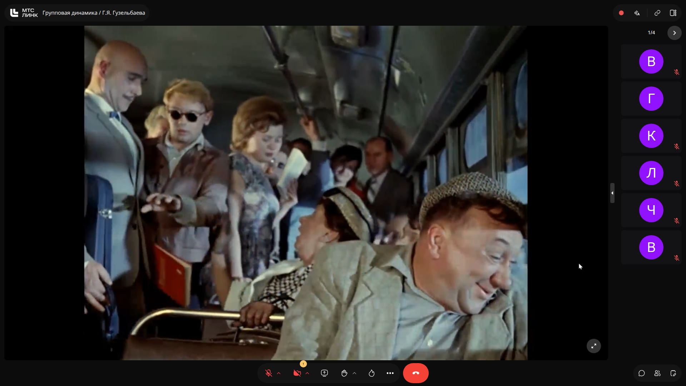
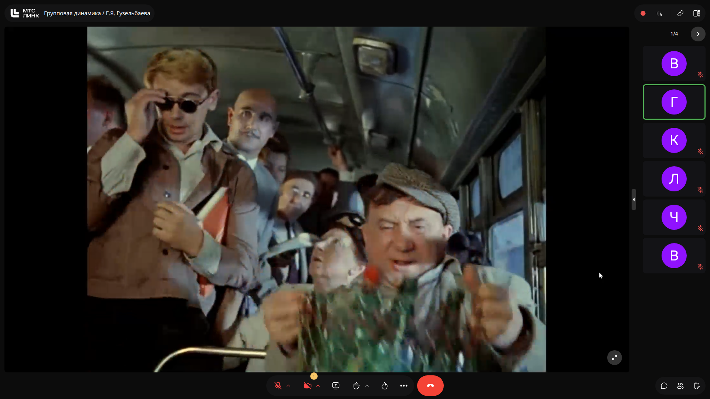
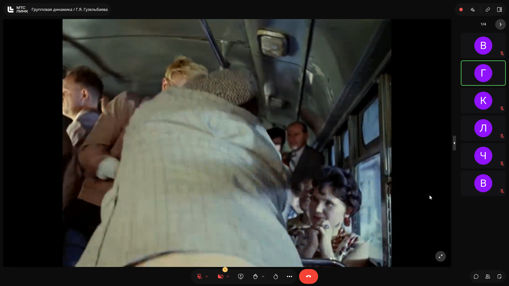
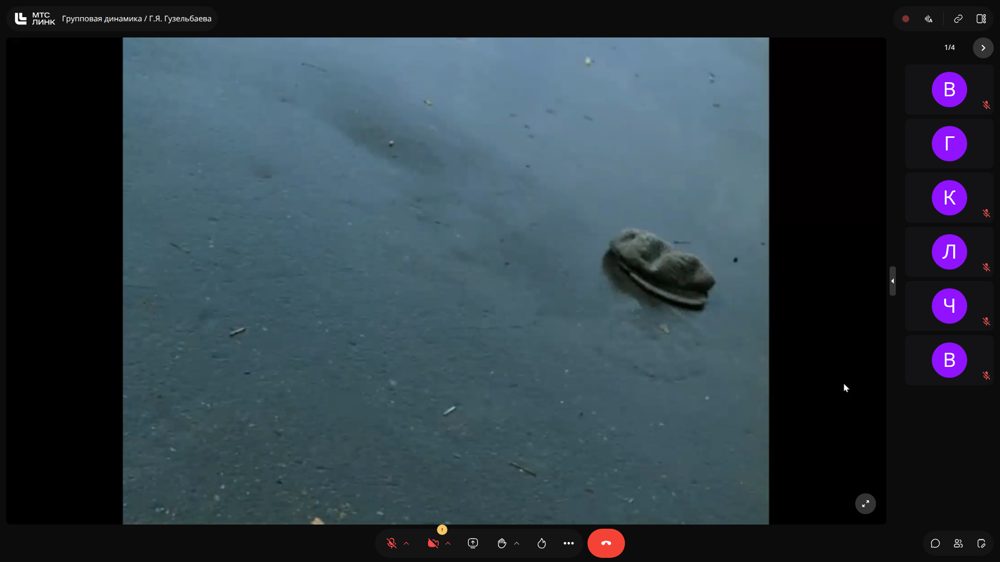
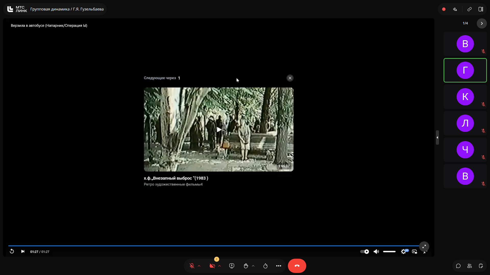
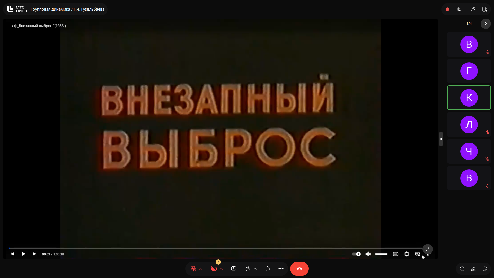

> [!IMPORTANT]
> **На заметку к зачету / экзамену:**
> - Когда один участник занимает позицию Ребенка, окружающие невольно скатываются в позицию Родителя.
> - Позиция Взрослого позволяет не втягиваться в манипулятивную динамику.

---

## Разбор кейсов: взаимодействие на строительной площадке `[76:50]`

Второй эпизод демонстрирует динамическое переключение ролей между прорабом, Шуриком и Федей на стройке СМУ-61:

1. **Прораб Пал Степаныч:**
   - В общении с Федей выступает как классический **заботливый и педагогический Родитель**: водит за руку, берет на себя всю заботу, увлеченно проводит лекцию о масштабах строительства, пытаясь увлечь и перевоспитать подопечного добром.
   - В общении с Шуриком прораб переключается в позицию **Взрослый — Взрослый** (или административного руководителя): дает четкие деловые указания по распределению фронта работ.
2. **Федя на стройке:**
   - Полное закрепление в роли **бунтующего Ребенка**: демонстративное безделье, обед за счет напарника, саботаж, провокация и физическая агрессия.
3. **Динамика эго-состояний Шурика:**
   - *Начало смены:* позиция **Взрослого** (готовность работать на равных, деловой партнерский подход).
   - *Момент опасности и нападения Феди:* временный переход Шурика в позицию испуганного, спасающегося **Ребенка**.
   - *Финал («Надо, Федя, надо!»):* Шурик перехватывает инициативу и занимает позицию карающего и воспитывающего **критического Родителя**, применяющего порку розгами к обездвиженному «Ребенку».

### Слайды и код с экрана:
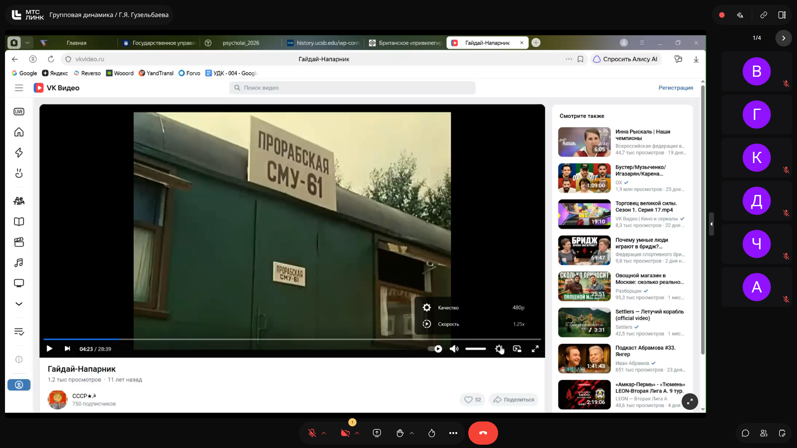
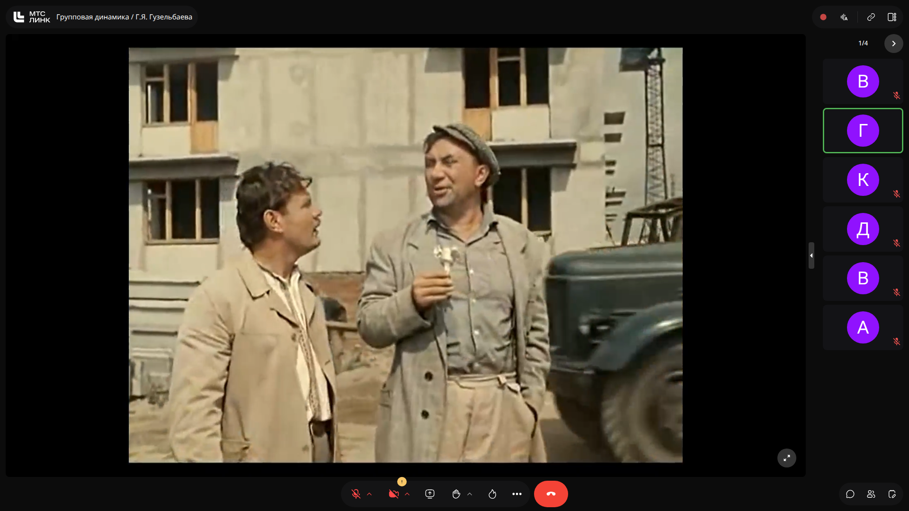
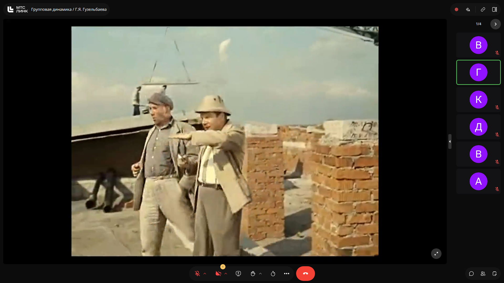
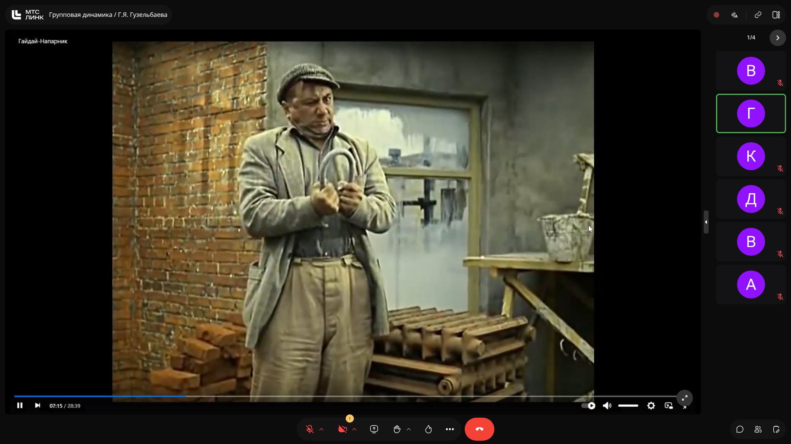
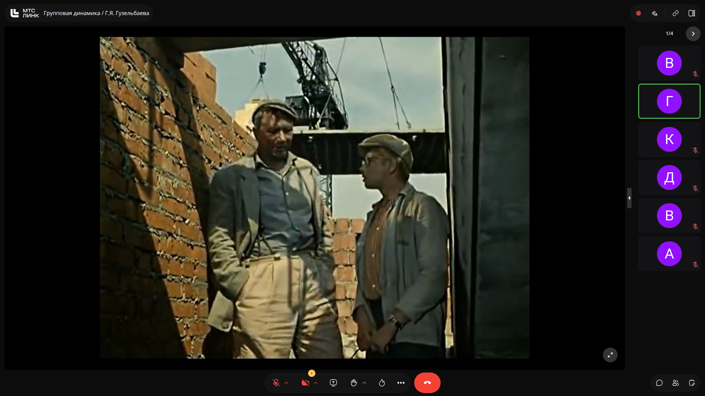
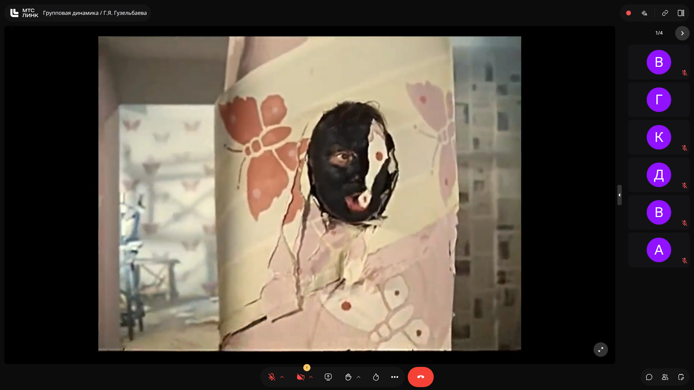

> [!IMPORTANT]
> **На заметку к зачету / экзамену:**
> - Эго-состояния нестабильны: смена внешних обстоятельств может вызвать мгновенное переключение человека из Взрослого в испуганного Ребенка или карающего Родителя.
> - В профессиональной и командной разработке конструктивное решение задач возможно преимущественно при трансакциях вида «Взрослый — Взрослый».

---
