# Информационная безопасность: Уязвимости и их классификация. Управление уязвимостями. Понятие и классификация угроз ИБ

> **Тема**: Уязвимости и их классификация. Управление уязвимостями. Понятие и классификация угроз ИБ  
> **Статус конспекта**: Очищен от оговорок и воды, структурирован AI-ассистентом с сохранением авторских терминов.  
> **AI-модель**: `gemini-flash-latest`  

## Введение
Лекция посвящена анализу уязвимостей как слабых мест информационных систем, методологиям их ранжирования и устранения, а также переходу к понятию угроз информационной безопасности. Рассматриваются технические и организационные аспекты безопасности: от переполнения буфера и аппаратных закладок микропроцессоров до систематического процесса Vulnerability Management и минимизации человеческого фактора.

---

## Жизненный цикл уязвимости и расширенное понимание уязвимостей `[00:00]`

### Стадии жизненного цикла уязвимости
Процесс работы с уязвимостью в идеале должен завершаться до начала её практической эксплуатации злоумышленниками:
1. **Эксплуатация (Exploitation):** Создание программного кода (эксплойта), использующего брешь в системе.
2. **Патчинг / Исправление (Patching):** Разработчик выпускает обновление, устраняющее дефект. Успешность зависит от наличия поддержки продукта (вендорская платная поддержка или сообщество открытого ПО).
3. **Установка обновления:** Системные администраторы применяют патч, после чего уязвимость считается закрытой.

### Расширенная трактовка понятия уязвимости
Уязвимость допустимо трактовать шире сценариев с хакерами. Любой системный риск подчиняется схожей логике:
- **Пример с flash-накопителем:** Износ ячеек памяти из-за лимита циклов записи — это аппаратная уязвимость к внезапному отказу. Эксплуатация наступает при потере накопителя/сбое чтения, а устранение заключается в резервном копировании и применении политики дублирования на всех носителях.
- Традиционное же понимание уязвимости в ИБ — это слабая точка (прореха), на которую направлено воздействие злоумышленника.

### Слайды и код с экрана:
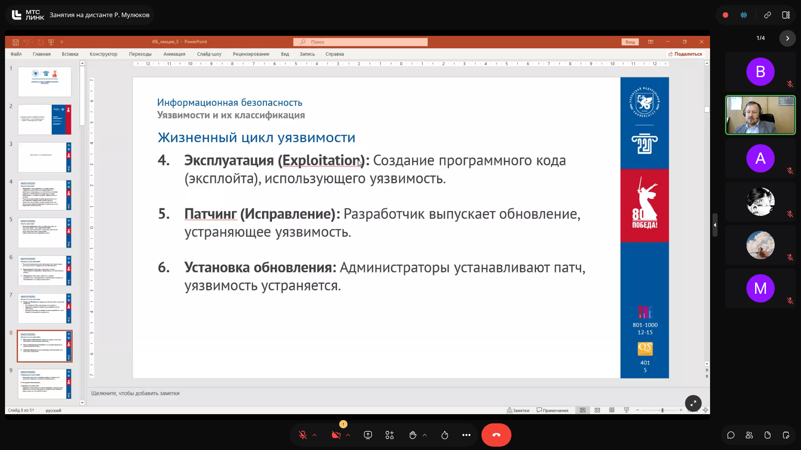

> [!IMPORTANT]
> **На заметку к зачету / экзамену:**
> - Понимать разницу между обнаружением уязвимости, выпуском патча разработчиком и его фактическим применением администратором (окно уязвимости).

---

## Классификация уязвимостей по природе возникновения `[03:43]`

### 1. Программные уязвимости
Возникают на этапе разработки программного обеспечения вследствие логических ошибок, некорректного кодирования и недостаточной валидации входных данных:
- **Переполнение буфера (Buffer Overflow):** Запись объема данных, превышающего выделенный буфер памяти. Избыточные данные перетирают смежные участки памяти (включая указатели инструкций), приводя к аварийному завершению или внедрению вредоносного исполняемого кода. *Исторический пример:* сетевой червь Морриса (1988), использовавший переполнение буфера в службе `fingerd`.
- **Внедрение SQL-кода (SQL Injection):** Отсутствие фильтрации пользовательского ввода в веб-формах, позволяющее манипулировать структурой запроса (например, ввод `' OR 1=1 --` обходит условие `WHERE login = ...`).
- **Межсайтовый скриптинг (XSS):** Внедрение вредоносного JavaScript-кода в веб-страницу, который выполняется в браузере жертвы (например, перехват сессионных cookie).

### 2. Аппаратные уязвимости
Физические или схемотехнические дефекты аппаратуры. Программные патчи часто лишь ограничивают их эксплуатацию за счет отключения оптимизаций процессора (что приводит к значительному падению производительности):
- **Meltdown и Spectre:** Архитектурные уязвимости спекулятивного выполнения инструкций в процессорах (Intel, ARM, AMD), позволяющие непривилегированному процессу читать защищенную память ядра.
- **Rowhammer:** Электромагнитное воздействие при многократном циклическом обращении к одним строкам динамической оперативной памяти (DRAM), вызывающее инверсию битов в соседних строках.

### 3. Конфигурационные уязвимости
Ошибки настройки установленного ПО, ОС и сетевого оборудования:
- Использование стандартных учетных записей (`admin/admin`, `root/root`). *Пример:* Ботнет **Mirai (2016)** заразил миллионы IoT-устройств через перебор паролей по умолчанию.
- Оставленные открытыми неиспользуемые порты и службы (например, СУБД MySQL, слушающая `0.0.0.0` вместо `127.0.0.1` и доступная наружу).
- Избыточные права доступа (нарушение принципа наименьших привилегий — Least Privilege).

### 4. Организационные и человеческие уязвимости
Слабым звеном выступают регламенты и поведение персонала:
- Уязвимость к фишингу и методам социальной инженерии.
- Небрежное хранение аутентификационных данных (пароли на стикерах, отсутствие блокировки экранов).
- Некорректные процедуры увольнения (несвоевременный отзыв прав доступа уволенных сотрудников).

### Слайды и код с экрана:
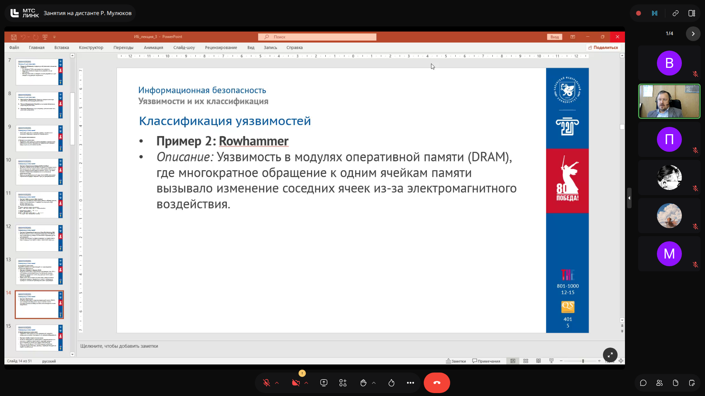
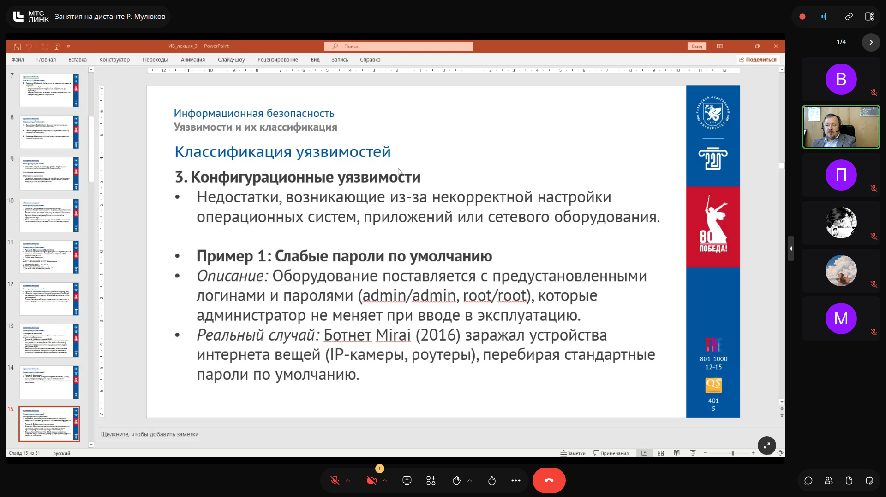

> [!IMPORTANT]
> **На заметку к зачету / экзамену:**
> - Лектор строго предупредил: тестирование уязвимостей допускается только на собственных изолированных учебных проектах. Любые несанкционированные тесты на внешних ресурсах университета перехватываются сетевым мониторингом и передаются в службу безопасности и ФСБ.
> - Аппаратные уязвимости практически невозможно исправить без замены «железа»; программные компенсации обычно вызывают просадку вычислительной мощности.

---

## Классификация по расположению, шкала CVSS и методология CVE `[32:44]`

### Расположение относительно защищаемой системы
- **Внутренние уязвимости:** Находятся внутри контролируемого периметра (ошибки конфигурации внутренних серверов, корпоративного софта). Опасны при горизонтальном перемещении атакующего (lateral movement).
- **Внешние уязвимости:** Находятся за пределами контролируемой зоны (уязвимости CDN, облачных провайдеров, BGP-хищения трафика).

### Шкала CVSS (Common Vulnerability Scoring System)
Оценка критичности уязвимости по 10-балльной шкале:
- **Низкая (Low, 0.1–3.9):** Сложная эксплуатация, минимальный ущерб.
- **Средняя (Medium, 4.0–6.9):** Требует специфических условий, ограниченный ущерб.
- **Высокая (High, 7.0–8.9):** Легко эксплуатируется, серьезный ущерб инфраструктуре.
- **Критическая (Critical, 9.0–10.0):** Максимальная опасность, возможность удаленного исполнения произвольного кода (RCE) без аутентификации.

### Идентификация CVE и базы уязвимостей
Каждой подтвержденной уязвимости присваивается номер формата `CVE-ГГГГ-НОМЕР`:
- **CVE-2017-0144 (EternalBlue):** Брешь в реализации протокола SMBv1 в Windows, позволившая распространяться шифровальщикам WannaCry и NotPetya.
- **CVE-2021-44228 (Log4Shell):** Критическая уязвимость в библиотеке Log4j (Java), CVSS 10.0.

**Реестры и базы данных:**
- **NVD (National Vulnerability Database)** и **VulDB** — международные каталоги.
- **БДУ ФСТЭК России (bdu.fstec.ru)** — отечественный банк данных угроз и уязвимостей, агрегирующий данные для российских организаций.

### Слайды и код с экрана:
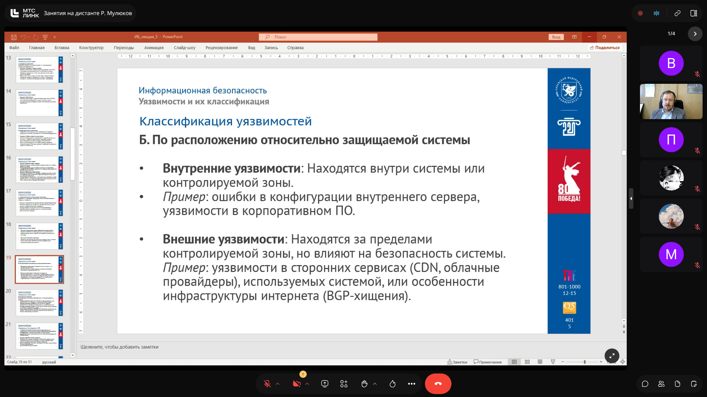
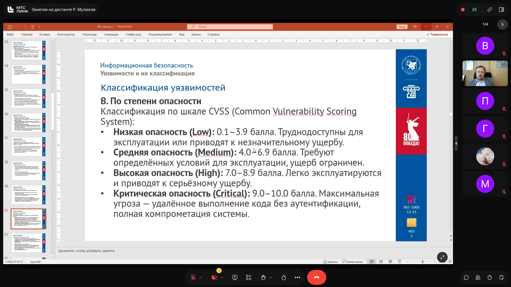
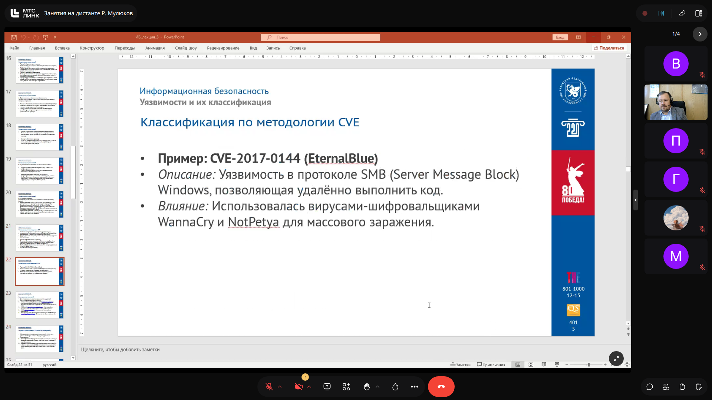

> [!IMPORTANT]
> **На заметку к зачету / экзамену:**
> - Знать градации CVSS: Critical присваивается оценкам 9.0–10.0.
> - Для госучреждений и вузов обязательным ориентиром является база БДУ ФСТЭК.

---

## Процесс управления уязвимостями (Vulnerability Management) `[45:08]`

Управление уязвимостями — непрерывный цикличный процесс, состоящий из четырех ключевых этапов:

1. **Идентификация (Identification):**
   - Регулярное сканирование активов с помощью специализированного ПО (сканеры уязвимостей: *Nessus*, *OpenVAS*, *Qualys*, *MaxPatrol*).
   - Автоматическое сопоставление версий установленного софта с сигнатурами известных CVE.
2. **Оценка и приоритизация (Assessment & Prioritization):**
   - Анализ CVSS-балла в контексте ценности конкретного актива (публичный сервер с CVSS 9.0 закрывается в первую очередь, в отличие от изолированной тестовой машины).
3. **Устранение (Remediation):**
   - *Патчинг:* установка официального обновления безопасности.
   - *Компенсирующие меры (Workaround):* если патча нет или его тестирование требует времени — фильтрация подозрительных запросов на межсетевом экране (WAF/Firewall), отключение уязвимого протокола/службы.
   - *Принятие риска (Risk Acceptance):* применяется в крайних случаях при невозможности устранения и соразмерной ценности риска (сопровождается резервированием или страхованием).
4. **Верификация (Verification):**
   - Повторное сканирование для подтверждения того, что брешь закрыта и система стабильна.

| Этап | Действие на примере Log4Shell (CVE-2021-44228) |
| :--- | :--- |
| **Идентификация** | Сканер показал версию Log4j 2.14.0 на публичном веб-сервере. |
| **Оценка** | CVSS 10.0 (Critical), доступ из интернета — максимальный риск, RCE. |
| **Устранение** | 1. Обновление библиотеки до версии 2.17.0 (патч).   2. Временная мера: фильтрация JNDI-строк на WAF. |
| **Верификация** | Повторное сканирование подтвердило отсутствие уязвимости. |

### Слайды и код с экрана:
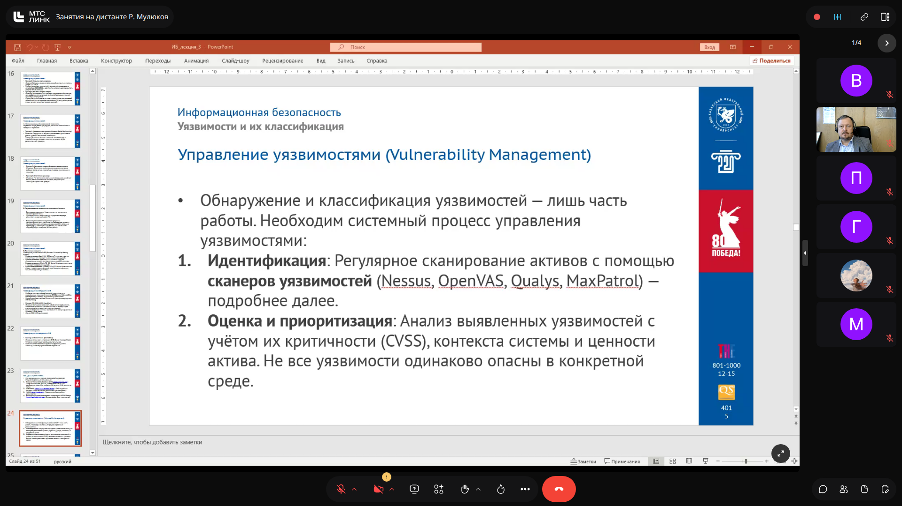
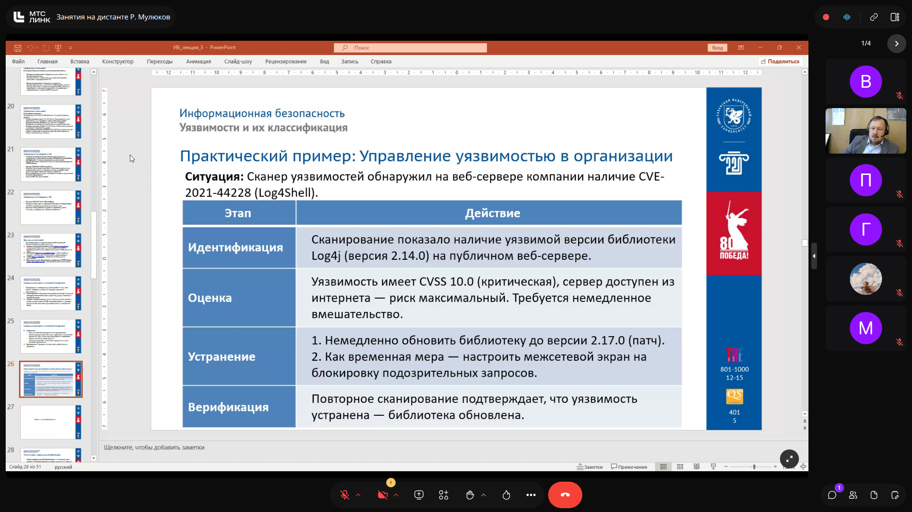
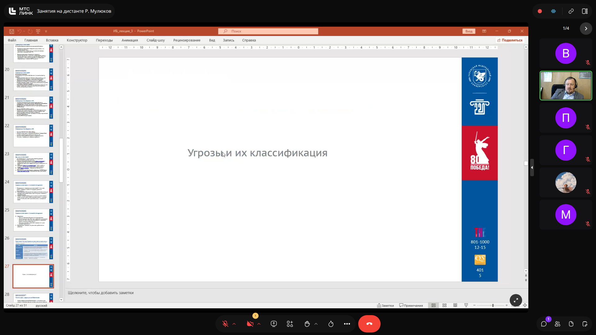

> [!IMPORTANT]
> **На заметку к зачету / экзамену:**
> - Четко воспроизводить 4 этапа Vulnerability Management: Идентификация -> Оценка -> Устранение -> Верификация.

---

## Понятие угроз информационной безопасности и их классификация `[58:12]`

### Базовая формула безопасности
- **Уязвимость (Vulnerability):** Слабое место в защите системы.
- **Угроза (Threat):** Потенциальная опасность реализации воздействия, направленного на нарушение конфиденциальности, целостности или доступности.
- **Риск (Risk):** Вероятность реализации угрозы через уязвимость с нанесением конкретного ущерба:  
  $$\text{Риск} = \text{Уязвимость} \times \text{Угроза}$$
- **Инцидент / Атака:** Угроза, которая перешла в стадию практической реализации.

### Классификация угроз по природе возникновения
1. **Естественные (объективные) угрозы:**
   - Вызваны природными явлениями и физическими процессами, не зависящими от человека (землетрясения, наводнения, пожары от молний).
   - Техногенные аварии (отказ электроснабжения, охлаждения, отопления).
   - *Косвенные системные риски:* Затопление заводов по выпуску жестких дисков в Таиланде привело к мировому дефициту накопителей и падению их надежности из-за нарушений герметичности в партиях.
   - *Методы защиты:* Георезервирование дата-центров, газовое пожаротушение, ИБП и дизель-генераторы.

2. **Искусственные (субъективные) угрозы:**
   - **Непреднамеренные (случайные) угрозы:** Деятельность людей без злого умысла. По статистике, **от 60% до 80% инцидентов ИБ вызваны человеческим фактором** (случайное удаление файлов, ошибки конфигурации маршрутизаторов, отправка писем не тому адресату, халатность с паролями, программные баги разработчиков).
   - *Способы противодействия:* Автоматизация процессов (исключение человека из контура принятия решений), внедрение строгих регламентов, регулярное резервное копирование и обучение сотрудников.

### Слайды и код с экрана:
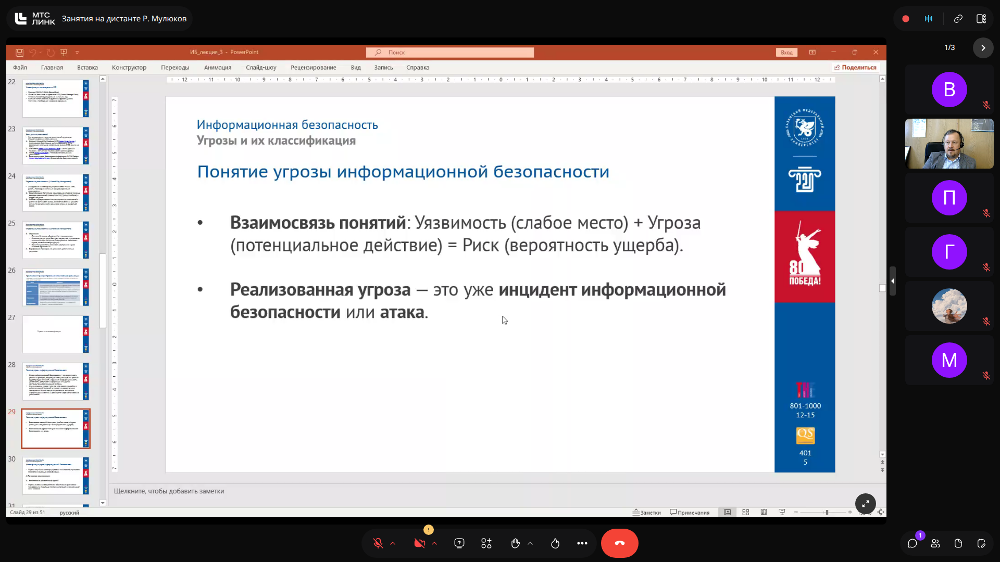
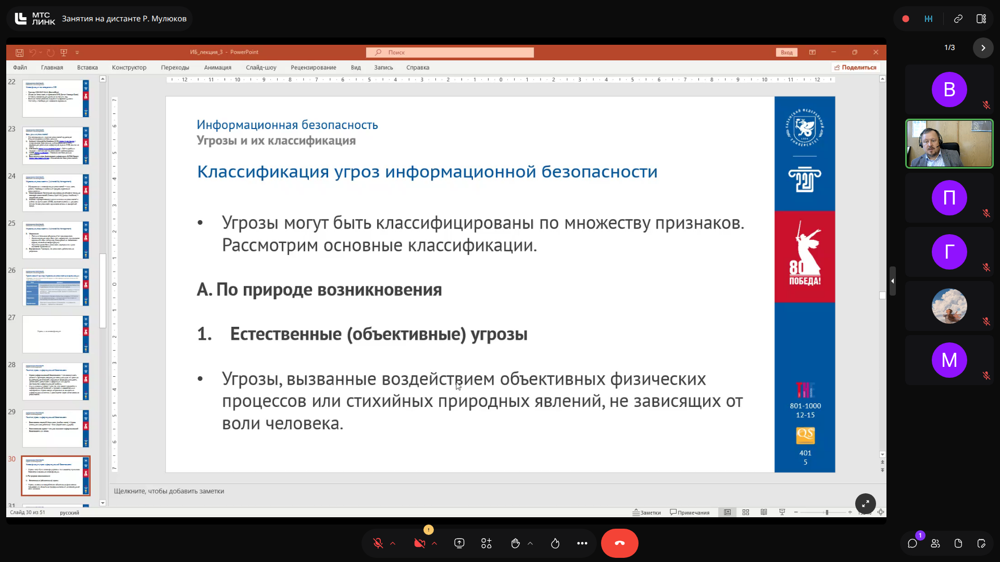
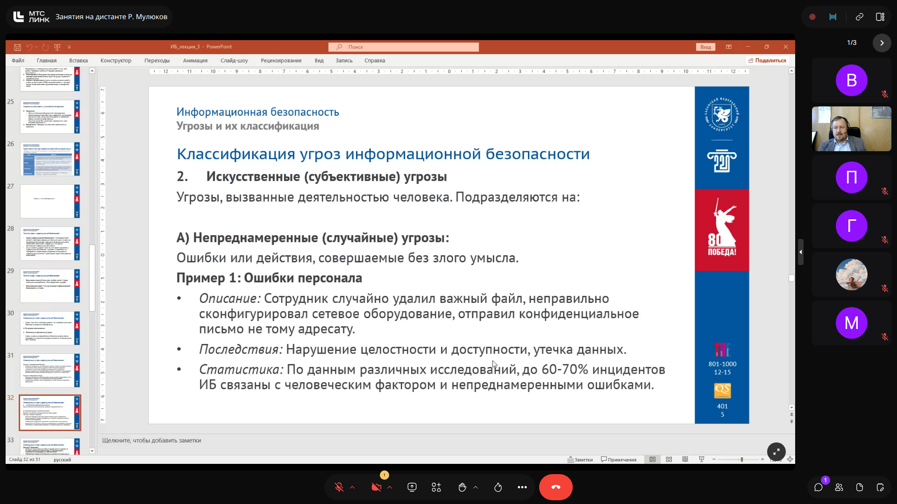
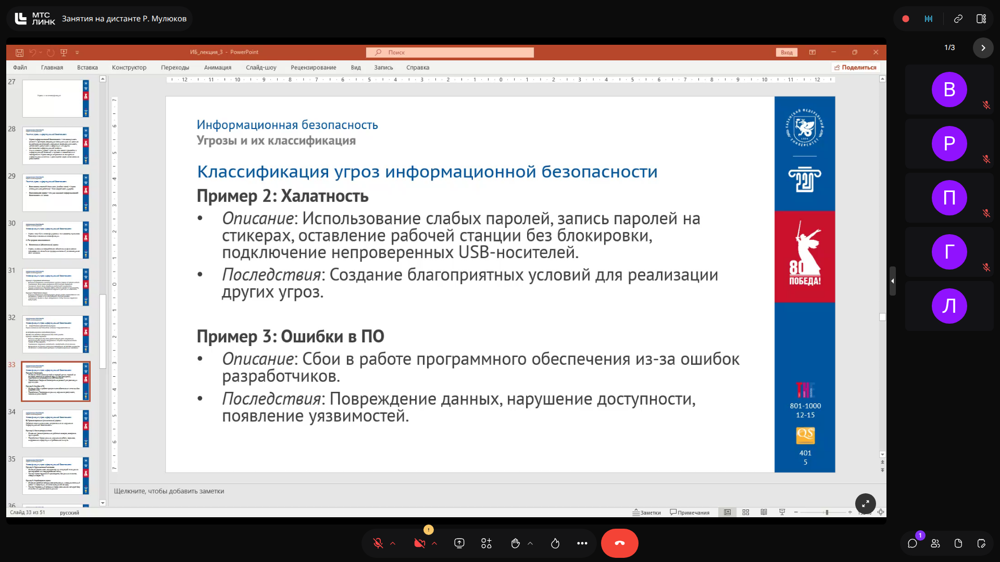
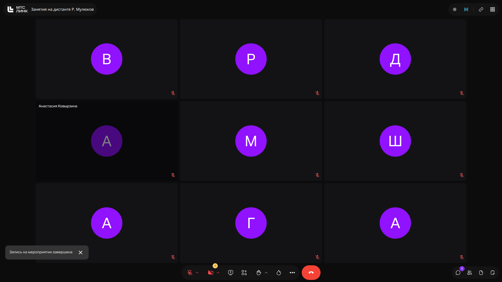

> [!IMPORTANT]
> **На заметку к зачету / экзамену:**
> - Запомнить процент инцидентов, приходящихся на непреднамеренные ошибки персонала: 60-80% всех сбоев и утечек.
> - Угроза всегда объектна и направлена на конкретное свойство информации (КЦД).

---
