# Компьютерные сети: Протокол ARP (Address Resolution Protocol) и введение в адресацию IPv6

> **Тема**: Протокол ARP (Address Resolution Protocol) и введение в адресацию IPv6  
> **Статус конспекта**: Очищен от оговорок и воды, структурирован AI-ассистентом с сохранением авторских терминов.  
> **AI-модель**: `gemini-3.8-flash`  

## Введение
Лекция посвящена детальному разбору функционирования протокола канально-сетевого взаимодействия ARP (Address Resolution Protocol) в сетях IPv4: механизмам кэширования, формату пакетов, расширениям и служебным вариациям (ARP probe, Gratuitous ARP, Proxy ARP), а также векторам атак (ARP Spoofing/Poisoning) и методам противодействия на уровне коммутаторов. В финальной части занятия дан старт теме IPv6: рассмотрена структура 128-битного адреса, канонические правила сокращения нотации (RFC 5952) и архитектура глобальных префиксов RIR.

---

## Назначение ARP и инкапсуляция кадра `[01:40]`

Протокол **ARP (Address Resolution Protocol)** — базовый протокол стека TCP/IP, предназначенный для установления соответствия между известным IP-адресом сетевого уровня и аппаратным MAC-адресом канального уровня в рамках одного широковещательного домена.

### Принцип работы и уровни стека
При формировании сокета сетевым приложением (например, HTTP-запрос поверх TCP) на транспортном и сетевом уровнях задаются IP-адреса и порты источника и назначения:
- IP-адрес источника и получателя известны системе.
- MAC-адрес источника также известен (привязан к сетевому интерфейсу).
- **MAC-адрес получателя** изначально неизвестен операционной системе и должен быть разрешен через ARP.

```text
+---------------+---------------+---------------+--------------+
| Ethernet II   | IPv4          | TCP           | HTTP         |
| L2 (MAC)      | L3 (IP)       | L4 (Port)     | L7 (Data)    |
+---------------+---------------+---------------+--------------+
```

### Инкапсуляция ARP-пакета
Пакет ARP инкапсулируется непосредственно в поле данных Ethernet-кадра. В заголовке кадра Ethernet II полю `EtherType` присваивается шестнадцатеричное значение `0x0806`, указывающее, что полезной нагрузкой является пакет протокола ARP.

### Слайды и код с экрана:
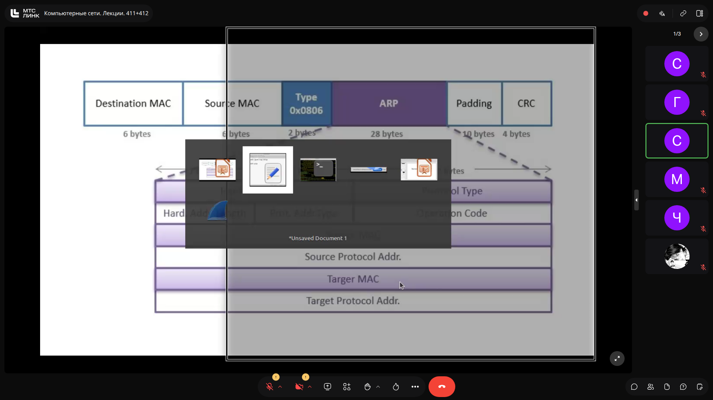
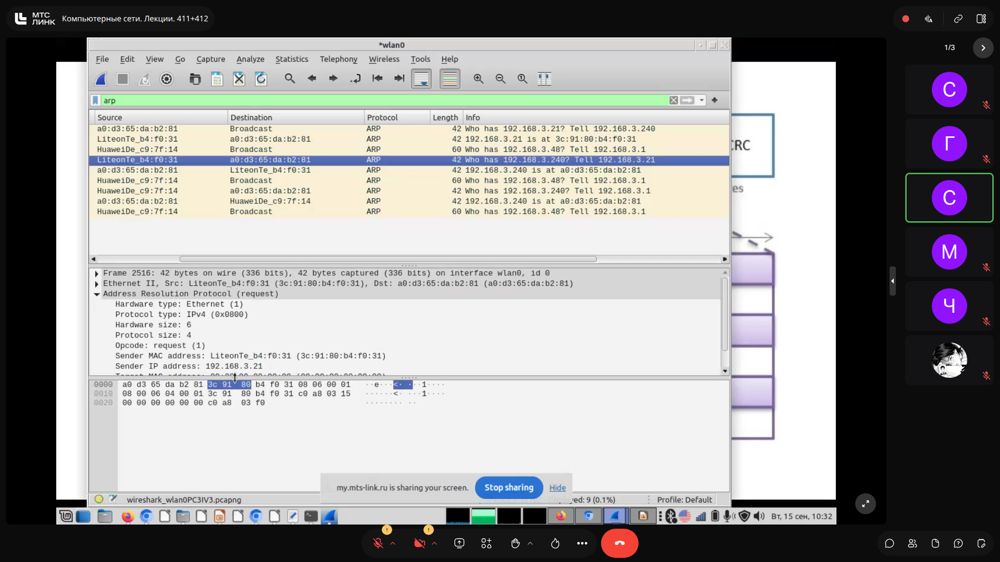
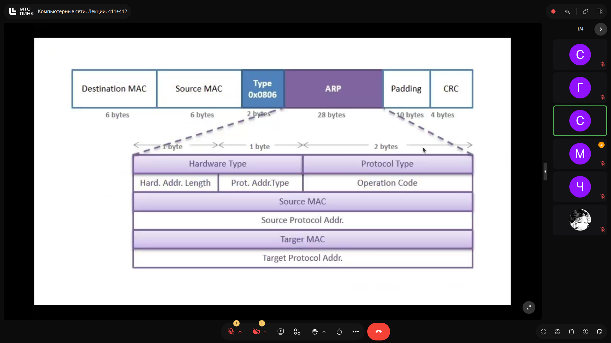

> [!IMPORTANT]
> **На заметку к зачету / экзамену:**
> - Вопрос об уровне модели OSI: лектор требует называть ARP протоколом сетевого уровня (L3), аргументируя это тем, что ARP непосредственно оперирует IP-адресами, хотя инкапсулируется прямо в Ethernet.

---

## Структура заголовка пакета ARP `[17:50]`

Заголовок ARP универсален и теоретически может связывать различные технологии канального и сетевого уровней.

| Поле | Размер | Значение для сетей Ethernet + IPv4 | Описание |
| :--- | :--- | :--- | :--- |
| **Hardware Type (HTYPE)** | 2 байта | `0x0001` | Тип технологии канального уровня (Ethernet = 1). |
| **Protocol Type (PTYPE)** | 2 байта | `0x0800` | Тип сетевого протокола (IPv4 = `0x0800`). |
| **Hardware Size (HLEN)** | 1 байт | `6` | Длина аппаратного адреса в байтах (MAC = 6 байт). |
| **Protocol Size (PLEN)** | 1 байт | `4` | Длина логического адреса в байтах (IPv4 = 4 байта). |
| **Opcode (OPER)** | 2 байта | `1` (Request) / `2` (Reply) | Код операции: 1 — запрос, 2 — ответ. |
| **Sender Hardware Addr** | 6 байт | MAC-адрес отправителя | Аппаратный адрес узла, отправляющего пакет. |
| **Sender Protocol Addr** | 4 байта | IP-адрес отправителя | IP-адрес узла, отправляющего пакет. |
| **Target Hardware Addr** | 6 байт | `00:00:00:00:00:00` (в запросе) | В запросе поле игнорируется получателем (Linux/Windows забивают нулями, оборудование Huawei — единицами `FF:FF:FF:FF:FF:FF`). В ответе — MAC-адрес инициатора. |
| **Target Protocol Addr** | 4 байта | Искомый IP-адрес | IP-адрес узла, чей MAC-адрес требуется выяснить. |

В запросе поле **Destination MAC** канального уровня является широковещательным (`ff:ff:ff:ff:ff:ff`). В ответе (Reply) пакет отправляется **юникастом (Unicast)** непосредственно на MAC-адрес узла, сделавшего запрос.

### Слайды и код с экрана:

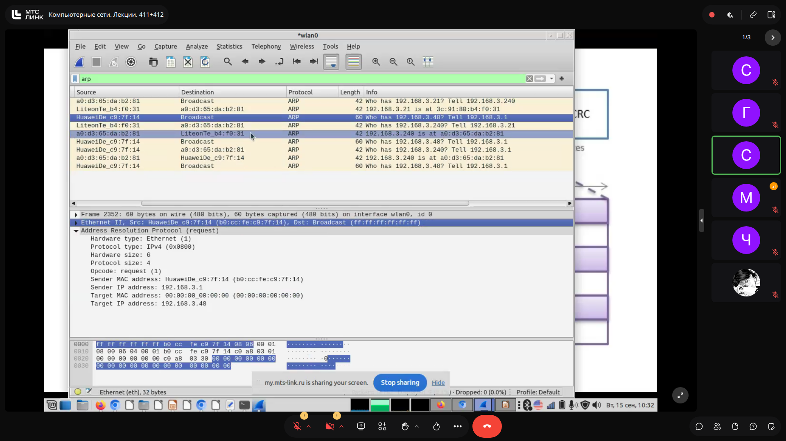


> [!IMPORTANT]
> **На заметку к зачету / экзамену:**
> - Поле Opcode: 1 — ARP Request, 2 — ARP Reply.
> - В ARP Request поле Target MAC в большинстве реализаций (Linux, Windows, Cisco) заполняется нулями, но RFC разрешает любое значение. Устройства Huawei под управлением VRP заполняют его всеми единицами.

---

## ARP-кэш, жизненный цикл записей и диагностика `[04:20]`

Чтобы не посылать широковещательный запрос перед каждым отправляемым IP-пакетом, сетевой стек ОС сохраняет разрешенные адреса в локальной таблице — **ARP-кэше**.

### Диагностические команды
- В Windows: `arp -a` — выводит таблицу ARP с разбивкой по физическим сетевым интерфейсам.
- В Linux:
  - Устаревшая утилита: `arp -n` (флаг `-n` отключает DNS-разрешение IP в имена для скорости).
  - Современный стек iproute2: `ip neighbor show` (или сокращенно `ip n s`).

```bash
user@xiaolaptop:~$ arp -n
Address          HWtype  HWaddress           Flags Mask  Iface
192.168.3.1      ether   b0:cc:fe:c9:7f:14   C           wlan0

user@xiaolaptop:~$ ip n s
192.168.3.1 dev wlan0 lladdr b0:cc:fe:c9:7f:14 REACHABLE
```

### Состояния и жизненный цикл записей
Записи в ARP-кэше имеют ограниченный срок жизни (TTL):
1. **REACHABLE** — узел доступен, срок жизни активен.
2. **STALE** — запись устарела (время таймера истекло, трафика долго не было). Запись не удаляется сразу. Если требуется отправить пакет узлу в состоянии `STALE`, ОС не делает широковещательный запрос, а выполняет **юникастовую проверку (Unicast ARP Request)** на старый известный MAC-адрес.
3. **DELAY** — ожидание ответа на юникастовый запрос для подтверждения актуальности записи.

### Разница таймеров кэширования по типам устройств
- **Конечные ОС (хосты):**
  - Windows: 15–45 секунд.
  - Linux: порядка 60 секунд.
- **Маршрутизаторы (L3-оборудование):**
  - Маршрутизаторы Cisco: по умолчанию **4 часа** (14400 секунд).
  - Маршрутизаторы Huawei: по умолчанию **20 минут** (1200 секунд).

### Слайды и код с экрана:
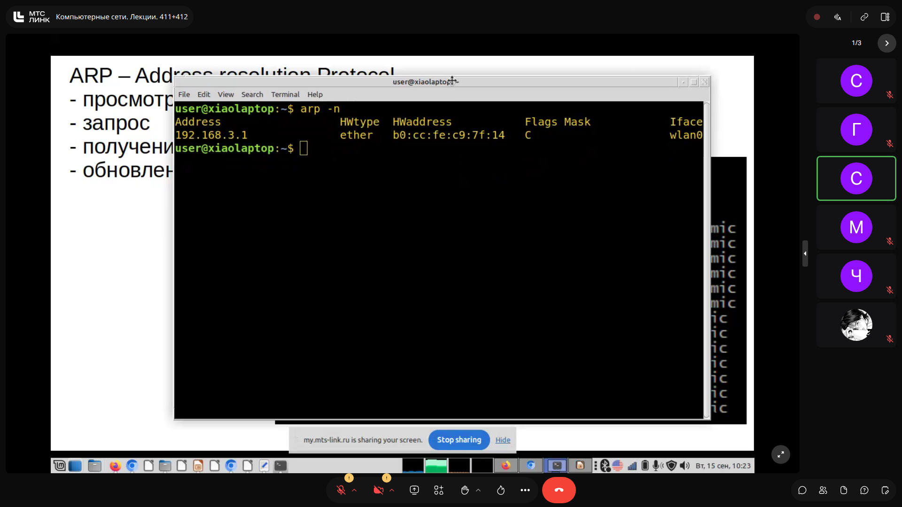


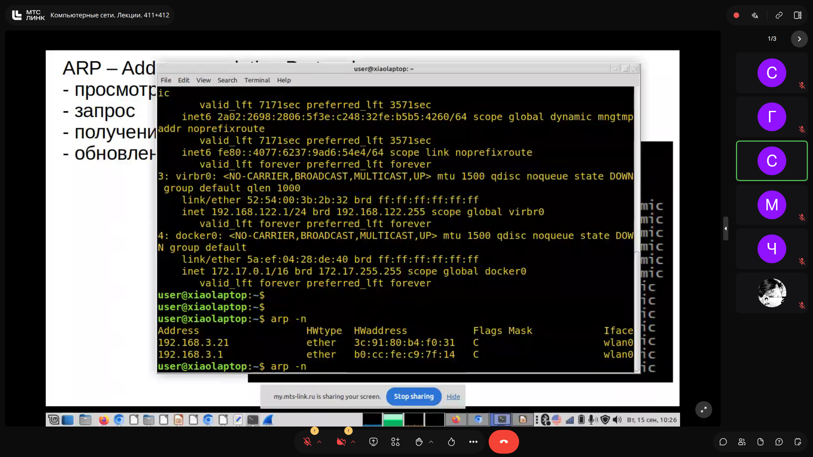

> [!IMPORTANT]
> **На заметку к зачету / экзамену:**
> - Обновление устаревшей записи (`STALE`) происходит юникастовым ARP-запросом, чтобы не засорять сеть широковещательным трафиком.
> - Таймауты кэша на хостах измеряются десятками секунд, а на маршрутизаторах — часами (у Cisco — 4 часа).

---

## Служебные вариации: ARP Probe, Gratuitous ARP и UnARP `[24:00]`

### 1. ARP Probe (DAD — Duplicate Address Detection)
Используется узлом при инициализации или получении IP-адреса (вручную или через DHCP) для проверки уникальности адреса в сети:
- В пакете ARP Request поле **Sender IP Address заполнено нулями (`0.0.0.0`)**.
- В поле **Target IP Address** подставляется проверяемый адрес.
- Если на такой запрос приходит ARP Reply — в сети обнаружен дубликат адреса (конфликт IP).

### 2. Gratuitous ARP (беспричинный ARP / GARP)
Используется узлом после успешной проверки уникальности адреса для оповещения всех соседей в сегменте:
- В ARP-запросе поля **Sender IP Address** и **Target IP Address совпадают**.
- Поле Target MAC заполнено нулями, кадр отправляется в широковещательный адрес.
- **Цель:** принудительно обновить ARP-таблицы всех хостов сегмента новой связкой `IP -> MAC` без предварительного запроса, а также уведомить L2-коммутаторы об актуальном порте хоста.

### 3. UnARP
Служебный пакет (Opcode = 2, Reply), отправляемый сервером удаленного доступа (VPN/Dial-up модемный пул) в локальную сеть при отключении удаленного клиента. Имеет пустые аппаратные адреса и широковещательный Target IP (`255.255.255.255`), предписывая узлам локальной сети очистить кэш от IP-адреса отключившегося клиента.

### Слайды и код с экрана:
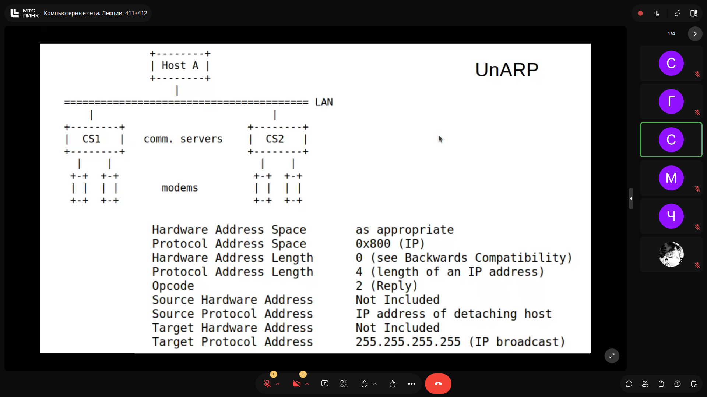
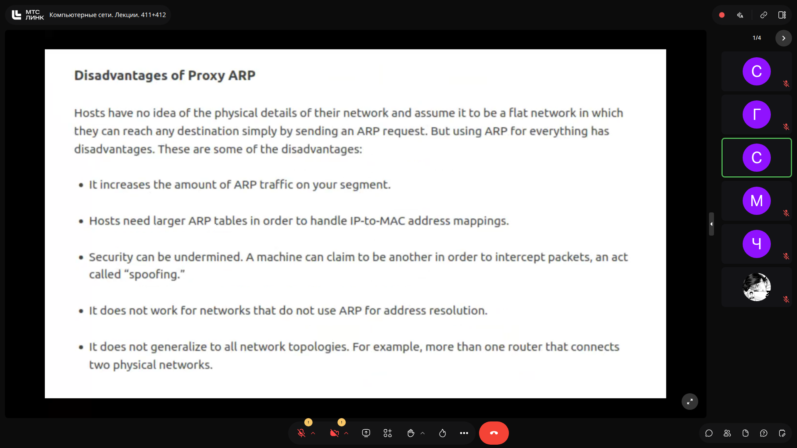

> [!IMPORTANT]
> **На заметку к зачету / экзамену:**
> - Различие ARP Probe и Gratuitous ARP: в Probe поле Sender IP всегда равно 0.0.0.0 (проверка на конфликт), в Gratuitous ARP — Sender IP равен Target IP (анонс своего адреса).

---

## Proxy ARP: концепция, применение и недостатки `[33:30]`

### Принцип Proxy ARP
**Proxy ARP** — функция маршрутизатора, при которой он отвечает собственным MAC-адресом на ARP-запросы, адресованные узлам из другой подсети, если маршрутизатор знает маршрут к целевой подсети.

```text
[ Host A: 172.16.10.100/16 ] --- Subnet A --- [ Router (eth0: 172.16.10.99) ]
                                              [ Router (eth1: 172.16.20.99) ] --- Subnet B --- [ Host C: 172.16.20.100/24 ]
```
Если хосту A некорректно назначена маска `/16` (он считает хост C локальным) или на нем не настроен шлюз по умолчанию:
1. Хост A отправляет широковещательный ARP-запрос: «Кто имеет `172.16.20.100`?»
2. Маршрутизатор с включенным Proxy ARP на интерфейсе `eth0` перехватывает запрос и отвечает **своим собственным MAC-адресом** интерфейса `eth0`.
3. Хост A помещает в кэш запись `172.16.20.100 -> MAC_Router` и шлет трафик на маршрутизатор, который пересылает его в Subnet B.

### Особенности настройки у вендоров
- **Cisco Systems:** включен по умолчанию (`ip proxy-arp`).
- **Huawei:** выключен по умолчанию.

### Недостатки технологии
- Значительное увеличение объема широковещательного ARP-трафика.
- Разрастание ARP-таблиц на конечных хостах (появляется запись на каждый удаленный IP вместо одной записи шлюза).
- Риски безопасности: скрывает некорректное проектирование сети и маскирует симптомы атак типа Spoofing.

### Слайды и код с экрана:
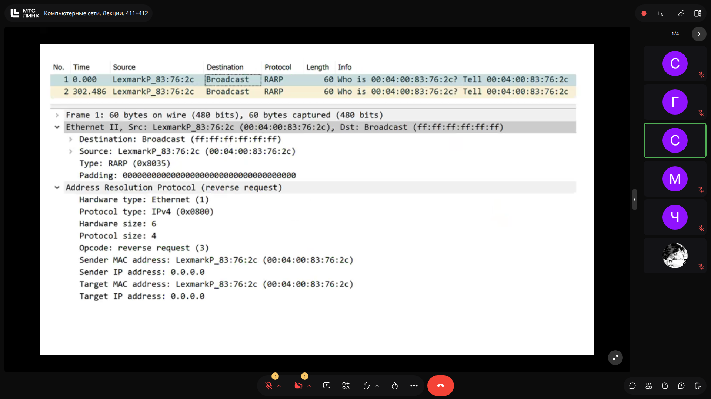


> [!IMPORTANT]
> **На заметку к зачету / экзамену:**
> - Proxy ARP включен по умолчанию на Cisco и выключен на Huawei. Cisco официально рекомендует его отключать, если нет явной архитектурной необходимости.

---

## ARP-атаки (MITM) и методы защиты (DHCP Snooping + DAI) `[49:30]`

### Механика ARP Poisoning / ARP Spoofing
Поскольку протокол ARP не имеет механизма аутентификации, операционные системы принимают и сохраняют в кэш любые входящие ARP Reply (даже если узел их не запрашивал).

**Атака «Человек посередине» (Man-in-the-Middle):**
1. Атакующий периодически посылает жертве поддельный ARP Reply: `IP_шлюза -> MAC_атакующего`.
2. Атакующий посылает шлюзу поддельный ARP Reply: `IP_жертвы -> MAC_атакующего`.
3. В результате весь трафик между жертвой и внешним миром проходит через узел атакующего.
- Для поддержания отравленного состояния атакующий обязан циклически слать фальшивые ответы с периодом меньше времени жизни записи в ОС жертвы (например, каждые 10 секунд для Windows).

### Методы обнаружения и противодействия
1. **Статические ARP-записи (`arp -s`):** эффективны, но крайне неудобны в администрировании (применимы только для шлюзов и ключевых серверов).
2. **Сегментация сети (/30 на клиента):** уменьшает размер домена коллизий/широковещания до двух узлов, но крайне нерациональна административно.
3. **Шифрование трафика (IPsec, TLS):** защищает полезную нагрузку от перехвата, но не устраняет сам факт сетевой атаки.
4. **Комплексная защита L2-коммутаторов (Enterprise-стандарт):**
   - **DHCP Snooping:** коммутатор следит за обменом DHCP и формирует доверенную таблицу привязок `[Port <-> MAC <-> IP <-> VLAN]`.
   - **Dynamic ARP Inspection (DAI):** коммутатор перехватывает все ARP-пакеты и сличает поля `Sender MAC` и `Sender IP` с базой DHCP Snooping. При несовпадении некорректный ARP-пакет мгновенно отбрасывается аппаратным чипом коммутатора.

### Слайды и код с экрана:
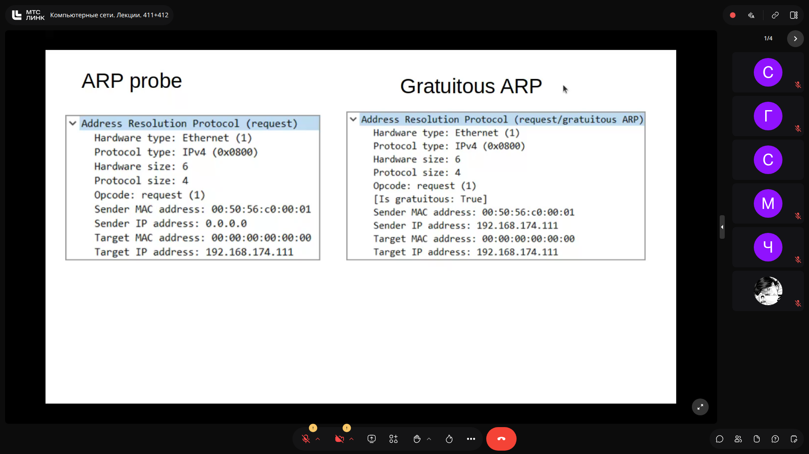


> [!IMPORTANT]
> **На заметку к зачету / экзамену:**
> - Признак отравления кэша (или Proxy ARP): наличие одного и того же MAC-адреса для нескольких разных IP-адресов в ARP-таблице хоста.
> - Главная корпоративная связка для нейтрализации ARP Spoofing — DHCP Snooping + Dynamic ARP Inspection (DAI) на управляемых L2-коммутаторах.

---

## Введение в IPv6: формат, каноническая нотация и RFC 5952 `[69:30]`

### Базовые характеристики IPv6
- **Длина адреса:** 128 бит (16 байт) против 32 бит (4 байта) в IPv4.
- **Количество адресов:** $2^{128} \approx 3.4 \times 10^{38}$.
- В IPv6 **полностью отсутствует широковещание (Broadcast)**; весь трафик делится на Unicast, Anycast и Multicast.

### Структура представления адреса
128 бит разбиваются на **8 хекстетов (hextets)** по 16 бит каждый (4 ниббла, где 1 ниббл = 4 бита = 1 шестнадцатеричная цифра), разделяемых двоеточиями:
`2001:0db8:0000:0000:0000:036e:1250:2b00`

### Правила сокращения записи (RFC 5952)
1. **Опускание ведущих нулей в хекстете:**
   `0db8` $\rightarrow$ `db8`; `0000` $\rightarrow$ `0`; `036e` $\rightarrow$ `36e`.
   `2001:db8:0:0:0:36e:1250:2b00`
2. **Применение двойного двоеточия (`::`):**
   - Последовательность из одного или нескольких смежных нулевых хекстетов может быть заменена на `::`.
   - `::` может использоваться в адресе **строго один раз** во избежание неоднозначности при парсинге.
   - Если в адресе есть несколько блоков нулей разной длины, сокращается **самый длинный** блок.
   - Если блоки нулей одинаковой длины, сокращается **первый по порядку (левый)** блок.

*Пример сжатия:*
`2001:0db8:0000:0000:0000:036e:1250:2b00` $\rightarrow$ `2001:db8::36e:1250:2b00`

### Специальные и зарезервированные адреса
- `::/128` — неопределенный адрес (Unspecified Address, аналог `0.0.0.0` в IPv4).
- `::1/128` — интерфейс петли Loopback (аналог `127.0.0.1` в IPv4).
- `::/0` — маршрут по умолчанию (Default Route).
- `::ffff:192.168.0.1` (или в hex `::ffff:c0a8:1`) — IPv4-mapped/embedded IPv6 address.

### Слайды и код с экрана:
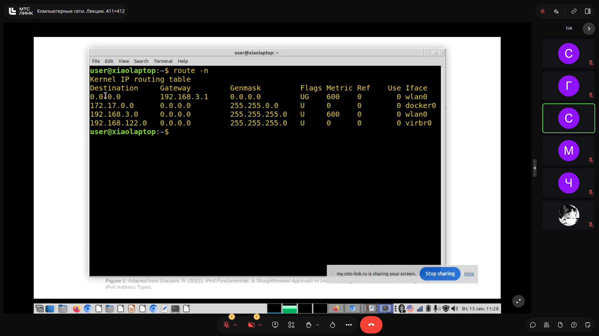

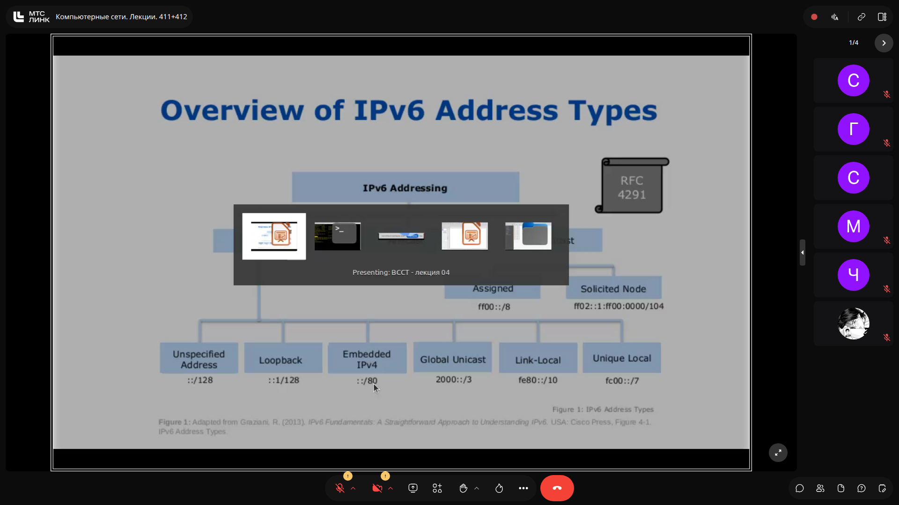


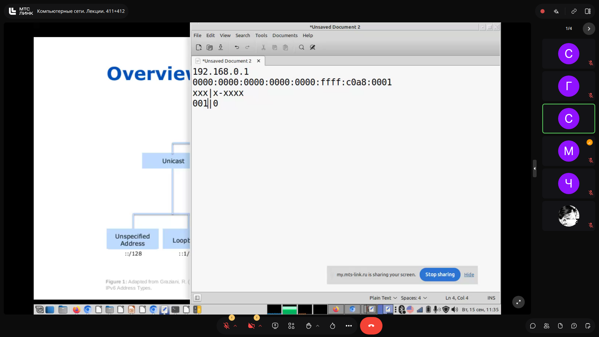


> [!IMPORTANT]
> **На заметку к зачету / экзамену:**
> - Длина адреса IPv6 — 16 байт (128 бит), а не 6 байт (распространенная ошибка студентов на зачете из-за цифры 6).
> - Двойное двоеточие '::' применяется строго один раз для самой длинной последовательности нулей; при равенстве длин выбирается самая левая.

---

## Глобальная структура адресов IPv6 и распределение RIR `[84:00]`

### Global Unicast Addresses (GUA)
Публичные маршрутизируемые адреса в сети Интернет начинаются с битового паттерна `001` (префикс `2000::/3`, охватывающий диапазон шестнадцатеричных адресов от `2000::` до `3FFF:FFFF:...`).

Организация **IANA** выделяет региональным интернет-регистраторам (**RIR**) адресные блоки размером `/12`:
- **APNIC** (Азиатско-Тихоокеанский регион): `2400::/12` (а также недавно выделенный второй блок `2410::/12` ввиду интенсивного роста в Китае и внедрения 5G/Smart City).
- **ARIN** (Северная Америка — США и Канада): `2600::/12`.
- **LACNIC** (Латинская Америка и Карибский бассейн): `2800::/12`.
- **RIPE NCC** (Европа, Россия, Ближний Восток, Центральная Азия): `2A00::/12`.
- **AfriNIC** (Африка): `2C00::/12`.

### Локальные адреса канального уровня (Link-Local)
Адреса диапазона `fe80::/10` автоматически генерируются на каждом активном интерфейсе узла (аналог APIPA `169.254.0.0/16` в IPv4) и используются исключительно для служебного обмена в пределах сегмента канального уровня (L2), не маршрутизируясь за пределы локальной сети.

### Слайды и код с экрана:


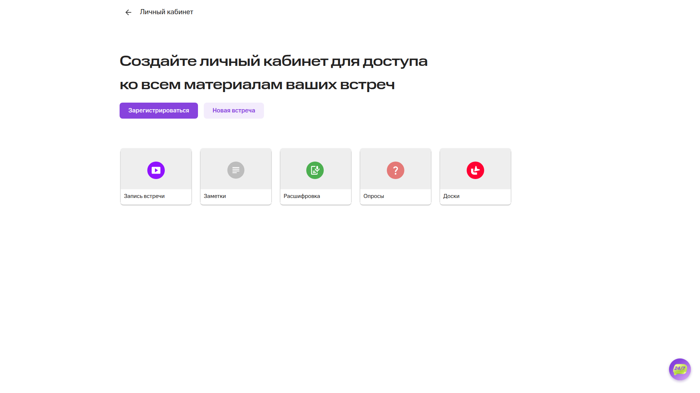

> [!IMPORTANT]
> **На заметку к зачету / экзамену:**
> - Все публичные адреса IPv6 в настоящее время начинаются с цифры 2 или 3 (префикс 2000::/3).
> - Российские провайдеры получают префиксы от RIPE NCC, поэтому их глобальные адреса начинаются с 2A00::.

---
