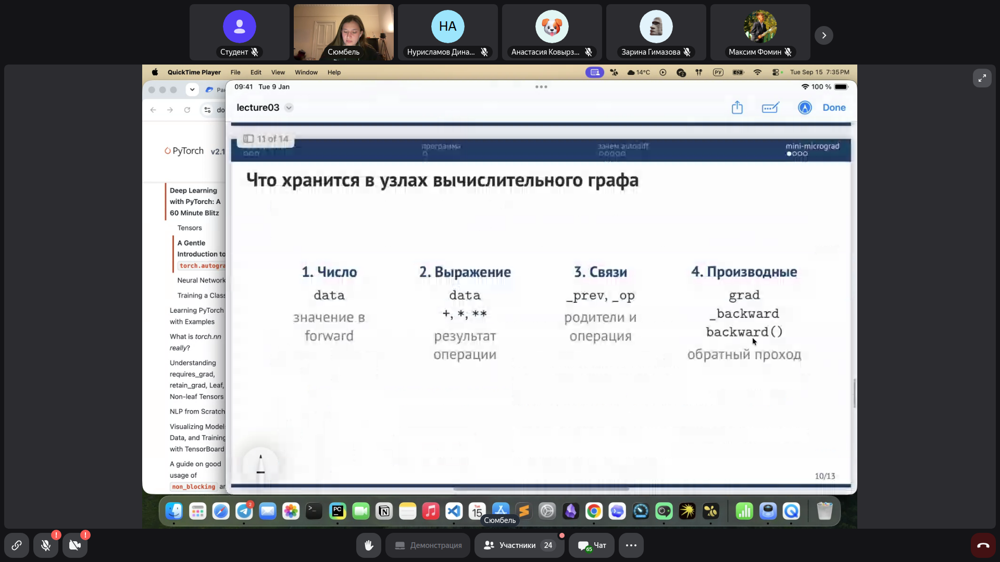
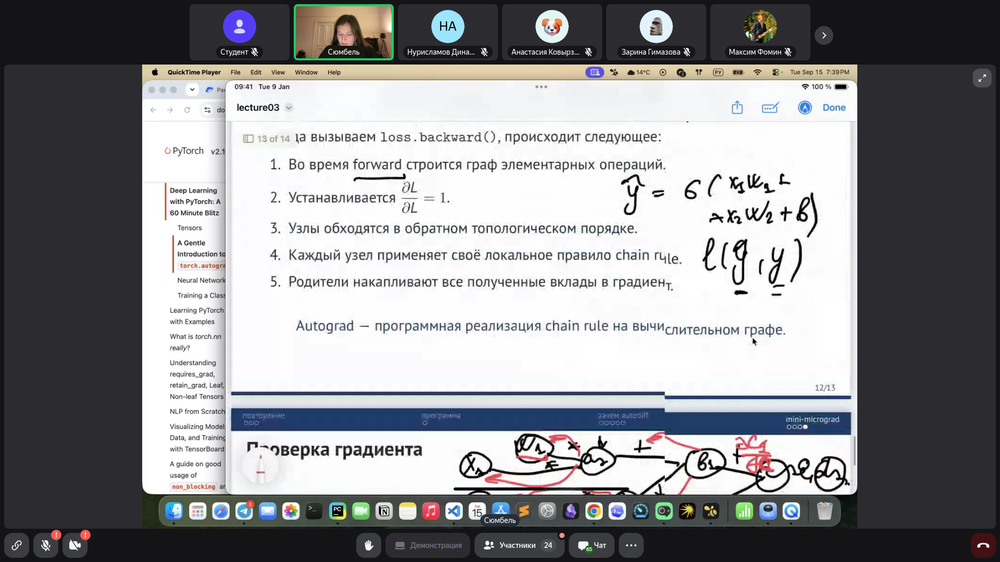
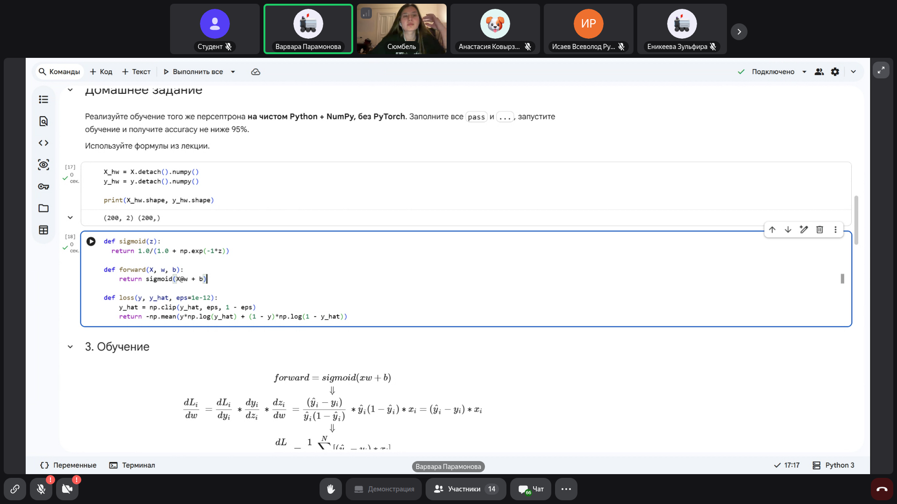
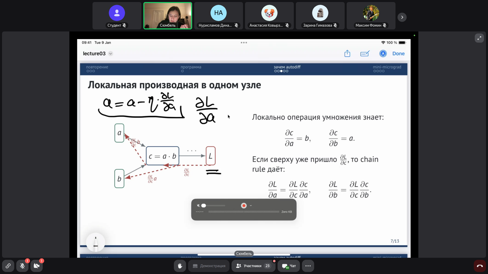
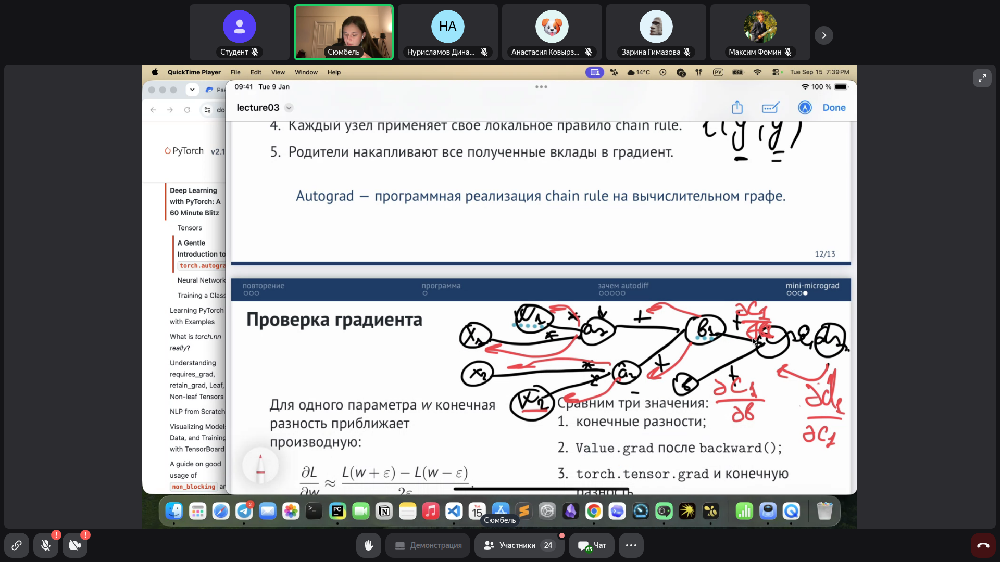
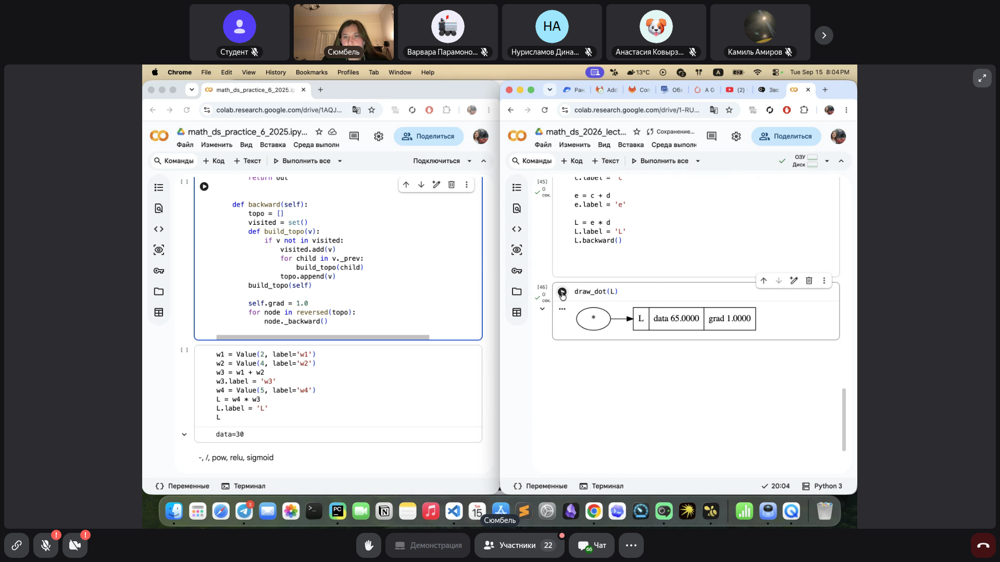
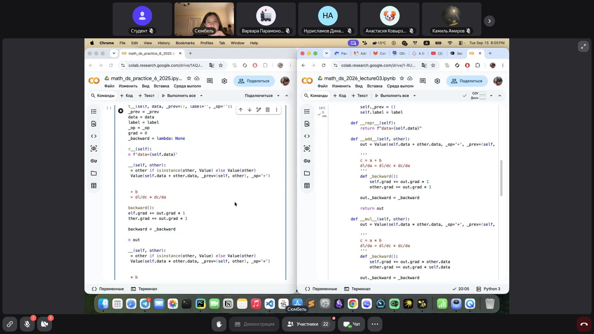
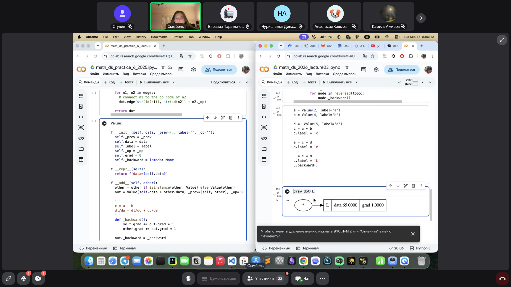
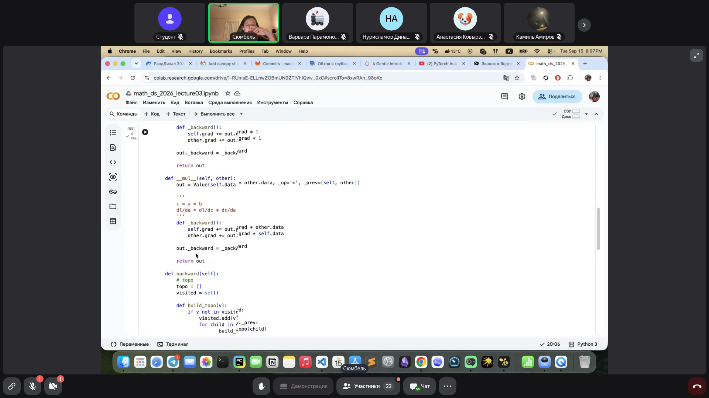

# Математика для Data Science: Автоматическое дифференцирование и реализация минималистичного Autograd-движка

> **Тема**: Автоматическое дифференцирование и реализация минималистичного Autograd-движка  
> **Статус конспекта**: Очищен от оговорок и воды, структурирован AI-ассистентом с сохранением авторских терминов.  
> **AI-модель**: `gemini-flash-latest`  

## Введение
В рамках оптимизации параметров нейронных сетей градиентным спуском критически важно эффективно и точно вычислять частные производные целевой функции потерь (Loss) по всем обучаемым весам и смещениям. Вместо ручного аналитического вывода формул производных для каждой отдельной архитектуры или численного приближения в современных фреймворках (включая PyTorch) используется парадигма автоматического дифференцирования (Automatic Differentiation, Autograd) на базе ориентированных ациклических графов вычислений (DAG). На лекции разобран теоретический базис Autograd, механизм вызова `loss.backward()` и пошагово реализован обучающий движок автодифференцирования (класс `Value`), управляющий прямым и обратным проходами.

---

## 1. Мотивация и концепция Autograd в PyTorch `[01:15]`

При обучении нейросети стандартный рабочий цикл в PyTorch выглядит следующим образом:

```python
model = NN()
criterion = nn.BCEWithLogitsLoss()
optimizer = torch.optim.SGD(model.parameters(), lr=lr)

# Forward pass
logits = model(X)
current_loss = criterion(logits, y)

# Backward pass
optimizer.zero_grad()
current_loss.backward()  # Вычисляет градиент nabla_w(L) для всех обучаемых параметров
optimizer.step()
```

Вызов `current_loss.backward()` выполняет автоматический расчет градиента функции потерь по всем параметрам модели, для которых установлен флаг `requires_grad=True`. 

Внутри PyTorch этот процесс реализован на высокопроизводительном C++ в виде динамического ориентированного ациклического графа (Dynamic Directed Acyclic Graph, DAG). Ключевые свойства вычислительного графа в PyTorch:
1. **Динамичность**: граф вычислений строится «на лету» во время каждого прямого прохода (`forward`). После завершения обратного прохода (`backward`) граф по умолчанию очищается и пересоздается на следующей итерации, что позволяет изменять ветвления, размеры тензоров и архитектуру прямо внутри цикла обучения.
2. **Узлы и ребра**: узлами графа выступают тензоры (данные, веса), а ребрами и промежуточными операторами — функции дифференцирования (`Node` / `Function`, такие как `AddBackward`, `MulBackward`, `DivBackward`), знающие правила распространения частных производных.

### Слайды и код с экрана:




> [!IMPORTANT]
> **На заметку к зачету / экзамену:**
> - Понимание того, почему PyTorch строит динамический граф (dynamic DAG), а не статический: граф создается заново на каждом прямом шаге (forward), что обеспечивает поддержку условий `if`, циклов и изменяющихся размерностей.

---

## 2. Анатомия узла вычислительного графа `[04:15]`

Любая сложная параметризованная модель может быть разложена на последовательность элементарных операций (бинарных: сложение, вычитание, умножение, деление; или унарных: логарифм, экспонента, степень, функции активации).

Каждый узел вычислительного графа хранит 4 фундаментальных компонента:
1. **Числовое значение (`data`)**: результат прямого прохода (`forward`), вычисленный на этапе выполнения операции.
2. **Операция (`_op`)**: тип выполненного математического действия (`+`, `*`, `pow` и т.д.).
3. **Связи / Родители (`_prev`)**: ссылки на входящие узлы-аргументы, породившие текущий узел.
4. **Градиент (`grad`) и метод обратного прохода (`_backward`)**: частная производная целевой функции потерь $L$ по значению данного узла (накапливается на этапе `backward`), а также замыкание, реализующее локальное цепное правило.

### Слайды и код с экрана:



> [!IMPORTANT]
> **На заметку к зачету / экзамену:**
> - Знать структуру узла вычислительного графа: `data`, `_op`, `_prev` (ссылки на родительские ноды), `grad` и замыкание `_backward`.

---

## 3. Цепное правило (Chain Rule) и локальные производные `[07:15]`

Пусть операция в узле вычисляет скаляр $c = a \cdot b$, а итоговая скалярная функция потерь всей сети равна $L$. 

Локально операция умножения знает свои частные производные:
$$\frac{\partial c}{\partial a} = b, \quad \frac{\partial c}{\partial b} = a$$

Если из последующих узлов графа уже вычислена и передана производная функции потерь по выходу текущего узла $\frac{\partial L}{\partial c}$ (в коде: `out.grad`), то по правилу дифференцирования сложной функции (Chain Rule) производные по входам $a$ и $b$ равны:
$$\frac{\partial L}{\partial a} = \frac{\partial L}{\partial c} \cdot \frac{\partial c}{\partial a} = \frac{\partial L}{\partial c} \cdot b$$
$$\frac{\partial L}{\partial b} = \frac{\partial L}{\partial c} \cdot \frac{\partial c}{\partial b} = \frac{\partial L}{\partial c} \cdot a$$

Аналогично для операции сложения $c = a + b$:
$$\frac{\partial c}{\partial a} = 1, \quad \frac{\partial c}{\partial b} = 1 \implies \frac{\partial L}{\partial a} = \frac{\partial L}{\partial c} \cdot 1, \quad \frac{\partial L}{\partial b} = \frac{\partial L}{\partial c} \cdot 1$$

### Начальное условие обратного прохода
Обратный проход стартует с самого последнего узла — функции потерь $L$. Так как $L$ тождественно зависит от самой себя, начальный градиент инициализируется единицей:
$$\frac{\partial L}{\partial L} = 1$$

### Слайды и код с экрана:



> [!IMPORTANT]
> **На заметку к зачету / экзамену:**
> - Обратный проход ВСЕГДА начинается с единицы: градиент функции потерь относительно самой себя равен $\frac{\partial L}{\partial L} = 1$.

---

## 4. Проблема множественных путей и накопление градиентов (+=) `[15:45]`

Если один и тот же параметр (или промежуточный узел) $x$ участвует в вычислении нескольких последующих узлов (разветвление графа, например $y = a(x) + b(x)$), то в соответствии с формулой полного дифференциала суммарный градиент равен сумме градиентов, пришедших по всем путям:
$$\frac{\partial L}{\partial x} = \sum_{k} \frac{\partial L}{\partial u_k} \frac{\partial u_k}{\partial x}$$

Именно поэтому при обратном распространении в коде **категорически нельзя использовать прямое присваивание** `node.grad = ...`. Градиент обязан накапливаться оператором сложения с присваиванием:
```python
self.grad += out.grad * local_derivative
```
Если использовать простое присваивание `=`, то при разветвлении потока вычислений вклад одного пути перезапишет вклад другого, что приведет к искажению вычисленного градиента.

### Слайды и код с экрана:


> [!IMPORTANT]
> **На заметку к зачету / экзамену:**
> - Критический акцент: почему в автограде используется `grad +=`, а не `grad =`? Для корректного суммирования частных производных в случае, если переменная используется более чем в одной ветке вычислений (формула полного дифференциала).

---

## 5. Топологическая сортировка и алгоритм обхода графа (DFS) `[20:30]`

Чтобы корректно вычислить градиенты, обратный проход должен обрабатывать узлы в строго определенном порядке: узел должен вызывать свой `_backward` только **после того**, как все его потомки (узлы, зависящие от него) уже передали ему свои градиенты.

Для ориентированного ациклического графа такой порядок гарантируется **топологической сортировкой** (Topological Sort).

### Алгоритм на базе поиска в глубину (DFS):
1. Создается список посещенных узлов `visited = set()` и упорядоченный список `topo = []`.
2. Для целевого узла рекурсивно вызывается обход в глубину (`build_topo`):
   - Если узел еще не посещен, он помечается как посещенный (`visited.add(v)`).
   - Рекурсивно вызывается `build_topo` для всех предков узла (`v._prev`).
   - После обработки всех предков узел добавляется в конец списка `topo.append(v)`.
3. Для запуска обратного прохода список `topo` инвертируется (`reversed(topo)`), устанавливается `self.grad = 1.0`, и для каждого узла последовательно вызывается локальная функция `node._backward()`.

### Слайды и код с экрана:



> [!IMPORTANT]
> **На заметку к зачету / экзамену:**
> - Топологический порядок вершин ациклического ориентированного графа гарантирует, что для каждого ребра $u \to v$ вершина $u$ расположена раньше $v$. Обратный проход обходит вершины в обратном топологическом порядке.

---

## 6. Пошаговая реализация класса Value на Python `[28:40]`

В ходе лекции написан базовый скелет движка автоматического дифференцирования:

```python
class Value:
    def __init__(self, data, _prev=(), _op='', label=''):
        self.data = data
        self.grad = 0.0  # Градиент по умолчанию равен нулю
        self._backward = lambda: None  # Пустая функция для листовых узлов
        self._prev = set(_prev)
        self._op = _op
        self.label = label

    def __repr__(self):
        return f"Value(data={self.data}, grad={self.grad})"

    def __add__(self, other):
        other = other if isinstance(other, Value) else Value(other)
        out = Value(self.data + other.data, _prev=(self, other), _op='+')

        def _backward():
            # dc/da = 1, dc/db = 1
            self.grad += out.grad * 1.0
            other.grad += out.grad * 1.0
        out._backward = _backward

        return out

    def __mul__(self, other):
        other = other if isinstance(other, Value) else Value(other)
        out = Value(self.data * other.data, _prev=(self, other), _op='*')

        def _backward():
            # dc/da = b, dc/db = a
            self.grad += out.grad * other.data
            other.grad += out.grad * self.data
        out._backward = _backward

        return out

    def backward(self):
        topo = []
        visited = set()

        def build_topo(v):
            if v not in visited:
                visited.add(v)
                for child in v._prev:
                    build_topo(child)
                topo.append(v)

        build_topo(self)

        # Инициализация градиента целевого узла
        self.grad = 1.0
        for node in reversed(topo):
            node._backward()
```

Пример сквозного вычисления:
```python
a = Value(2.0, label='a')
b = Value(4.0, label='b')
d = Value(5.0, label='d')
c = a * b; c.label = 'c'          # data = 8.0
e = c + d; e.label = 'e'          # data = 13.0
L = e * d; L.label = 'L'          # data = 65.0

L.backward()
# dL/dL = 1.0
# dL/de = 5.0 (d.data)
# dL/dd = 13.0 (e.data) + 5.0 (из узла e через c+d) = 18.0
# dL/dc = 5.0
# dL/da = 5.0 * 4.0 = 20.0
# dL/db = 5.0 * 2.0 = 10.0
```

### Слайды и код с экрана:







> [!IMPORTANT]
> **На заметку к зачету / экзамену:**
> - Обратите внимание на проверку `isinstance(other, Value)`: чтобы выражения вида `a + 2` или `a * 5` не приводили к ошибке, скаляры оборачиваются в `Value(other)`.

---

## 7. Верификация градиентов методом центральных конечных разностей `[60:15]`

Для проверки корректности написанных аналитических производных в `_backward` используется численная аппроксимация производной через **центральные конечные разности (finite differences)**:

$$\frac{\partial L}{\partial w} \approx \frac{L(w + \varepsilon) - L(w - \varepsilon)}{2\varepsilon}$$

где $\varepsilon$ — достаточно малое число (например, $10^{-4}$ или $10^{-5}$).

Центральная разность имеет второй порядок погрешности $O(\varepsilon^2)$ (в отличие от односторонней разности $\frac{L(w+\varepsilon)-L(w)}{\varepsilon}$ с погрешностью $O(\varepsilon)$), благодаря чему обеспечивает высокую точность.

В домашнем задании требуется сопоставить три значения градиента для каждого параметра:
1. Значение, полученное методом конечных разностей;
2. Значение в поле `Value.grad` после собственного вызова `backward()`;
3. Значение `torch.tensor.grad` стандартного PyTorch Autograd.

### Слайды и код с экрана:


> [!IMPORTANT]
> **На заметку к зачету / экзамену:**
> - Формула центральной разности: деление строго на $2\varepsilon$. Это стандартный метод Gradient Check для верификации кастомных операторов.

---
