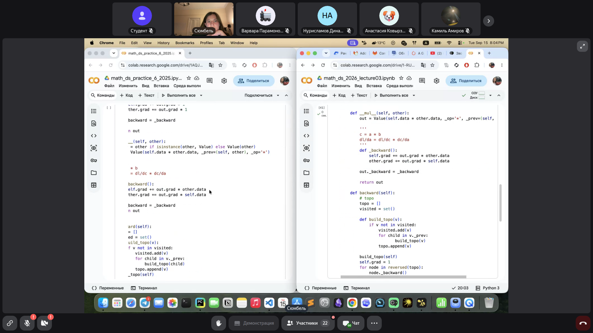
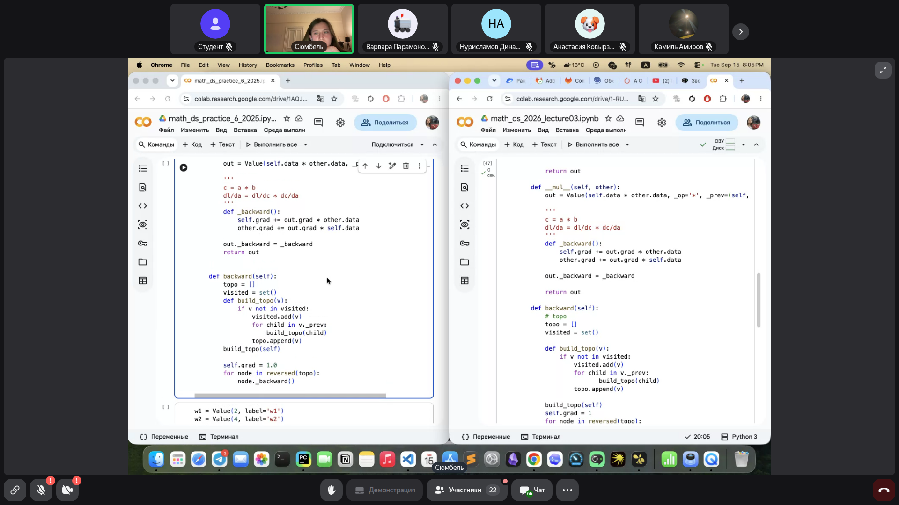
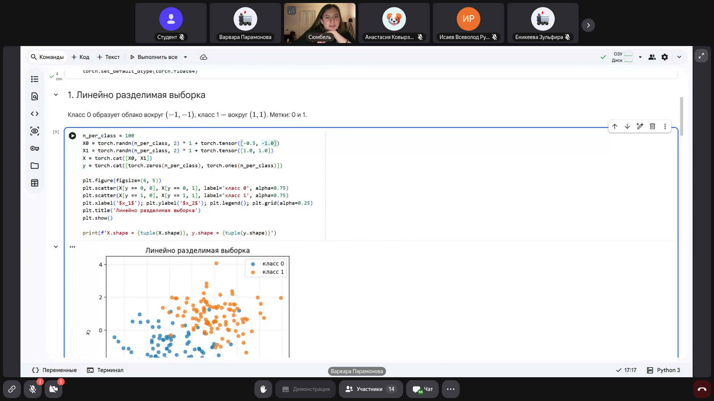
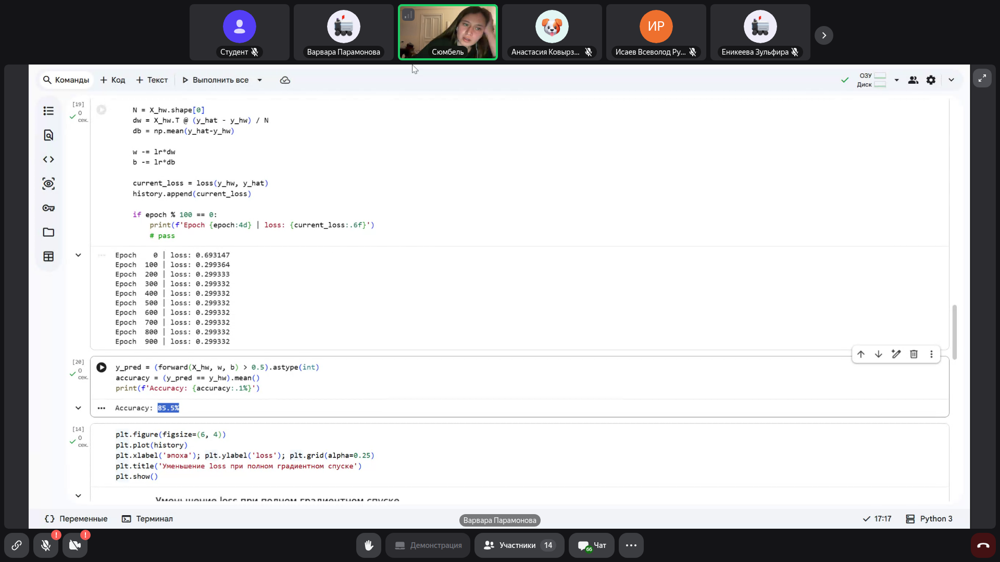

# Машинное обучение / Data Science: Автоматическое дифференцирование и устройство Autograd в PyTorch

> **Тема**: Автоматическое дифференцирование и устройство Autograd в PyTorch  
> **Статус конспекта**: Очищен от оговорок и воды, структурирован AI-ассистентом с сохранением авторских терминов.  
> **AI-модель**: `gemini-flash-latest`  

## Введение
В обучении нейронных сетей оптимизация параметров (весов и смещений) строится на методе градиентного спуска и его модификациях. Градиент функции потерь указывает направление наискорейшего возрастания, поэтому шаги оптимизации совершаются в противоположном направлении — по антиградиенту. Для вычисления градиентов в сложных многослойных архитектурах вручную дифференцировать функции невозможно. Современные фреймворки глубокого обучения (в частности, PyTorch) решают эту задачу автоматически с помощью модуля Autograd. В рамках лекции рассмотрены математические основы цепного правила (chain rule), представление вычислений в виде ориентированного ациклического графа (DAG), необходимость обхода графа в обратном топологическом порядке и накопления производных, а также написана базовая реализация класса `Value` на Python.

---

## Повторение: градиентный спуск и вызов backward() в PyTorch `[00:21]`

Нейронная сеть представляет собой сложную параметризованную функцию, параметры которой мы подбираем для минимизации функции потерь $L$.

В PyTorch стандартный цикл обучения выглядит следующим образом:
```python
model = NN()
criterion = nn.BCEWithLogitsLoss()
optimizer = torch.optim.SGD(model.parameters(), lr=lr)

logits = model(X)
current_loss = criterion(logits, y)
optimizer.zero_grad()
current_loss.backward()  # Вычисляет градиенты nabla_w L для параметров модели
optimizer.step()
```

При вызове `loss.backward()` происходит автоматический расчет частных производных функции потерь по всем обучаемым параметрам модели (`requires_grad=True`). В PyTorch вычислительные графы являются динамическими: граф создается «на лету» во время прямого прохода (forward pass) и перестраивается заново на каждой итерации.

### Слайды и код с экрана:


> [!IMPORTANT]
> **На заметку к зачету / экзамену:**
> - Динамический вычислительный граф в PyTorch позволяет менять архитектуру сети и поток управления прямо во время выполнения (на каждом шаге цикла обучения).

---

## Теоретические основы: Chain Rule и локальные производные `[07:13]`

В основе обратного распространения ошибки лежит правило взятия производной сложной функции (**chain rule** / правило цепочки).

Рассмотрим элементарный узел операции умножения: $c = a \cdot b$.
Локально операция умножения знает свои частные производные по входам:
$$\frac{\partial c}{\partial a} = b, \quad \frac{\partial c}{\partial b} = a$$

Если из последующих слоев в узел $c$ уже пришла производная функции потерь $\frac{\partial L}{\partial c}$, то по цепному правилу градиенты для входных переменных вычисляются перемножением:
$$\frac{\partial L}{\partial a} = \frac{\partial L}{\partial c} \cdot \frac{\partial c}{\partial a} = \frac{\partial L}{\partial c} \cdot b$$
$$\frac{\partial L}{\partial b} = \frac{\partial L}{\partial c} \cdot \frac{\partial c}{\partial b} = \frac{\partial L}{\partial c} \cdot a$$

Для операции сложения $c = a + b$ локальные производные равны единице:
$$\frac{\partial c}{\partial a} = 1, \quad \frac{\partial c}{\partial b} = 1 \implies \frac{\partial L}{\partial a} = \frac{\partial L}{\partial c} \cdot 1, \quad \frac{\partial L}{\partial b} = \frac{\partial L}{\partial c} \cdot 1$$

### Слайды и код с экрана:


> [!IMPORTANT]
> **На заметку к зачету / экзамену:**
> - Каждый узел графа обязан знать только локальную производную своей математической операции и перемножать ее на пришедший «сверху» (из выхода) градиент.

---

## Инициализация обратного прохода и ветвление графа `[15:08]`

Обратный проход всегда начинается с итоговой вершины функции потерь $L$. Производная целевой функции по самой себе тождественно равна единице:
$$\frac{\partial L}{\partial L} = 1$$
Поэтому узел $L$ перед запуском `backward()` получает базовый градиент `grad = 1.0`.

### Проблема разветвления (Multivariate Chain Rule)
Если переменная $x$ используется в нескольких ветвях графа (например, входит и в узел $a$, и в узел $b$, где $y = a + b$), то ее полный дифференциал складывается из вкладов по всем путям:
$$dy = \frac{\partial y}{\partial a} da + \frac{\partial y}{\partial b} db$$
$$\frac{\partial y}{\partial x} = \frac{\partial y}{\partial a} \frac{\partial a}{\partial x} + \frac{\partial y}{\partial b} \frac{\partial b}{\partial x}$$

**Важнейшее следствие для реализации кода:** градиенты в узлах нельзя перезаписывать через обычное присваивание (`grad = ...`), их обязательно нужно **накапливать** суммированием (`grad += ...`).

### Слайды и код с экрана:


> [!IMPORTANT]
> **На заметку к зачету / экзамену:**
> - Почему в PyTorch и кастомных движках градиент суммируется (+=)? Из-за правила полного дифференциала: если переменная участвует в нескольких операциях, градиенты от всех потомков должны сложиться.

---

## Топологический порядок и обход графа (DFS) `[20:05]`

Чтобы вычислить градиенты для узла, необходимо гарантировать, что все узлы, зависящие от него (потомки при прямом проходе), уже полностью вычислили свои градиенты и передали вклад в данный узел.

Вычислительный граф представляет собой ориентированный ациклический граф (**DAG** — Directed Acyclic Graph). Порядок, в котором каждый узел идет строго после своих родителей, называется **топологическим порядком**.

Для корректного `backward()` граф обходится в **обратном топологическом порядке** (от листьев/лосса к корням/входам). Топологическая сортировка строится с помощью алгоритма поиска в глубину (**DFS**):
```python
topo = []
visited = set()

def build_topo(v):
    if v not in visited:
        visited.add(v)
        for child in v._prev:
            build_topo(child)
        topo.append(v)

build_topo(self)
for node in reversed(topo):
    node._backward()
```

### Слайды и код с экрана:


> [!IMPORTANT]
> **На заметку к зачету / экзамену:**
> - Топологическая сортировка DAG гарантирует корректную последовательность вызовов локальных функций _backward: ни один узел не запустит вычисление, пока не собраны все градиенты от его потребителей.

---

## Архитектура узла графа: реализация класса Value `[28:38]`

Каждый узел вычислительного графа инкапсулирует 4 ключевые сущности:
1. **Число (`data`)** — скалярное значение, полученное при прямом проходе (forward);
2. **Операция (`_op`)** — символ или идентификатор операции (`+`, `*` и т.д.);
3. **Связи (`_prev`)** — ссылки на узлы-родители, породившие данное значение;
4. **Производная (`grad`) и лямбда-функция (`_backward`)** — накопленный градиент $\frac{\partial L}{\partial v}$ и замыкание для передачи градиента родителям.

### Базовая реализация сложения и умножения:
```python
class Value:
    def __init__(self, data, _prev=(), _op='', label=''):
        self.data = data
        self.grad = 0.0
        self._backward = lambda: None
        self._prev = set(_prev)
        self._op = _op
        self.label = label

    def __repr__(self):
        return f"Value(data={self.data}, grad={self.grad})"

    def __add__(self, other):
        other = other if isinstance(other, Value) else Value(other)
        out = Value(self.data + other.data, (self, other), '+')

        def _backward():
            self.grad += out.grad * 1.0
            other.grad += out.grad * 1.0
        out._backward = _backward

        return out

    def __mul__(self, other):
        other = other if isinstance(other, Value) else Value(other)
        out = Value(self.data * other.data, (self, other), '*')

        def _backward():
            self.grad += out.grad * other.data
            other.grad += out.grad * self.data
        out._backward = _backward

        return out

    def backward(self):
        topo = []
        visited = set()
        def build_topo(v):
            if v not in visited:
                visited.add(v)
                for p in v._prev:
                    build_topo(p)
                topo.append(v)
        build_topo(self)

        self.grad = 1.0
        for node in reversed(topo):
            node._backward()
```

### Слайды и код с экрана:






> [!IMPORTANT]
> **На заметку к зачету / экзамену:**
> - В конструкторе `grad` изначально инициализируется нулем, а узел, у которого вызван `backward()`, перед обратным проходом принудительно устанавливает `self.grad = 1.0`.

---

## Численная проверка градиентов: конечные разности `[60:15]`

Для верификации корректности аналитических производных в автодифференцировании используется **gradient check** через центральные конечные разности:
$$\frac{\partial L}{\partial w} \approx \frac{L(w + \varepsilon) - L(w - \varepsilon)}{2\varepsilon}$$
где $\varepsilon$ — достаточно малое число (например, $10^{-4}$ или $10^{-5}$).

В домашнем задании студентам необходимо сравнить три показателя:
1. Значения градиентов, полученные приближением конечными разностями;
2. Значение поля `Value.grad` после выполнения кастомного `backward()`;
3. Значение `torch.tensor.grad`, полученное из стандартного PyTorch.

### Слайды и код с экрана:


> [!IMPORTANT]
> **На заметку к зачету / экзамену:**
> - Центральная разностная схема O(eps^2) дает более высокую точность численной аппроксимации производной по сравнению с односторонней разностью O(eps).

---

## Разбор сдачи предыдущего домашнего задания студентами `[62:40]`

В конце занятия студенты продемонстрировали выполнение предыдущей лабораторной работы (реализация персептрона и градиентного спуска на чистом NumPy без фреймворков глубокого обучения):
- Разобрано влияние клиппинга аргументов логарифма в функции потерь Binary Cross-Entropy (`np.clip(y_hat, eps, 1 - eps)`) для предотвращения расходимости к $-\infty$ при вероятностях $0$ и $1$.
- Преподаватель обратила внимание на математический смысл транспонирования матрицы признаков $X^T$ при матричном перемножении с вектором ошибок $(y_{pred} - y)$ для согласования размерностей при расчете градиента весов $dw = \frac{1}{N} X^T (\hat{y} - y)$.
- Обсуждена линейная разделимость выборки и визуализация границы разделения классов $x^T w + b = 0$.

### Слайды и код с экрана:






> [!IMPORTANT]
> **На заметку к зачету / экзамену:**
> - Зачем нужно транспонирование при вычислении матричного градиента: чтобы скалярные произведения признаков на ошибки суммировались по всем объектам выборки, выдавая градиент размерности весов (d,).

---
