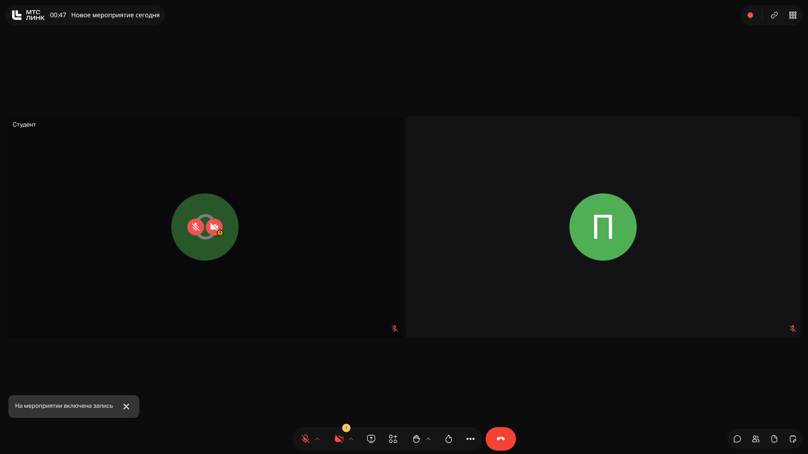
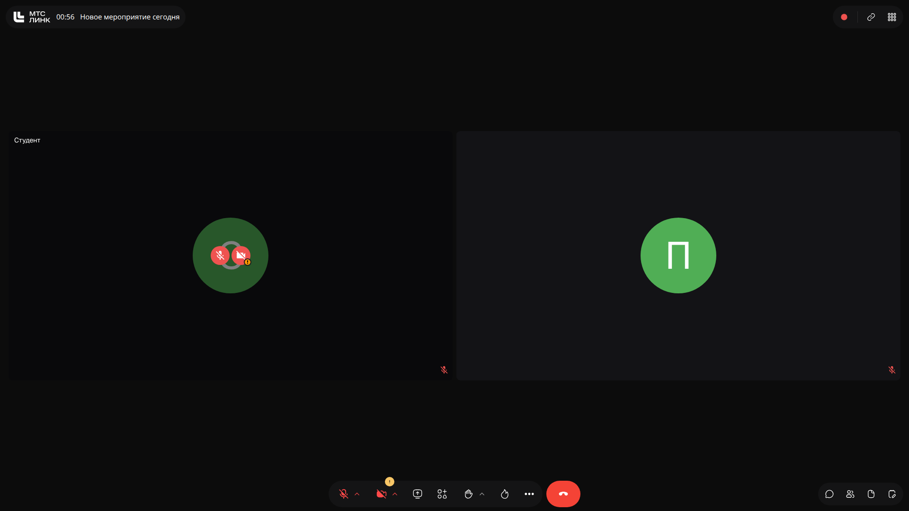

# Онлайн-встреча (тест): Проверка работоспособности бота

> **Тема**: Проверка работоспособности бота  
> **Статус конспекта**: Очищен от оговорок и воды, структурирован AI-ассистентом с сохранением авторских терминов.

## Введение
Встреча представляет собой техническую проверку записи на платформе МТС Линк. Фактический учебный процесс не проводился.

---

## Тестовая запись `[00m15s]`

Была выполнена проверка записи и передачи звука.

Единственный комментарий участника:  
> *«Так, это тестовая встреча, видеозапись, тестовый звонок, чтобы проверить работу бота.»*

Никаких учебных тем, слайдов с материалами лекции или практических заданий представлено не было.

### Слайды и код с экрана:

---
