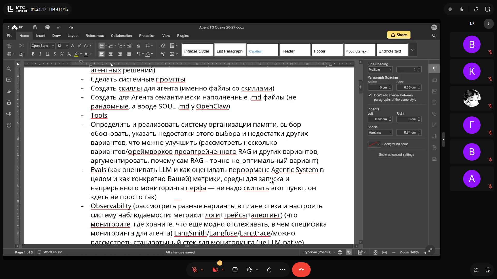
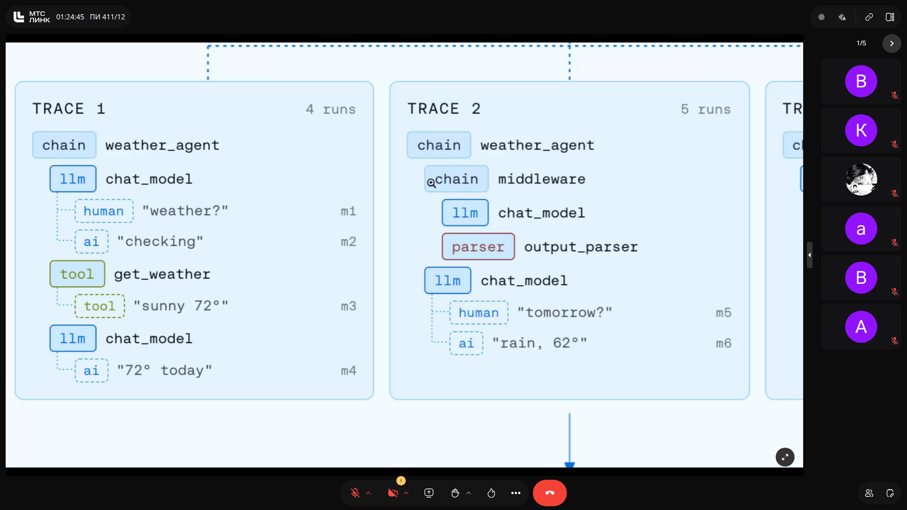
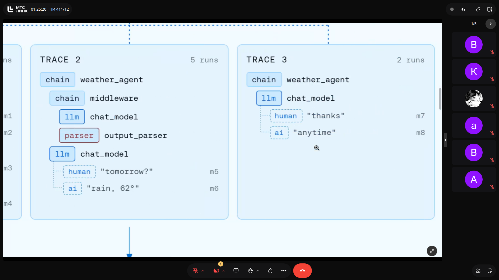
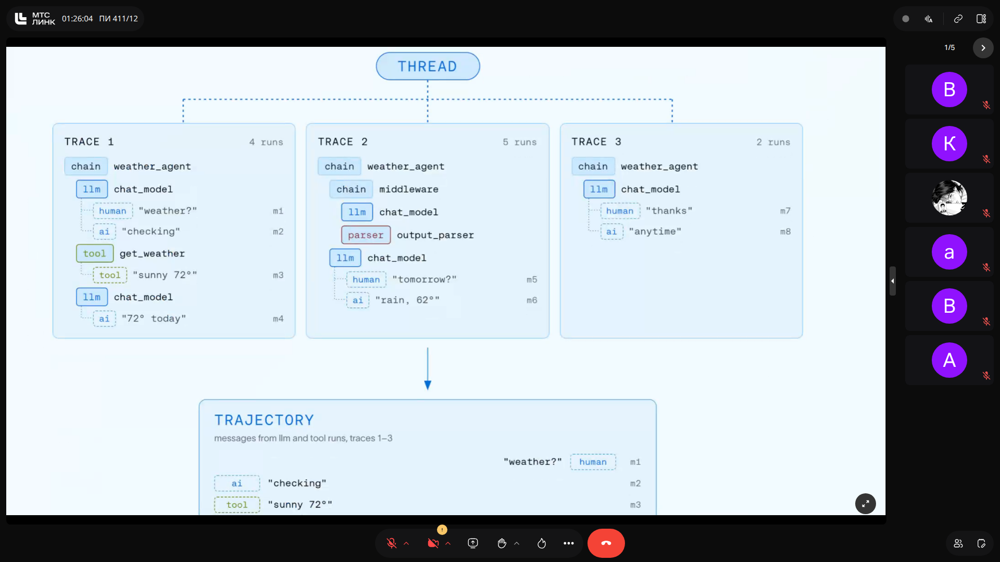
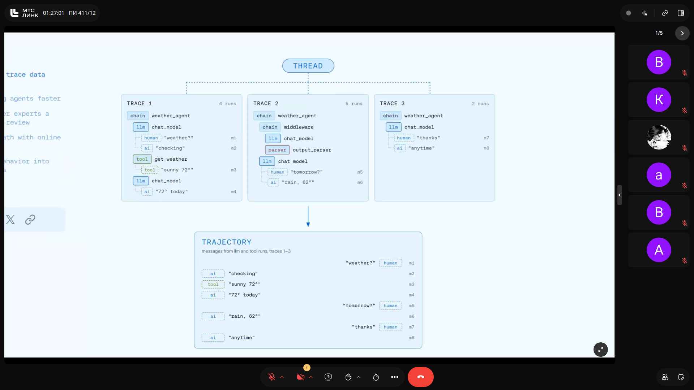
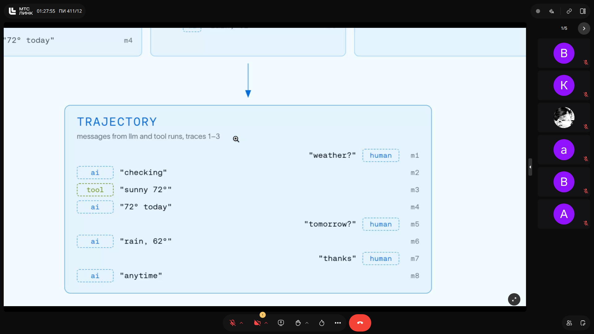
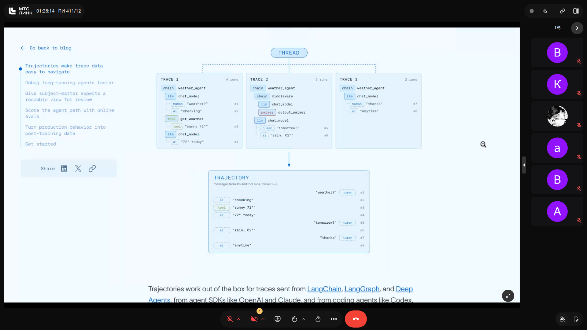
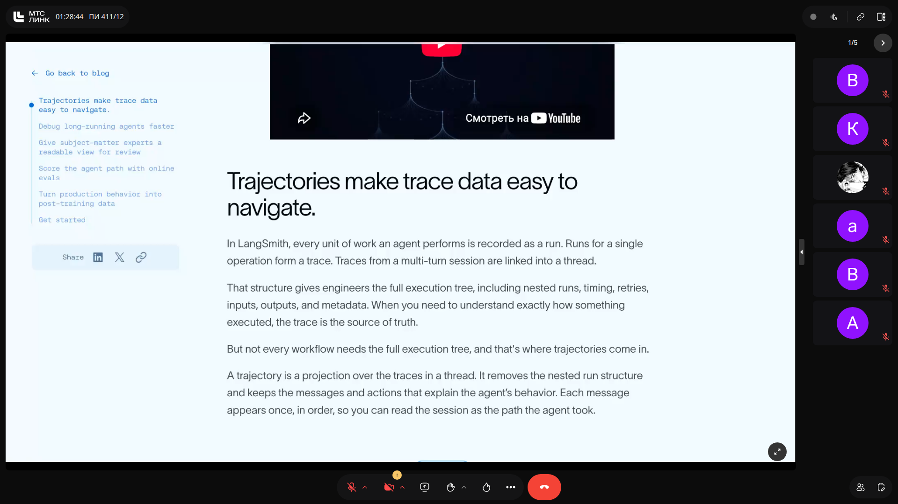
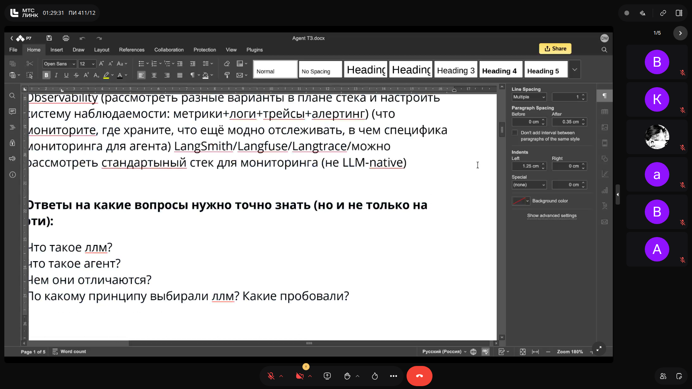
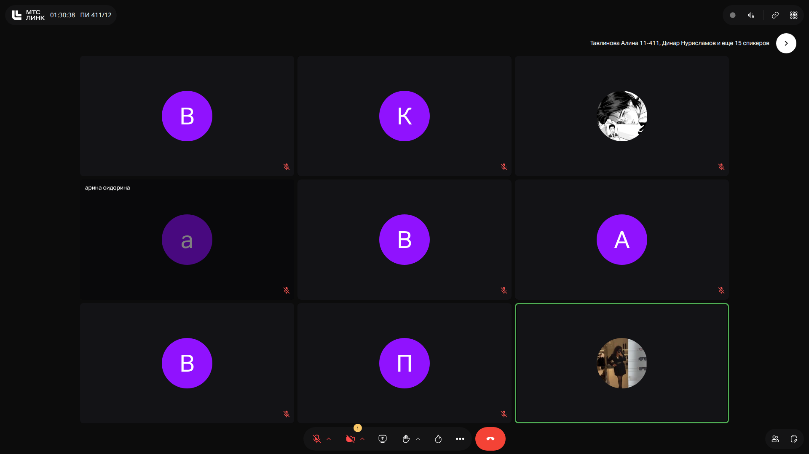

# Программная инженерия: Базовые концепты LLM, терминология и проектирование мультиагентных систем

> **Тема**: Базовые концепты LLM, терминология и проектирование мультиагентных систем  
> **Статус конспекта**: Очищен от оговорок и воды, структурирован AI-ассистентом с сохранением авторских терминов.  
> **AI-модель**: `gemini-3.8-flash`  

## Введение
В рамках лекции проведен детальный опрос и разбор базового понятийного аппарата для работы с искусственным интеллектом и большими языковыми моделями: от токенизации и векторных пространств до концепций MoE, LLM-as-a-judge и идемпотентности системных вызовов. Во второй половине занятия представлен детальный разбор требований ко второму практическому заданию семестра — проектированию и реализации мультиагентной системы промышленного уровня с акцентом на архитектуру изоляции (песочницы), многоуровневую память, эвалюацию и трассировку траекторий агентов.

---

## Понятийный аппарат: LLM, Агенты, Токены и Эмбеддинги `[05:10]`

### Различие между LLM и AI-агентом
- **LLM (Large Language Model):** Стохастическая языковая модель, работающая на предсказание вероятностей последующих токенов на основе предобученных весов нейросети. Сама по себе модель не является полноценным программным обеспечением — это вычислительное ядро/интерфейс генерации.
- **Агент (AI Agent):** Автономное программное обеспечение (автономный софт), использующее LLM как один из компонентов принятия решений («мозг»), но обладающее окружением, доступом к инструментам (Tools), долговременной памятью, механизмами планирования и способностью совершать действия во внешней среде.

### Токенизация и Векторизация
- **Токен:** Минимальная дискретная единица текста, с которой оперирует модель (слово, подслово, символ).
- **Эмбеддинг (Embedding):** Числовой вектор фиксированной размерности в многомерном пространстве, отражающий семантический смысл дискретного элемента (токена, предложения или целого документа). Семантическая близость между понятиями выражается через геометрическое расстояние (косинусное расстояние, евклидова метрика).
- **Векторная база данных:** Специализированное NoSQL хранилище данных, оптимизированное под индексацию, хранение и быстрый поиск векторов по метрикам подобия (KNN/ANN).

> [!IMPORTANT]
> **На заметку к зачету / экзамену:**
> - Агент — это прежде всего автономный софт (автономное ПО), а не просто промпт в чате.
> - Векторные базы данных относятся к категории NoSQL, называть их «обычными реляционными БД» на экзамене грубая ошибка.

---

## Детерминированность, MoE и LLM-as-a-Judge `[14:48]`

### Детерминированность систем
- **Детерминированная система:** При подаче одинаковых входных данных $X$ всегда возвращает строго идентичный результат $Y$.
- **LLM по умолчанию недетерминированы:** Так как это вероятностные стохастические модели. Регулировка гиперпараметра температуры (`temperature`) позволяет сместить распределение вероятностей. При снижении температуры ближе к $0$ модель ведет себя более детерминированно, но стохастическая природа архитектуры сохраняется.

### Архитектуры Dense vs MoE
- **Dense (Полносвязные):** Для каждого токена/запроса активируются все параметры и веса модели.
- **MoE (Mixture of Experts):** Архитектура «смеси экспертов». Модель разделена на специализированные подсети (эксперты), и роутер активирует только небольшую часть параметров (Top-K экспертов) для обработки конкретного запроса, что ускоряет инференс и снижает затраты памяти.

### LLM-as-a-Judge и проблемы валидации
Паттерн использования более сильной LLM для оценки качества работы другой модели или агента.
- **Преимущество:** Возможность автоматизированно и недорого оценивать неструктурированные метрики (тональность, связность, точность ответа по смыслу), которые невозможно выразить жесткой формулой.
- **Проблемы:** Предвзятость моделей (bias в пользу собственного стиля/инференса, любовь к определенным вариантам ответов), галлюцинации и необходимость использования независимых семейств моделей для взаимной верификации.

> [!IMPORTANT]
> **На заметку к зачету / экзамену:**
> - LLM недетерминированы по дефолту. На экзамене помнить: температура варьируется от 0 до 1 (иногда до 2), для максимальной детерминированности ее стремят к нулю.
> - В MoE активируются не все веса сразу, а только выбранные роутером эксперты.

---

## Архитектурная идемпотентность и надежность систем `[36:35]`

### Принцип идемпотентности (Idempotency)
Свойство операции при повторном применении давать тот же результат, что и при первом вызове, не вызывая нежелательных побочных эффектов в системе ($f(f(x)) = f(x)$).
- **Значение в агентных распределенных системах:** Взаимодействие через брокеры сообщений (Kafka, RabbitMQ) и HTTP API требует обработки повторов (retries). Если агент выполняет финансовую транзакцию или удаление/модификацию сущности, повторный вызов не должен приводить к двойному списанию средств или дублированию записей.
- **Гарантии доставки:** Принципы *at-most-once*, *at-least-once* и *exactly-once* требуют строгой поддержки идемпотентных ключей на стороне консьюмеров и сервисов.

> [!IMPORTANT]
> **На заметку к зачету / экзамену:**
> - Идемпотентность критична для финансовых и агентных систем с автоматическими ретраями: повторный запрос не должен менять состояние системы дважды.

---

## Техническое задание на мультиагентную систему: Инфраструктура и Изоляция `[44:00]`

### Выбор движка и моделей
- **Критерии выбора LLM:** Требуется протестировать не менее 3 моделей (open-source / локальные) и обосновать выбор под решаемую задачу по бенчмаркам, качеству инференса и стоимости.
- **Движки инференса:** Не путать модели с движками! Примеры движков: **Ollama**, **llama.cpp**, **vLLM**.
- **Роутинг моделей:** Оптимизация костов через перенаправление простых задач на дешевые/быстрые модели (или специализированные decision-модели вроде Jev), а сложных — на тяжелые reasoning-модели.

### Изоляция сред исполнения (Sandboxing)
Развертывание агента строго в изолированной среде:
- Использование стандартных Docker-контейнеров недостаточно безопасно для выполнения непроверенного кода, сгенерированного LLM.
- Необходимо использовать специализированные песочницы: **Docker Sandboxes**, **MicroVM** (например, Firecracker), виртуальные машины или бессерверные изолированные рантаймы.
- В отчете необходимо провести сравнительный анализ вариантов изоляции и аргументировать выбранное решение.

### Слайды и код с экрана:

> [!IMPORTANT]
> **На заметку к зачету / экзамену:**
> - Ошибкой считается называть 'Ollama' моделью — это движок/рантайм.
> - Обычный Docker-контейнер не создавался под запуск недоверенного LLM-кода, требуется анализировать sandbox-решения.

---

## Архитектура агента: Фреймворки, Промпты, Скиллы и Память `[65:10]`

### Фреймворки и Проектирование
- Рекомендуемые фреймворки: **LangGraph**, **CrewAI**, **AutoGen** (разработка без фреймворка допустима только при жесткой аргументации).
- Архитектурная документация: схемы C4 (Context, Container, Component) и Sequence-диаграммы потока сообщений.

### Системные артефакты
- **Системные промпты:** Базовые скрытые инструкции, определяющие роль и рамки поведения.
- **Скиллы (Skills) и Tools:** Описание инструментов и навыков агента в формате `.md`-файлов.
- **Семантическое наполнение:** Файлы сущности агента (например, аналог `SOUL.md` в OpenClaw).

### Многоуровневая организация памяти
1. **Краткосрочная память (Short-term / State):** Текущее состояние диалога/графа. Сервисы должны стремиться быть *Stateless*, а состояние выноситься во внешнее хранилище (Redis/БД) для обеспечения отказоустойчивости.
2. **Среднесрочная память (Mid-term / Personalization):** Сбор семантических данных о предпочтениях пользователя в рамках серии сессий.
3. **Долговременная память (Long-term / Persistent / RAG):** База знаний компании, нормативные акты, регламенты, подключаемые через векторный поиск и графовые индексы.

### Слайды и код с экрана:

> [!IMPORTANT]
> **На заметку к зачету / экзамену:**
> - Базовый RAG не является оптимальным решением для всех задач памяти агента, необходимо обосновывать выбор гибридных или проапгрейженных подходов.

---

## Observability и Эвалюация: Трейсы и Траектории в LangSmith `[81:25]`

### Наблюдаемость (Observability)
Для агентных систем логирования недостаточно — требуется специализированный мониторинг:
- Стек: **LangSmith**, **Langfuse**, **Langtrace** или OpenTelemetry-инструменты.
- Фиксация вызовов моделей, времени ответа (latency), потребления токенов и срабатывания инструментов (tool calls).

### Трейсы vs Траектории (Trajectories)
- **Трейс (Trace):** Полное дерево выполнения технического графа (включая middleware, парсеры, ретраи, вспомогательные вызовы).
- **Траектория (Trajectory):** Проекция над трейсами сессии, отображающая упорядоченную последовательность смысловых сообщений и действий между человеком, агентом и тулами. Позволяет оперативно локализовать ошибки бизнес-логики и использовать успешные сессии для дообучения (post-training / fine-tuning).

### Слайды и код с экрана:

> [!IMPORTANT]
> **На заметку к зачету / экзамену:**
> - Пункты Evals и Observability обязательны для демонстрации на защите; пустые графики или отсутствие трейсов ведут к снижению баллов.

---
