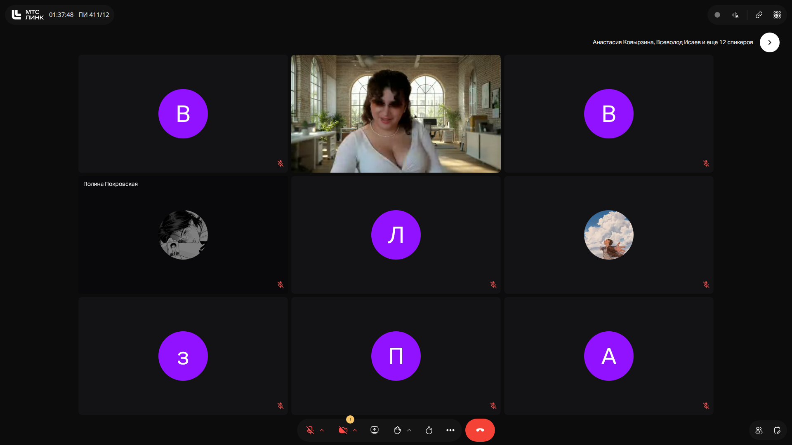
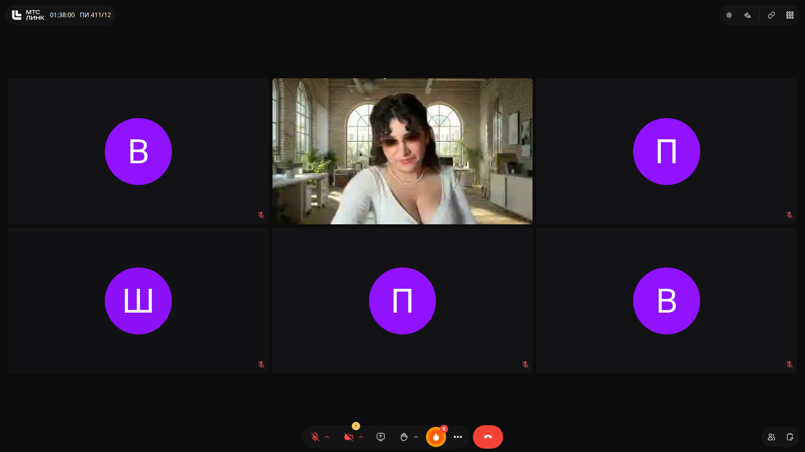

# Программная инженерия: Рекомендательные системы, векторизация данных и RAG-архитектуры

> **Тема**: Рекомендательные системы, векторизация данных и RAG-архитектуры  
> **Статус конспекта**: Очищен от оговорок и воды, структурирован AI-ассистентом с сохранением авторских терминов.  
> **AI-модель**: `gemini-3.6-flash`  

## Введение
Лекция посвящена фундаментальным принципам векторизации данных, проектированию рекомендательных систем, методам сбора неявного фидбека, обработке проблем Cold Start и многоэтапному ранжированию, а также влиянию LLM-агентов на эширование и архитектуру современных сервисов.

---

## Векторизация и концепция RAG `[00m01s]`

Векторные базы данных служат основой для RAG (Retrieval-Augmented Generation). Они позволяют извлекать фактологические данные из внешнего контекста для снижения уровня галлюцинаций языковых моделей. Классический чистый RAG имеет ряд ограничений, для решения которых применяется **Graph RAG** — объединение векторного поиска с графовыми структурами знаний.

### Слайды и код с экрана:

> [!IMPORTANT]
> **На заметку к зачету / экзамену:**
> - Понимать назначение RAG для предотвращения галлюцинаций LLM.

---

## Архитектура рекомендательных систем: пространства объектов и пользователей `[00m33s]`

Главная задача рекомендательной системы — персонализация контента или товаров под конкретного пользователя.

### Основные сущности:
1. **Items (Объекты)**: видеоролики, карточки товаров, музыкальные треки.
2. **Users (Пользователи)**: профили потребителей контента.

Все объекты и пользователи проецируются в векторное пространство. Степень схожести объектов или соответствия товара интересам пользователя определяется геометрическим расстоянием между их векторами (чаще всего **косинусным сходством** / Cosine Similarity).

> [!IMPORTANT]
> **На заметку к зачету / экзамену:**
> - Векторная близость пользователей и объектов основывается на вычислении косинусного расстояния между их представлениями.

---

## Специфика фидбека и UX в различных доменах `[03m06s]`

Способы сбора сигнала о том, нравится ли контент пользователю, существенно различаются в зависимости от бизнеса:

* **Медиа и развлечения (TikTok, YouTube)**: глубина просмотра, регулировка громкости, лайки, шеринг, повторный просмотр.
* **E-commerce / Ритейл (Ozon, Wildberries)**: просмотр карточки, добавление в избранное, добавление в корзину, оформление заказа.

Прямая экстраполяция механик из одного домена в другой невозможна из-за разной семантики взаимодействия и бизнес-целей (конверсия в покупку vs удержание внимания).

### Слайды и код с экрана:

> [!IMPORTANT]
> **На заметку к зачету / экзамену:**
> - Обратить внимание на различие явных и неявных сигналов взаимодействия в разных предметных областях.

---

## Проблемы холодного старта, сезонности и каскадное ранжирование `[10m07s]`

### Ключевые сложности:
- **Cold Start (Холодный старт)**: отсутствие истории взаимодействий для новых пользователей или только что добавленных товаров.
- **Сезонность**: быстрый сдвиг распределения предпочтений (например, сэмплы летней одежды становятся неактуальны осенью).

### Каскадная воронка ранжирования (Retrieval -> Ranking):
Чтобы обработать миллионные каталоги за миллисекунды, поиск разбивают на этапы:
1. **Candidate Retrieval (Грубый отбор)**: быстрый фильтр отсекает основной объем каталога, оставляя сотни/тысячи кандидатов.
2. **Reranking (Точное ранжирование)**: тяжелая ML-модель подробно пересчитывает скоры для отобранных кандидатов с учетом всех факторов контекста.

### Слайды и код с экрана:

> [!IMPORTANT]
> **На заметку к зачету / экзамену:**
> - На созвоне по проверке заданий лектор обязательно спрашивает про метрики качества рекомендаций и варианты решения проблемы Cold Start.

---

## Тренды: перенос взаимодействия на автономных LLM-агентов `[13m30s]`

Современные пользователи все чаще взаимодействуют с сервисами не через UI, а через персональных LLM-агентов. Агенты самостоятельно вызывают API сервисов и совершают целевые действия. Это приводит к тому, что агентский трафик в сети начинает превалировать над человеческим, меняя архитектуру веб-приложений и требования к API.

> [!IMPORTANT]
> **На заметку к зачету / экзамену:**
> - Понимать тенденцию смены парадигмы UI/UX на агентские протоколы взаимодействия.

---
