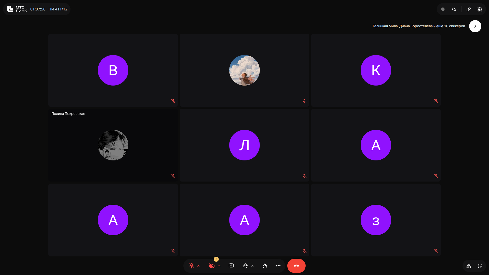
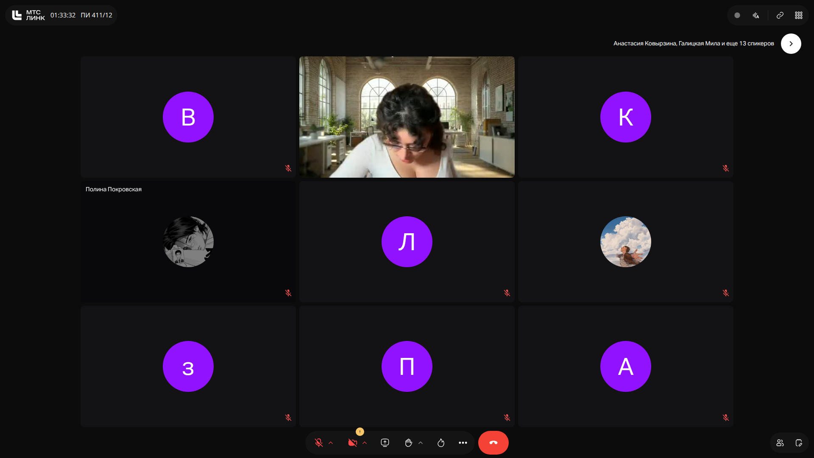

# Программная инженерия: Рекомендательные системы и векторные представления

> **Тема**: Рекомендательные системы и векторные представления  
> **Статус конспекта**: Очищен от оговорок и воды, структурирован AI-ассистентом с сохранением авторских терминов.  
> **AI-модель**: `gemini-3.6-flash`  

## Введение
Лекция посвящена устройству рекомендательных систем (RecSys). Рассматриваются процессы математической оцифровки сущностей в векторном пространстве, применение косинусного расстояния для вычисления близости объектов, особенности проектирования UX/UI для сбора неявного фидбека, а также проблемы холодного старта, метрики эффективности и многоэтапные архитектуры фильтрации.

---

## 1. Векторные пространства сущностей (Users и Items) `[00m31s]`

В основе современных рекомендательных систем лежит концепция переноса информации о пользователях (`Users`) и объектах (`Items`) в единое многомерное векторное пространство.

### Основные элементы концепции:
* **Оцифровка сущностей**: Каждый элемент каталога (товар в e-commerce, видеоролик, трек) и каждый профиль пользователя описываются многомерным вектором признаков (эмбеддингом).
* **Метрика расстояния**: Близость объектов друг к другу или интересам пользователя определяется расстоянием между векторными представлениями. Наиболее популярной метрикой является **косинусное сходство (Cosine Similarity)**.
* **Векторные базы данных**: Позволяют выполнять быстрый поиск ближайших соседей (ANN — Approximate Nearest Neighbors) среди миллионов векторных представлений.

### Слайды и код с экрана:

> [!IMPORTANT]
> **На заметку к зачету / экзамену:**
> - Ключевым инструментом определения близости интересов пользователя и характеристик объекта является косинусное сходство векторов в многомерном пространстве.

---

## 2. Специфика доменов и сбор обратной связи через UX/UI `[03m15s]`

Характер данных и метрики успешности рекомендаций принципиально зависят от предметной области (домена):

* **Короткие видео (TikTok, YouTube Shorts)**: Основные сигналы — глубина просмотра, повторный просмотр (looping), досмотр до конца, шеринг и лайки.
* **E-Commerce / Retail (Ozon, Amazon)**: Основной целевой сигнал — конверсия в добавление в корзину и финальную покупку. Просмотр товара не всегда гарантирует покупку.
* **Музыкальные сервисы**: Учитываются прослушивания целиком, добавление в медиатеку, переключения (skip).

### Проектирование UX для получения фидбека:
Прямые опросы («Что вам нравится?») работают крайне эффективно лишь на этапе онбординга, но быстро начинают раздражать пользователей. Наиболее качественный фидбек собирается **нативно через UI/UX паттерны** (например, свайпы влево/вправо), где каждое действие пользователя неявно формирует его исторический профиль.

### Слайды и код с экрана:

> [!IMPORTANT]
> **На заметку к зачету / экзамену:**
> - Прямые опросы пользователя неэффективны; система должна опираться на неявную обратную связь (implicit feedback), интегрированную в UX приложения.

---

## 3. Проблемы рекомендательных систем и бизнес-метрики `[10m14s]`

Разработка рекомендательных систем сталкивается с рядом фундаментальных инженерных и продуктовых проблем:

1. **Холодный старт (Cold Start)**: Появление нового пользователя или нового товара без истории взаимодействий.
2. **Сезонность и тренды**: Изменение актуальности товаров в зависимости от времени года или внешних инфоповодов (например, спад спроса на летнюю одежду к осени).
3. **Ориентация на бизнес-показатели**: В отличие от медиаконтента, где важен Engagement и Retention, в ритейле главная цель — конверсия в оплату (Revenue / GMV). При этом важно учитывать специфику оплаты на этапе UX (борьба с оттоком/Churn Rate на этапе ввода платёжных данных).
4. **Этические аспекты и фильтрация**: Необходимость избегать формирования изолированных «пузырей фильтрации» (filter bubbles).

### Слайды и код с экрана:

> [!IMPORTANT]
> **На заметку к зачету / экзамену:**
> - На защите лабораторных работ преподаватель обязательно проверяет понимание метрик эффективности RecSys и способов решения проблемы Cold Start.

---

## 4. Многоэтапная (воронкообразная) архитектура ранжирования `[16m00s]`

При миллионных и миллиардных объемах каталога невозможно использовать сложные тяжелые модели машинного обучения для всего массива объектов единовременно из-за жестких ограничений по времени отклика (SLA).

### Этапы каскадной фильтрации:
1. **Отбор кандидатов (Candidate Generation / Retrieval)**: Быстрое грубое отсечение через векторизацию, простой поиск ближайших соседей или эвристики (выборка сотен/тысяч объектов из миллионов).
2. **Детальное ранжирование (Ranking)**: Применение сложных градиентных бустингов или глубоких нейронных сетей для точной оценки релевантности кандидатов с учетом контекста и истории профиля.
3. **Пост-обработка и бизнес-правила (Re-ranking / Diversity)**: Дедупликация, перемешивание категорий, добавление продвигаемых позиций.

> [!IMPORTANT]
> **На заметку к зачету / экзамену:**
> - Для обеспечения высокой скорости работы RecSys применяют каскадную архитектуру: от быстрого грубого отбора кандидатов к высокоточному ранжированию ограниченного списка.

---
