# Компьютерные сети: Операционная система Cisco IOS, консольное подключение и удаленное управление оборудованием

> **Тема**: Операционная система Cisco IOS, консольное подключение и удаленное управление оборудованием  
> **Статус конспекта**: Очищен от оговорок и воды, структурирован AI-ассистентом с сохранением авторских терминов.  
> **AI-модель**: `gemini-flash-latest`  

## Введение
В отличие от потребительского сегмента (SOHO), где управление маршрутизаторами обычно осуществляется через встроенный веб-интерфейс, профессиональное телекоммуникационное оборудование корпоративного класса настраивается преимущественно через интерфейс командной строки (CLI). Это обусловлено колоссальным объемом параметров и команд, визуализация которых в графическом интерфейсе перегрузила бы систему. Первоначальное конфигурирование оборудования «из коробки» (out-of-the-box) всегда производится локально через консольный порт, поскольку сетевые интерфейсы по умолчанию не имеют IP-адресов. Данное занятие посвящено физическим стандартам консольного подключения, правильной конфигурации терминальных клиентов, режимам иерархического интерфейса Cisco IOS, структуре внутренней памяти маршрутизатора и базовой настройке безопасности.

---

## 1. Физические интерфейсы управления: Консольный порт, RS-232 и переходники `[01:40]`

Сетевое оборудование корпоративного класса не комплектуется мониторами, видеокартами или клавиатурами. Большую часть времени оно размещается в серверных стойках, коммуникационных шкафах или специализированных серверных комнатах. Первоначальный доступ к CLI обеспечивается через специализированный **консольный порт**.

### Физические разъемы и кабели
- **Консольный порт (Console Port):** Исторически представляет собой последовательный интерфейс стандарта **RS-232 (EIA/TIA-232)**. В оборудовании Cisco консольный порт традиционно маркируется **голубым цветом** (в отличие от портов данных FastEthernet/GigabitEthernet, маркируемых желтым цветом).
- **Проблема унификации разъемов:** Внешне классический консольный порт Cisco выполнен в виде розетки 8P8C (RJ-45) — точно такой же, как сетевые порты Ethernet. Однако логически и электрически сигналы кардинально отличаются (уровни напряжений, кодирование, протоколы). Подключение стандартного сетевого патч-корда локальной сети напрямую в консольный порт может привести к выходу порта из строя.
- **Rollover-кабель («голубой шнур»):** Классический консольный кабель Cisco имеет разъем RJ-45 с одной стороны и гнездо DB-9 (9-pin D-sub) с другой. Внутри проводники разведены зеркально («перевернуты», rollover).
- **Переходники USB-to-RS232:** В современных ПК и ноутбуках разъемы COM-порта (DB-9) практически исчезли. Для подключения консольного кабеля применяется активный переходник **USB-RS232**, содержащий контроллер-преобразователь интерфейсов (FTDI, Prolific, CH340). При его подключении операционная система создает виртуальный последовательный порт (`COMx` в Windows или `/dev/ttyUSBx` / `/dev/ttySx` в Linux).
- **Современный Mini-USB / USB Type-B консольный порт:** Современные линейки маршрутизаторов и коммутаторов (например, Cisco Catalyst 2960-S) содержат спаренный консольный блок: традиционный RJ-45 и порт Mini-USB (также выделенный голубой рамкой). При одновременном подключении обоих портов аппаратный приоритет отдается USB-подключению.

### Слайды и код с экрана:
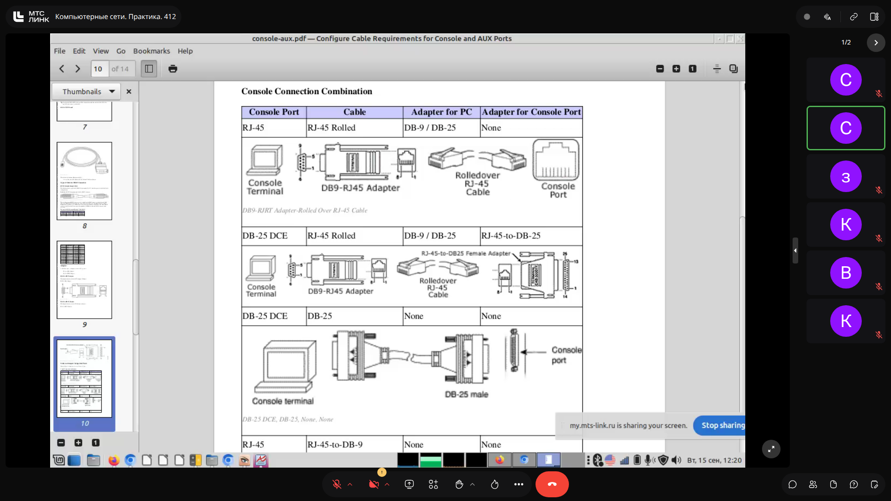
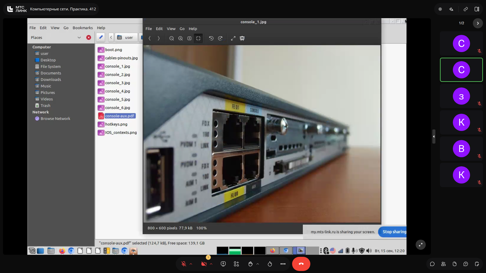
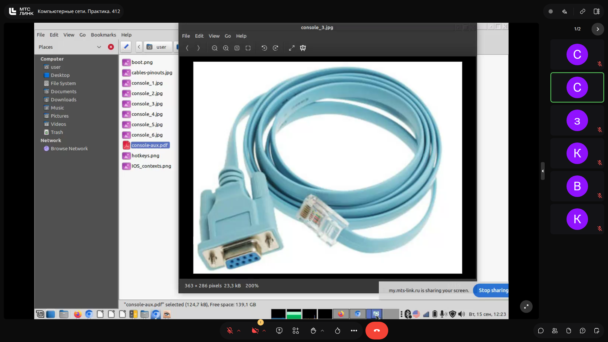
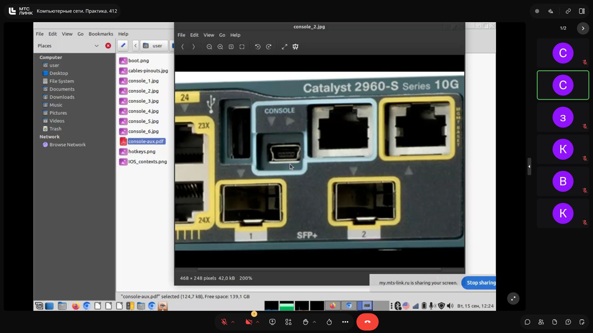
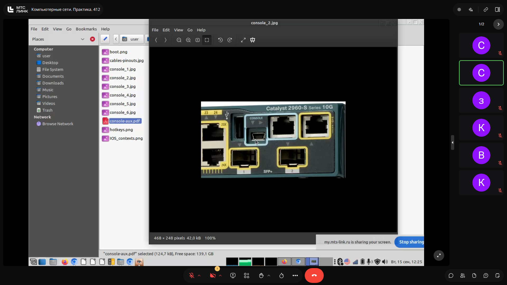
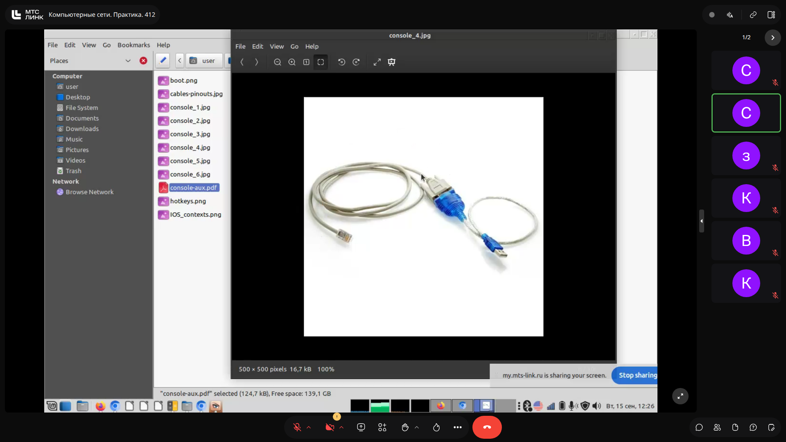
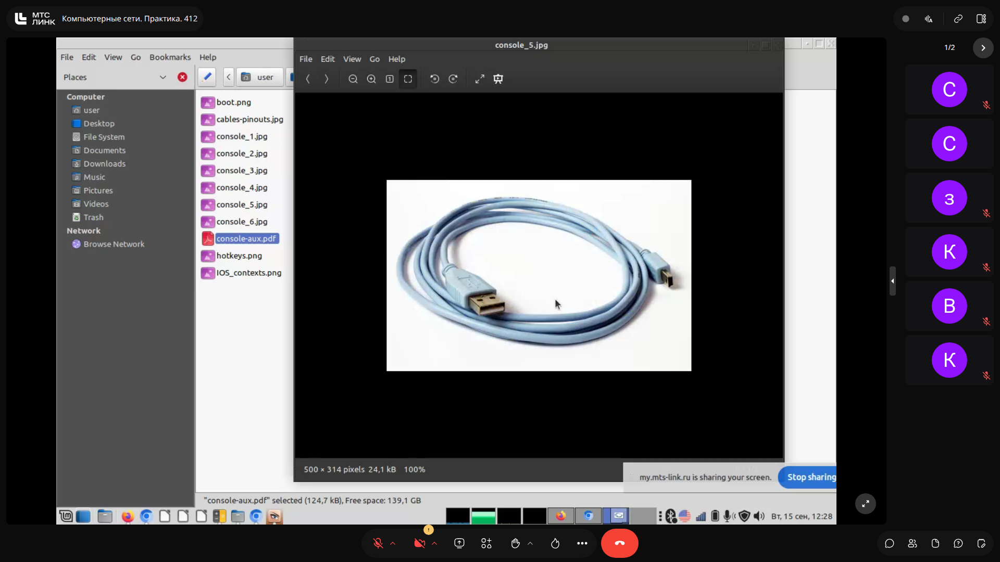
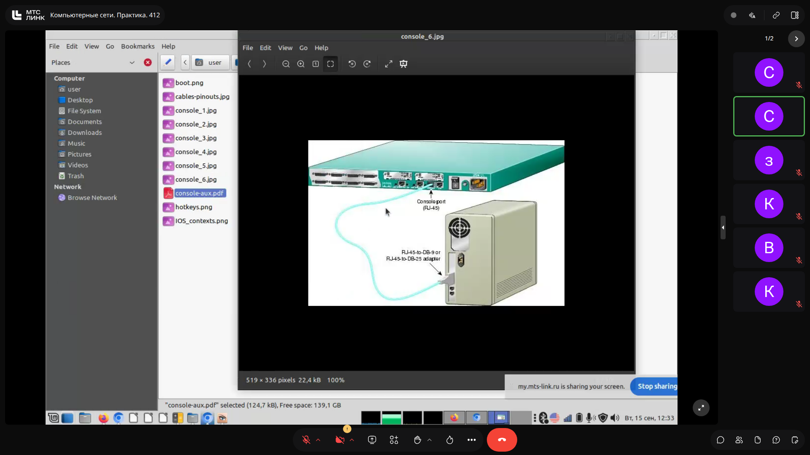

> [!IMPORTANT]
> **На заметку к зачету / экзамену:**
> - Порты консоли у Cisco маркируются голубым цветом, порты данных (FastEthernet) — желтым.
> - Нельзя путать Ethernet и консольный RJ-45: уровни сигналов и протоколы несовместимы, есть риск сжечь порт.
> - При одновременном подключении RJ-45 консоли и Mini-USB консоли приоритет имеет USB.

---

## 2. Настройка эмулятора терминала (PuTTY) и параметры Serial-соединения `[17:50]`

Для взаимодействия с последовательным портом на компьютере администратора запускается программа-эмулятор терминала (например, **PuTTY**, Tera Term или Minicom).

### Параметры последовательного порта (Serial Connection)
Для корректного отображения консоли параметры терминального клиента обязаны строго соответствовать аппаратным настройкам устройства Cisco:

| Параметр | Значение по умолчанию | Описание |
| :--- | :--- | :--- |
| **Speed (baud rate)** | **9600** | Скорость передачи данных в бодах (символов/бит в единицу времени) |
| **Data bits** | **8** | Количество информационных бит в кадре |
| **Stop bits** | **1** | Количество стоповых бит |
| **Parity** | **None** | Контроль четности отсутствует |
| **Flow control** | **None** | Управление потоком (важно выключить для Cisco!) |

> **Важное замечание лектора:** По умолчанию в PuTTY управление потоком (Flow control) может быть установлено в `XON/XOFF` или `RTS/CTS`. В оборудовании Cisco аппаратное/программное управление потоком на консоли отключено (`None`). Если не переключить этот параметр в `None`, консоль может не реагировать на нажатия клавиш или отображать искаженные символы.

### Слайды и код с экрана:
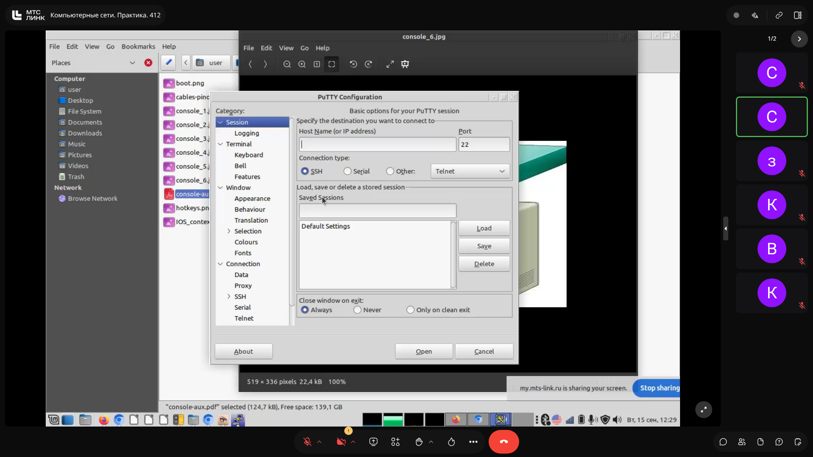
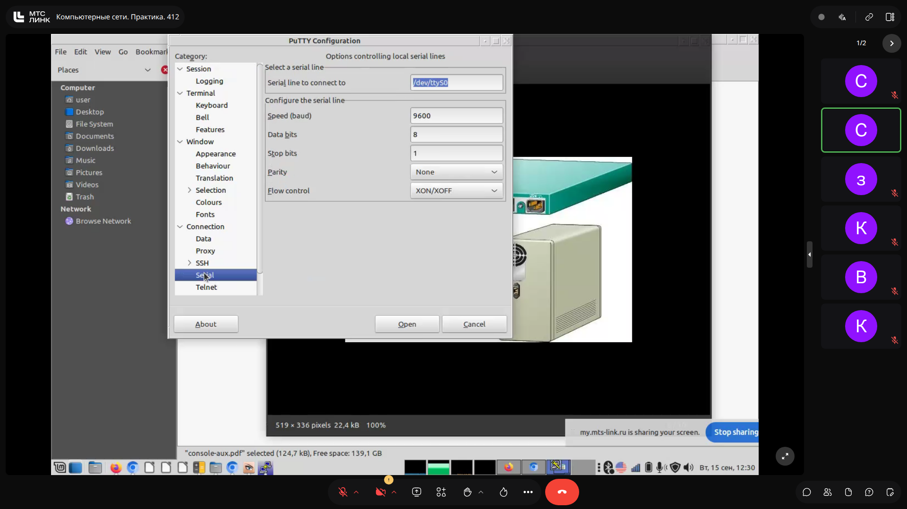
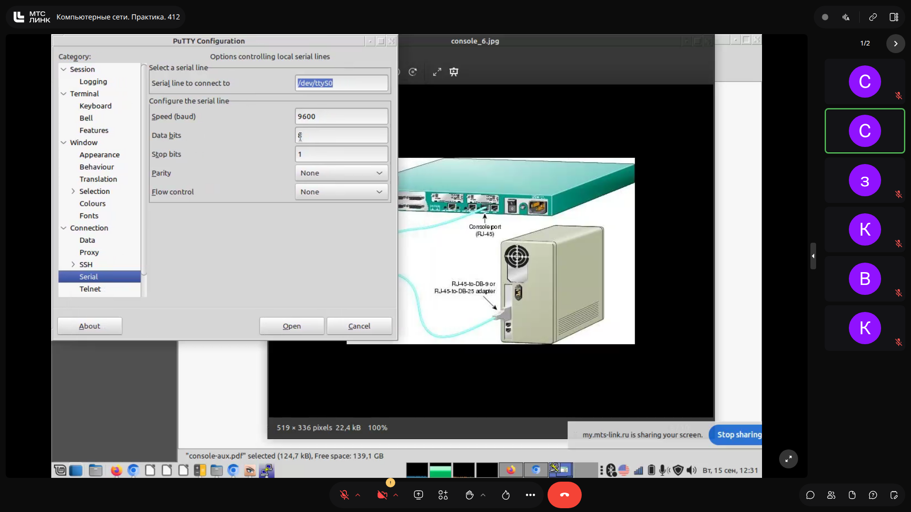

> [!IMPORTANT]
> **На заметку к зачету / экзамену:**
> - Стандартные параметры консоли Cisco: 9600-8-N-1, Flow Control: None.
> - Несовпадение бодовой скорости приводит к выводу нечитаемого «мусора» на экран.

---

## 3. Иерархия режимов командной строки Cisco IOS и горячие клавиши `[23:00]`

Командная строка Cisco IOS структурирована в виде строгой древовидной иерархии контекстов (режимов). Текущий режим всегда идентифицируется видом приглашения (prompt):

```
+-------------------------------------------------------------+
|                 Пользовательский контекст                   |
|                        router>                              |
+-------------------------------------------------------------+
                               | enable
                               v
+-------------------------------------------------------------+
|                 Контекст администратора                     |
|                        router#                              |
+-------------------------------------------------------------+
                               | configure terminal
                               v
+-------------------------------------------------------------+
|             Глобальный контекст конфигурирования            |
|                     router(config)#                         |
+-------------------------------------------------------------+
          /                    |                    \
 interface ...            router ...             line ...
        v                      v                     v
 Контекст интерфейса   Контекст маршрутизации   Контекст линий
router(config-if)#    router(config-router)#  router(config-line)#
```

1. **Пользовательский режим (User EXEC Mode):**
   - Приглашение: `Router>`
   - Ограниченный набор команд просмотра базовой информации. Не позволяет менять конфигурацию.
2. **Привилегированный режим (Privileged EXEC Mode / Enable Mode):**
   - Переход: команда `enable` (может запрашивать пароль).
   - Приглашение: `Router#`
   - Доступны мощные диагностические команды (`show running-config`, `debug`, перезагрузка `reload`, управление файлами конфигурации).
   - Возврат: `disable` или `exit`.
3. **Режим глобальной конфигурации (Global Configuration Mode):**
   - Переход: из привилегированного режима командой `configure terminal` (сокращенно `conf t`).
   - Приглашение: `Router(config)#`
   - Настройки, влияющие на устройство целиком: имя хоста (`hostname`), баннеры, списки доступа (ACL), глобальные параметры IP.
4. **Специализированные подрежимы конфигурации (Specific Configuration Modes):**
   - `interface <имя_порта>` -> `Router(config-if)#` (настройка IP-адреса, маски, включение порта `no shutdown`).
   - `line console 0` -> `Router(config-line)#` (настройка физической консоли).
   - `line vty 0 4` -> `Router(config-line)#` (настройка виртуальных терминальных линий для Telnet/SSH).
   - Выход на один уровень вверх: `exit`. Полный выход в привилегированный режим: `end` или комбинация клавиш `Ctrl+Z`.

### Полезные комбинации клавиш (Hotkeys)
- **Tab:** Автодополнение начатой команды или параметра.
- **Ctrl+A:** Перемещение курсора в начало строки.
- **Ctrl+E:** Перемещение курсора в конец строки.
- **Ctrl+U:** Удаление всей введенной строки.
- **Ctrl+C / Ctrl+Z:** Выход из режима конфигурации в `Router#`.
- **Ctrl+Shift+6 (Ctrl+^):** Прерывание выполнения текущей зависшей команды (например, широковещательного DNS-запроса при ошибочно введенной команде или traceroute/ping).

### Слайды и код с экрана:
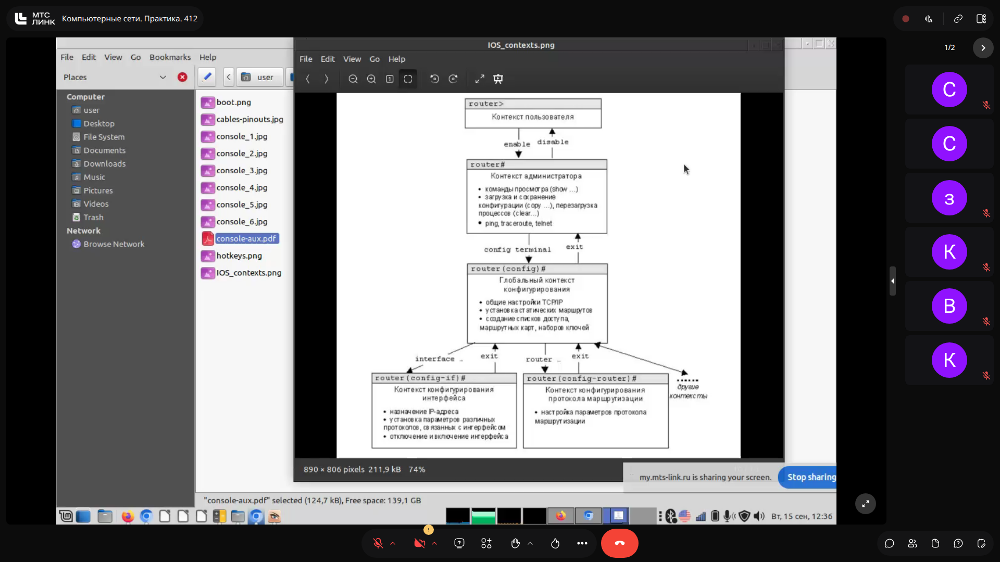
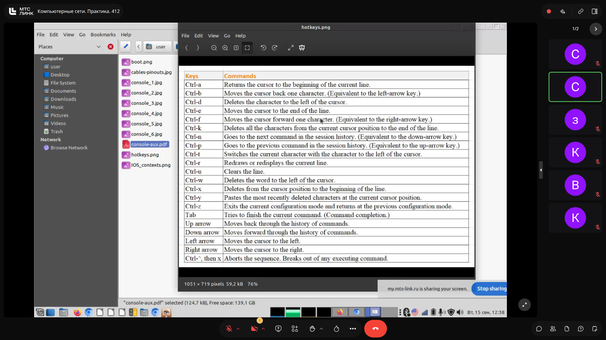
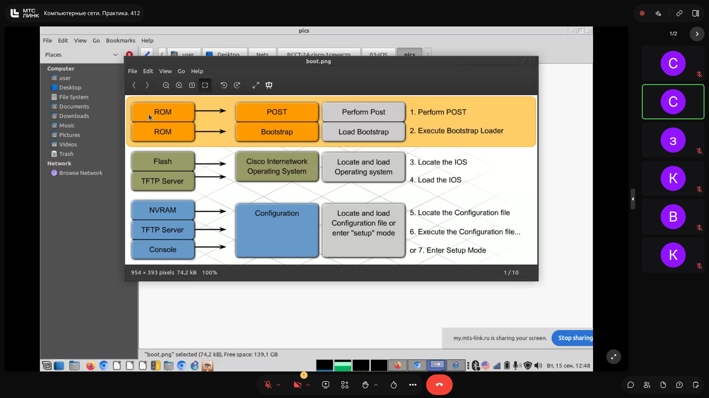

> [!IMPORTANT]
> **На заметку к зачету / экзамену:**
> - Знать точные приглашения: '>' — User, '#' — Privileged, '(config)#' — Global, '(config-if)#' — Interface, '(config-line)#' — Line.
> - Команда 'exit' поднимает на один уровень вверх, 'end' или 'Ctrl+Z' выбрасывает сразу в корневой привилегированный режим.

---

## 4. Категории кабелей витой пары: Прямой (Straight-Through) и Перекрестный (Crossover) `[29:50]`

Стандарты расшивки витой пары регламентируются спецификациями **EIA/TIA T568A** и **EIA/TIA T568B**.

- **T568B порядок проводников:**
  1. Бело-оранжевый
  2. Оранжевый
  3. Бело-зеленый
  4. Синий
  5. Бело-синий
  6. Зеленый
  7. Бело-коричневый
  8. Коричневый
- **T568A:** оранжевая и зеленая пары меняются местами (контакты 1-2 и 3-6).

### Типы кабелей и правила их применения по модели OSI
1. **Прямой кабель (Straight-Through):**
   - Одинаковая расшивка с обоих концов (T568B — T568B или T568A — T568A).
   - Применяется для соединения устройств, работающих на **разных** уровнях модели OSI:
     - Компьютер (L3) <-> Коммутатор (L2)
     - Маршрутизатор (L3) <-> Коммутатор (L2)
2. **Перекрестный кабель (Crossover):**
   - Разная расшивка на концах (T568A с одной стороны, T568B с другой; передающие пары `TX` соединяются с приемными `RX`).
   - Применяется для соединения устройств, работающих на **одном** уровне модели OSI:
     - Коммутатор (L2) <-> Коммутатор (L2)
     - Маршрутизатор (L3) <-> Маршрутизатор (L3)
     - Компьютер (L3) <-> Маршрутизатор (L3) *(Внимание: ПК и маршрутизатор оба являются L3-устройствами!)*
     - Компьютер (L3) <-> Компьютер (L3)

*Примечание:* В современных физических сетевых платах реализована технология **Auto-MDIX**, которая автоматически определяет назначение жил и устраняет необходимость в кроссоверах, однако на экзаменах Cisco знание правил OSI обязательно.

### Слайды и код с экрана:
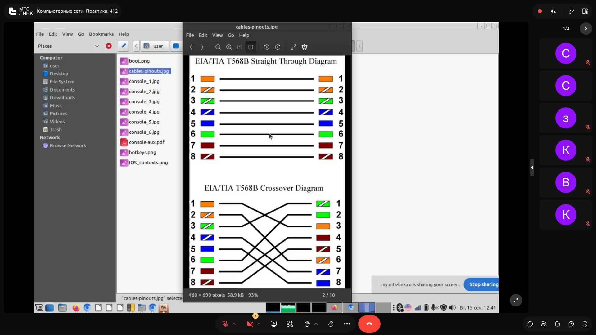

> [!IMPORTANT]
> **На заметку к зачету / экзамену:**
> - ПК и маршрутизатор — устройства одного логического уровня (L3), поэтому исторически соединяются кроссовером (Crossover)!
> - Прямой кабель соединяет L2 с L3 (коммутатор с ПК или коммутатор с маршрутизатором).

---

## 5. Архитектура памяти устройств Cisco и процесс начальной загрузки (Boot Sequence) `[37:05]`

Маршрутизаторы Cisco используют четыре ключевых типа памяти:

1. **ROM (Read-Only Memory / ПЗУ):**
   - Содержит микрокод самотестирования аппаратной части **POST (Power-On Self Test)**.
   - Содержит программу **Bootstrap (первичный загрузчик)**.
   - Хранит аварийную урезанную версию ОС (**ROMmon / RxBoot**).
2. **Flash Memory (Флеш-память):**
   - Энергонезависимая память, хранящая полноценный образ операционной системы **Cisco IOS**.
3. **NVRAM (Non-Volatile RAM):**
   - Энергонезависимая память с автономным питанием от батарейки. Хранит сохраненную стартовую конфигурацию — **startup-config**, а также значение конфигурационного регистра (`config-register`).
4. **RAM (Random Access Memory / ОЗУ):**
   - Энергозависимая оперативная память. В ней исполняется ядро IOS и находится текущая активная рабочая конфигурация — **running-config**, таблицы маршрутизации, ARP-таблицы и буферы пакетов.

### Этапы процесса загрузки
1. При включении питания выполняется микрокод **POST** из ROM (проверка процессора, памяти, шин и сетевых интерфейсов).
2. Выполняется загрузчик **Bootstrap** из ROM.
3. Bootstrap находит и загружает образ операционной системы Cisco IOS (по умолчанию из **Flash**, либо по сети с **TFTP-сервера**).
4. Образ IOS распаковывается и запускается в **RAM**.
5. Операционная система ищет файл конфигурации:
   - Сначала проверяется **NVRAM** на наличие `startup-config`.
   - Если файл найден, он копируется в RAM и становится `running-config`.
   - Если в NVRAM конфигурация отсутствует, маршрутизатор пытается запросить ее по сети через **TFTP**.
   - Если TFTP недоступен, маршрутизатор переходит в режим мастера начальной настройки (**System Configuration Dialog / Setup Mode**).

### Слайды и код с экрана:
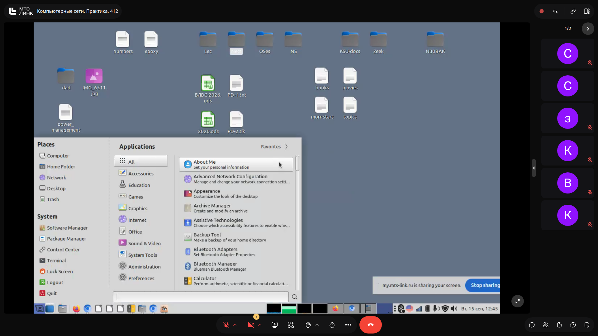
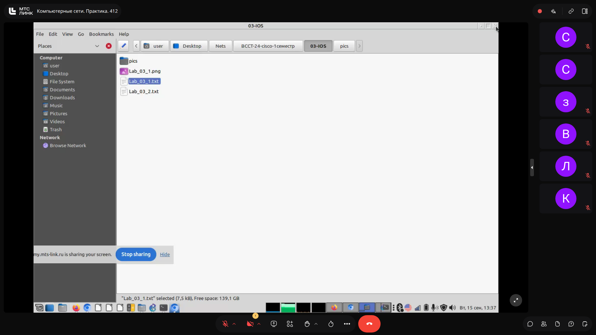

> [!IMPORTANT]
> **На заметку к зачету / экзамену:**
> - Разница между running-config (в RAM, теряется при перезагрузке) и startup-config (в NVRAM, сохраняется).
> - Команда сохранения: 'copy running-config startup-config' или устаревшая, но используемая 'write memory' ('wr').
> - Если конфига нет ни в NVRAM, ни на TFTP — запускается интерактивный 'Setup Mode'.

---

## 6. Лабораторная работа №3: Защита консоли, настройка Telnet и перехват трафика `[40:00]`

В рамках практической части студенты выполняют развертывание схемы в **GNS3**:
- Маршрутизаторы `R1`, `R2`, `R3` (образы Cisco 2691 / c7200 / c3745) и коммутатор `ESW1` (EtherSwitch Router c 16 портами `FastEthernet1/0` – `FastEthernet1/15`).

### Типовые ошибки и правила конфигурирования аутентификации
Во время практики возникла распространенная ошибка: после выхода из консоли пароль не запрашивался.
Преподаватель разобрал причину в конфигурации:
```cisco
! ОШИБКА: команда login без предварительно заданного пароля
Router(config)# line console 0
Router(config-line)# login
% Login disabled on line 0, until 'password' is set

! ПРАВИЛЬНЫЙ ПОРЯДОК:
Router(config)# line console 0
Router(config-line)# password console
Router(config-line)# login
```
- Команда `login` активирует проверку пароля на порту, но IOS блокирует вход, если пароль еще не задан. Сначала задается пароль, затем вводится `login`.

### Настройка удаленного доступа по Telnet
```cisco
Router(config)# line vty 0 4
Router(config-line)# password telnet
Router(config-line)# login
```

### Пароль администратора: enable password vs enable secret
- `enable password <пароль>` — сохраняется в конфигурационном файле открытым текстом (plaintext). Опасен при просмотре `show running-config`.
- `enable secret <пароль>` — хешируется с использованием криптографического алгоритма (MD5). Имеет абсолютный приоритет над `enable password`.
- Для защиты паролей, заданных открытым текстом, используется глобальная команда:
```cisco
Router(config)# service password-encryption
```
Она шифрует все открытые пароли в файле конфигурации обратимым алгоритмом типа Cisco Type 7.

### Анализ безопасности протокола Telnet в Wireshark
Студенты настраивают перехват пакетов в GNS3 (ПКМ по линку -> `Start capture` -> запуск **Wireshark**). При подключении с одного маршрутизатора на другой по протоколу Telnet (`telnet 192.168.0.1`) в дампе сетевых пакетов четко видны передаваемые логины, команды и пароли в открытом виде (символ за символом). Это наглядно доказывает небезопасность протокола Telnet и необходимость перехода на протокол **SSH**.

### Слайды и код с экрана:
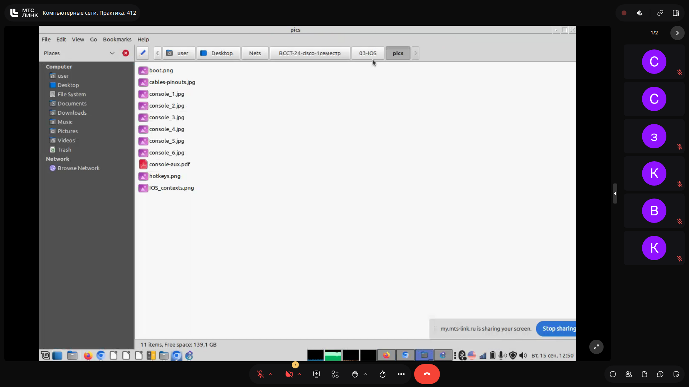
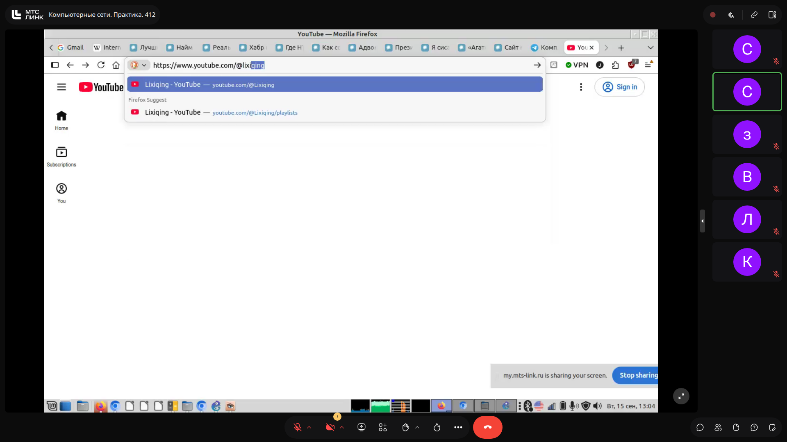
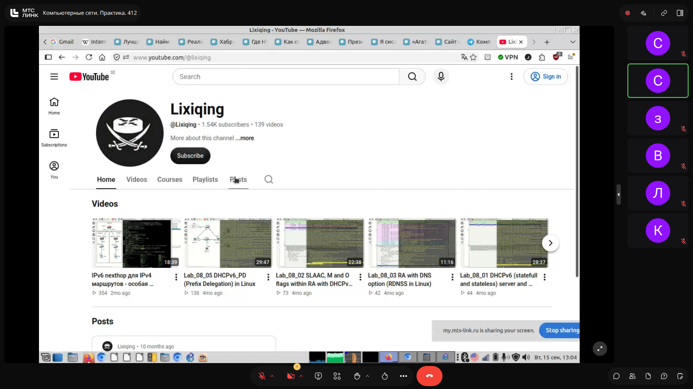
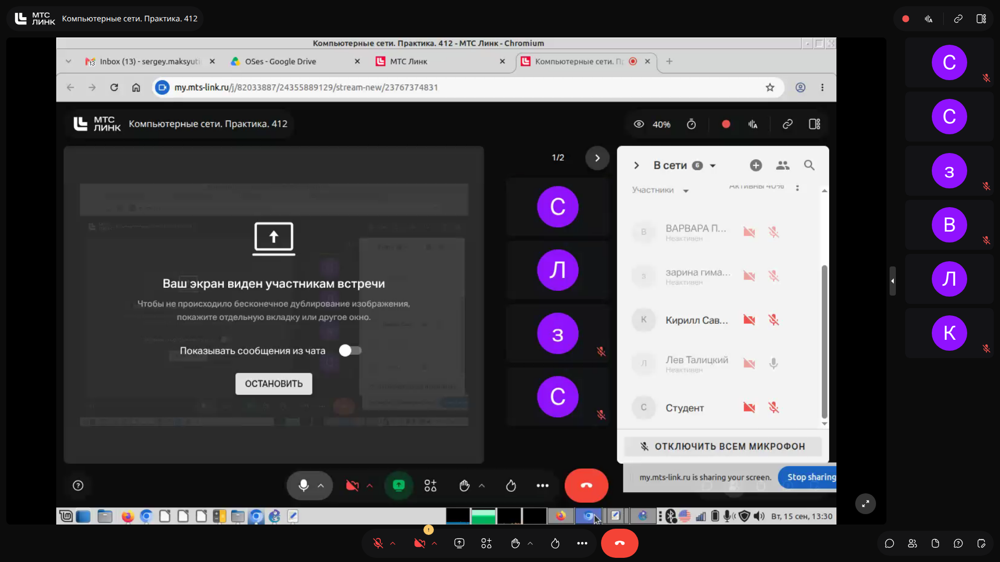
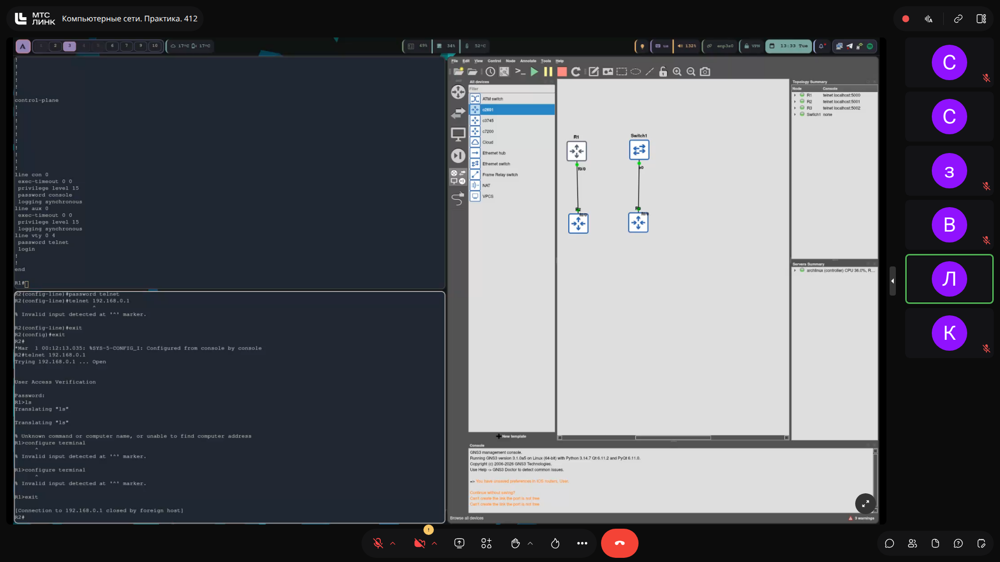
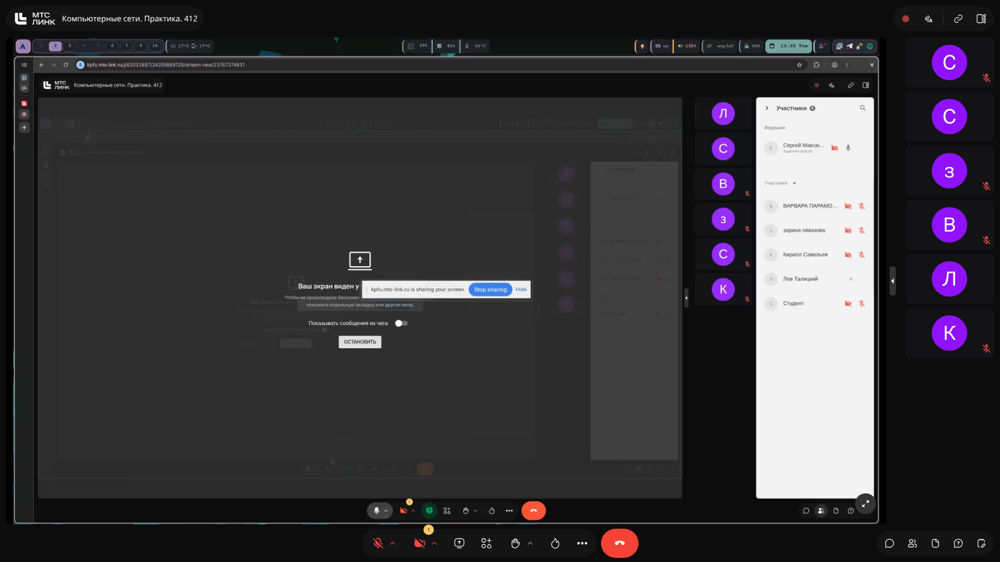
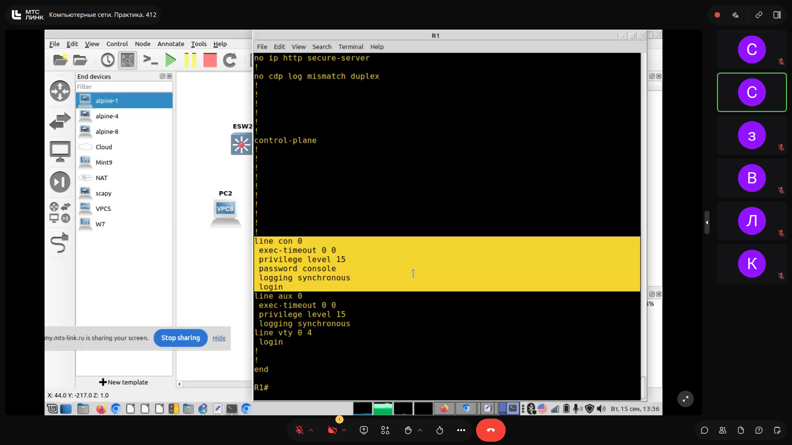
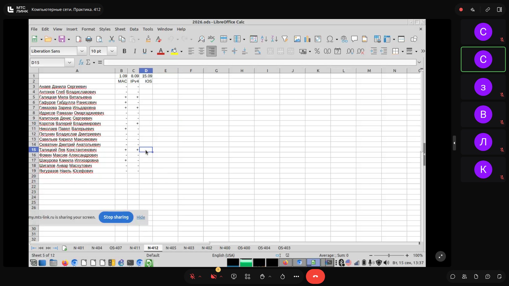

> [!IMPORTANT]
> **На заметку к зачету / экзамену:**
> - Разница: 'enable password' хранит пароль открытым текстом, 'enable secret' хеширует его.
> - Команда 'service password-encryption' защищает от подглядывания в консоль (Type 7), но не защищает от профессионального взлома.
> - Удаленный доступ через Telnet передает учетные данные открытым текстом без шифрования.

---
