# Компьютерные сети: Протокол ARP, его вариации и безопасность. Архитектура и типы адресов IPv6

> **Тема**: Протокол ARP, его вариации и безопасность. Архитектура и типы адресов IPv6  
> **Статус конспекта**: Очищен от оговорок и воды, структурирован AI-ассистентом с сохранением авторских терминов.  
> **AI-модель**: `gemini-flash-latest`  

## Введение
В рамках занятия детально рассмотрены два фундаментальных вопроса сетевого взаимодействия: механизм сопоставления логических IP-адресов с физическими MAC-адресами канального уровня при помощи протокола ARP (включая служебные расширения и векторы атак), а также концептуальные основы перехода на стек IPv6, правила записи 128-битных адресов, их классификация и иерархия распределения адресного пространства в глобальной сети.

---

## Назначение и инкапсуляция протокола ARP `[01:40]`

Протокол **ARP** (*Address Resolution Protocol*) предназначен для определения MAC-адреса узла-получателя по его известному IP-адресу в пределах одного широковещательного домена.

### Место в стеке протоколов и модели OSI
При формировании сетевого пакета (например, HTTP-запроса поверх TCP/IP) прикладной, транспортный и сетевой уровни заполняются автоматически или полуавтоматически: сокет связывается с IP-адресом и портом назначения. Однако для спуска данных на канальный уровень (*L2*) и формирования Ethernet- или Wi-Fi-кадра требуется знать MAC-адрес получателя или шлюза по умолчанию.

В академической литературе ведутся дискуссии о принадлежности ARP: некоторые источники относят его к канальному уровню, поскольку кадр ARP инкапсулируется непосредственно в поле полезной нагрузки Ethernet-кадра (EtherType `0x0806`), минуя IP-заголовок. Однако лектор классифицирует ARP как **протокол сетевого уровня (Layer 3)**, так как он оперирует идентификаторами сетевого уровня (IP-адресами).

```text
+-------------------------------------------------------------+
| Ethernet II Header (Dst MAC, Src MAC, Type: 0x0806)         |
+-------------------------------------------------------------+
| ARP Payload (Hardware Type, Protocol Type, Addresses...)     |
+-------------------------------------------------------------+
```

### Слайды и код с экрана:

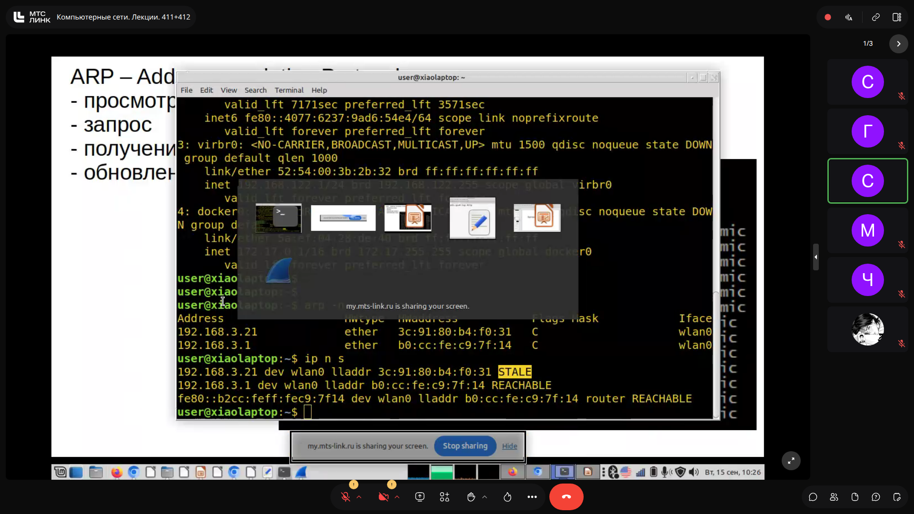

> [!IMPORTANT]
> **На заметку к зачету / экзамену:**
> - На зачете лектор однозначно требует классифицировать ARP как протокол сетевого уровня (L3).

---

## Формат кадра и логика работы ARP-кэша `[04:10]`

### Структура полей ARP-пакета
Пакет ARP универсален и может связывать различные канальные и сетевые технологии:
- **Hardware Type (2 байта)**: тип канального протокола (`0x0001` для Ethernet).
- **Protocol Type (2 байта)**: тип сетевого протокола (`0x0800` для IPv4).
- **Hardware Address Length (1 байт)**: длина физического адреса (6 байт для MAC).
- **Protocol Address Length (1 байт)**: длина сетевого адреса (4 байта для IPv4).
- **Opcode (2 байта)**: код операции (`1` — Request/запрос, `2` — Reply/ответ).
- **Sender MAC (6 байт)** и **Sender IP (4 байта)**: адреса отправителя.
- **Target MAC (6 байт)** и **Target IP (4 байта)**: адреса цели.

В ARP-запросе поле `Target MAC` не заполнено: в Windows, Linux и Cisco оно забивается нулями (`00:00:00:00:00:00`), тогда как прошивки Huawei в запросном кадре могут выставлять все единицы (`ff:ff:ff:ff:ff:ff`).

### Жизненный цикл ARP-кэша
Для минимизации широковещательного трафика результаты работы протокола кэшируются узлами:
1. Перед отправкой кадра узел проверяет локальный ARP-кэш.
2. При промахе формируется широковещательный ARP-запрос (`Dst MAC: ff:ff:ff:ff:ff:ff`), на который узел-владелец IP отвечает адресным (Unicast) ARP-ответом.
3. Записи имеют время жизни (*TTL*):
   - **Конечные ОС (хосты)**: Windows держит запись от 15 до 45 секунд, Linux — около 60 секунд. По истечении таймера запись переходит в состояние `STALE` и перед удалением проверяется unicast-запросом.
   - **Маршрутизаторы**: Cisco хранит ARP-записи по умолчанию 4 часа (14400 с), Huawei — 20 минут (1200 с).

Команды просмотра кэша в Linux:
```bash
arp -n
ip neighbour show  # (или сокращенно: ip n s)
```

### Слайды и код с экрана:


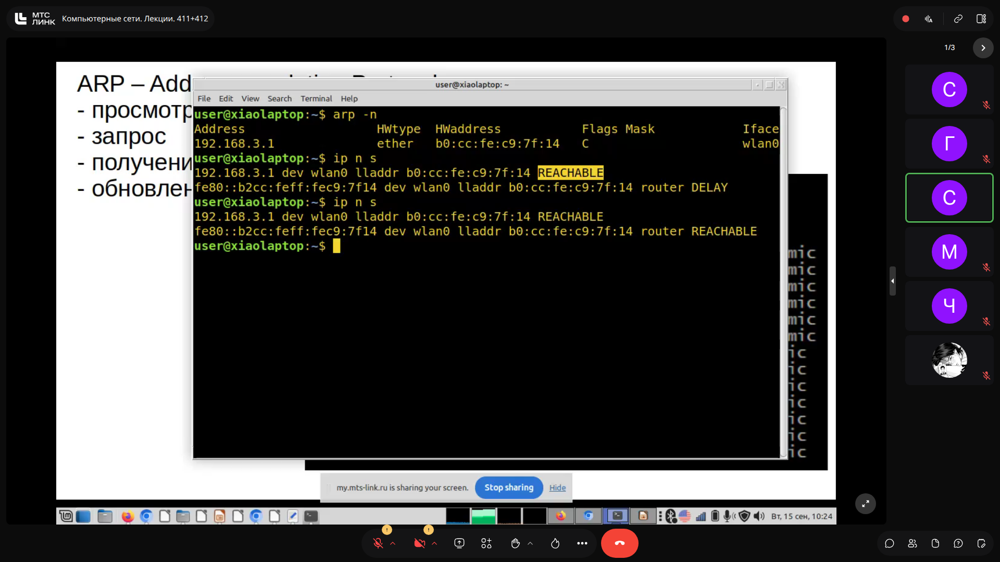
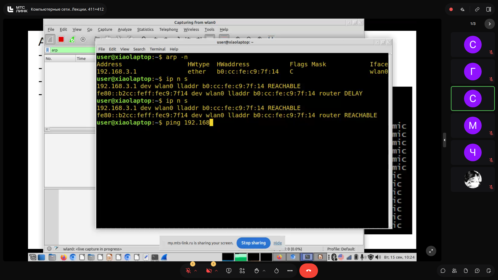
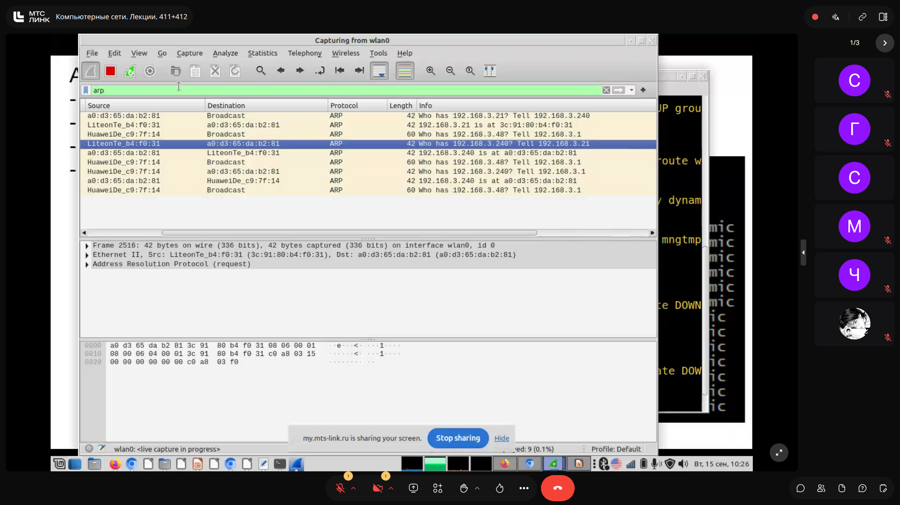


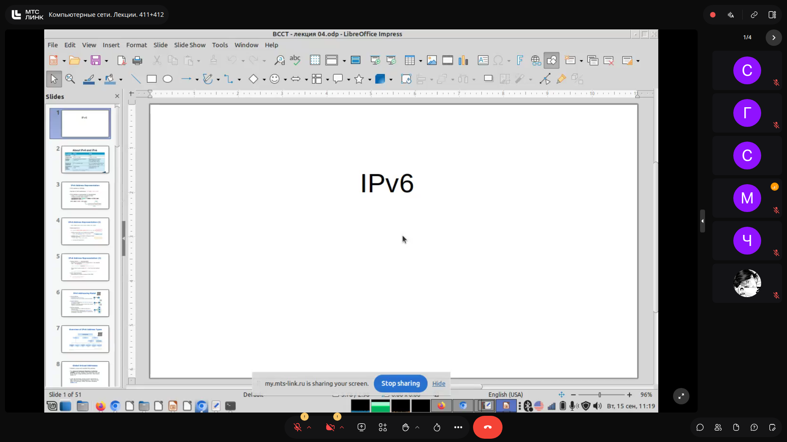

> [!IMPORTANT]
> **На заметку к зачету / экзамену:**
> - Разница времени жизни ARP-записей между хостами (десятки секунд) и маршрутизаторами (часы) составляет 2-3 порядка величины.

---

## Служебные модификации: ARP Probe, Gratuitous ARP, UnARP и SLARP `[24:00]`

### ARP Probe и Duplicate Address Detection (DAD)
Используется для проверки уникальности IP-адреса перед его назначением интерфейсу (как при статической настройке, так и при получении от DHCP/APIPA):
- **Sender IP**: устанавливается в `0.0.0.0` (так как хост еще не закрепил адрес за собой).
- **Target MAC**: обнулен (`00:00:00:00:00:00`).
- **Target IP**: проверяемый IP-адрес.
Если на зонд приходит ответ — в сети обнаружен конфликт адресов, и адрес блокируется.

### Gratuitous ARP (беспричинный ARP)
Широковещательный запрос хоста, объявляющий свой собственный адрес (`Sender IP == Target IP`, `Target MAC == 00:00:00:00:00:00`):
- Информирует соседей по сегменту о смене MAC-адреса или новом подключенном IP.
- Позволяет всем узлам превентивно обновить ARP-кэш без генерации лишних запросов.

### UnARP и устаревшие протоколы
- **UnARP (RFC 1868)**: механизм динамического сброса ARP-записей при отключении внешних клиентов (модемные пулы, VPN) с целью предотвращения утечки трафика на отключившийся узел.
- **SLARP (Serial Line ARP)**: проприетарный протокол Cisco для согласования IP-адресов на двухточечных последовательных интерфейсах (HDLC/PPP).
- **InARP (Inverse ARP)**: обратный ARP для сетей Frame Relay и ATM (сопоставление DLCI/VPI/VCI с IP).

### Слайды и код с экрана:

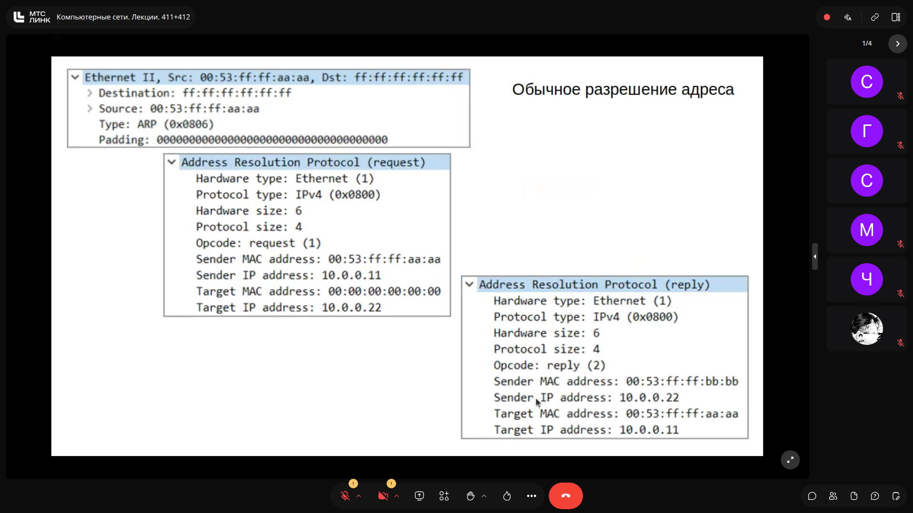


> [!IMPORTANT]
> **На заметку к зачету / экзамену:**
> - В ARP Probe поле Sender IP обязательно равно 0.0.0.0, чтобы не отравить кэш соседей до подтверждения уникальности адреса.

---

## Proxy ARP: назначение, механизм и недостатки `[33:30]`

### Принцип функционирования
**Proxy ARP** позволяет маршрутизатору отвечать собственным MAC-адресом на ARP-запросы к IP-адресам, расположенным в других физических сегментах или подсетях, если маршрутизатор имеет к ним маршрут.

Применяется в случаях, когда:
1. Хосты в сегменте не имеют настроенного шлюза по умолчанию (*Default Gateway*).
2. На хосте задана некорректная маска сети (например, хост считает сеть плоской `/16`, в то время как маршрутизатор разбивает ее на `/24`).
3. Организованы удаленные подключения (Host-to-Site VPN), где хосты должны выглядеть членами локальной сети.

### Недостатки Proxy ARP
- **Увеличение объемов ARP-трафика** в сегменте.
- **Раздувание ARP-таблиц на хостах**: на хосте появляются отдельные записи с MAC-адресом маршрутизатора для каждого внешнего IP-адреса, вместо одной записи шлюза по умолчанию.
- **Уязвимость к атакам подмены (Spoofing)**.
- По умолчанию включен на оборудовании Cisco, но выключен на Huawei. Cisco рекомендует отключать Proxy ARP (`no ip proxy-arp`), если нет явной архитектурной необходимости.

### Слайды и код с экрана:
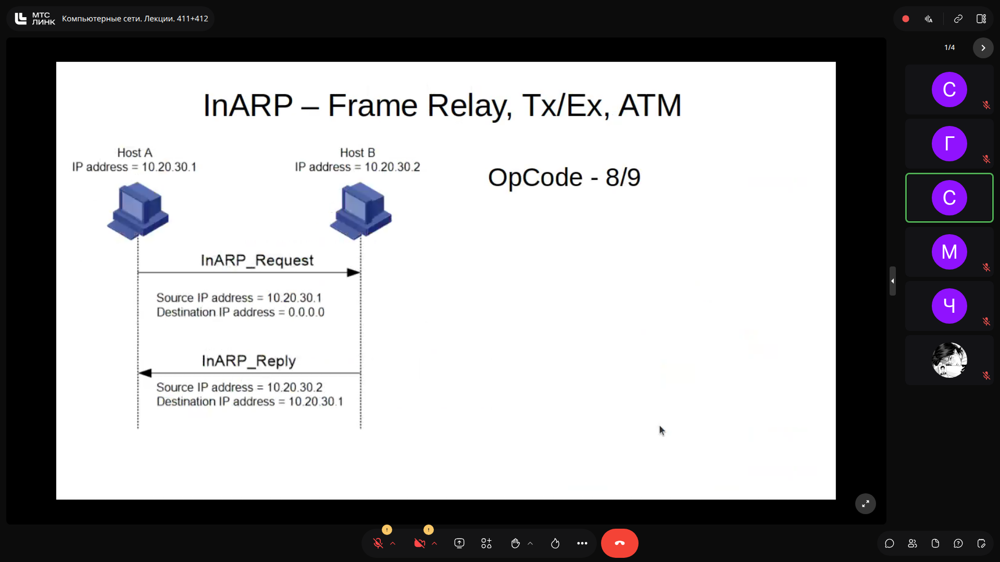

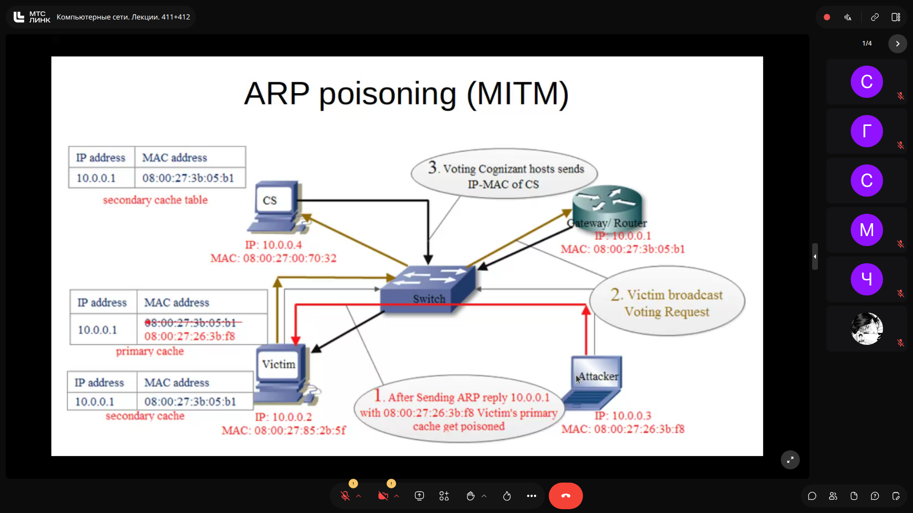

> [!IMPORTANT]
> **На заметку к зачету / экзамену:**
> - Характерный признак работы Proxy ARP в ARP-таблице хоста: множество разных внешних IP-адресов ассоциированы с одним и тем же MAC-адресом интерфейса маршрутизатора.

---

## ARP Poisoning / Spoofing и методы противодействия `[49:30]`

### Механика атаки Man-in-the-Middle (MITM)
Исторически стек TCP/IP доверяет входящим ARP-ответам (принцип: *«видишь ответ — положи в кэш»*). Злоумышленник периодически рассылает поддельные одноадресные или широковещательные ARP-ответы:
- Жертве сообщается, что IP-адрес шлюза ассоциирован с MAC-адресом атакующего.
- Шлюзу сообщается, что IP-адрес жертвы ассоциирован с MAC-адресом атакующего.
В результате коммутатор перенаправляет сквозной трафик через хост атакующего.

### Признаки атаки
- Появление в ARP-кэше записей для IP-адресов **одного и того же локального сегмента** с совпадающим MAC-адресом (в отличие от Proxy ARP, где совпадение MAC характерно для внешних IP-адресов).
- Высокая периодичность незапрошенных ARP-пакетов (каждые 5-10 секунд для перебивания таймеров ОС).

### Методы обнаружения и защиты
1. **Статические ARP-записи**: эффективны только для неизменных серверов и шлюзов, неудобны при динамическом пуле клиентов.
2. **DHCP Snooping + Dynamic ARP Inspection (DAI)**: стандартное корпоративное решение на L2-коммутаторах. Коммутатор слушает DHCP-трафик, строит таблицу привязок (*Port - IP - MAC*), а затем инспектирует ARP-пакеты, отбрасывая фальсифицированные.
3. **Модификация поведения ОС**: отбрасывание ARP-ответов, на которые хост не отправлял запрос (однако это нарушает штатный Gratuitous ARP).
4. **Сегментация сети масками `/30` или `/31`**: локализует домен до 2 хостов, но административно не масштабируется.
5. **Сквозное шифрование (IPsec, TLS)**: делает перехват трафика бесполезным для злоумышленника.

### Слайды и код с экрана:


> [!IMPORTANT]
> **На заметку к зачету / экзамену:**
> - Отличие в ARP-кэше: при ARP Spoofing одинаковый MAC имеют IP-адреса из ОДНОЙ подсети (клиент и шлюз/сервер), а при Proxy ARP — из РАЗНЫХ подсетей.

---

## Адресация IPv6: структура, правила сокращения и типы адресов `[69:30]`

### Структура и формат записи IPv6
- Длина адреса составляет **128 бит** (16 байт), что дает $2^{128} \approx 3.4 \times 10^{38}$ уникальных адресов.
- Адрес делится на 8 шестнадцатибитных блоков — **хекстеты (hextets)**, разделяемых двоеточиями. Внутри каждого хекстета 4 полубайта — **ниббла (nibble)** по 4 бита.
- В IPv6 **полностью отсутствует широковещание (Broadcast)**. Все широковещательные функции заменены на адресные группы **Multicast**.

### Правила сокращения записи адресов (RFC 5952)
1. **Опускание ведущих нулей** в любом хекстете: `0042` $\to$ `42`, `0000` $\to$ `0`.
2. **Замена последовательности нулевых хекстетов на двойное двоеточие (`::`)**:
   - Применяется **строго один раз** во всем адресе (во избежание неоднозначности разбора).
   - Если в адресе несколько групп нулей, двойным двоеточием заменяется **наиболее длинная последовательность**. При равенстве длин заменяется **первая (самая левая)** группа.

### Основные типы адресов IPv6
- **Unspecified Address (`::/128`)**: признак отсутствия адреса (аналог `0.0.0.0` в IPv4).
- **Loopback Address (`::1/128`)**: локальная петля (аналог `127.0.0.1`).
- **Link-Local (`fe80::/10`)**: автоконфигурируемый адрес для связи в пределах одного L2-сегмента (назначается ОС каждому интерфейсу автоматически).
- **Unique Local (`fc00::/7`)**: приватные серые адреса (аналог RFC 1918 в IPv4).
- **Embedded IPv4 (`::/80` или `::ffff:0:0/96`)**: механизм трансляции и совместимости с IPv4.

```text
Пример конвертации IPv4 192.168.0.1 в IPv6 Embedded:
192 = 0xc0, 168 = 0xa8, 0 = 0x00, 1 = 0x01
Полный вид:  0000:0000:0000:0000:0000:ffff:c0a8:0001
Краткий вид: ::ffff:c0a8:1
```

### Слайды и код с экрана:
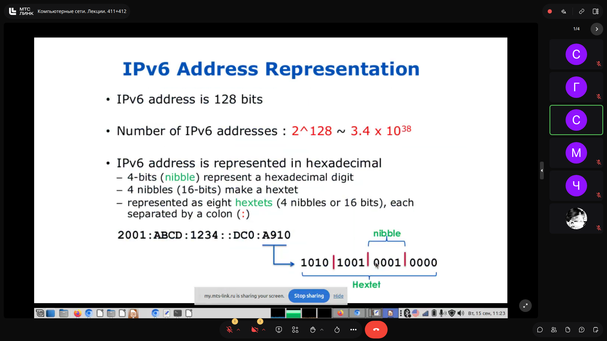
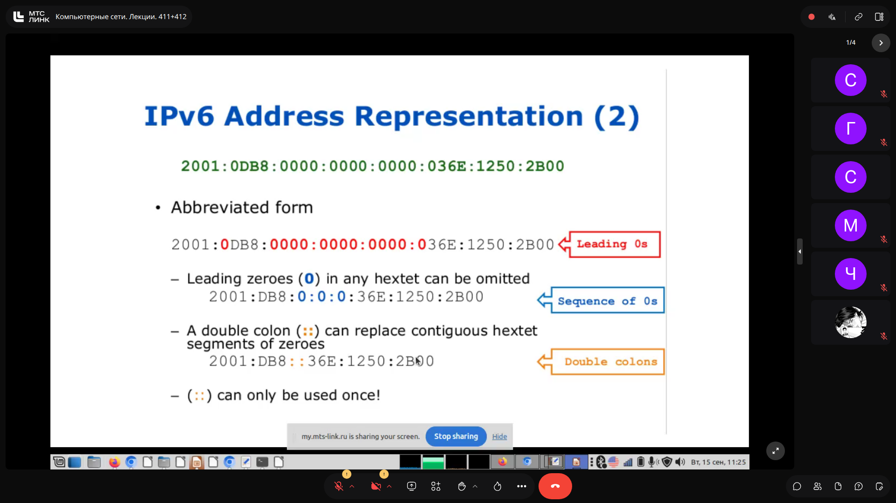


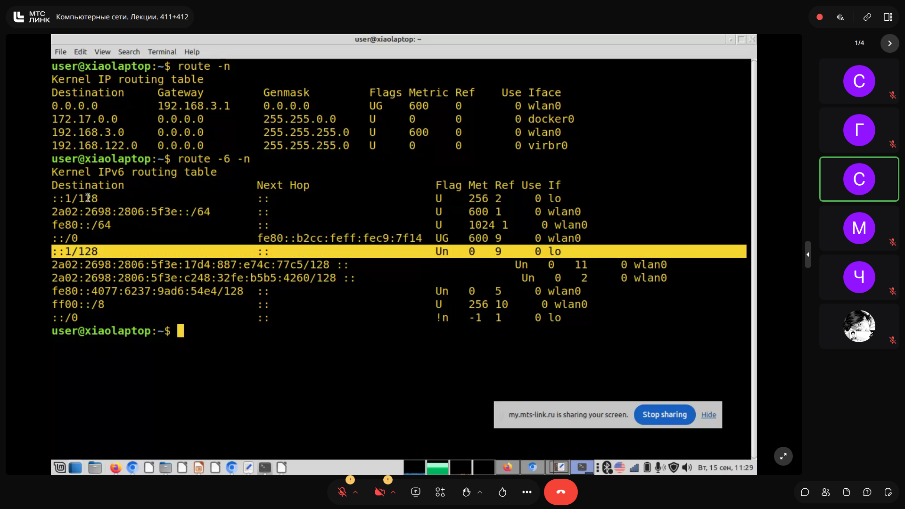
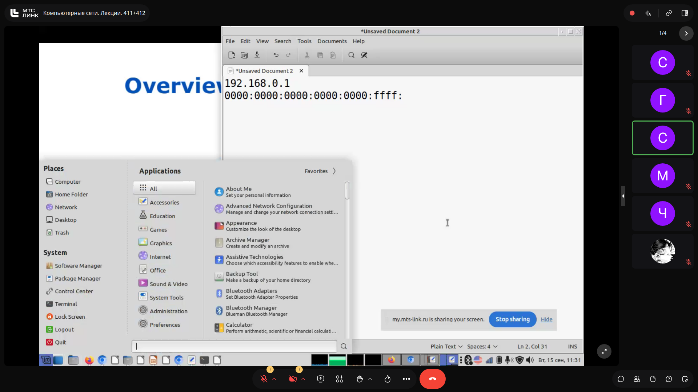
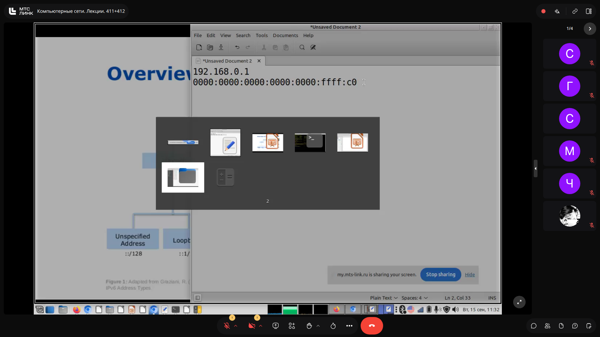
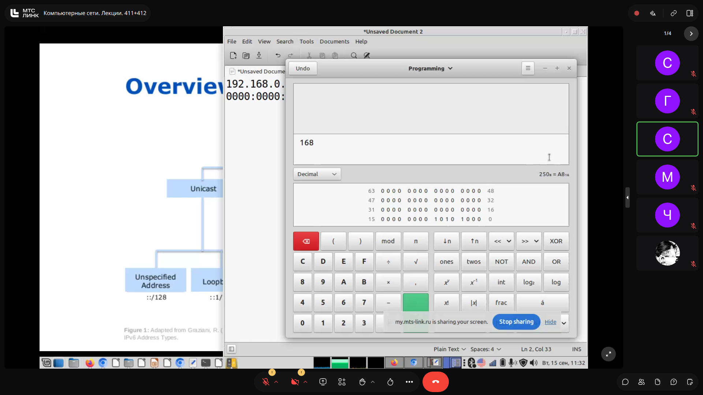
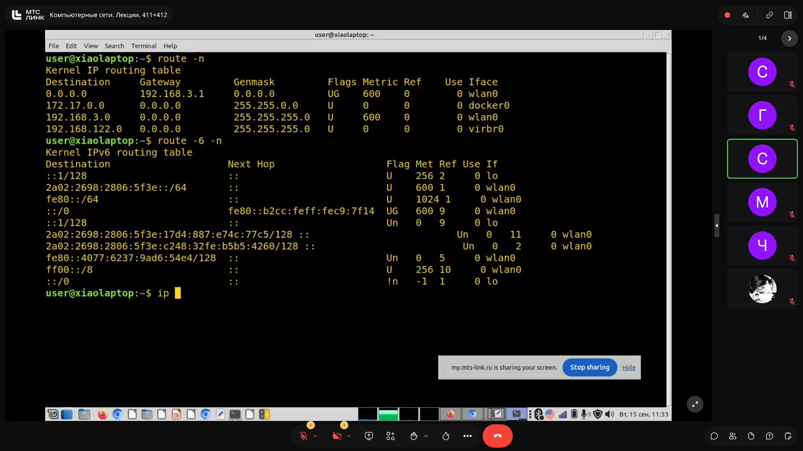
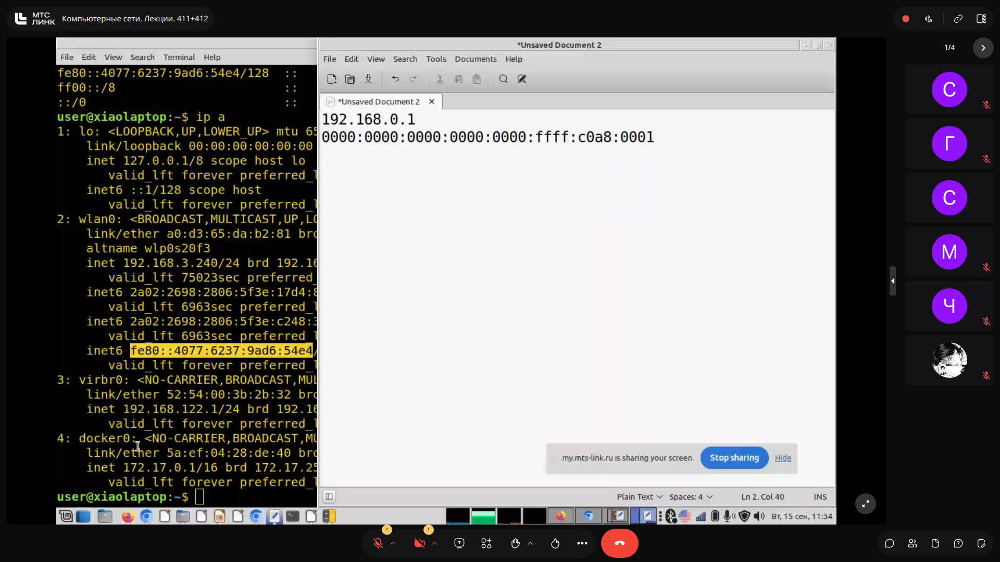
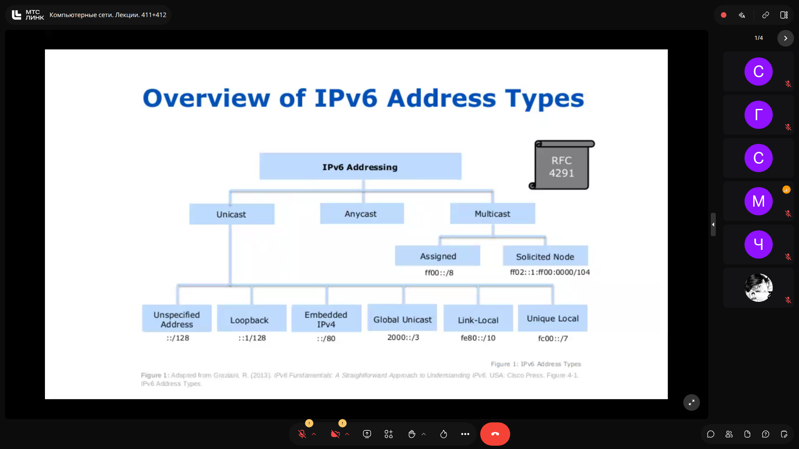

> [!IMPORTANT]
> **На заметку к зачету / экзамену:**
> - В IPv6 нет broadcast! Вместо него используются multicast-группы.
> - Двойное двоеточие :: может использоваться в адресе строго один раз.

---

## Глобальные адреса (Global Unicast) и распределение пулов RIR `[84:45]`

### Диапазон Global Unicast (`2000::/3`)
Публичные маршрутизируемые в Интернете адреса IPv6 выделяются из диапазона, начинающегося с бинарного префикса `001` (маска `/3`). Это означает, что первый шестнадцатеричный символ любого публичного IPv6-адреса может принимать значения исключительно **2** или **3** (диапазон от `2000::` до `3fff:ffff:...`).

### Иерархия RIR (Regional Internet Registry)
Организация IANA выделяет блоки `/12` пяти региональным регистраторам:
- **APNIC** (Азиатско-Тихоокеанский регион): префикс `2400::/12` (а также недавно выделенный дополнительный блок `2410::/12` из-за стремительного развития сетей 5G и умных городов в Китае).
- **ARIN** (Северная Америка: США, Канада): префикс `2600::/12`.
- **AfriNIC** (Африка): префикс `2c00::/12`.
- **LACNIC** (Латинская Америка и страны Карибского бассейна): префикс `2800::/12`.
- **RIPE NCC** (Европа, Россия, Ближний Восток, Центральная Азия): префикс `2a00::/12`.

Именно поэтому публичные IPv6-адреса российских провайдеров начинаются с `2a0...`.

### Слайды и код с экрана:

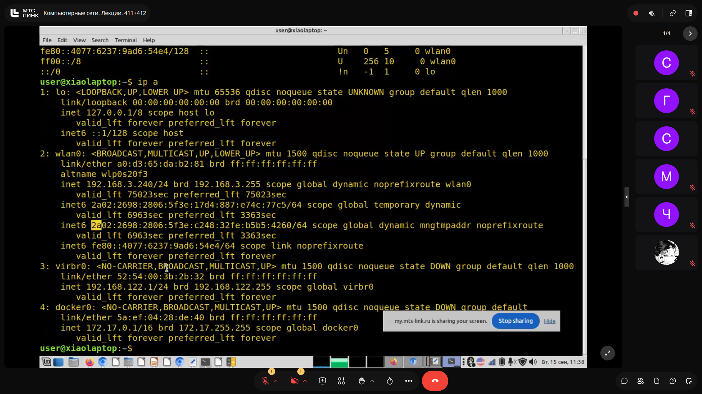
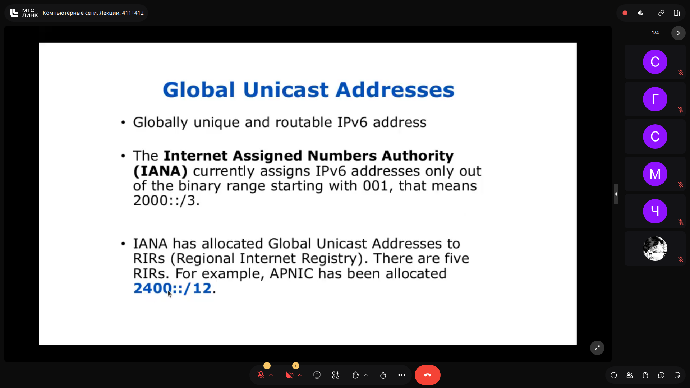
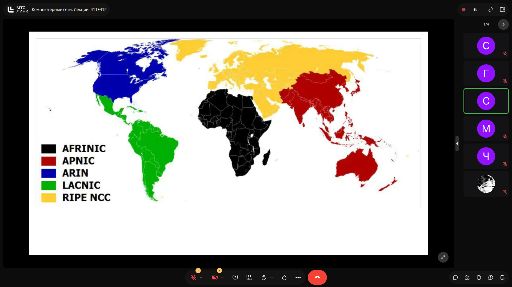
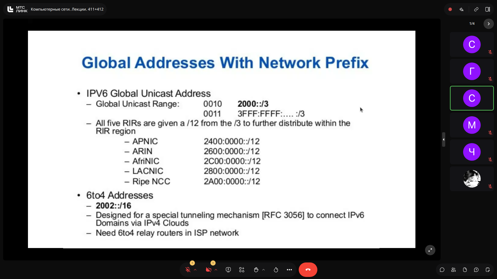

> [!IMPORTANT]
> **На заметку к зачету / экзамену:**
> - Префикс 2000::/3 означает фиксацию первых 3 бит в значение 001, следовательно первая цифра любого Global Unicast адреса — 2 или 3.

---
