# Компьютерные сети: Протокол ARP (структура, разновидности, атаки и защита) и основы адресации IPv6

> **Тема**: Протокол ARP (структура, разновидности, атаки и защита) и основы адресации IPv6  
> **Статус конспекта**: Очищен от оговорок и воды, структурирован AI-ассистентом с сохранением авторских терминов.  
> **AI-модель**: `gemini-flash-latest`  

## Введение
В рамках данной лекции подробно рассматривается механизм трансляции адресов между сетевым и канальным уровнями стека протоколов TCP/IP с помощью протокола ARP (Address Resolution Protocol). Проанализирована структура кадра ARP, логика кэширования в современных ОС, специфика служебных запросов (ARP Probe, Gratuitous ARP), а также технология Proxy ARP. Разобраны уязвимости протокола ARP к атакам типа MITM (ARP Cache Poisoning) и эффективные механизмы предотвращения на уровне коммутации (DHCP Snooping и Dynamic ARP Inspection). Во второй части лекции представлен вводный материал по протоколу IPv6: архитектура 128-битного адресного пространства, синтаксис шестнадцатеричной записи, правила сокращения нулей по RFC 5952, основные типы адресов и принципы их глобального распределения регистраторами RIR.

---

## 1. Протокол ARP: Назначение, инкапсуляция и формат кадра `[01:40]`

Протокол **ARP (Address Resolution Protocol)** предназначен для определения MAC-адреса узла-получателя по его известному IP-адресу в пределах одного широковещательного домена (L2-сегмента).

При создании сокета на прикладном уровне (например, для HTTP) инкапсулируются заголовки уровней L7–L4 (HTTP, TCP), далее L3 (IPv4), где указываются исходный и целевой IP-адреса. Однако для передачи данных по среде Ethernet (или IEEE 802.11 Wi-Fi) сетевой пакет должен быть упакован в канальный кадр (L2), требующий физических MAC-адресов источника и назначения.

### Инкапсуляция в кадр Ethernet II:
- В поле **Type/EtherType** заголовка Ethernet указывается значение `0x0806`, определяющее, что полезной нагрузкой является пакет ARP (в отличие от `0x0800` для обычного IPv4).

### Структура пакета ARP (28 байт):
1. **Hardware Type (2 байта):** тип технологии канального уровня (для Ethernet всегда равен `0x0001`).
2. **Protocol Type (2 байта):** тип протокола сетевого уровня (для IPv4 равен `0x0800`).
3. **Hardware Address Length (1 байт):** длина MAC-адреса (для Ethernet — `6`).
4. **Protocol Address Length (1 байт):** длина адреса сетевого протокола (для IPv4 — `4`).
5. **Operation Code / OpCode (2 байта):** код операции:
   - `1` — ARP Request (запрос);
   - `2` — ARP Reply (ответ).
6. **Sender Hardware Address (Source MAC) (6 байт):** MAC-адрес отправителя пакета.
7. **Sender Protocol Address (Source IP) (4 байта):** IP-адрес отправителя пакета.
8. **Target Hardware Address (Target MAC) (6 байт):**
   - В **ARP Reply** содержит реальный MAC-адрес узла, инициировавшего запрос.
   - В **ARP Request** неизвестен: в реализациях Linux, Windows и Cisco заполняется нулями (`00:00:00:00:00:00`). Оборудование Huawei на L2-уровне кадра использует широковещательный адрес, а в теле запроса в Target MAC подставляет все единицы (`ff:ff:ff:ff:ff:ff`).
9. **Target Protocol Address (Target IP) (4 байта):** целевой IP-адрес, для которого запрашивается MAC-адрес.

### Слайды и код с экрана:


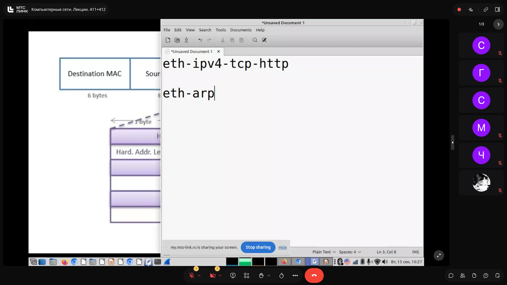


> [!IMPORTANT]
> **На заметку к зачету / экзамену:**
> - На вопрос о принадлежности ARP к уровням модели OSI: преподаватель настаивает на сетевом уровне (Layer 3), аргументируя тем, что протокол оперирует идентификаторами сетевого уровня (IP-адресами), несмотря на инкапсуляцию непосредственно в L2-кадр без IP-заголовка.
> - Коды операций OpCode: запомнить 1 — request, 2 — reply.

---

## 2. Жизненный цикл ARP-кэша и логика разрешения адресов `[04:10]`

Для снижения объемов нежелательного широковещательного трафика результаты работы ARP кэшируются на хостах.

### Алгоритм разрешения:
1. Хост проверяет собственный локальный ARP-кэш.
2. **При отсутствии записи:** отправляется **ARP Request**. На канальном уровне запрос является широковещательным (`FF:FF:FF:FF:FF:FF`). Маршрутизаторы широковещательный трафик не пропускают, поэтому зона распространения ограничена широковещательным доменом (Broadcast Domain).
3. Все узлы домена принимают запрос, сравнивают запрашиваемый IP со своим. Узел-владелец отвечает адресным пакетом — **ARP Reply (Unicast)** на MAC-адрес отправителя.
4. **Обновление кэша (Refresh):**
   - Каждая запись имеет время жизни (TTL).
   - В ОС Windows записи живут от 15 до 45 секунд.
   - В ОС Linux дефолтный тайм-аут составляет порядка 60 секунд. Запись переходит в состояние `STALE` (устаревшая). При попытке отправить данные на такой адрес выполняется проверка актуальности — отправляется **Unicast ARP Request** непосредственно на старый MAC-адрес без использования широковещания. При получении ответа запись снова переходит в статус `REACHABLE`.
   - На маршрутизаторах Cisco тайм-аут по умолчанию составляет 4 часа (14400 с), на Huawei — 20 минут (1200 с).

### Утилиты просмотра:
- В Windows: `arp -a`
- В Linux: `arp -n` либо современный вызов из пакета iproute2: `ip neighbour show` (`ip n s`), отображающий статусы (`REACHABLE`, `STALE`, `DELAY`).

### Слайды и код с экрана:

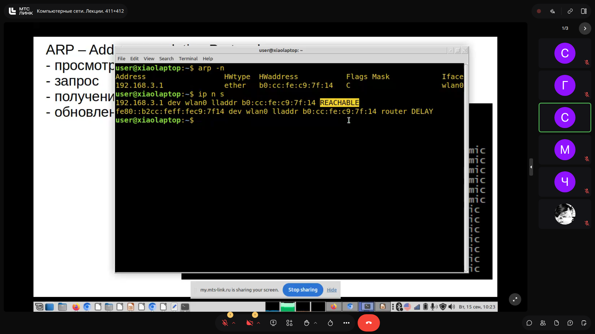

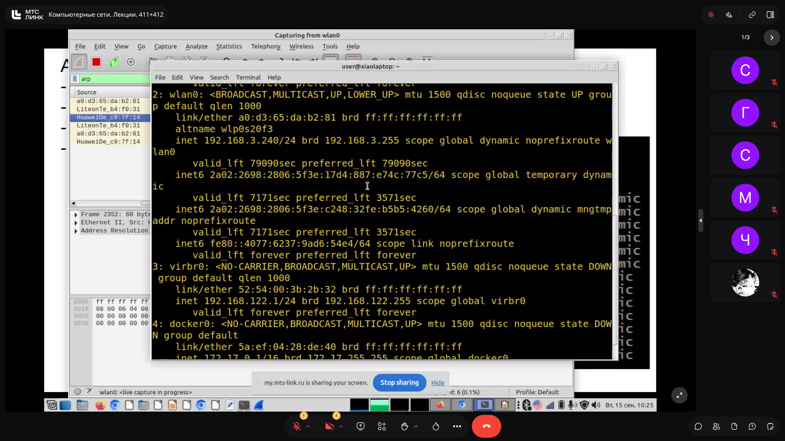


> [!IMPORTANT]
> **На заметку к зачету / экзамену:**
> - Разница запроса и ответа: ARP Request — broadcast (на L2), ARP Reply — unicast.
> - Для обновления устаревающей записи (STALE) отправляется именно Unicast ARP Request, чтобы избежать широковещательного флуда.

---

## 3. Специальные модификации ARP: Probe, Gratuitous ARP, UnARP `[23:55]`

### 1. ARP Probe и механизм DAD (Duplicate Address Detection)
Используется при назначении хосту нового IP-адреса (вручную, через DHCP или механизм APIPA `169.254.0.0/16`) для проверки его уникальности в сети.
- В ARP-запросе поле **Sender IP address** заполняется нулями (`0.0.0.0`), а в **Target IP address** указывается проверяемый адрес.
- Если ни один узел в сегменте не ответил на серию запросов (обычно 3 попытки), адрес признается уникальным и хост вводит его в эксплуатацию. Ответ на Probe означает конфликт IP-адресов.

### 2. Gratuitous ARP (Беспричинный ARP)
Широковещательный запрос/объявление, который хост отправляет сам о себе сразу после успешного применения IP-адреса:
- В полях **Sender IP** и **Target IP** указан один и тот же собственный адрес узла, Target MAC — `00:00:00:00:00:00` (либо `ff:ff:ff:ff:ff:ff`).
- **Цель:** принудительно обновить кэши всех соседних узлов в сегменте, чтобы они сразу ассоциировали данный IP с новым MAC-адресом и в будущем не генерировали широковещательные ARP-запросы.

### 3. UnARP (RFC 1868)
Служебный механизм очистки кэшей соседей при отключении хоста. Применялся в модемных пулах и серверах удаленного доступа (Remote Access Servers / VPN). Сервер рассылал кадр с кодом ответа (Opcode 2), сообщающий об удалении связки IP-MAC, предотвращая отправку трафика в никуда.

### Слайды и код с экрана:
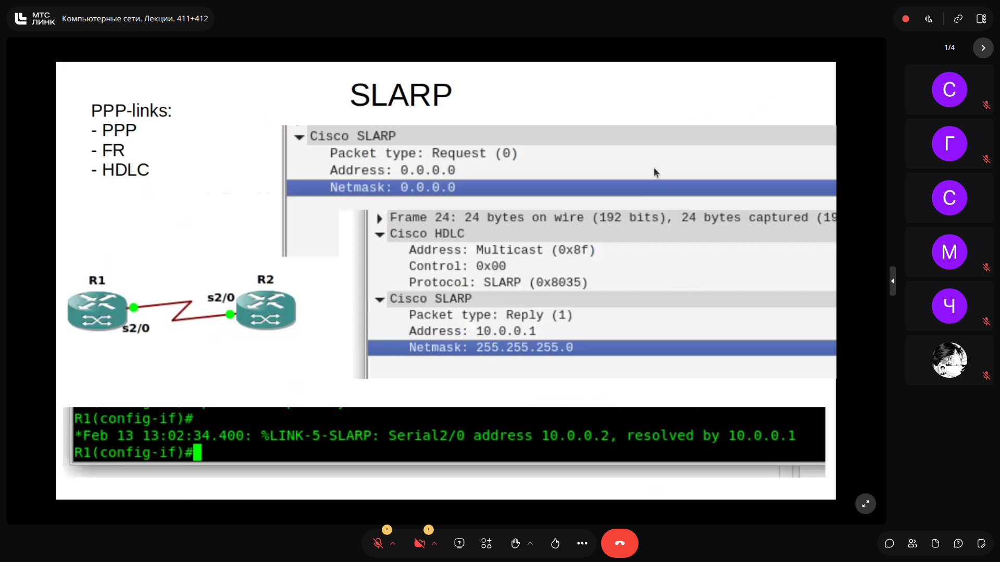


> [!IMPORTANT]
> **На заметку к зачету / экзамену:**
> - Главное отличие ARP Probe: поле Sender IP строго равно 0.0.0.0, чтобы сторонние хосты случайно не добавили в свой кэш непроверенный адрес.
> - В Gratuitous ARP поля Sender IP и Target IP совпадают.

---

## 4. Технология Proxy ARP: Принцип работы, преимущества и риски `[33:30]`

Механизм **Proxy ARP** позволяет маршрутизатору отвечать собственным MAC-адресом на ARP-запросы, отправленные к узлам, физически расположенным в другой подсети.

### Сценарий возникновения:
- Узел Host A имеет адрес `172.16.10.100` с ошибочной или преднамеренной маской `/16`, считая, что хост `172.16.20.100` находится с ним в одной физической сети (хотя между подсетями `Subnet A /24` и `Subnet B /24` стоит маршрутизатор).
- Host A не обращается к Default Gateway, а шлет прямой ARP Request: *«Кто имеет 172.16.20.100?»*.
- Если на интерфейсе маршрутизатора включен Proxy ARP и маршрутизатор имеет маршрут до подсети назначения, он отправляет ARP Reply, подставляя в поле Sender MAC собственный MAC-адрес своего входного интерфейса.
- В результате Host A помещает в кэш запись, где чужой IP сопоставлен с MAC-адресом маршрутизатора, и передает кадры ему.

```
  [Host A: 172.16.10.100/16] (считает сеть общей)
             |
     (Subnet A 172.16.10.0/24)
             |
  [Router (e0: 172.16.10.99, MAC: ...ab)] <--- Proxy ARP включен: отвечает своим MAC (...ab)
             |
     (Subnet B 172.16.20.0/24)
             |
  [Host C: 172.16.20.100/24]
```

### Анализ Proxy ARP:
- **Плюсы:** позволяет объединять сети без перенастройки шлюзов по умолчанию на старых или примитивных клиентах (костыльное решение); используется в некоторых конфигурациях удаленного доступа (Remote Access / L2 VPN).
- **Минусы:**
  - Увеличение объема широковещательного ARP-трафика.
  - Разрастание таблиц ARP на конечных хостах (один и тот же MAC маршрутизатора дублируется для десятков удаленных IP).
  - Маскирует ошибки сетевого планирования.
  - Дефолтное поведение: на оборудовании Cisco включен по умолчанию (`ip proxy-arp`), вендор рекомендует выключать его (`no ip proxy-arp`). На Huawei отключен по умолчанию.

### Слайды и код с экрана:


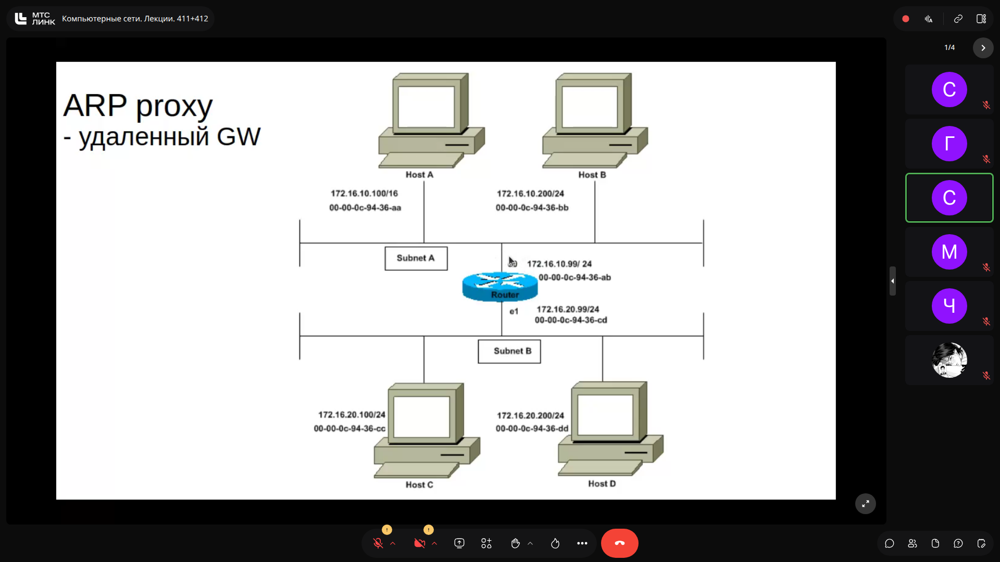

> [!IMPORTANT]
> **На заметку к зачету / экзамену:**
> - Признак работы Proxy ARP в таблице хоста: наличие нескольких записей с разными IP-адресами, но с абсолютно одинаковым MAC-адресом (принадлежащим интерфейсу маршрутизатора).

---

## 5. Атака ARP Poisoning (Spoofing) и механизмы защиты (DAI, DHCP Snooping) `[49:30]`

### Механика атаки ARP Spoofing (MITM):
В коммутируемой сети коммутатор передает Unicast-кадры строго на порт получателя на основе таблицы MAC-адресов. Чтобы перехватить чужой трафик, злоумышленник использует архитектурную уязвимость протокола: ОС принимает и сохраняет ARP Reply даже в том случае, если предварительного ARP Request хост не отправлял.

1. Атакующий отсылает поддельные (unsolicited) ARP-ответы жертве: *«IP-адрес шлюза 10.0.0.1 находится на моем MAC-адресе»*.
2. Кэш жертвы перезаписывается: весь трафик, предназначенный шлюзу, уходит атакующему.
3. Для организации двусторонней атаки (Two-Way Poisoning) аналогичные поддельные пакеты шлются маршрутизатору от имени жертвы.
4. Атакующий производит пересылку (forwarding) транзитных пакетов, реализуя схему Man-in-the-Middle (MitM).

### Методы обнаружения и противодействия:
- **Мониторинг кэша на хостах:** антивирусное ПО (например, Kaspersky Internet Security) может фиксировать дублирование MAC-адресов или всплеск однотипных ответов. Для энтерпрайз-среды метод неэффективен из-за зависимости от человеческого фактора.
- **Статические ARP-записи (`arp -s`):** эффективны, но крайне трудно масштабируемы в динамических сетях с DHCP.
- **Корпоративный отраслевой стандарт (Защита на L2-коммутаторах):**
  1. **DHCP Snooping:** коммутатор анализирует транзитный DHCP-трафик и формирует защищенную базу привязок `DHCP Snooping Binding Table` (MAC-адрес, выданный IP, порт коммутатора, VLAN, аренда).
  2. **Dynamic ARP Inspection (DAI):** коммутатор перехватывает все ARP-пакеты на ненадежных (untrusted) портах и сопоставляет их с базой DHCP Snooping. Если связка IP-MAC в пакете не совпадает с легитимной, кадр отбрасывается.

### Слайды и код с экрана:
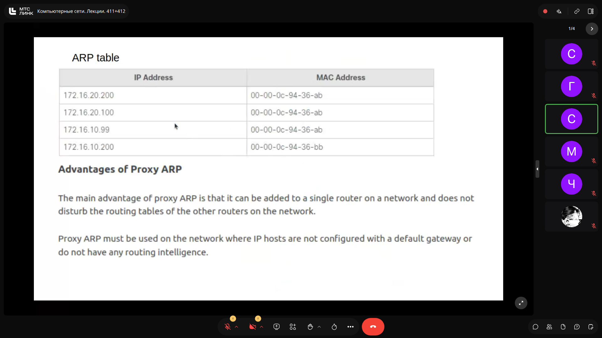


> [!IMPORTANT]
> **На заметку к зачету / экзамену:**
> - Ключевое отличие таблицы кэша при атаке от Proxy ARP: при Proxy ARP одинаковый MAC принадлежит шлюзу и сопоставлен с IP другой подсети; при ARP Spoofing одинаковый MAC сопоставляется с IP-адресами внутри той же самой подсети (шлюз и локальные узлы).

---

## 6. Введение в IPv6: Архитектура, запись и правила компрессии (RFC 5952) `[69:30]`

### Основные характеристики IPv6:
- Разработан из-за исчерпания пула адресов IPv4 (32 бита, ~4.3 млрд адресов).
- Длина адреса IPv6: **128 бит (16 байт)**. Общее количество адресов составляет $2^{128} \approx 3.4 \times 10^{38}$.
- Полностью исключен широковещательный трафик (Broadcast отсутствует) — его функции выполняет **Multicast**.

### Формат представления:
Адрес записывается в виде 8 шестнадцатеричных групп по 16 бит каждая (называемых **хекстетами**, *hextet*), разделенных двоеточиями:
`2001:0DB8:0000:0000:0000:036E:1250:2B00`
Каждый символ hex представляет собой **ниббл** (*nibble* = 4 бита). В одном хекстете — 4 ниббла.

### Стандартные правила сокращения записи адреса (RFC 5952):
1. **Опускание ведущих нулей:** в каждом отдельном хекстете начальные нули могут быть опущены (`0DB8` $\to$ `DB8`, `0000` $\to$ `0`, `036E` $\to$ `36E`).
   `2001:DB8:0:0:0:36E:1250:2B00`
2. **Сжатие последовательности нулей (двойное двоеточие `::`):**
   - Непрерывная группа хекстетов, состоящих исключительно из нулей, может быть заменена на `::`.
   - Двойное двоеточие разрешено использовать в адресе **только один раз**, иначе возникает неоднозначность парсинга длины подстрок.
   - **Правило разрешения конфликтов:** если в адресе есть несколько нулевых последовательностей, сокращается **наиболее длинная**. При равенстве длин сокращается **первая слева**.
   *Пример:* `2001:0:0:0:2F:0:0:5` сокращается строго в `2001::2F:0:0:5`.
   *Пример:* `2001:DB8:0:0:2F:0:0:5` сокращается строго в `2001:DB8::2F:0:0:5`.
3. **Обозначение префикса:** маска подсети указывается исключительно в формате CIDR через слэш (`/64`, `/48`, `/128`).

### Слайды и код с экрана:

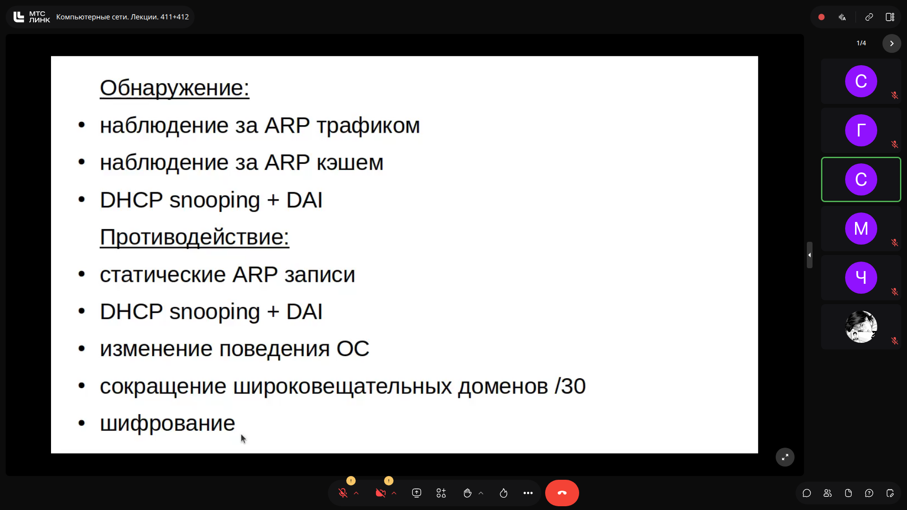
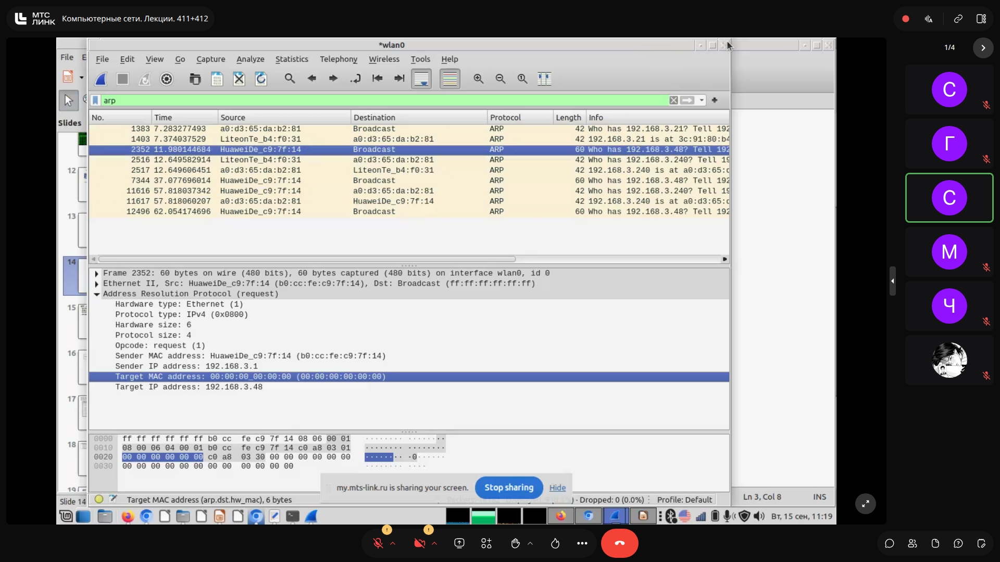
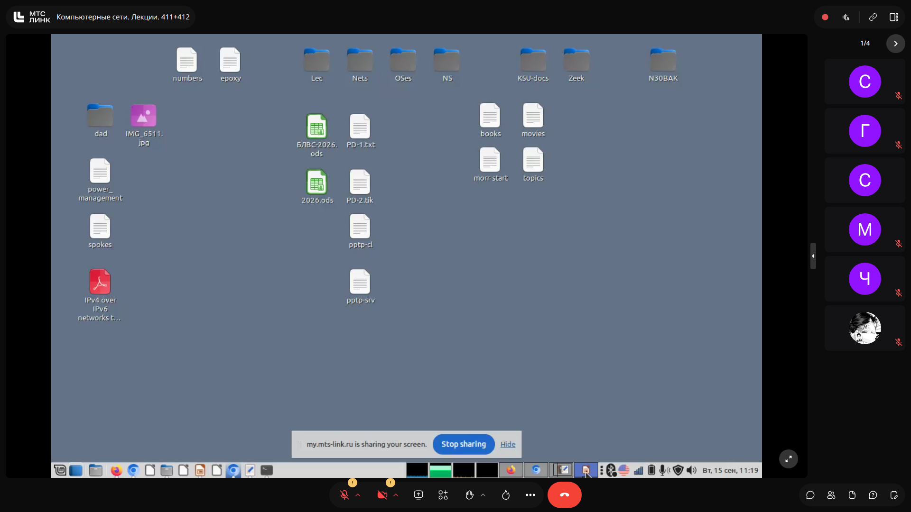


> [!IMPORTANT]
> **На заметку к зачету / экзамену:**
> - Длина IPv6 адреса: ровно 16 байт (128 бит). Не путать с 6 байтами!
> - Двойное двоеточие применяется ровно один раз. Если последовательности нулей равны — сокращается строго первая слева.

---

## 7. Классификация адресов IPv6 и глобальные префиксы `[76:40]`

Все адреса IPv6 подразделяются на три основных класса передачи данных:
1. **Unicast** (одноадресные);
2. **Multicast** (многоадресные, начинаются с префикса `ff00::/8`);
3. **Anycast** (выбирается ближайший топологический узел).

### Основные типы Unicast-адресов:
- **Unspecified Address (`::/128`):** эквивалент `0.0.0.0` в IPv4. Используется хостом до получения собственного адреса (в процессах DAD, DHCPv6).
- **Default Route (`::/0`):** маршрут по умолчанию (шлюз по умолчанию в таблице маршрутизации).
- **Loopback (`::1/128`):** локальная петля (эквивалент диапазона `127.0.0.1` в IPv4).
- **Link-Local (`fe80::/10`):** адреса локальной связи (аналог APIPA). Назначаются автоматически на каждом включенном интерфейсе и действуют строго в пределах L2-сегмента.
- **Unique Local (`fc00::/7`):** частные 'серые' адреса локальных корпоративных сетей (аналог RFC 1918 в IPv4).
- **IPv4-Mapped / Embedded IPv4 (`::ffff:0:0/96` либо `::/80`):** формат интеграции IPv4 в IPv6. Первые 80 бит нули, затем `ffff`, а последние 32 бита содержат IPv4-адрес.
  *Пример:* `192.168.0.1` представляется как `::ffff:c0a8:0001` (так как $192 = \text{C0}_{16}, 168 = \text{A8}_{16}, 0 = 00_{16}, 1 = 01_{16}$).

### Global Unicast Addresses (GUA):
Аналог публичных 'белых' адресов в сети Интернет. Занимают диапазон `2000::/3` (первые 3 бита фиксированы как `001`, что означает диапазон шестнадцатеричных значений от `2000...` до `3FFF...`).
Организация IANA выделила региональным интернет-регистраторам (RIR) блоки с маской `/12`:
- **APNIC** (Азиатско-Тихоокеанский регион): `2400::/12` (недавно добавлен `2410::/12` из-за потребностей Китая и 5G-инфраструктуры);
- **ARIN** (Северная Америка): `2600::/12`;
- **LACNIC** (Латинская Америка): `2800::/12`;
- **RIPE NCC** (Европа, РФ, Ближний Восток): `2A00::/12`;
- **AFRINIC** (Африка): `2C00::/12`.

### Слайды и код с экрана:
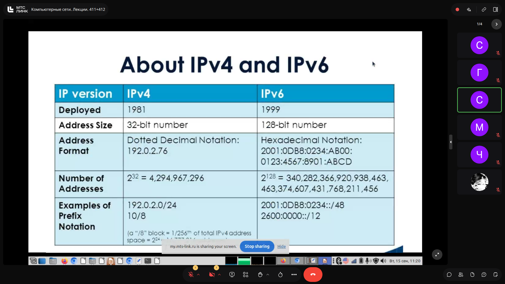


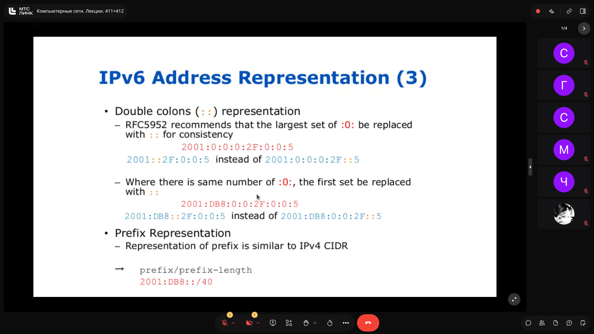


> [!IMPORTANT]
> **На заметку к зачету / экзамену:**
> - Любой Global Unicast адрес IPv6 на текущий момент начинается с цифры 2 или 3 (двоичный префикс 001).
> - В IPv6 полностью отсутствует Broadcast-адресация.

---

## 8. Методические указания к лабораторной работе №3 (Cisco IOS CLI) `[00:00]`

В прикрепленных материалах к занятию представлены сценарии для выполнения лабораторной работы по конфигурированию сетевого оборудования Cisco.

### Ключевые аспекты работы:
1. **Иерархия контекстов Cisco IOS (`att_IOS_contexts.png`):**
   - Пользовательский режим (`Router>`):
   - Привилегированный режим (`Router#`): переход по команде `enable`.
   - Режим глобальной конфигурации (`Router(config)#`): переход по `configure terminal`.
   - Контексты интерфейсов (`Router(config-if)#`) и линий терминалов (`Router(config-line)#`).

2. **Управление паролями и безопасность (Lab_03_1.txt):**
   - Установка незашифрованного пароля администратора: `enable password <pass>` (хранится в открытом виде).
   - Установка защищенного MD5-хэшем пароля: `enable secret <pass>` (имеет приоритет над `enable password`).
   - Сервис шифрования обратимых паролей в конфигурационном файле: `service password-encryption`.
   - Настройка доступа по Telnet: `line vty 0 4` -> `login` -> `password <pass>`.
   - Ограничение доступа через ACL: `access-list 1 permit <IP>` -> на интерфейсе VTY: `access-class 1 in`.

3. **Настройка защищенного протокола SSH v2 (Lab_03_2.txt):**
   ```text
   hostname RR
   ip domain name Net
   crypto key generate rsa (выбрать размер 1024 бит)
   username sshuser password sshpassword
   ip ssh version 2
   line vty 0 15
     transport input ssh
     login local
   ```

4. **Работа с памятью и конфигурацией (boot.png):**
   - Сохранение из RAM в NVRAM: `copy running-config startup-config` (или `write`).
   - Сброс настроек к заводским: `write erase` (или `delete nvram:/startup-config`), с последующей перезагрузкой `reload`.

### Слайды и код с экрана:


> [!IMPORTANT]
> **На заметку к зачету / экзамену:**
> - Команда `enable secret` имеет приоритет над `enable password` и использует криптостойкое хэширование.
> - При настройке IP на L2-коммутаторе адрес назначается виртуальному интерфейсу VLAN (SVI): `interface vlan 1`, так как физические порты свитча IP-адресов не имеют.

---
