# Компьютерные сети: Адресация и архитектура протокола IPv6

> **Тема**: Адресация и архитектура протокола IPv6  
> **Статус конспекта**: Очищен от оговорок и воды, структурирован AI-ассистентом с сохранением авторских терминов.  
> **AI-модель**: `gemini-flash-latest`  

## Введение
Данная лекция является углубленным продолжением темы адресации IPv6. В фокусе внимания — иерархическая структура и распределение глобальных адресов (Global Unicast), специфика функционирования Link-Local адресов с интерфейсными зонами (Zone IDs), переход от Site-Local к Unique Local адресам, алгоритмы формирования Interface ID (Modified EUI-64 и Privacy Extensions), таймеры жизни адресов, работа Solicited-Node Multicast и кардинальные изменения в заголовке сетевого уровня при переходе от IPv4 к IPv6.

---

## Глобальные уникальные адреса (Global Unicast) и иерархия распределения `[01:00]`

Глобальные уникальные адреса (**Global Unicast**) являются аналогом публичных белых IP-адресов в IPv4, они маршрутизируются в глобальном интернете.

### Диапазон и распределение
- Выделенный диапазон: префикс `2000::/3` (первые три бита равны `001`). Это означает, что первый шестнадцатеричный символ в шестнадцатеричной записи адреса принимает значения `2` или `3`.
- Данный диапазон охватывает ровно $\frac{1}{8}$ всего адресного пространства IPv6 (128 бит).

### Иерархия RIR и распределение блоков
Адресное пространство делегируется организацией **IANA** пяти региональным интернет-регистраторам (**RIR**):
- **APNIC** (Азиатско-Тихоокеанский регион) — блок `2400::/12`, а также сравнительно недавно выделенный дополнительный блок `2410::/12` (в связи с бурным развитием сотовых сетей 5G и оборудования Huawei);
- **ARIN** (Северная Америка: США, Канада) — `2600::/12`;
- **LACNIC** (Латинская Америка и Карибский бассейн) — `2800::/12`;
- **RIPE NCC** (Европа, РФ, Ближний Восток, Центральная Азия) — `2a00::/12`;
- **AFRINIC** (Африка) — `2c00::/12`.

### Структура агрегируемых адресов (Provider-Aggregatable vs Provider-Independent)
1. **Provider-Aggregatable (PA)**:
   - IANA выделяет префикс RIR (12 бит);
   - RIR выделяет блок интернет-провайдеру (**LIR / ISP**) — обычно 32 бита (`/32`);
   - ISP выделяет конечному клиенту (**End Site**) префикс размером `/48` (согласно рекомендациям IANA) или `/56`;
   - Конечному сайту остается 16 бит для формирования собственных подсетей (`Subnet ID`), получая подсети `/64`;
   - Хостовая часть (`Interface ID`) жестко зафиксирована размером **64 бита**;
   - Преимущество: внешние операторы видят лишь один агрегированный маршрут провайдера (`/32`), таблица маршрутизации не раздувается. При смене оператора клиент вынужден менять префикс.
2. **Provider-Independent (PI)**:
   - Выделяются RIR напрямую конечному сайту (обычно блок `/48`);
   - Блок сохраняется за организацией при смене провайдера, но анонсируется в BGP отдельным мелким префиксом `/48`, увеличивая глобальную таблицу маршрутизации.

### Слайды и код с экрана:
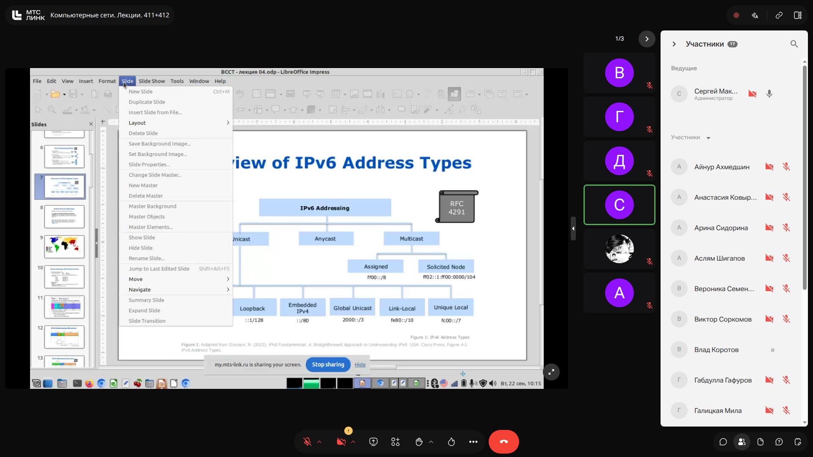
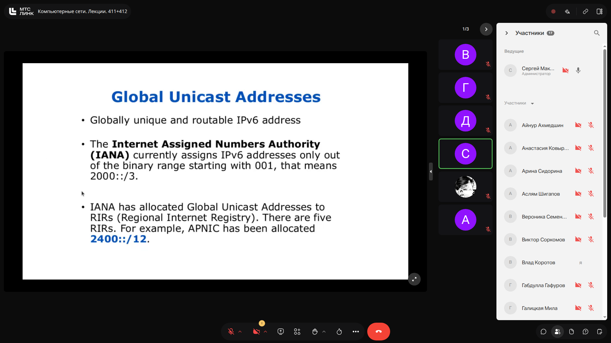
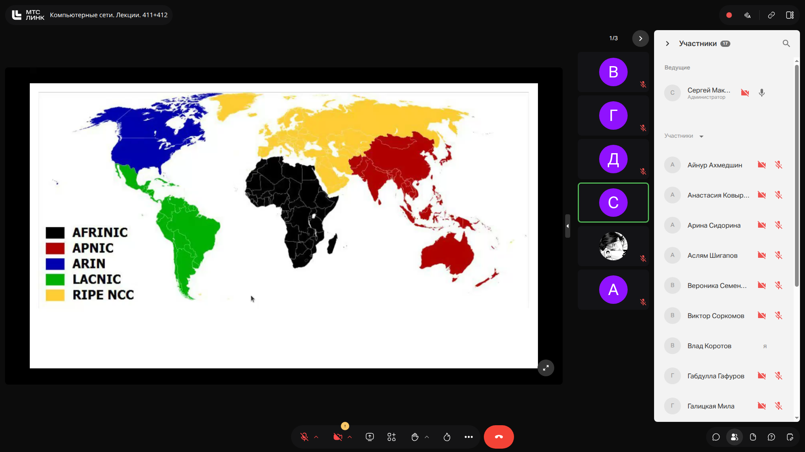
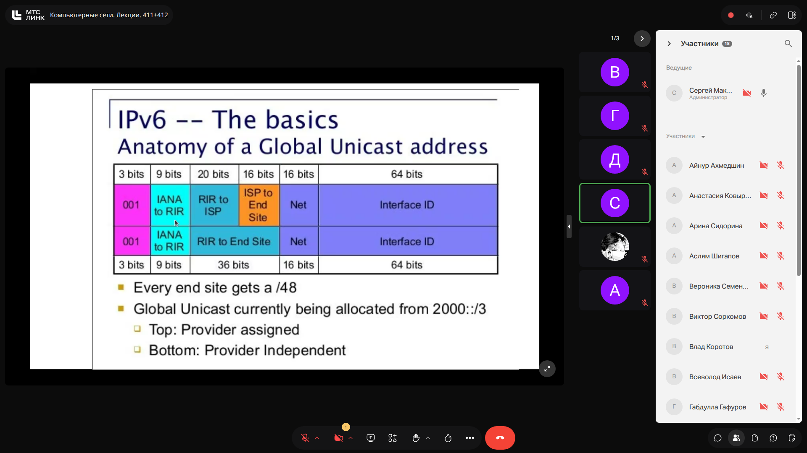
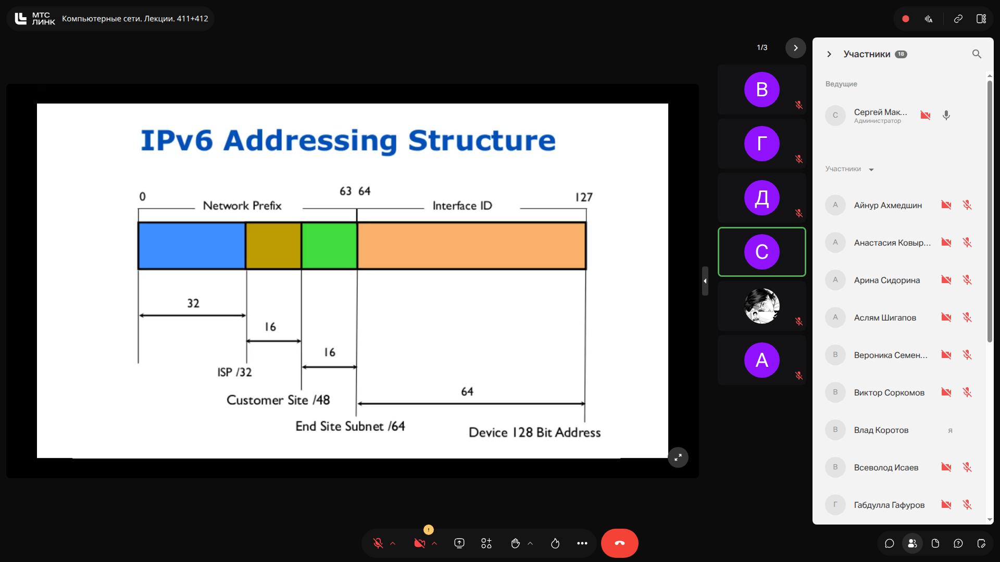

> [!IMPORTANT]
> **На заметку к зачету / экзамену:**
> - Глобальные адреса IPv6 выдаются из диапазона 2000::/3 (первые три бита 001, шестнадцатеричные первые цифры 2 или 3).
> - Стандартный размер префикса, выдаваемого конечному сайту по рекомендациям IETF/IANA — /48, размер подсети для интерфейсов хостов — строго /64.

---

## Link-Local адреса и зональные идентификаторы (Zone ID / Scope ID) `[19:52]`

### Назначение Link-Local адресов
- Префикс: `fe80::/10` (на практике всегда имеет вид `fe80::/64`).
- Генерируются автоматически на всех активных интерфейсах с включенным IPv6 (аналог механизма APIPA `169.254.0.0/16` в IPv4).
- Не маршрутизируются за пределы L2-сегмента (канала).
- **Ключевая роль в маршрутизации**: в IPv6 дефолтный шлюз (`Default Gateway`) и `Next-Hop` маршрутизаторов почти всегда задаются именно через Link-Local адрес соседа, а не через Global Unicast адрес.

### Проблема однозначности и зональные идентификаторы (Zone ID)
Поскольку все интерфейсы узла имеют Link-Local адреса с одинаковым префиксом `fe80::/64`, операционная система при отправке пакета на чужой Link-Local адрес не может определить по таблице маршрутизации, через какой именно сетевой интерфейс вытолкнуть пакет.

Для устранения неоднозначности используется суффикс зоны:
- **В Linux**: имя интерфейса указывается либо через знак процента `%`, либо через ключ утилиты:
  ```bash
  ping6 fe80::800:27ff:fe00:1%vboxnet1
  ping6 -I vboxnet1 fe80::800:27ff:fe00:1
  ```
- **В Windows**: интерфейсы нумеруются числовыми индексами в списке интерфейсов (`route print`). Идентификатор зоны добавляется через `%индекс`:
  ```cmd
  ping fe80::f913:d7ee:685a:2a57%11
  ```
- Для пинга *собственного* адреса Link-Local современные ОС (включая Linux с новыми ядрами и Windows) позволяют опускать Zone ID, разрешая маршрут локально.

### Слайды и код с экрана:
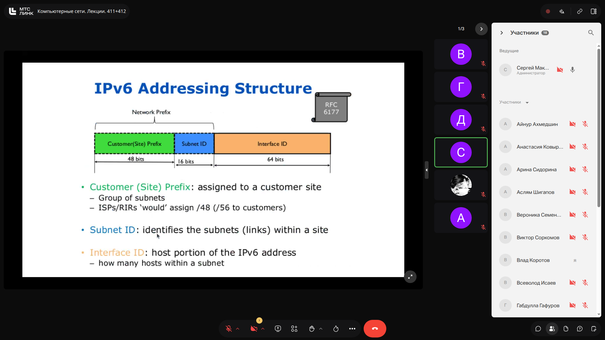
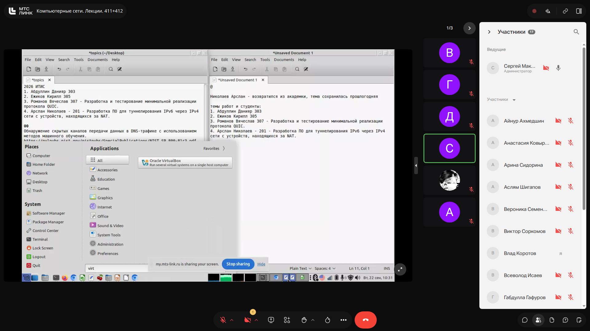
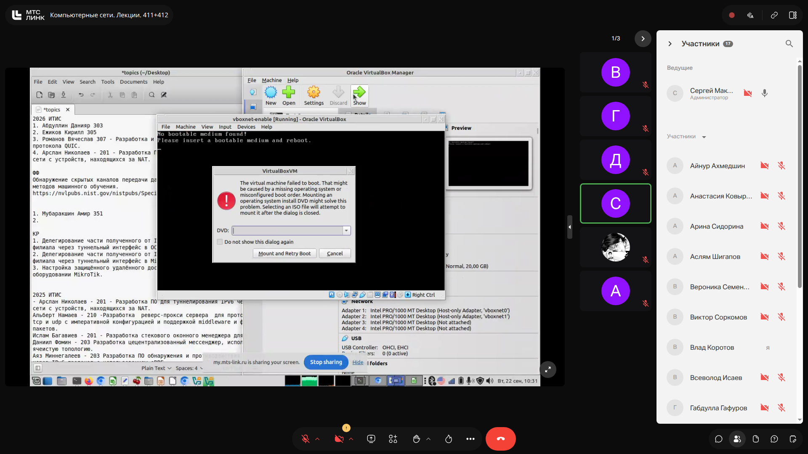
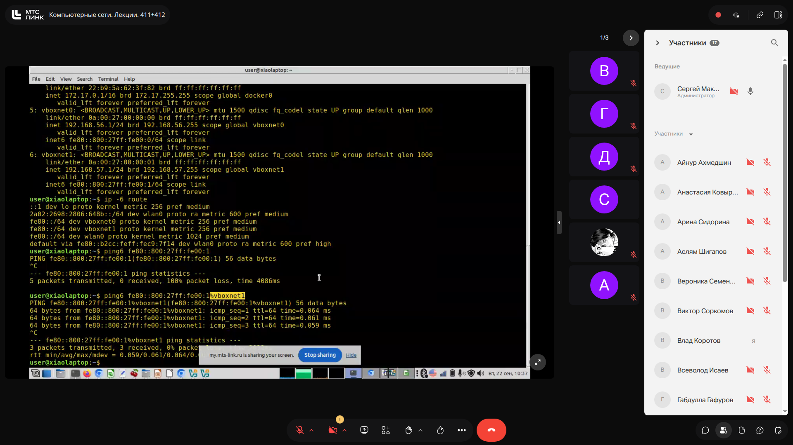

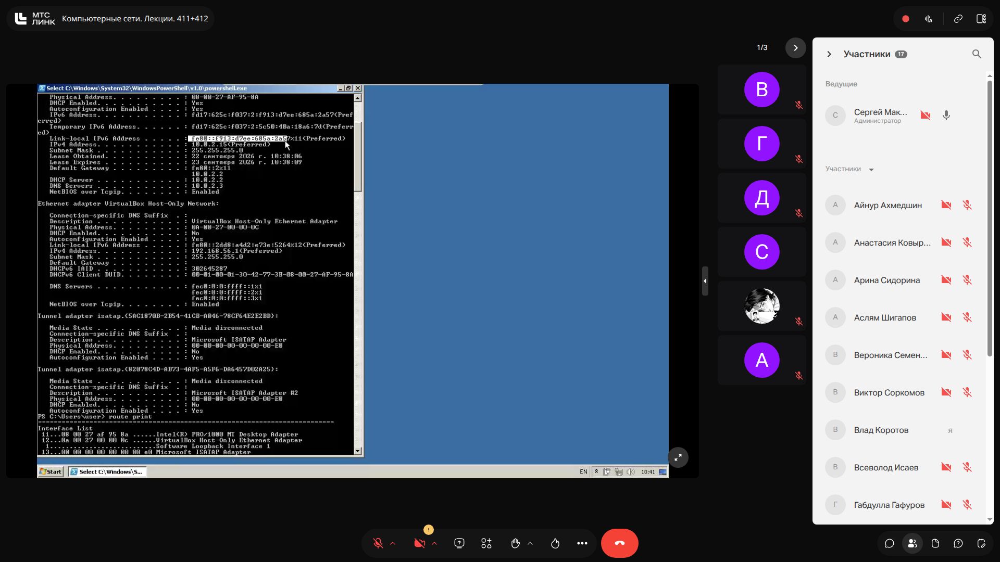
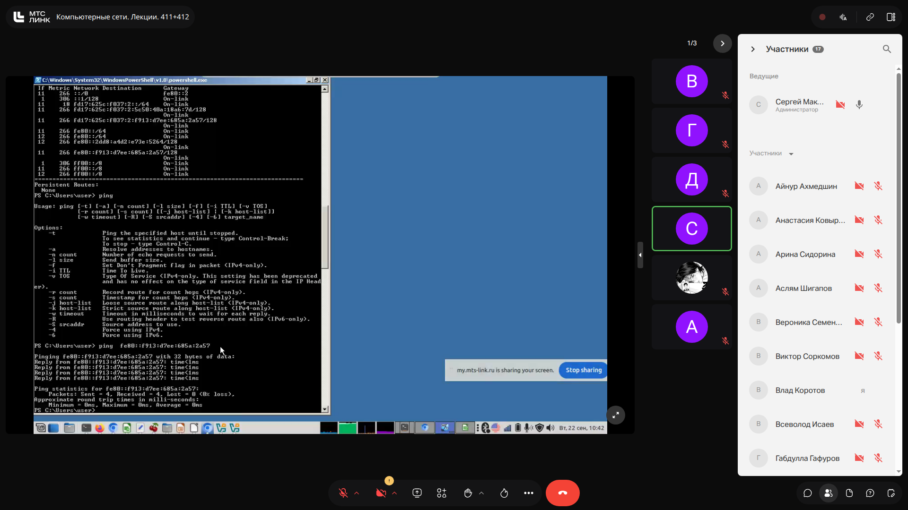

> [!IMPORTANT]
> **На заметку к зачету / экзамену:**
> - Next-Hop и Default Gateway в IPv6 указываются через Link-Local адрес (fe80::/64).
> - Zone ID (Scope ID) обязателен при взаимодействии по Link-Local адресу с удаленным узлом, чтобы стек TCP/IP знал исходящий L2-интерфейс.

---

## Уникальные локальные адреса (Unique Local) и устаревшие Site-Local `[33:05]`

### Устаревшие Site-Local адреса
- Префикс: `fec0::/10`.
- Задумывались как аналог приватных сетей RFC 1918 (например, `192.168.0.0/16`).
- **Причина признания устаревшими**: у всех организаций подсети были одинаковыми (`fec0:0:0:1::/64` и т.д.). При слиянии компаний или соединении сетей через VPN возникали неразрешимые коллизии адресации без сложных трансляций.

### Unique Local Unicast Addresses (ULA, RFC 4193)
- Базовый префикс: `fc00::/7` (биты `1111 110x`).
- Поле состоит из:
  - `Prefix` (7 бит) = `1111 110`;
  - `L-бит` (1 бит): если $L=1$, префикс имеет вид `fd00::/8` (локально сгенерированный префикс). Значение $L=0$ зарезервировано под централизованное назначение IANA (пока не используется);
  - `Global ID` (40 бит): псевдослучайный идентификатор сайта/организации;
  - `Subnet ID` (16 бит): идентификатор внутренней подсети;
  - `Interface ID` (64 бита): адрес хоста.
- Благодаря 40-битному случайному Global ID адреса `fdxx:xxxx:xxxx::/48` практически гарантированно глобально уникальны, что исключает коллизии при объединении филиалов через VPN.

### Слайды и код с экрана:
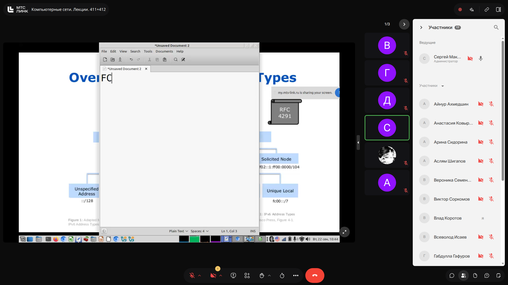
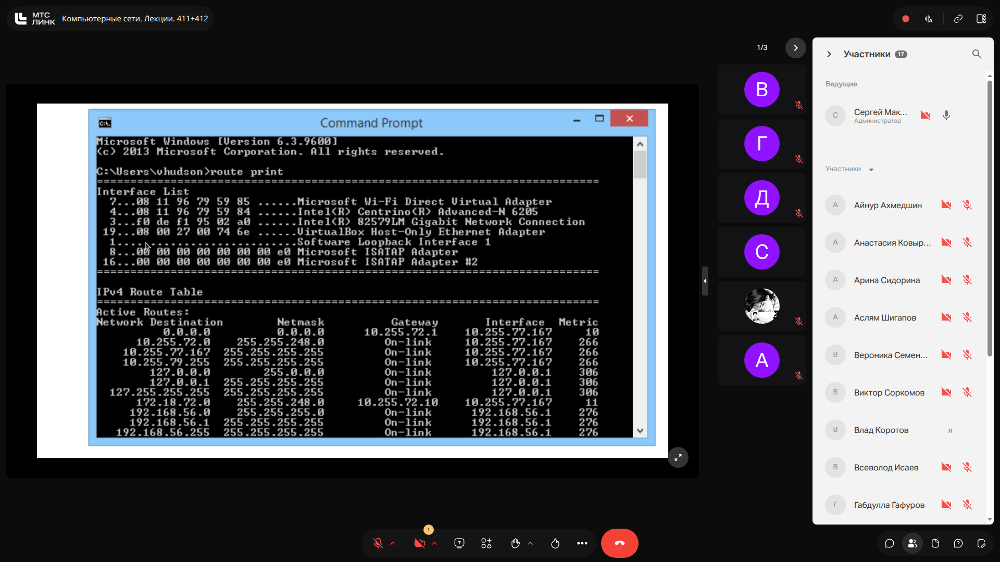
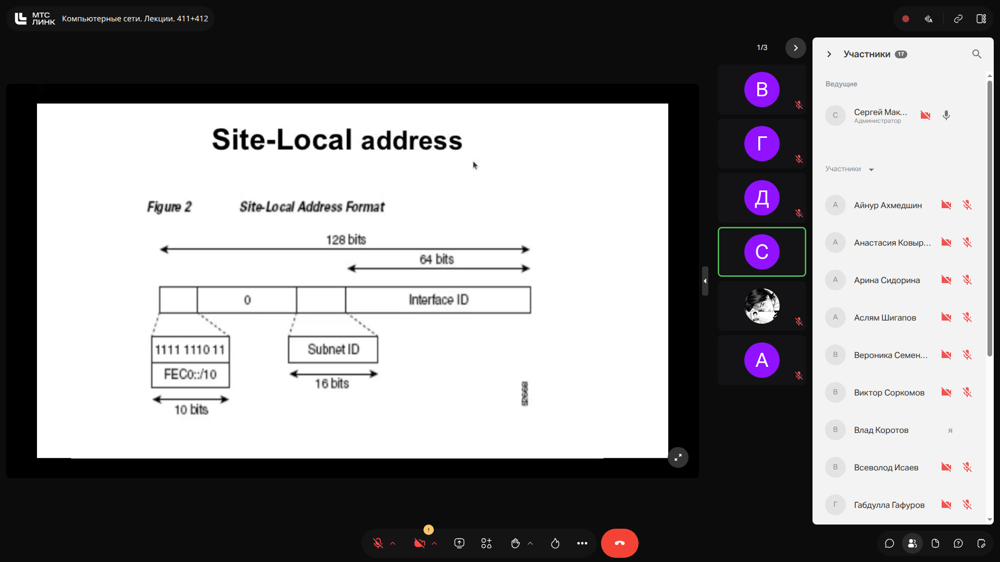
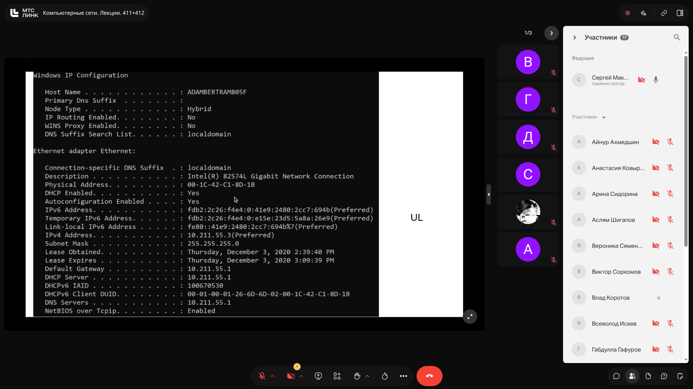
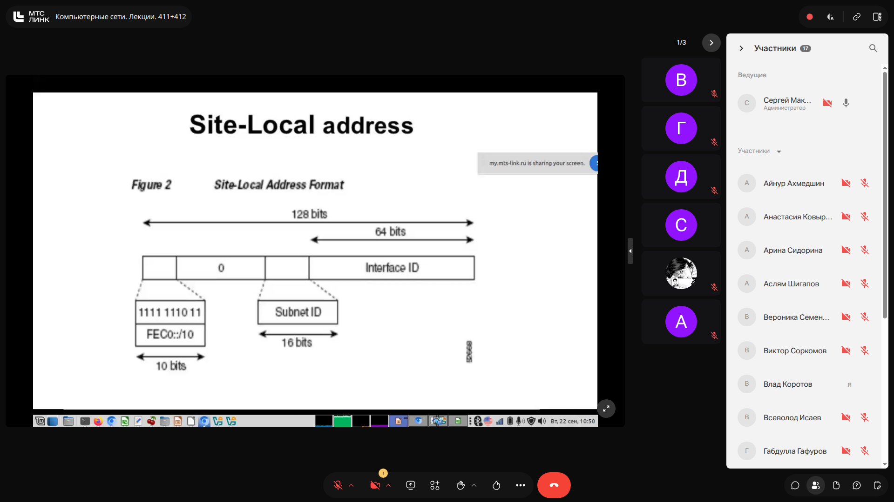

> [!IMPORTANT]
> **На заметку к зачету / экзамену:**
> - Site-Local (fec0::/10) признан deprecated.
> - Современные серые адреса IPv6 называются Unique Local (fc00::/7), при локальной генерации префикс всегда начинается с fd::/8 за счет L-бита = 1.

---

## Формирование Interface ID: Modified EUI-64 и Privacy Extensions `[40:20]`

Хостовая часть IPv6 адреса всегда занимает младшие 64 бита (`Interface ID`). Существует несколько способов ее формирования.

### 1. Метод Modified EUI-64
Позволяет детерминированно преобразовать 48-битный MAC-адрес сетевой карты в 64-битный Interface ID:
1. MAC-адрес делится на две половины по 24 бита: OUI (идентификатор вендора) и NIC (серийный номер интерфейса);
2. Посередине вставляются 16 фиксированных бит шестнадцатеричной константы `0xFFFE`;
3. В первом байте инвертируется 7-й бит (бит всеобщей/локальной уникальности, **U/L бит** — *Universal/Local*):
   - Если бит был `0` (глобально уникальный MAC, прошитый заводом), он становится `1`;
   - Пример: `08:00:27:19:4a:5a` $\to$ вставка `ff:fe` $\to$ `0800:27ff:fe19:4a5a`. Байт `08` ($00001000_2$) с инвертированным 7-м битом превращается в `0a` ($00001010_2$). Результирующий Interface ID: `0a00:27ff:fe19:4a5a`.

### 2. Проблема безопасности EUI-64 и Privacy Extensions (RFC 4941, RFC 7217)
- **Недостаток EUI-64**: раскрывает MAC-адрес устройства и вендора сетевой карты, что позволяет отслеживать перемещения ноутбука/смартфона между сетями и облегчает целенаправленное сканирование портов (знание вендора сужает диапазон перебора адресов с $2^{64}$ до $2^{24}$);
- **Решение**: переход на псевдослучайную генерацию Interface ID.
  - В современных ОС клиент получает постоянный безопасный адрес (**Secured address**) для приема входящих соединений и временные адреса (**Temporary address**) для исходящих сессий в интернет, которые периодически меняются.

### Слайды и код с экрана:
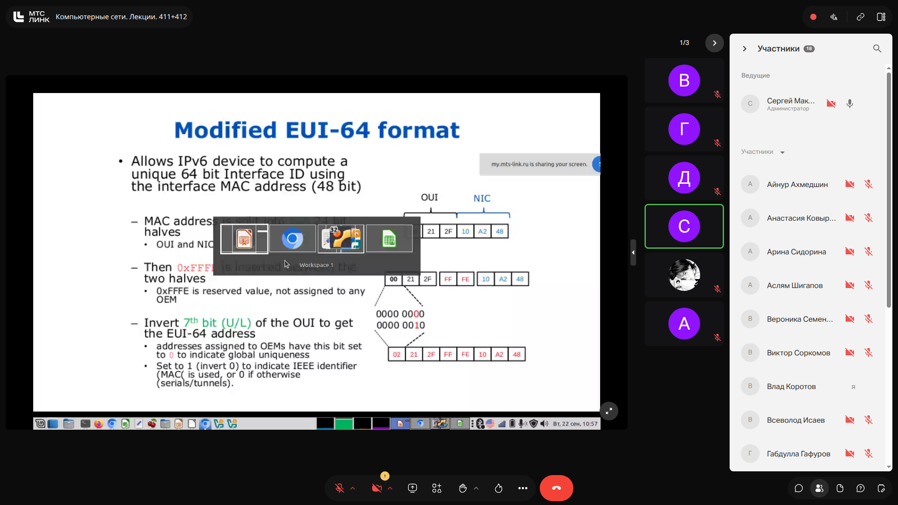
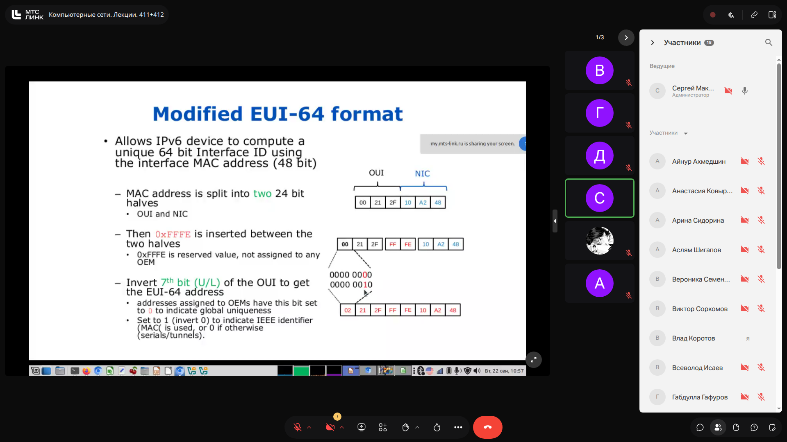
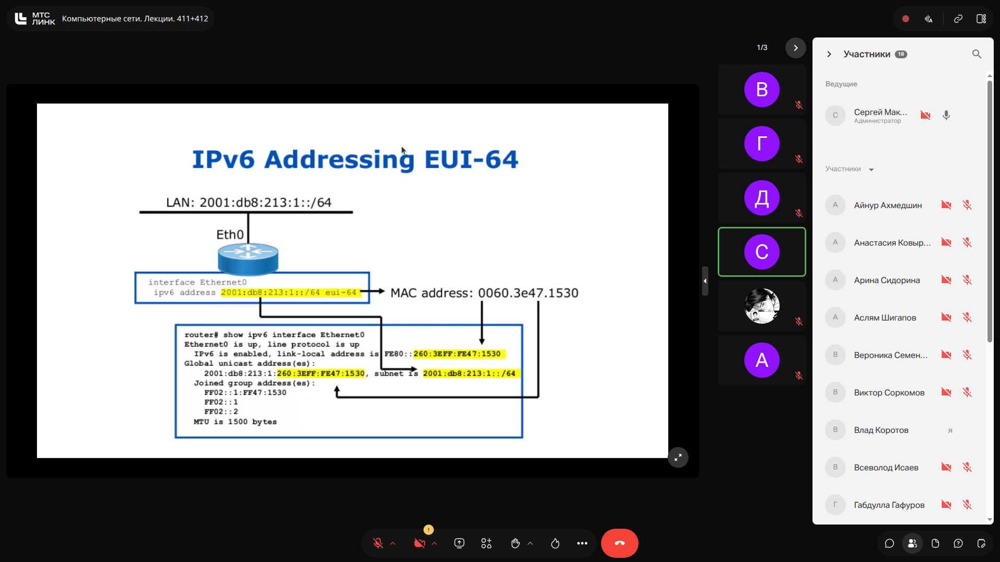
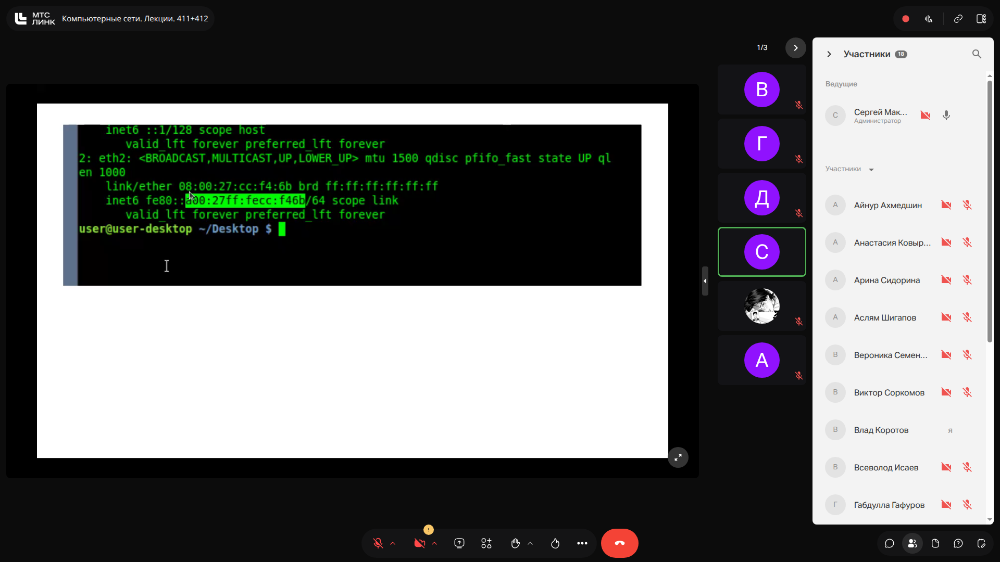
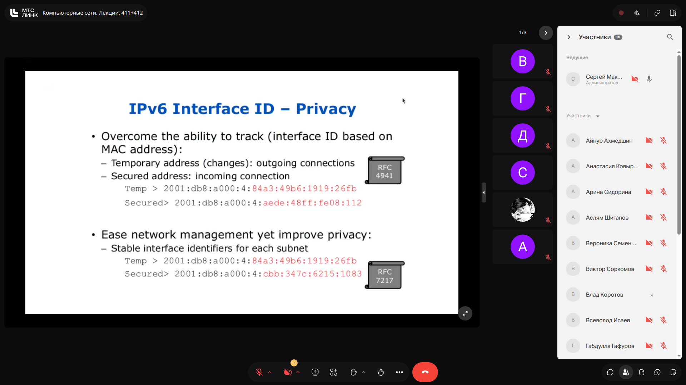

> [!IMPORTANT]
> **На заметку к зачету / экзамену:**
> - При Modified EUI-64 в середину 48-битного MAC вставляется 0xFFFE, а 7-й бит (U/L) первого байта инвертируется.
> - Для защиты приватности хосты используют RFC 4941 / RFC 7217 (временные псевдослучайные адреса).

---

## Жизненный цикл адреса IPv6: Preferred и Valid Lifetime `[52:00]`

Каждый динамический адрес IPv6 проходит через несколько состояний в соответствии с RFC 4862:

```text
[ Генерация ] ---> ( Tentative ) --[DAD успешен]--> ( Preferred ) ---> ( Deprecated ) ---> [ Invalid / Удален ]
                      |                                     |                   |
                 Проверка на коллизии           Preferred Lifetime    Valid Lifetime
```

### Состояния адреса
1. **Tentative (пробный)** — адрес сгенерирован, но не назначен на интерфейс. Запускается процедура **Duplicate Address Detection (DAD)** для проверки уникальности в сегменте.
2. **Preferred (предпочтительный)** — адрес активен. Может свободно использоваться для открытия **новых** сокетов и соединений. Длительность задается параметром **Preferred Lifetime**.
3. **Deprecated (устаревший)** — интервал Preferred Lifetime истек, но **Valid Lifetime** еще продолжается. Хост не имеет права инициировать новые соединения с этого адреса, но уже существующие открытые соединения продолжают корректно работать.
4. **Invalid** — истек таймер Valid Lifetime. Адрес удаляется с интерфейса, все оставшиеся сокеты принудительно разрываются.

Link-Local адрес имеет параметры `valid_lft forever preferred_lft forever` и не устаревает.

### Слайды и код с экрана:
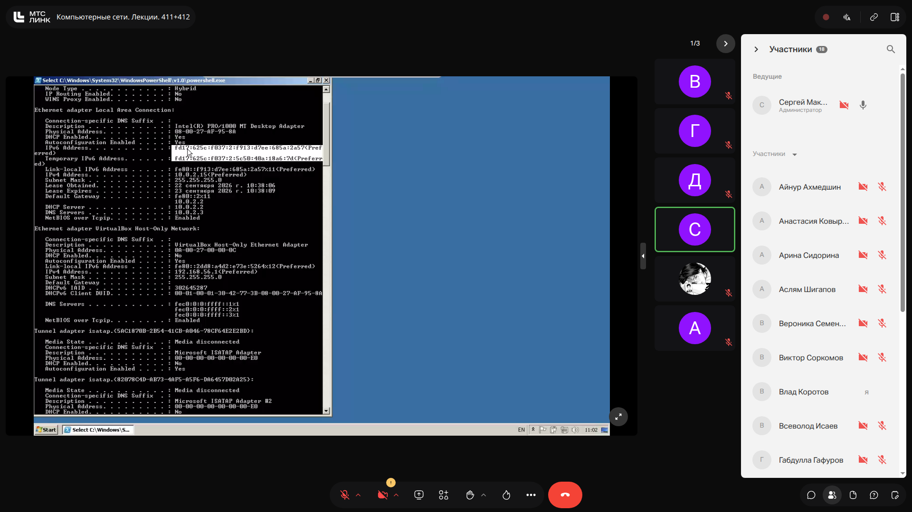
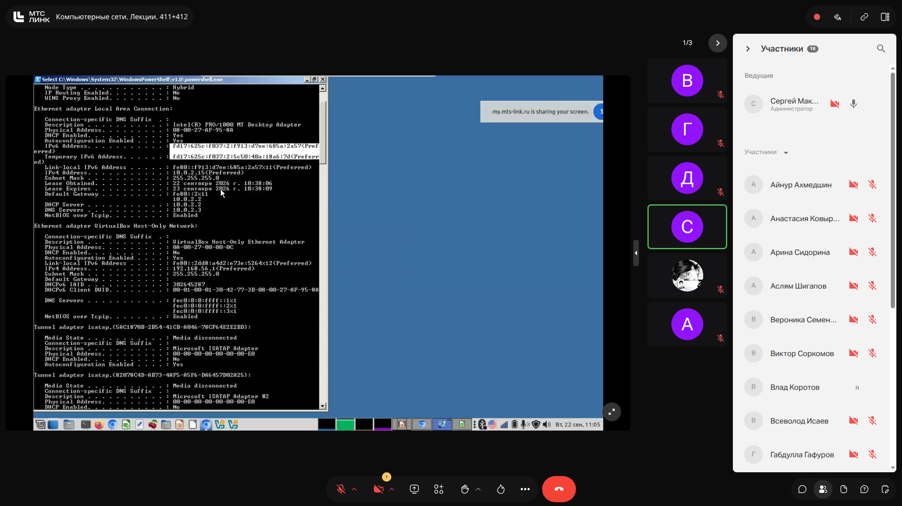
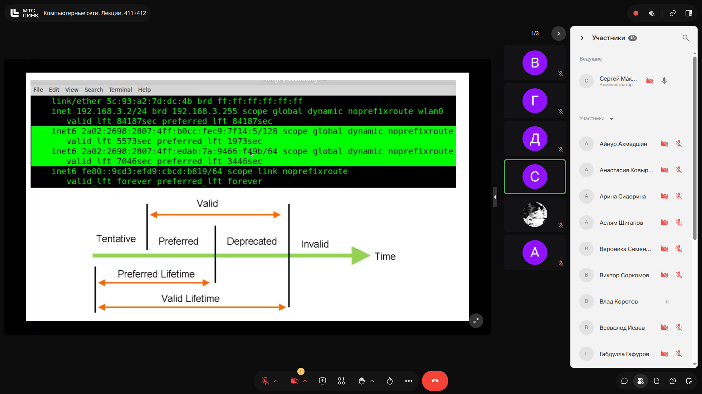
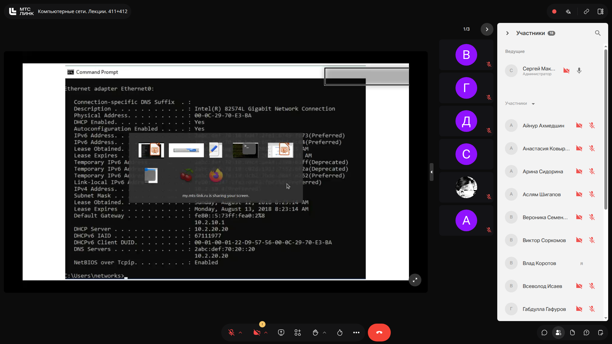

> [!IMPORTANT]
> **На заметку к зачету / экзамену:**
> - Разница между Preferred и Deprecated: из состояния Deprecated нельзя открывать новые сокеты, но можно завершать уже открытые сессии.
> - Valid Lifetime всегда больше либо равен Preferred Lifetime.

---

## Групповая адресация (IPv6 Multicast) и Solicited-Node Multicast `[57:15]`

В IPv6 полностью отсутствует широковещание (Broadcast) — все широковещательные механизмы заменены на Multicast.

### Формат адреса Multicast
- Префикс: `ff00::/8` (первый байт `0xFF`).
- Поле `Flags` (4 бита): `0RPT`.
  - Флаг `T` (*Transient*): `0` — Well-known (постоянно зарегистрированный IANA), `1` — динамический/временный;
  - Флаги `R` (*Rendezvous Point*) и `P` (*Prefix-based*) исторически использовались в специализированных протоколах маршрутизации мультикаста.
- Поле `Scope` (4 бита) — определяет радиус распространения:
  - `1` — Interface-Local (только в пределах одного хоста/интерфейса);
  - `2` — Link-Local (в пределах L2-канала, не покидает маршрутизатор);
  - `4` — Admin-Local (в пределах административной зоны);
  - `5` — Site-Local (в пределах площадки/филиала компании);
  - `8` — Organization-Local (все площадки одной компании);
  - `E` — Global Scope (весь Интернет).

### Известные адреса (Well-Known Multicast)
- `ff02::1` — все узлы в канале (аналог broadcast в IPv4);
- `ff02::2` — все маршрутизаторы в канале;
- `ff02::1:2` — все DHCPv6-серверы/агенты ретрансляции на линке;
- `ff05::1:3` — все DHCPv6-серверы на сайте.

### Solicited-Node Multicast
Специальный тип группового адреса, используемый протоколом **NDP** (Neighbor Discovery Protocol) вместо ARP-запросов:
- Формат: `ff02::1:ffxx:xxxx/104`;
- Младшие 24 бита копируются из младших 24 бит соответствующего Unicast адреса хоста;
- При инкапсуляции в Ethernet-кадр мультикаст отображается на MAC-адрес вида `33-33-ff-xx-xx-xx`. Это позволяет сетевым картам других узлов отфильтровывать чужие запросы на аппаратном уровне (NIC hardware filtering), не пробуждая процессор ОС.

### Слайды и код с экрана:
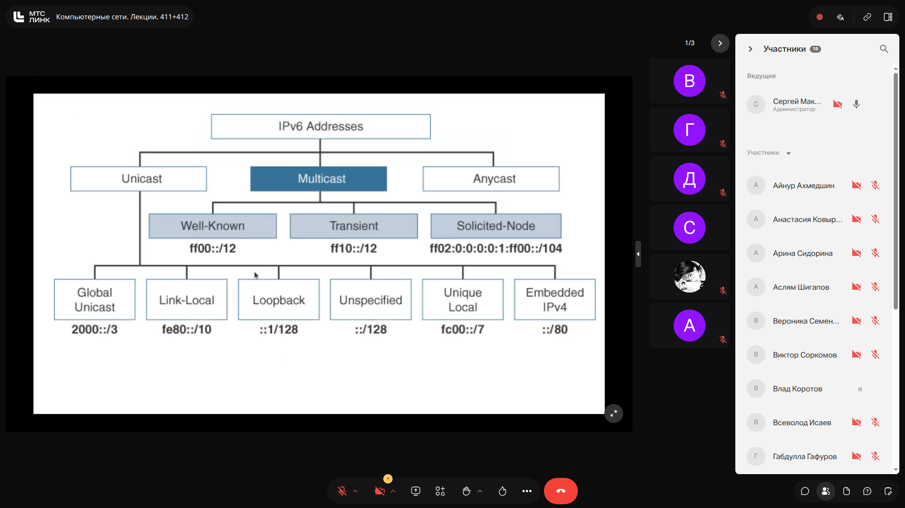
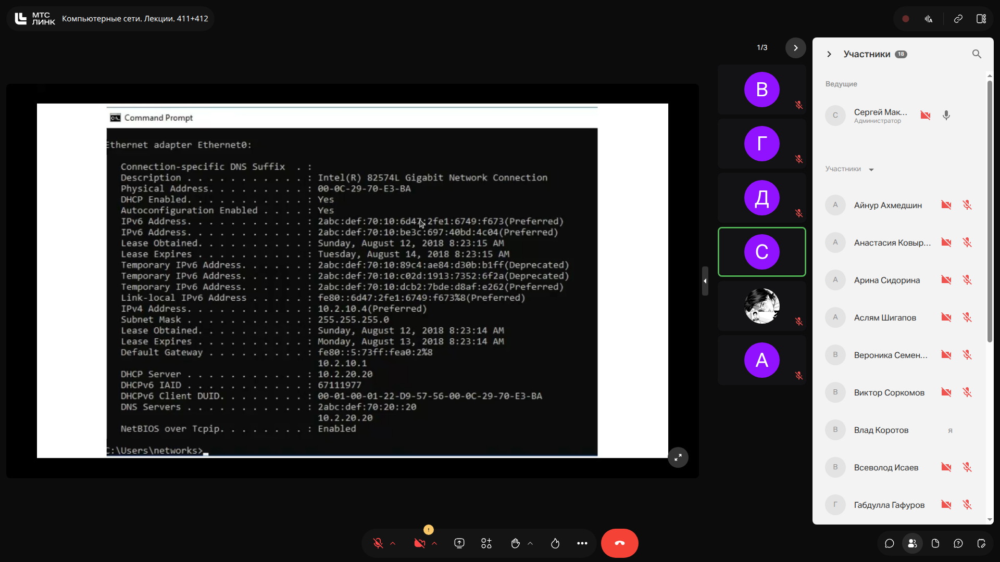
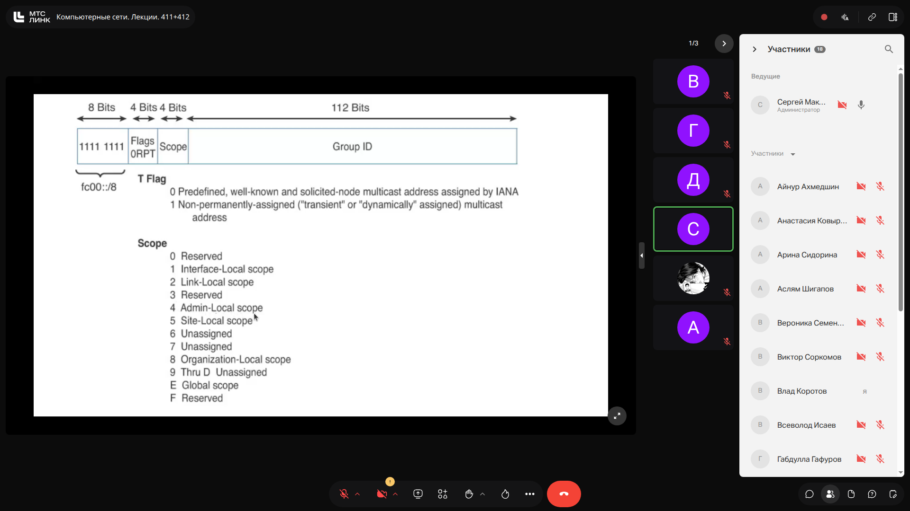
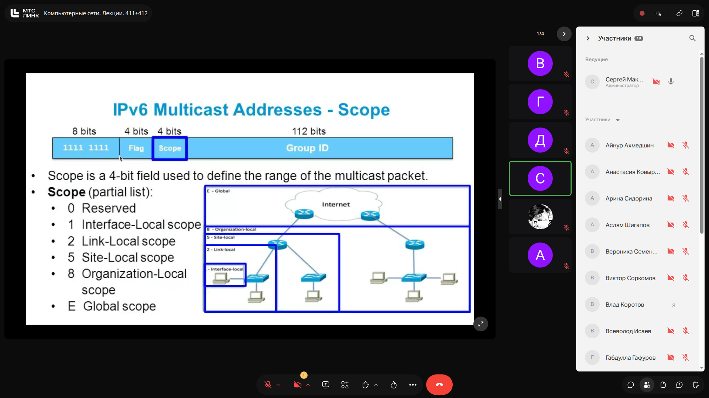
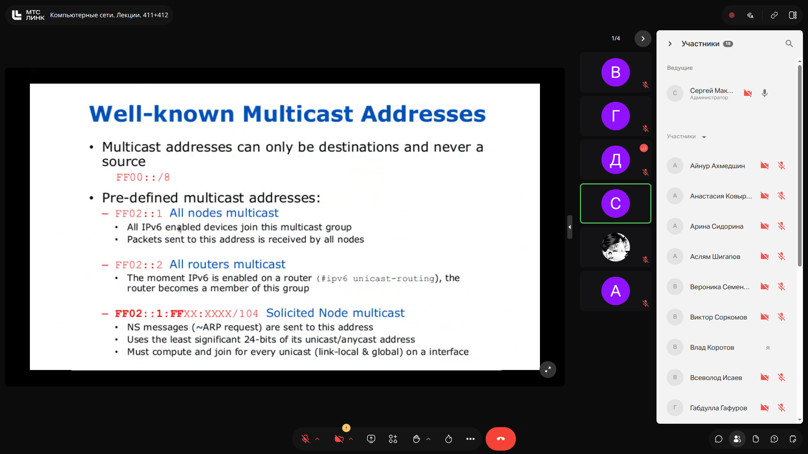
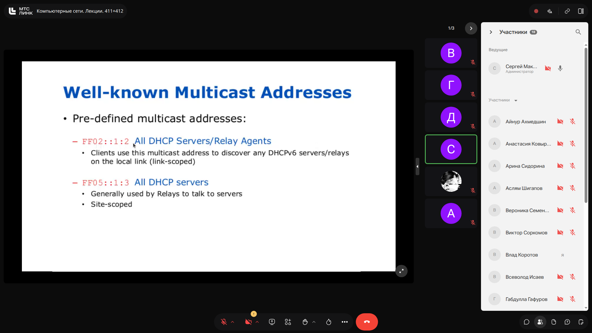

> [!IMPORTANT]
> **На заметку к зачету / экзамену:**
> - В IPv6 нет Broadcast. Замена ARP Request — это Neighbor Solicitation (NS), отправляемый на Solicited-Node Multicast адрес ff02::1:ffxx:xxxx.
> - Младшие 24 бита Solicited-Node адреса берутся из младших 24 бит настраиваемого Unicast-адреса хоста.

---

## Сравнение заголовков IPv4 и IPv6, фрагментация и MTU `[71:05]`

### Архитектурные отличия заголовков
- **IPv4 заголовок**: переменная длина (минимум 20 байт, до 60 байт с опциями), наличие поля `IHL` (Internet Header Length) и контрольной суммы заголовка (`Header Checksum`), поля для фрагментации на маршрутизаторах (`Identification`, `Flags`, `Fragment Offset`).
- **IPv6 заголовок**: фиксированная длина **40 байт**. Поле `IHL` упразднено. Все опции вынесены в цепочку расширенных заголовков (*Extension Headers*), на которые указывает поле `Next Header`.

| Поле IPv4 | Аналог в IPv6 | Назначение |
|---|---|---|
| Version (4b) | Version (4b) | Номер версии протокола (4 или 6) |
| Type of Service / DiffServ | Traffic Class (8b) | Классификация трафика и QoS |
| - | Flow Label (20b) | Метка потока для сквозной маршрутизации без парсинга L4 |
| Total Length | Payload Length (16b) | Длина полезной нагрузки (без учета базовых 40 байт заголовка) |
| Time to Live (TTL) | Hop Limit (8b) | Защита от петель маршрутизации (декрементируется каждым роутером) |
| Protocol | Next Header (8b) | Протокол следующего уровня или тип Extension Header |
| Header Checksum | *Упразднено* | Контрольная сумма исключена для ускорения коммутации маршрутизаторами |
| Source IP (32b) | Source IP (128b) | Адрес отправителя |
| Destination IP (32b) | Destination IP (128b) | Адрес получателя |

### Фрагментация и MTU в IPv6
- В IPv4 промежуточные маршрутизаторы могли сами фрагментировать пакет при уменьшении MTU канала (если не стоял флаг `DF = Don't Fragment`).
- В IPv6 **промежуточные маршрутизаторы не имеют права фрагментировать пакеты**. Если пакет превышает MTU следующего линка, маршрутизатор отбрасывает его и посылает отправителю сообщение ICMPv6 *Packet Too Big*.
- Фрагментацию выполняет исключительно **узел-отправитель** через механизм **Path MTU Discovery (PMTUD)**.
- Минимальный MTU, который обязаны поддерживать все каналы в IPv6 — **1280 байт** (в IPv4 был 576 байт).

### Слайды и код с экрана:
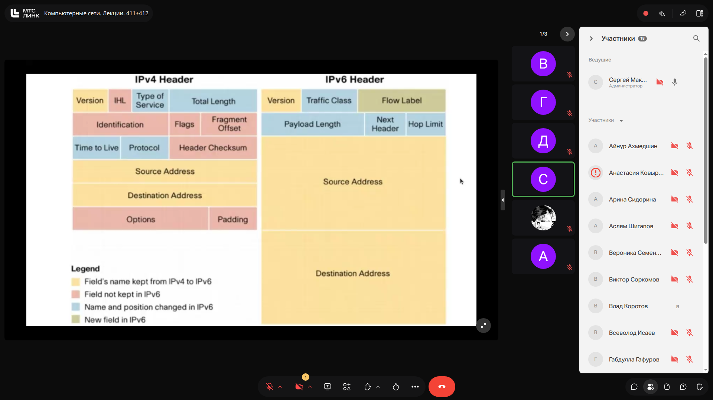
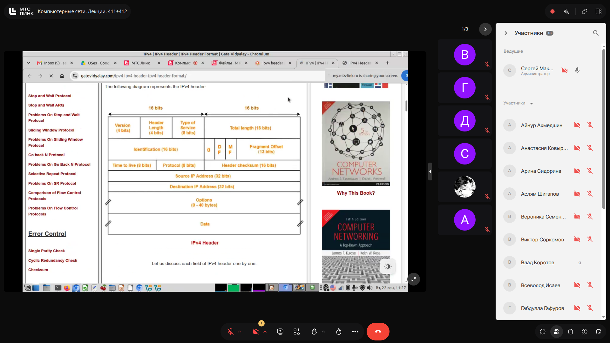
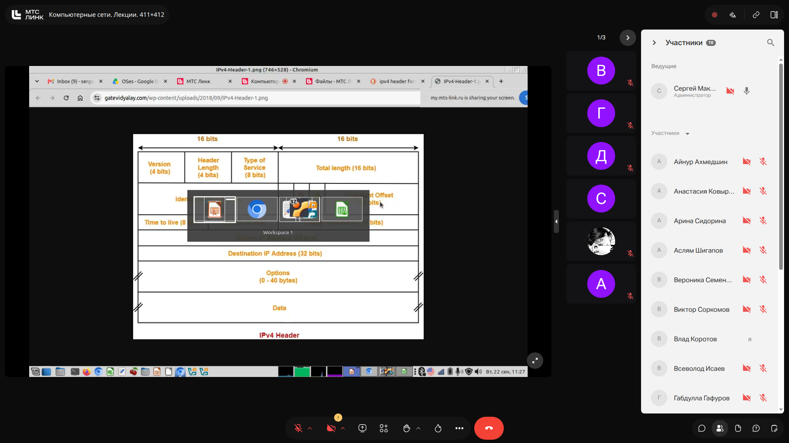
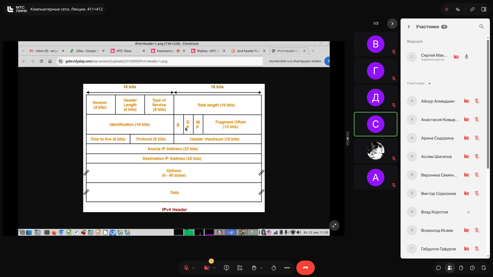
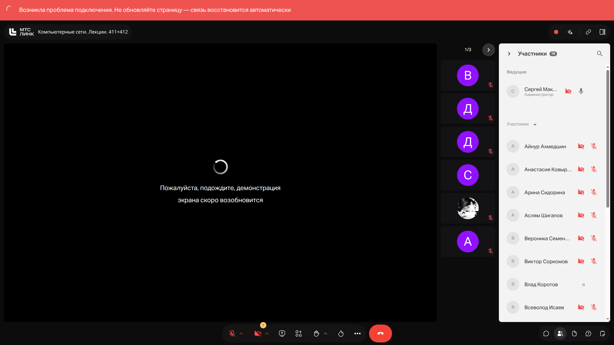

> [!IMPORTANT]
> **На заметку к зачету / экзамену:**
> - В IPv6 заголовок имеет фиксированный размер 40 байт, контрольная сумма заголовка отсутствует.
> - Роутеры в IPv6 никогда не фрагментируют транзитные пакеты; фрагментация возможна только на хосте-отправителе.
> - Минимальный обязательный MTU канала для IPv6 составляет 1280 байт.

---
