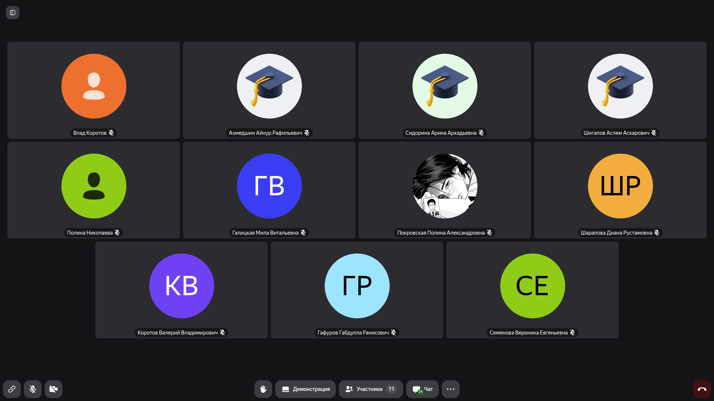
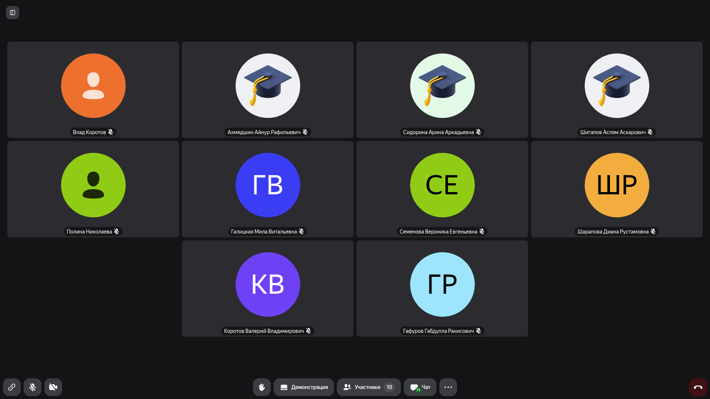
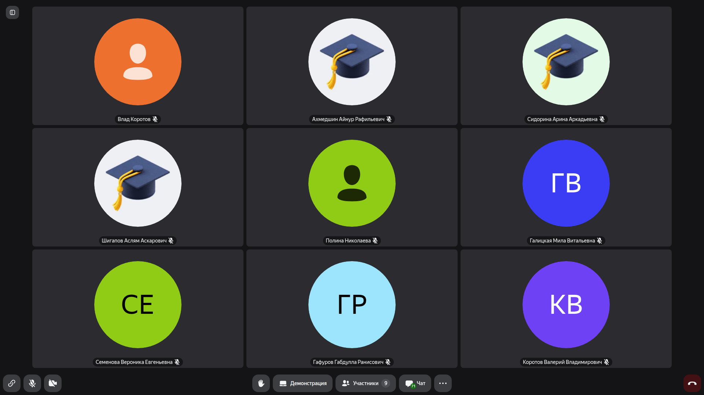
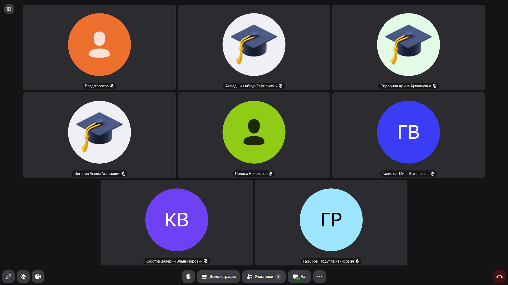
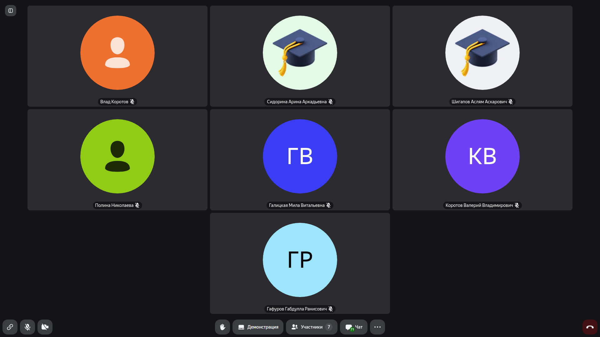
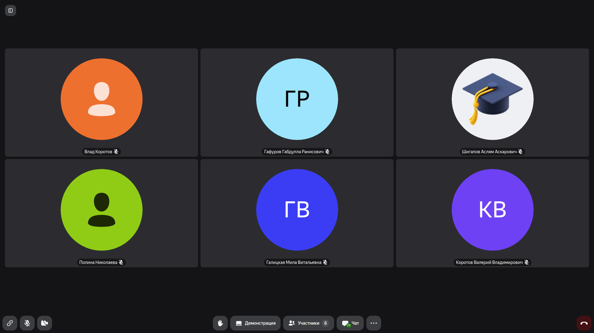
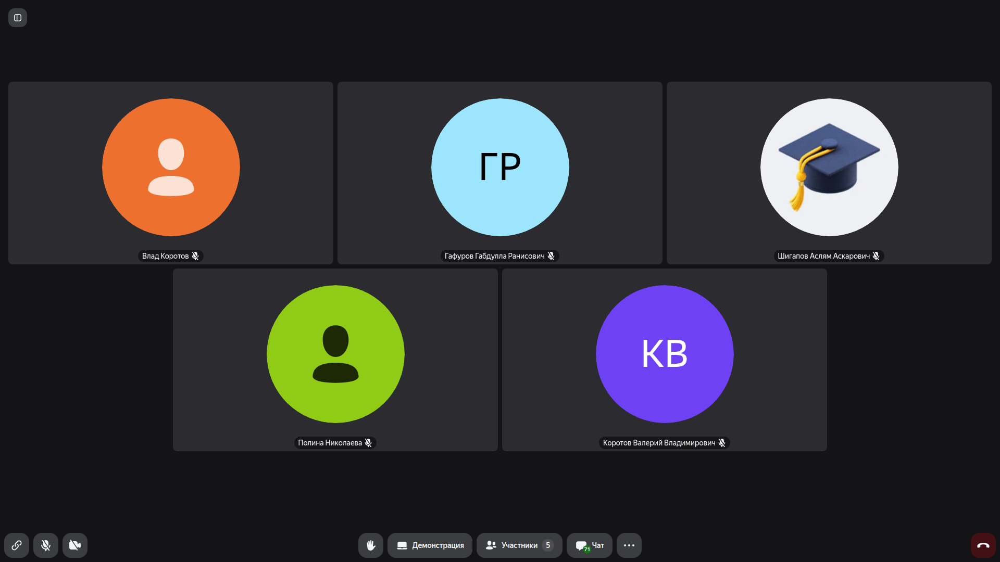
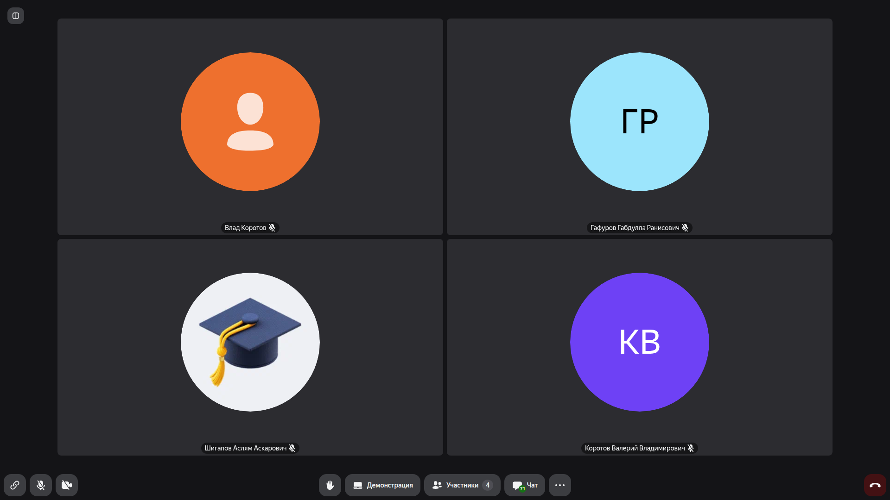
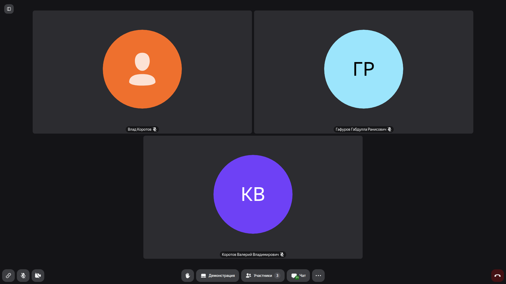

# Системная аналитика: Разбор проектных заданий, требований и системного проектирования

> **Тема**: Разбор проектных заданий, требований и системного проектирования  
> **Статус конспекта**: Очищен от оговорок и воды, структурирован AI-ассистентом с сохранением авторских терминов.  
> **AI-модель**: `gemini-3.7-flash`  

## Введение
В рамках данного семинарского занятия состоялся разбор практических работ и текущего прогресса студенческих команд по дисциплине «Системная аналитика». Основной фокус встречи был направлен на валидацию требований к разрабатываемым информационным системам, правильную декомпозицию функционала, корректное оформление сценариев использования (Use Cases) и согласование архитектурных решений.

---

## Организационная часть и статус выполнения проектов `[00:00]`

В начале занятия преподаватель провел перекличку и уточнил текущий статус подготовки проектных решений у команд. Обсуждались вопросы формата сдачи, готовности аналитических разделов и структура защиты работ.

Ключевые моменты обсуждения:
- Проверка наличия всех необходимых разделов в аналитической записке;
- Согласование терминологии предметной области;
- Уточнение границ проектируемых систем.

### Слайды и код с экрана:



> [!IMPORTANT]
> **На заметку к зачету / экзамену:**
> - Четко разграничивать границы разрабатываемой системы и внешних сервисов при описании скоупа проекта.

---

## Формирование и декомпозиция функциональных и нефункциональных требований `[15:00]`

Рассмотрены основные правила формулирования требований к информационным системам:

1. **Функциональные требования (FR):**
   - Определение конкретных действий, которые система должна выполнять для пользователей.
   - Избегание двусмысленности и неизмеримых формулировок.
   - Связь требований с бизнес-целями проекта.

2. **Нефункциональные требования (NFR):**
   - Требования к производительности, надежности, безопасности и масштабируемости.
   - Количественные метрики (время отклика, допустимое время простоя, количество одновременных пользователей).

```markdown
Пример корректного NFR:
- Система должна обрабатывать поисковый запрос пользователя и возвращать результат в течение не более 1.5 секунд при нагрузке до 1000 RPS.
```

### Слайды и код с экрана:




> [!IMPORTANT]
> **На заметку к зачету / экзамену:**
> - Нефункциональные требования обязательно должны быть измеримыми и проверяемыми.

---

## Проектирование сценариев использования (Use Cases) и моделирование процессов `[40:00]`

В ходе анализа работ подробно обсуждалось построение сценариев использования:

- **Акторы (Actors):** идентификация первичных и вторичных участников процесса.
- **Основной сценарий (Main Success Scenario):** последовательность шагов от инициации до достижения цели.
- **Альтернативные и исключительные сценарии:** обработка ошибок валидации, отказов внешних API и прерываний сессии.
- **Предусловия и постусловия:** фиксация состояния системы до начала и после успешного/неуспешного выполнения Use Case.

### Слайды и код с экрана:




> [!IMPORTANT]
> **На заметку к зачету / экзамену:**
> - В Use Case важно описывать взаимодействие системы и пользователя на уровне 'действие — реакция системы', а не внутреннюю реализацию кода.

---

## Анализ архитектуры решений и ответы на вопросы `[65:00]`

Завершающая часть пары была посвящена разбору архитектурных вопросов и интеграций:

- Взаимодействие компонентов через API (REST/JSON);
- Хранение и структура реляционных/нереляционных данных;
- Устранение узких мест и обеспечение целостности транзакций;
- Индивидуальные консультации по проектам каждой группы.

### Слайды и код с экрана:



> [!IMPORTANT]
> **На заметку к зачету / экзамену:**
> - При защите архитектуры уметь обосновать выбор протоколов взаимодействия и типа базы данных под конкретные требования нагрузки.

---
